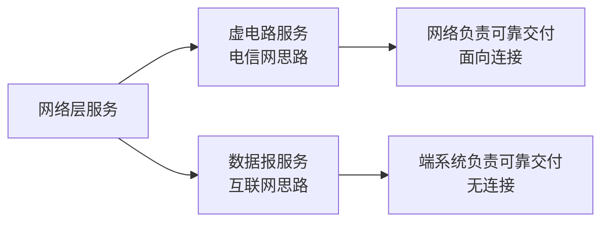
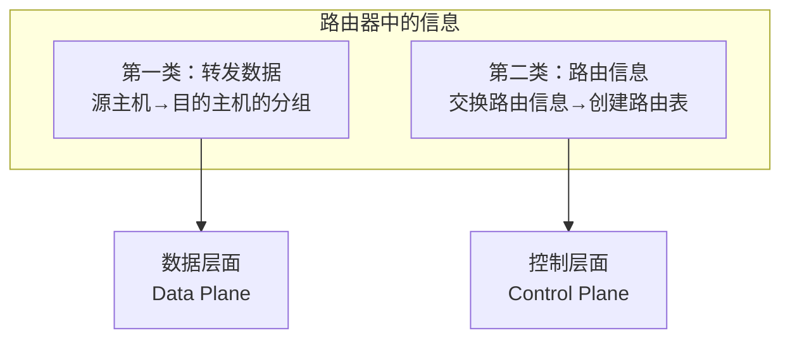

# 第4章-4.1-网络层的几个重要概念

## 基本信息
- **课程**：计算机网络
- **章节**：第4章 4.1节 网络层的几个重要概念
- **日期**：2026-04-26
- **标签**：#网络层 #虚电路 #数据报 #SDN #控制层面 #数据层面

---

## 重点内容

### ⭐⭐⭐ 核心概念
1. **网络层两种服务**：虚电路服务 vs 数据报服务
2. **互联网的选择**：采用数据报服务（无连接、尽最大努力交付）
3. **网络层的两个层面**：数据层面（转发）vs 控制层面（路由）
4. **SDN**：软件定义网络，控制层面集中化

### ⭐⭐ 关键问题
- 为什么互联网选择数据报服务而非虚电路服务？
- 数据层面和控制层面的区别是什么？
- SDN对传统网络架构的改变？

---

## 详细笔记

### 一、网络层提供的两种服务

#### 1. 两种服务思路的争论



**争论焦点**：可靠交付应当由谁来负责？
- **电信网观点**：网络负责可靠交付（虚电路服务）
- **互联网观点**：端系统负责可靠交付（数据报服务）

#### 2. 虚电路服务

**基本思想**：
- 模仿电话网的面向连接通信方式
- 通信前先建立虚电路（VC, Virtual Circuit）
- 预留通信所需的网络资源
- 分组沿已建立的虚电路传送
- 分组首部只需填写虚电路号（小整数）
- 通信结束后释放虚电路

**特点**：
- ✅ 分组首部开销小（只需虚电路号）
- ✅ 分组按序到达
- ✅ 网络提供可靠传输
- ❌ 需要建立连接
- ❌ 网络复杂、交换机昂贵
- ❌ 节点故障影响所有虚电路

#### 3. 数据报服务

**基本思想**：
- 网络层设计尽量简单
- 提供无连接的、尽最大努力交付的数据报服务
- 每个分组独立发送，与其前后分组无关
- 不建立连接，不进行编号
- 不提供服务质量的承诺

**特点**：
- ✅ 无需建立连接
- ✅ 网络简单、路由器价格低廉
- ✅ 运行方式灵活
- ✅ 适应多种应用
- ❌ 分组可能出错、丢失、重复、失序
- ❌ 不保证交付时限

#### 📷 图4-1 网络层提供的两种服务


> 📚 **课本出处**：图4-1(a) 虚电路服务：所有数据在事先建立的虚电路上传送


> 📚 **课本出处**：图4-1(b) 数据报服务：数据传送路径不确定，每个分组独立选择路由

#### 📊 表4-1 虚电路服务与数据报服务的对比

| 对比的方面 | 虚电路服务 | 数据报服务 |
|-----------|-----------|-----------|
| **思路** | 可靠通信应当由网络来保证 | 可靠通信应当由用户主机来保证 |
| **连接的建立** | 必须有 | 不需要 |
| **终点地址** | 仅在连接建立阶段使用，每个分组使用短的虚电路号 | 每个分组都有终点的完整地址（IP地址） |
| **分组的转发** | 属于同一条虚电路的分组均按照同一路由进行转发 | 每个分组独立查找转发表进行转发 |
| **当节点出故障时** | 所有通过出故障的节点的虚电路均不能工作 | 出故障的节点可能会丢失分组，一些路由可能会发生变化 |
| **分组的顺序** | 总是按发送顺序到达终点 | 到达终点的顺序不一定按发送的顺序 |
| **端到端的差错处理和流量控制** | 可以由网络负责，也可以由用户主机负责 | 由用户主机负责 |

#### 4. 互联网的选择：数据报服务

**为什么互联网选择数据报服务？**

**关键原因**：计算机网络的端系统是有智能的计算机
- 计算机有很强的差错处理能力
- 与传统电话机有本质差别
- 因此可靠传输可以由端系统（运输层）负责

**数据报服务的好处**：
1. **网络造价大大降低**：路由器简单、价格低廉
2. **运行方式灵活**：适应多种应用
3. **可扩展性好**：互联网能发展到今日规模

**历史背景**：
- OSI体系支持者曾主张使用虚电路服务
- ITU-T的X.25建议书就是虚电路服务标准
- 但X.25早已成为历史文献

---

### 二、网络层的两个层面

#### 1. 路由器中的两大类信息



**第一类信息**：
- 转发源主机和目的主机之间传送的数据
- 像接力赛跑一样从一个路由器转发到下一个路由器
- 最终传送到目的主机

**第二类信息**：
- 传送路由信息
- 根据路由选择协议和路由算法
- 不断交换路由信息分组
- 目的是创建路由表，导出转发表

#### 2. 数据层面 vs 控制层面

#### 📷 图4-2 网络层的数据层面和控制层面


> 📚 **课本出处**：图4-2 数据层面负责转发分组，控制层面负责生成路由表

**对比**：

| 特性 | 数据层面（转发层面） | 控制层面 |
|-----|-------------------|---------|
| **功能** | 根据转发表转发分组 | 交换路由信息，生成路由表 |
| **速度** | 纳秒级（10⁻⁹秒） | 秒级 |
| **实现方式** | 硬件转发 | 软件计算 |
| **工作机制** | 独立根据本路由器转发表转发 | 需要多个路由器协同动作 |
| **复杂度** | 比较单纯 | 比较复杂 |

**关键点**：
- 数据层面：路由器独立工作，根据转发表转发
- 控制层面：路由器协同工作，通过路由协议交换信息

#### 3. 软件定义网络SDN

#### 📷 图4-3 软件定义网络SDN中的控制层面和数据层面


> 📚 **课本出处**：图4-3 SDN将控制层面集中，路由器只保留数据层面

**传统互联网 vs SDN**：

| 特性 | 传统互联网 | SDN |
|-----|-----------|-----|
| **控制层面** | 每个路由器都有 | 逻辑上集中的远程控制器 |
| **路由选择软件** | 每个路由器都有 | 路由器中没有 |
| **路由信息交换** | 路由器之间交换 | 路由器之间不再交换 |
| **转发表生成** | 各路由器独立计算 | 控制器计算，下发到路由器 |
| **控制方式** | 分散控制 | 集中控制 |

**SDN的工作原理**：
1. 远程控制器掌握各主机和整个网络的状态
2. 为每个分组计算出最佳路由
3. 在每个路由器中生成正确的转发表
4. 路由器工作很单纯：收到分组→查找转发表→转发分组

**SDN的应用场景**：
- 大型专用数据中心之间的广域网
- 可提高网络运行效率
- 获得更好的经济效益

**注意**：SDN并非要改造整个互联网，而是在特定条件下使用

---

## 疑问与思考

### ❓ 待解决问题
1. 虚电路服务在哪些场景下仍有应用？（如ATM网络）
2. SDN控制器的高可用性如何保证？
3. 控制层面和数据层面的分离对网络安全有什么影响？

### 💡 个人理解
- 互联网选择数据报服务体现了"端到端原则"：在端系统实现功能，网络保持简单
- 两个层面的分离是网络架构的重要抽象，SDN将其推向极致
- 集中控制 vs 分散控制各有优劣，SDN是特定场景下的优化选择

---

## 核心考点总结

### ⭐⭐⭐ 必考内容

1. **两种服务的对比**（重点掌握）

```
┌─────────────────────────────────────────────────────────┐
│  虚电路服务          vs          数据报服务              │
├─────────────────────────────────────────────────────────┤
│  面向连接                      无连接                    │
│  需建立虚电路                  不需要建立连接            │
│  分组按序到达                  可能失序                  │
│  网络保证可靠性                主机保证可靠性            │
│  分组首部开销小                需要完整IP地址            │
│  节点故障影响大                容错性好                  │
└─────────────────────────────────────────────────────────┘
```

2. **互联网选择数据报服务的原因**
   - 端系统有智能，可处理差错
   - 网络简单、灵活、可扩展
   - 适应多种应用

3. **两个层面的功能对比**

| 层面 | 功能 | 速度 | 实现 |
|-----|------|------|------|
| 数据层面 | 转发分组 | 纳秒级 | 硬件 |
| 控制层面 | 生成路由表 | 秒级 | 软件 |

4. **SDN的核心思想**
   - 控制层面集中化
   - 路由器只保留数据层面
   - 控制器计算路由，下发转发表

### 📌 易混淆点辨析

| 概念 | 说明 |
|-----|------|
| **虚电路** | 逻辑连接，非物理连接，分组沿固定路径传送 |
| **数据报** | 每个分组独立传送，路径不确定 |
| **数据层面** | 负责实际的数据分组转发 |
| **控制层面** | 负责路由信息的交换和路由表的生成 |
| **SDN** | 软件定义网络，控制层面集中化 |

### 📝 常见考题类型

1. **简答题**：
   - 比较虚电路服务和数据报服务的主要区别
   - 为什么互联网选择数据报服务？
   - 说明网络层两个层面的功能和区别
   - 简述SDN的基本思想

2. **分析题**：
   - 分析数据报服务的优缺点
   - 说明SDN对传统网络架构的改变
   - 为什么控制层面比数据层面慢？

3. **选择题/判断题**：
   - 虚电路需要建立连接（✓）
   - 数据报保证分组按序到达（✗）
   - SDN中路由器之间交换路由信息（✗）
   - 数据层面使用硬件转发（✓）

---

## 相关链接

### 本节涉及图片
- [图4-1 虚电路服务](../../../images/0f7c0cf2bbed4f94a9d3181f1ae703be170fc058e091f7f811fe82032a3c6c37.jpg)
- [图4-1 数据报服务](../../../images/73734c369d27d4ca6ea9ce261ed6d721bc03f3ba060adf81090d54c439cb9f24.jpg)
- [图4-2 网络层的两个层面](../../../images/923a69377551753d26b5a5991a7ad26340db5c5ab4a1e9b91520f34195b16975.jpg)
- [图4-3 SDN架构](../../../images/04628d459fb8fc1937721064b4f069908042c3f767bac236faaf33513798c1de.jpg)

### 关联章节
- [第4章-4.2-网际协议IP](./第4章-4.2-网际协议IP.md) - IP协议详解
- [第5章-运输层](./第5章-运输层.md) - 端系统的可靠传输

---

*笔记创建时间：2026-04-26*
