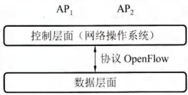
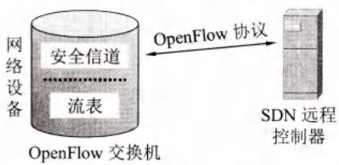
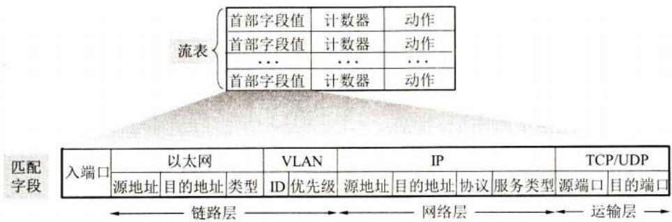
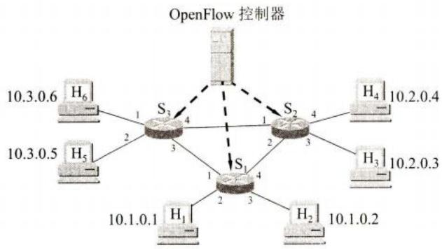
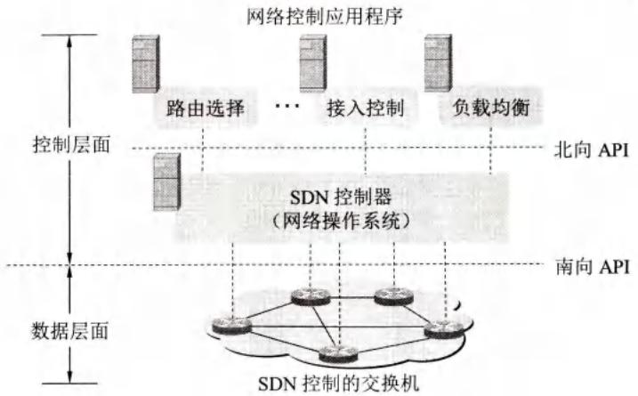
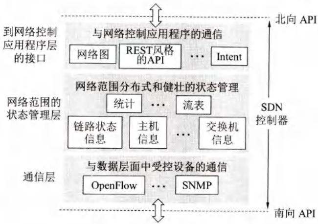

# 第4章-4.10-软件定义网络SDN简介

## 基本信息
- **课程**：计算机网络
- **章节**：第4章 4.10节 软件定义网络SDN简介
- **日期": 2026-04-26
- **标签": #SDN #OpenFlow #控制层面 #数据层面 #流表

---

## 重点内容

### ⭐⭐ 核心概念
1. **SDN**：一种新的网络体系结构，控制层面与数据层面分离
2. **OpenFlow**：控制层面与数据层面之间的通信接口（南向API）
3. **流表**：SDN中取代传统转发表的"匹配+动作"表
4. **广义转发**：不仅可以转发，还可以重写首部、阻挡分组、负载均衡等

### ⭐⭐ 关键问题
- SDN与传统网络的主要区别？
- 什么是广义转发？
- SDN控制器的三个层次？

---

## 详细笔记

### 一、SDN概述

#### 1. SDN的产生背景

**提出时间**：2009年，斯坦福大学N. McKeown首先提出

**发展**：
- 最初只是学术界的探讨
- 随后几年快速发展，不少企业采用
- 最成功案例：谷歌数据中心网络B4（2010-2012年建立）

**B4网络成果**：
- 大大提高网络带宽利用率
- 网络运行更加稳定
- 管理更加高效简化
- 运行费用明显降低

#### 2. SDN的核心思想

**基本概念**：
- SDN不是协议，也不是产品
- SDN是一个**体系结构**
- 是一种设计、构建和管理网络的**新方法/新概念**

**核心要点**：
- **控制层面**和**数据层面**分离
- 控制层面利用**软件**控制数据层面的许多设备
- 逻辑上是**集中式控制**

#### 3. SDN与OpenFlow的关系

**常见误解**：
- 有人误认为SDN就是OpenFlow
- 实际上二者有很大区别

**区别**：

| | SDN | OpenFlow |
|---|-----|----------|
| **性质** | 体系结构 | 通信协议 |
| **作用** | 设计网络的新方法 | 控制层面与数据层面的接口 |
| **关系** | 可以使用OpenFlow，也可以使用其他协议 | 是SDN的一种实现方式 |

**OpenFlow的双重意义**：
1. SDN远程控制器与网络设备之间的**通信协议**
2. 网络交换功能的**逻辑结构规约**

---

### 二、SDN的基本原理

#### 1. 数据层面与控制层面的分离

#### 📷 图4-70 协议OpenFlow是控制层面和数据层面的接口



> 📚 **课本出处**：图4-70 SDN通过OpenFlow协议实现控制层面与数据层面的分离

**传统网络**：
- 路由器/交换机：控制层面和数据层面**耦合**在同一设备中
- 垂直集成：硬件、软件、协议都在一个机器里

**SDN网络**：
- **数据层面**：相对简单但快速的网络交换机
- **控制层面**：由服务器和软件组成，逻辑上集中
- 二者**去耦合**（decouple）

#### 2. 广义转发

**传统转发**：
- 根据转发表转发分组
- 两个步骤：匹配（查找网络前缀）+ 动作（转发出去）

**SDN广义转发**：
- "匹配"：可以对不同层次（链路层、网络层、运输层）的首部字段进行匹配
- "动作"：不仅是转发，还可以：
  - 从不同的接口转发（负载均衡）
  - 重写IP首部（类似NAT）
  - 阻挡或丢弃分组（类似防火墙）

#### 3. 流表（Flow Table）

**概念**：
- 取代传统转发表
- "匹配 + 动作"的转发表

**OpenFlow交换机**：
- 完成"匹配 + 动作"的设备
- 不局限于网络层工作（可使用L2/L3交换机）

---

### 三、OpenFlow协议与交换机

#### 1. OpenFlow协议版本

**发展历史**：
- OpenFlow 1.0：2009年底（最早版本）
- 每年更新，共12次更新
- OpenFlow 1.5.1：2015年3月（283页）
- **目前较成熟**：1.3版本

**制定组织**：
- 开放网络基金会ONF（Open Networking Foundation）
- 非营利性产业联盟
- 致力于SDN的发展和标准化

#### 2. OpenFlow交换机结构

#### 📷 图4-71 OpenFlow协议与OpenFlow交换机



> 📚 **课本出处**：图4-71 流表由远程控制器通过安全信道使用OpenFlow协议管理

**关键概念**：
- **流表**由远程控制器管理
- 通过**安全信道**使用OpenFlow协议
- 不同厂商的设备，控制器看到的是统一的逻辑交换功能

#### 3. 流表结构

#### 📷 图4-72 OpenFlow 1.0版本的流表和分组的首部匹配字段



> 📚 **课本出处**：图4-72 流表项包括首部字段值（匹配字段）、计数器、动作三个字段

**流表项（Flow Entry）三个字段**：

| 字段 | 说明 |
|-----|------|
| **首部字段值（匹配字段）** | 使入分组的对应首部与之匹配 |
| **计数器** | 匹配的分组数量、上次更新时间 |
| **动作** | 转发、丢弃、复制、重写首部等 |

**匹配字段**（OpenFlow 1.0，11个项目，涉及三个层次）：
- 链路层：源MAC、目的MAC、以太网类型
- 网络层：源IP、目的IP、IP协议
- 运输层：TCP/UDP源端口、目的端口

**注意**：OpenFlow匹配抽象与分层原则不同，可以跨层次处理。

#### 4. 流表应用示例

#### 📷 图4-73 OpenFlow"匹配+动作"网络



> 📚 **课本出处**：图4-73 示例网络包含6台主机、3台分组交换机、1台OpenFlow控制器

**示例1：简单转发**

规则：H₅或H₆发往H₃或H₄的分组，路径为S₃→S₁→S₂

S₃的流表项：
| 匹配 | 动作 |
|-----|------|
| IP源=10.3.*.*; IP目的=10.2.*.* | 转发(3) |

S₁的流表项：
| 匹配 | 动作 |
|-----|------|
| 入端口=1; IP源=10.3.*.*; IP目的=10.2.*.* | 转发(4) |

**示例2：负载均衡**

规则：
- H₃发往10.1.*.*：路径S₂→S₁
- H₄发往10.1.*.*：路径S₂→S₃→S₁

S₂的流表项：
| 匹配 | 动作 |
|-----|------|
| 入端口=3; IP目的=10.1.*.* | 转发(2) |
| 入端口=4; IP目的=10.1.*.* | 转发(1) |

**示例3：防火墙**

规则：仅接收来自S₃相连主机的分组

S₂的流表项：
| 匹配 | 动作 |
|-----|------|
| IP源=10.3.*.*; IP目的=10.2.0.3 | 转发(3) |
| IP源=10.3.*.*; IP目的=10.2.0.4 | 转发(4) |

---

### 四、SDN体系结构

#### 1. SDN的四个关键特征

#### 📷 图4-74 SDN体系结构的构件



> 📚 **课本出处**：图4-74 SDN体系结构包含数据层面、控制层面和网络控制应用程序

**特征1：基于流的转发**
- 分组转发基于网络层、运输层、链路层首部字段
- 转发规则精确规定在流表中
- 所有流表项由SDN控制器计算、管理和安装

**特征2：数据层面与控制层面分离**
- 去耦合（decouple）
- 数据层面：简单快速的网络交换机
- 控制层面：服务器和软件

**特征3：控制层面在交换机之外**
- 用软件实现
- 软件在不同机器上，可能远离交换机
- 逻辑上集中控制（实际使用多个分散服务器）

**特征4：可编程的网络**
- 通过控制层面的网络控制应用程序
- 指明和控制数据层面
- 实现路由选择、接入控制、负载均衡等功能

#### 2. SDN控制器的三个层次

#### 📷 图4-75 SDN控制器的三个层次



> 📚 **课本出处**：图4-75 SDN控制器分为通信层、状态管理层、网络控制应用层

**层次1：通信层（南向接口）**
- 任务：SDN控制器与网络设备之间的通信
- 协议：OpenFlow、SNMP等
- 接口：南向API
- 功能：传送信息、接收设备事件（链路状态、设备接入等）

**层次2：状态管理层**
- 维护网络状态信息
- 提供网络视图

**层次3：网络控制应用层（北向接口）**
- 网络控制应用程序
- 接口：北向API
- API类型：REST风格的API等
- 功能：路由计算、接入控制、负载均衡等

#### 3. 开源控制器

**代表性开源控制器**：
- **OpenDaylight**
- **ONOS**

---

## 核心考点总结

### ⭐⭐ 必考内容

1. **SDN的四个关键特征**

| 特征 | 说明 |
|-----|------|
| **基于流的转发** | 可基于多层首部字段转发，流表由控制器管理 |
| **数据与控制分离** | 去耦合，数据层面简单快速，控制层面软件实现 |
| **控制层面在外部** | 软件在服务器上，逻辑集中控制 |
| **可编程的网络** | 通过应用程序控制网络行为 |

2. **SDN vs 传统网络**

| 对比项 | 传统网络 | SDN |
|-------|---------|-----|
| **控制与数据** | 耦合在同一设备 | 分离 |
| **转发依据** | 目的IP地址 | 多层首部字段（流表） |
| **控制方式** | 分布式 | 逻辑集中式 |
| **灵活性** | 低 | 高（可编程） |
| **厂商依赖** | 高（垂直集成） | 低（开放接口） |

3. **SDN控制器三层结构**

```
┌─────────────────────────────────┐
│  网络控制应用层（北向接口）        │
│  - 路由选择应用                    │
│  - 接入控制应用                    │
│  - 负载均衡应用                    │
├─────────────────────────────────┤
│  状态管理层                       │
│  - 维护网络状态信息                │
├─────────────────────────────────┤
│  通信层（南向接口）               │
│  - OpenFlow、SNMP                │
│  - 与网络设备通信                  │
└─────────────────────────────────┘
```

4. **流表三要素**

| 字段 | 作用 |
|-----|------|
| **首部字段值（匹配）** | 匹配入分组的首部 |
| **计数器** | 统计匹配分组数量、时间 |
| **动作** | 转发、丢弃、重写、复制等 |

5. **广义转发的动作类型**

- **转发**：从指定端口转发
- **负载均衡**：从多个端口转发
- **重写首部**：类似NAT的地址转换
- **阻挡/丢弃**：类似防火墙

### 📌 易混淆点辨析

| 概念 | 说明 |
|-----|------|
| **SDN vs OpenFlow** | SDN是体系结构，OpenFlow是协议/接口 |
| **流表 vs 转发表** | 流表更灵活，可匹配多层首部，动作更丰富 |
| **南向API vs 北向API** | 南向：控制器→设备；北向：应用→控制器 |
| **逻辑集中 vs 物理集中** | 逻辑上集中控制，物理上使用多个服务器 |

### 📝 常见考题类型

1. **简答题**：
   - SDN的四个关键特征
   - SDN与传统网络的主要区别
   - OpenFlow协议的作用

2. **分析题**：
   - 分析SDN如何实现负载均衡
   - 比较SDN控制器三层结构的功能

3. **应用题**：
   - 设计流表实现特定转发规则
   - 分析给定网络的SDN控制流程

---

## 相关链接

### 本节涉及图片
- [图4-70 SDN架构](../../../images/fb73791cdbcaa5fe4ab1bdf616fc630e0362daa767cf903253bd4fb35e553400.jpg)
- [图4-71 OpenFlow交换机](../../../images/0ffb9a8eafed295918872767531debd15265f8df46078fa54bc1e88446926e44.jpg)
- [图4-72 流表结构](../../../images/22ce777b93163339e3d03d8dc5caa0bdbe8d7d718894f66bea7e4523d06b08e1.jpg)
- [图4-73 OpenFlow网络示例](../../../images/21893fa2763974f72821b9494875a6f0742e0bfd31e1a0f4b224313ebc16d496.jpg)
- [图4-74 SDN体系结构](../../../images/5ee86a4b6b2c0c8a21b86f886f2d0294dec3c098de1ae3eff09d184c4a0644df.jpg)
- [图4-75 SDN控制器层次](../../../images/3866092c60854d84abc371af7253352ff307a38849e51330563f28cc73e10a7e.jpg)

### 关联章节
- [第4章-4.1-网络层的几个重要概念](./第4章-4.1-网络层的几个重要概念.md) - 数据层面与控制层面
- [第4章-4.9-多协议标签交换MPLS](./第4章-4.9-多协议标签交换MPLS.md) - SR与SDN控制器

---

*笔记创建时间：2026-04-26*
