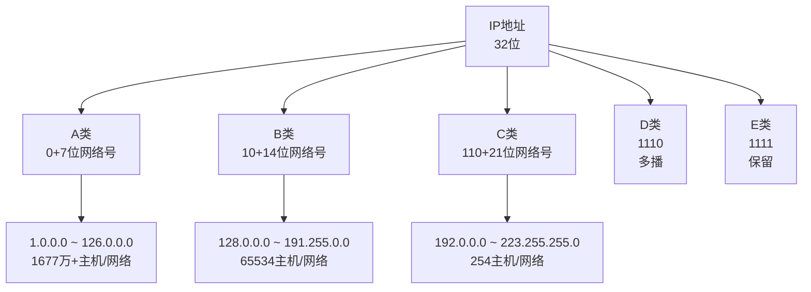

# 第4章-4.2-网际协议IP

## 基本信息
- **课程**：计算机网络
- **章节**：第4章 4.2节 网际协议IP
- **日期**：2026-04-26
- **标签**：#IP协议 #虚拟互连网络 #CIDR #IP地址 #分类编址

---

## 重点内容

### ⭐⭐⭐ 核心概念
1. **虚拟互连网络**：使用IP协议屏蔽底层物理网络的异构性
2. **IP地址编址**：分类编址（历史）→ CIDR无分类编址（现在）
3. **CIDR**：网络前缀 + 主机号，斜线记法，地址掩码
4. **路由聚合**：用大的CIDR地址块代替多个小的地址块

### ⭐⭐ 关键问题
- 为什么需要虚拟互连网络？
- CIDR如何解决IP地址枯竭问题？
- 如何计算网络地址和地址块范围？

---

## 详细笔记

### 一、虚拟互连网络

#### 1. 网络互连的问题

**异构网络的差异**：
- 不同的寻址方案
- 不同的最大分组长度
- 不同的网络接入机制
- 不同的超时控制
- 不同的差错恢复方法
- 不同的状态报告方法
- 不同的路由选择技术
- 不同的用户接入控制
- 不同的服务（面向连接/无连接）
- 不同的管理与控制方式

**能否让大家都使用相同的网络？**
- ❌ 不行
- 用户需求多种多样
- 网络技术不断发展
- 市场上总有多种不同性能、不同协议的网络

#### 2. 中间设备

| 层次 | 中间设备 | 功能 |
|-----|---------|------|
| 物理层 | 转发器(repeater) | 信号放大 |
| 数据链路层 | 网桥/交换机(bridge/switch) | 帧转发 |
| **网络层** | **路由器(router)** | **分组转发、路由选择** |
| 网络层以上 | 网关(gateway) | 协议转换 |

⚠️ **注意**：
- 用转发器或网桥连接的网络仍是一个网络（从网络层看）
- 网关比较复杂，目前使用较少
- **网络互连主要指用路由器进行互连**

#### 3. 虚拟互连网络的概念

#### 📷 图4-4 网际协议IP及其配套协议


> 📚 **课本出处**：图4-4 ARP在最下层（IP常用），ICMP和IGMP在上层（使用IP）

**与IP配套的协议**：
- **ARP**（地址解析协议）：IP地址 → MAC地址
- **ICMP**（网际控制报文协议）：差错报告、诊断
- **IGMP**（网际组管理协议）：多播组管理

**虚拟互连网络（IP网）**：
- 利用IP协议使异构网络在网络层看起来像一个统一网络
- 互连起来的各种物理网络的异构性客观存在
- 但使用统一的IP地址进行通信

#### 📷 图4-5 IP网的概念


> 📚 **课本出处**：图4-5(a) 实际的互连网络：多种异构网络通过路由器互连


> 📚 **课本出处**：图4-5(b) 虚拟的IP网：在网络层看像一个统一的网络

**虚拟互连网络的好处**：
- 主机通信时看不见互连网络的具体细节
- 不需要关心底层物理网络的异构性
- 使用统一的IP地址进行通信

#### 📷 图4-6 分组在互联网中的传送


> 📚 **课本出处**：图4-6 分组从H1经R1→R2→R5直接交付到H2，经过不同网络类型

**直接交付 vs 间接交付**：

| 类型 | 条件 | 特点 |
|-----|------|------|
| **直接交付** | 源和目的在同一网络 | 不经过路由器 |
| **间接交付** | 源和目的在不同网络 | 必须经过路由器转发 |

#### 📷 图4-7 源主机向目的主机发送分组


> 📚 **课本出处**：图4-7 简化表示：省略路由器之间的网络和无关主机

---

### 二、IP地址

#### 1. 分类的IP地址（历史）



**分类地址的问题**：
- A类网络主机太多（1677万+），浪费严重
- C类网络主机太少（254个），不够用
- 即使划分子网也无法解决地址枯竭

#### 📊 表4-2 一般不指派的特殊IP地址

| 网络号 | 主机号 | 源地址 | 目的地址 | 含义 |
|-------|-------|-------|---------|------|
| 0 | 0 | 可以 | 不可 | 本网络上的本主机（DHCP） |
| 0 | X | 可以 | 不可 | 本网络上主机号为X的主机 |
| 全1 | 全1 | 不可 | 可以 | 只在本网络广播（不转发） |
| Y | 全1 | 不可 | 可以 | 对网络Y的所有主机广播 |
| 127 | 非全0/全1 | 可以 | 可以 | 本地软件环回测试 |

#### 2. 无分类编址CIDR ⭐⭐⭐

**CIDR（Classless Inter-Domain Routing）**：无分类域间路由选择

**三个要点**：

**(1) 网络前缀**
- 网络前缀长度n可变（0~32）
- 斜线记法：IP地址/n
- 例：128.14.35.7/20，前20位是网络前缀

**(2) 地址块**
- 网络前缀相同的连续IP地址组成CIDR地址块
- 地址数 = 2^(32-n)
- 例：/20地址块有2^12 = 4096个地址

**(3) 地址掩码（子网掩码）**
- 1的个数 = 网络前缀长度
- 网络地址 = IP地址 AND 掩码

#### 📷 图4-11 CIDR表示的IP地址


> 📚 **课本出处**：图4-11 CIDR网络前缀长度可变，不同于分类地址的固定长度

#### 📷 图4-12 从IP地址算出网络地址


> 📚 **课本出处**：图4-12 IP地址与掩码进行AND运算得到网络地址

**计算示例**：
```
IP地址：128.14.35.7/20

二进制IP：  10000000 00001110 00100011 00000111
掩码(/20)：11111111 11111111 11110000 00000000
           ----------------------------------- AND
网络地址：  10000000 00001110 00100000 00000000
           = 128.14.32.0/20

最小地址：128.14.32.0（主机号全0）
最大地址：128.14.47.255（主机号全1）
可指派地址数：2^12 - 2 = 4094
```

#### 📊 表4-3 常用的CIDR地址块

| 前缀长度 | 掩码 | 地址数 | 相当于 |
|---------|------|-------|-------|
| /13 | 255.248.0.0 | 512K | 8个B类或2048个C类 |
| /16 | 255.255.0.0 | 64K | 1个B类或256个C类 |
| /20 | 255.255.240.0 | 4K | 16个C类 |
| /24 | 255.255.255.0 | 256 | 1个C类 |
| /30 | 255.255.255.252 | 4 | 点对点链路 |
| /31 | 255.255.255.254 | 2 | 点对点链路（RFC3021） |
| /32 | 255.255.255.255 | 1 | 主机路由 |

**特殊地址块**：
- /32：主机路由
- /31：点对点链路
- /0：默认路由（0.0.0.0/0）

#### 📷 图4-13 CIDR地址块划分举例


> 📚 **课本出处**：图4-13 ISP拥有206.0.64.0/18，大学分配206.0.68.0/22，各系再细分

**路由聚合（构造超网）**：
- 用较大的CIDR地址块代替多个小地址块
- 减少转发表项目数
- 缩短查找时间

**示例**：
```
ISP拥有：206.0.64.0/18（64个C类网络）
    ↓ 分配
大学：206.0.68.0/22（4个C类，1024地址）
    ↓ 再分配
一系：206.0.68.0/23（2个C类）
二系：206.0.70.0/24（1个C类）
三系：206.0.71.0/25（1/2个C类）
四系：206.0.71.128/25（1/2个C类）
```

#### 3. IP地址的特点

1. **分等级结构**：网络前缀 + 主机号
   - 方便IP地址管理
   - 减少转发表项目数

2. **标志主机和链路的接口**
   - 多归属主机有多个IP地址
   - 路由器至少有两个IP地址

3. **相同前缀 = 同一网络**
   - 转发器/交换机连接的局域网仍为一个网络
   - 不同前缀必须用路由器互连

4. **网络平等**
   - 所有分配到前缀的网络地位平等

#### 📷 图4-14 需要IP地址的地方


> 📚 **课本出处**：图4-14 小圆圈表示需要IP地址的接口，注意交换机没有IP地址

**重要说明**：
- 同一局域网的主机/路由器IP地址网络前缀必须相同
- 网络地址的主机号必定是全0
- 以太网交换机是链路层设备，只有MAC地址，没有IP地址
- 路由器每个接口的IP地址网络前缀都不同

---

## 疑问与思考

### ❓ 待解决问题
1. 为什么分类IP地址会造成地址浪费？
2. CIDR如何解决路由表膨胀问题？
3. 如何合理规划CIDR地址块分配？

### 💡 个人理解
- 虚拟互连网络是互联网设计的核心思想，屏蔽底层复杂性
- CIDR是IP地址编址的重大改进，提高了地址利用率
- 路由聚合是CIDR带来的重要好处，减少了路由表规模
- 网络前缀越短，地址块越大，包含的地址越多

---

## 核心考点总结

### ⭐⭐⭐ 必考内容

1. **CIDR编址方法**（重点掌握）

```
IP地址 ::= {<网络前缀>, <主机号>}

斜线记法：128.14.35.7/20
- 前20位：网络前缀
- 后12位：主机号
- 地址块大小：2^12 = 4096
- 可指派地址：2^12 - 2 = 4094

地址掩码：255.255.240.0（20个1，12个0）
网络地址 = IP地址 AND 掩码
```

2. **地址块计算**

| 步骤 | 操作 |
|-----|------|
| 1 | 确定网络前缀长度n |
| 2 | 计算主机号位数 = 32 - n |
| 3 | 地址数 = 2^(32-n) |
| 4 | 可指派地址 = 2^(32-n) - 2 |
| 5 | 最小地址 = 网络地址（主机号全0） |
| 6 | 最大地址 = 网络地址 + 地址数 - 1（主机号全1） |

3. **路由聚合（构造超网）**
   - 用大的CIDR块代替多个小的
   - 减少转发表项目
   - 加快查找速度

### 📌 易混淆点辨析

| 概念 | 说明 |
|-----|------|
| **网络前缀** | CIDR中的网络号部分，长度可变 |
| **地址掩码** | 32位，1表示网络前缀，0表示主机号 |
| **网络地址** | 主机号全0的地址，标识网络本身 |
| **广播地址** | 主机号全1的地址 |
| **可指派地址** | 除去网络地址和广播地址后的地址 |
| **路由聚合** | 用大的CIDR块代替多个小的块 |

### 📝 常见考题类型

1. **计算题**（重点）：
   - 给定IP地址和掩码，计算网络地址
   - 给定地址块，计算地址范围、可指派地址数
   - 路由聚合：合并多个地址块为一个大的CIDR块

2. **简答题**：
   - 说明CIDR相比分类地址的优点
   - 解释虚拟互连网络的概念
   - 说明路由聚合的作用

3. **分析题**：
   - 分析CIDR如何解决IP地址枯竭问题
   - 说明IP地址的特点

---

## 相关链接

### 本节涉及图片
- [图4-4 IP配套协议](../../../images/f6a2405c14197ab345fe9e43bdf2d3484db80c7770ee4afefc8ac8fbcda89bac.jpg)
- [图4-5 实际互连网络](../../../images/2111c20d560afb8a4f74dbeb3efb7c57efc1ab3827e4ec374faea00a9389a953.jpg)
- [图4-5 虚拟IP网](../../../images/dacd8cdedf3cfdf0a65cff6ac14eb4830a94a9b1270954f363b3ad2964149e7b.jpg)
- [图4-6 分组传送](../../../images/71e6904caae138d1fe19297f38c2f7b2733b8aa4cff417a572d37abec0e76c25.jpg)
- [图4-7 简化传输路径](../../../images/58b208c5fe622ae66bdf65478ae904a23e909ed5e2056b55f2e15b66f1d0da4f.jpg)
- [图4-11 CIDR地址](../../../images/731cb2968fba4755573527adc00c0d7d866c4273162ed2d41b0768582908cca4.jpg)
- [图4-12 地址掩码运算](../../../images/8d36d3051cb42eafbaeb2dae4a3e9b054b78f5cde783c9d8a21ab588cd670d6b.jpg)
- [图4-13 CIDR划分](../../../images/543120d372726e22e12c6d81f6d14c5ac66be19c7420a6b71cf05c2ad8665ec2.jpg)
- [图4-14 IP地址位置](../../../images/e472609dd7624aa3970535099058095243809bd121dfb4bd3e05ff4cf3e8d854.jpg)

### 关联章节
- [第4章-4.1-网络层的几个重要概念](./第4章-4.1-网络层的几个重要概念.md) - 网络层基础
- [第4章-4.2.3-IP地址与MAC地址](./第4章-4.2.3-IP地址与MAC地址.md) - 两种地址的关系
- [第4章-4.2.4-地址解析协议ARP](./第4章-4.2.4-地址解析协议ARP.md) - IP地址到MAC地址的解析

---

*笔记创建时间：2026-04-26*
