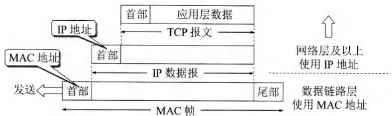
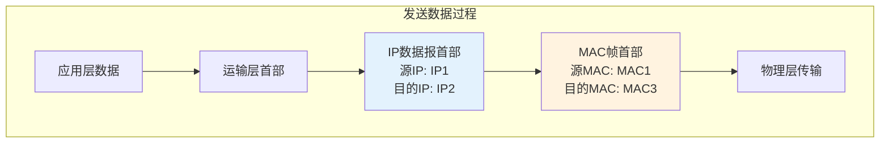
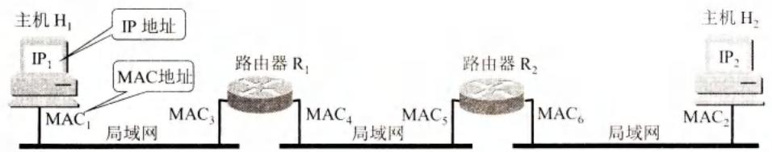
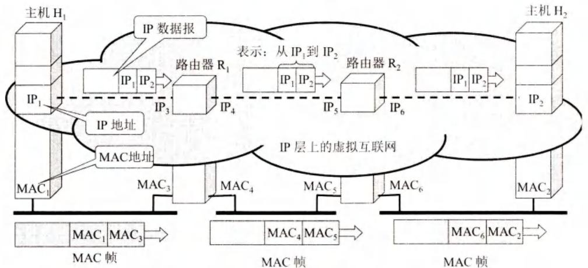
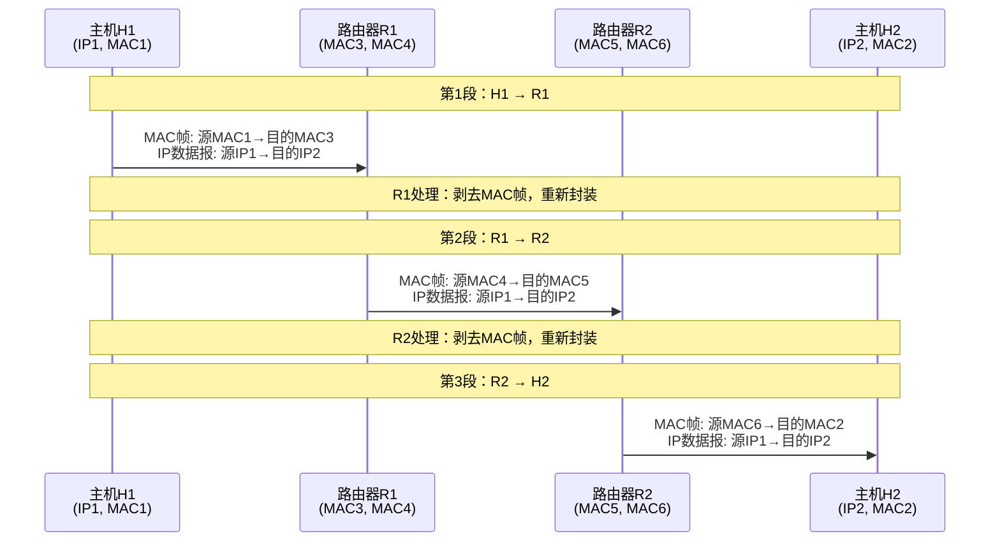

# 第4章-4.2.3-IP地址与MAC地址

## 基本信息
- **课程**：计算机网络
- **章节**：第4章 4.2.3节 IP地址与MAC地址
- **日期": "2026-04-26"
- **标签**: "#IP地址 #MAC地址 #数据链路层 #网络层 #地址区别"

---

## 重点内容

### ⭐⭐⭐ 核心概念
1. **两种地址的层次不同**: MAC地址是数据链路层地址，IP地址是网络层地址
2. **IP地址是逻辑地址**: 用软件实现，可改变
3. **MAC地址是硬件地址**: 固化在网卡ROM中，全球唯一
4. **通信过程中地址的使用**: IP地址始终不变，MAC地址每段链路都变

### ⭐⭐ 关键问题
- 为什么需要两种地址？
- 两种地址在通信过程中如何变化？
- 能否只用MAC地址通信？

---

## 详细笔记

### 一、两种地址的区别

#### 1. 基本概念

| 特性 | IP地址 | MAC地址 |
|-----|--------|---------|
| **层次** | 网络层及以上 | 数据链路层及以下 |
| **类型** | 逻辑地址（软件地址） | 硬件地址（物理地址） |
| **长度** | 32位（IPv4） | 48位 |
| **表示** | 点分十进制 | 十六进制（如 00-1A-2B-3C-4D-5E） |
| **分配** | 由网络管理员分配 | 由厂商固化在网卡中 |
| **改变** | 可改变（如DHCP） | 一般不可改变 |
| **范围** | 互联网全局 | 局域网本地 |

#### 📷 图4-15 IP地址与MAC地址的区别



> 📚 **课本出处**: 图4-15 从层次角度看，MAC地址是数据链路层使用，IP地址是网络层及以上使用

#### 2. 地址的使用位置



**关键点**：
- **IP地址**放在IP数据报的首部
- **MAC地址**放在MAC帧的首部
- 网络层及以上使用IP地址
- 数据链路层及以下使用MAC地址

**数据封装过程**：
```
应用层数据
    ↓ + TCP/UDP首部
运输层报文
    ↓ + IP首部（含IP地址）
IP数据报
    ↓ + MAC帧首尾部（含MAC地址）
MAC帧
    ↓
物理层比特流
```

---

### 二、通信过程中地址的变化

#### 📷 图4-16 从不同层次上看IP地址和MAC地址



> 📚 **课本出处**: 图4-16(a) 三个局域网通过两个路由器R1和R2互连



> 📚 **课本出处**: 图4-16(b) 不同层次、不同区间的源地址和目的地址

#### 📊 表4-4 不同层次、不同区间的源地址和目的地址

| 区间 | 网络层IP数据报首部 | 数据链路层MAC帧首部 |
|-----|------------------|-------------------|
| | 源地址 | 目的地址 | 源地址 | 目的地址 |
| **H1 → R1** | IP1 | IP2 | MAC1 | MAC3 |
| **R1 → R2** | IP1 | IP2 | MAC4 | MAC5 |
| **R2 → H2** | IP1 | IP2 | MAC6 | MAC2 |

**关键观察**：
1. **IP地址始终不变**：从源主机到目的主机，IP数据报首部中的源IP和目的IP始终是IP1和IP2
2. **MAC地址每段都变**：每经过一段链路，MAC帧首部中的源MAC和目的MAC都会改变
3. **路由器更换MAC帧**：路由器收到MAC帧后，剥去首尾部，重新添加新的MAC帧首尾部

#### 通信过程详解



---

### 三、重要概念总结

#### 1. 四个要点 ⭐⭐⭐

**(1) IP层只能看到IP数据报**
- IP数据报经过路由器R1和R2两次转发
- 但首部中的源地址和目的地址始终是IP1和IP2
- 路由器的IP地址不出现在IP数据报首部中

**(2) 路由器只根据目的IP地址转发**
- 虽然有源站IP地址，但路由器不据此转发
- 只根据目的IP地址查找转发表

**(3) 链路层只能看见MAC帧**
- IP数据报被封装在MAC帧中
- MAC帧在不同网络上传送时，MAC地址要变化
- 路由器更换MAC帧的首部和尾部
- 这种变化在IP层看不见

**(4) IP层屏蔽了下层复杂性**
- 互连网络的MAC地址体系各不相同
- 但IP层抽象的互联网使用统一的IP地址
- 在网络层讨论问题，使用统一的、抽象的IP地址

#### 2. 为什么需要两种地址？

**问题**：既然最终按MAC地址找目的主机，为什么不直接用MAC地址通信？

**答案**：

1. **异构网络问题**
   - 全世界存在各式各样的网络
   - 它们使用不同的MAC地址格式
   - MAC地址转换工作极其复杂

2. **寻址困难**
   - 对分布全世界的以太网MAC地址寻址极其困难
   - IP编址解决了这个复杂问题

3. **IP地址的优势**
   - 连接到互联网的主机只需一个IP地址
   - 通信像连接在同一网络上那样简单
   - ARP过程由软件自动进行，用户看不见

4. **结论**
   - 在虚拟的IP网络上用IP地址通信给广大用户带来方便
   - 两种地址各司其职，缺一不可

---

## 疑问与思考

### ❓ 待解决问题
1. 如果网卡坏了更换，MAC地址改变，通信会受影响吗？
2. 虚拟机中的MAC地址是如何分配的？
3. 移动设备在不同网络间切换时，IP地址如何变化？

### 💡 个人理解
- 两种地址的分层设计是网络体系结构的精髓
- IP地址提供全局逻辑寻址，MAC地址提供本地物理寻址
- 路由器是连接两个层次的关键设备
- 理解地址变化过程对理解网络通信至关重要

---

## 核心考点总结

### ⭐⭐⭐ 必考内容

1. **两种地址的对比**

| 对比项 | IP地址 | MAC地址 |
|-------|--------|---------|
| 层次 | 网络层 | 数据链路层 |
| 类型 | 逻辑地址 | 硬件地址 |
| 长度 | 32位 | 48位 |
| 位置 | IP数据报首部 | MAC帧首部 |
| 通信中 | 始终不变 | 每段链路都变 |

2. **通信过程中地址变化规律**

```
主机H1 → 路由器R1 → 路由器R2 → 主机H2

IP地址:  IP1 → IP2 (始终不变)
         IP1 → IP2 (始终不变)
         IP1 → IP2 (始终不变)

MAC地址: MAC1 → MAC3 (第1段)
         MAC4 → MAC5 (第2段)
         MAC6 → MAC2 (第3段)
```

3. **四个要点**（务必掌握）
   - IP层只能看到IP数据报，IP地址始终不变
   - 路由器只根据目的IP地址转发
   - 链路层只能看见MAC帧，MAC地址每段都变
   - IP层屏蔽了下层复杂性

### 📌 易混淆点辨析

| 概念 | 说明 |
|-----|------|
| **逻辑地址** | 软件实现的地址，如IP地址，可改变 |
| **物理地址** | 硬件实现的地址，如MAC地址，一般固定 |
| **直接交付** | 同一网络，不经过路由器 |
| **间接交付** | 不同网络，经过路由器转发 |
| **路由器转发** | 根据目的IP地址查找转发表 |
| **交换机转发** | 根据目的MAC地址查找交换表 |

### 📝 常见考题类型

1. **简答题**：
   - 简述IP地址和MAC地址的区别
   - 为什么需要两种地址？
   - 说明通信过程中两种地址的变化规律

2. **分析题**：
   - 分析图4-16中各段链路的地址变化
   - 说明路由器如何处理MAC帧
   - 解释IP层如何屏蔽下层复杂性

3. **综合题**：
   - 给出一个网络拓扑，填写各段链路的源/目的地址
   - 分析数据包从源到目的的完整传输过程

---

## 相关链接

### 本节涉及图片
- [图4-15 两种地址的区别](../../../images/0a7232349e4e20abd12bef7583a4b1aadb8720ad6f6e4a45eb33be210730cf2b.jpg)
- [图4-16 网络配置](../../../images/84c80055d026f89c81c30bdf8257be9857b584d04b865279be60e4269db19dbc.jpg)
- [图4-16 地址使用](../../../images/b1b27ac3dc3002f5fb9bd89a95843fd53fd7627ad0106345b9e2693d3195a770.jpg)

### 关联章节
- [第4章-4.2-网际协议IP](./第4章-4.2-网际协议IP.md) - IP地址详解
- [第4章-4.2.4-地址解析协议ARP](./第4章-4.2.4-地址解析协议ARP.md) - IP地址到MAC地址的解析
- [第3章-数据链路层](./第3章-数据链路层.md) - MAC地址和以太网

---

*笔记创建时间：2026-04-26*
