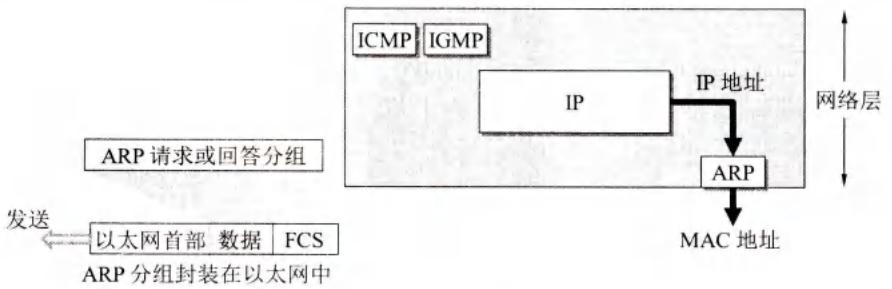
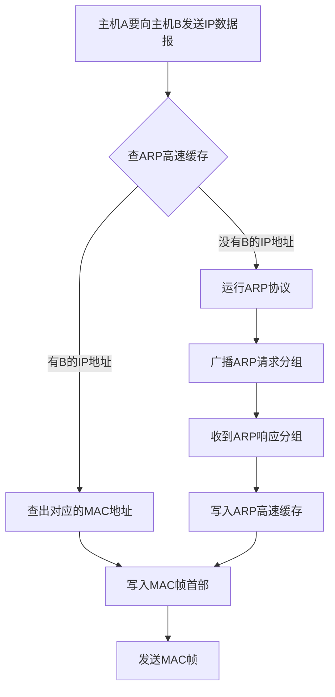
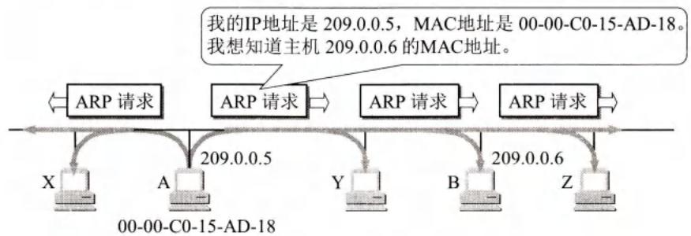
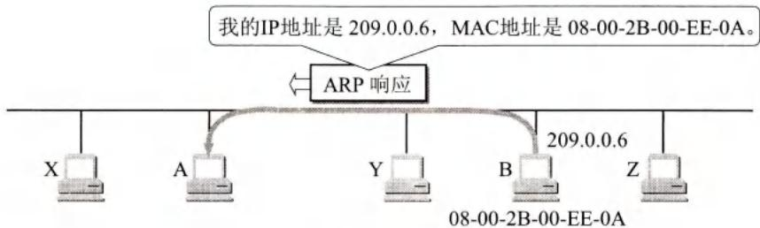
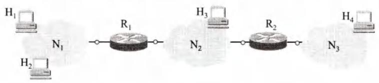
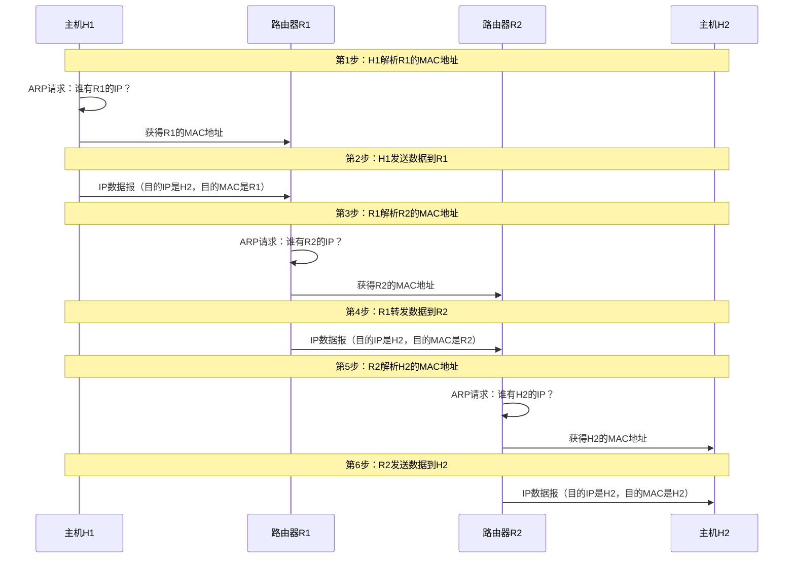
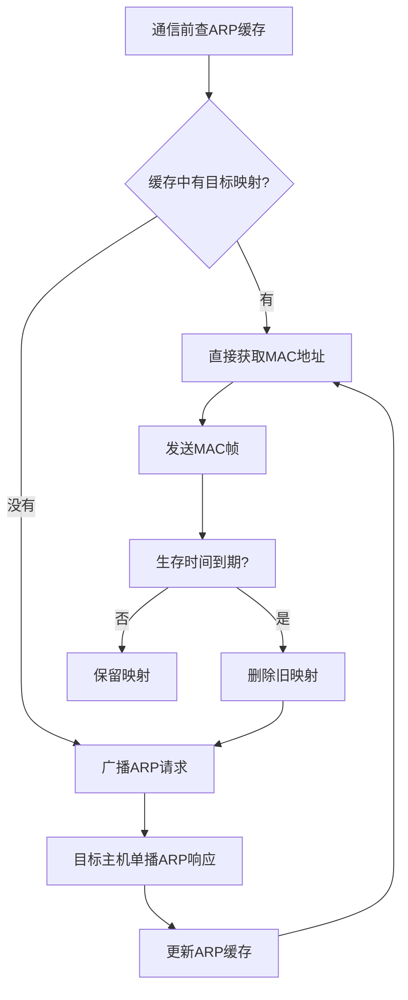

# 第4章-4.2.4-地址解析协议ARP

## 基本信息
- **课程**：计算机网络
- **章节**：第4章 4.2.4节 地址解析协议ARP
- **日期": "2026-04-26"
- **标签": "#ARP #地址解析 #IP地址 #MAC地址 #广播"

---

## 重点内容

### ⭐⭐⭐ 核心概念
1. **ARP作用**：将IP地址解析为MAC地址
2. **ARP高速缓存**：存放IP地址到MAC地址的映射表，减少广播
3. **ARP工作原理**：广播请求，单播响应
4. **ARP使用范围**：只解决同一局域网上的地址映射问题

### ⭐⭐ 关键问题
- ARP为什么需要高速缓存？
- ARP请求为什么用广播，响应为什么用单播？
- 跨网络的通信如何解析MAC地址？

---

## 详细笔记

### 一、ARP协议概述

#### 1. ARP的作用

**问题**：已知IP地址，如何找到对应的MAC地址？

**解决方案**：地址解析协议ARP（Address Resolution Protocol）


#### 📷 图4-17 协议ARP的作用



> 📚 **课本出处**: 图4-17 ARP实现IP地址到MAC地址的解析

#### 2. 为什么需要ARP？

**IP地址和MAC地址的差异**：
- IP地址：32位，逻辑地址
- MAC地址：48位，硬件地址
- 两者之间不存在简单的映射关系

**网络环境的变化**：
- 新主机加入网络
- 主机撤走
- 更换网络适配器（MAC地址改变）

**ARP的解决方案**：
- 在主机ARP高速缓存中存放IP地址到MAC地址的映射表
- 动态更新（新增或超时删除）

---

### 二、ARP工作原理

#### 1. ARP高速缓存

**作用**：
- 存放本局域网上各主机和路由器的IP地址到MAC地址的映射
- 减少网络上的通信量
- 避免每次通信都发送ARP请求广播

**工作流程**：



#### 2. ARP请求与响应

#### 📷 图4-18 地址解析协议ARP的工作原理



> 📚 **课本出处**: 图4-18(a) 主机A广播发送ARP请求分组



> 📚 **课本出处**: 图4-18(b) 主机B向A发送ARP响应分组（单播）

**ARP请求过程**：

| 步骤 | 操作 | 说明 |
|-----|------|------|
| 1 | 主机A广播ARP请求 | "我的IP是209.0.0.5，MAC是00-00-C0-15-AD-18，我想知道IP为209.0.0.6的主机的MAC地址" |
| 2 | 局域网上所有主机收到 | 所有运行ARP进程的主机都收到此请求 |
| 3 | 主机B响应 | IP地址一致的主机B收下请求，发送ARP响应 |
| 4 | 其他主机忽略 | IP地址不一致的主机忽略此请求 |
| 5 | 主机B发送ARP响应 | "我的IP是209.0.0.6，MAC是08-00-2B-00-EE-0A"（单播） |
| 6 | 主机A更新缓存 | 将B的IP-MAC映射写入ARP高速缓存 |

**关键点**：
- ✅ **ARP请求**：广播发送（目的MAC为FF-FF-FF-FF-FF-FF）
- ✅ **ARP响应**：单播发送（一对一）
- ✅ **双向更新**：A的请求中包含A的映射，B收到后也会更新自己的缓存

#### 3. ARP高速缓存的生存时间

**设置生存时间的重要性**：

**场景示例**：
1. 主机A和B通信，A的缓存中有B的MAC地址
2. B的网络适配器坏了，B更换了一块，MAC地址改变
3. A用旧的MAC地址向B发送数据帧 → 找不到B
4. **超过生存时间后**，A的缓存删除B的旧映射
5. A重新广播ARP请求 → 找到B的新MAC地址

**典型生存时间**：10~20分钟

---

### 三、ARP的使用范围

#### 1. 同一局域网内

**ARP解决的问题**：同一局域网上的主机或路由器的IP地址和MAC地址的映射

#### 📷 图4-19 使用ARP的四种典型情况



> 📚 **课本出处**: 图4-19 使用ARP的四种典型情况

**四种典型情况**：

| 情况 | 发送方 | 接收方 | ARP操作 |
|-----|--------|--------|---------|
| **1** | 主机H1 | 同一网络的主机H2 | H1广播ARP请求，找到H2的MAC地址 |
| **2** | 主机H1 | 另一网络的主机H3/H4 | H1广播ARP请求，找到本网络路由器R1的MAC地址 |
| **3** | 路由器R1 | 同一网络的主机H3 | R1广播ARP请求，找到H3的MAC地址 |
| **4** | 路由器R1 | 另一网络的主机H4 | R1广播ARP请求，找到本网络路由器R2的MAC地址 |

#### 2. 跨网络通信

**重要原则**：
- ARP只解决**同一局域网**上的地址映射问题
- 跨网络的通信需要多次使用ARP

**示例：H1发送数据到H2（不同网络）**



**关键点**：
- 每经过一个路由器，都要重新解析下一跳的MAC地址
- IP数据报中的目的IP始终是最终目的主机
- MAC帧中的目的MAC是下一跳的MAC地址

---

### 四、为什么需要两种地址？

**问题**：既然最终按MAC地址找目的主机，为什么不直接用MAC地址通信？

**答案**：

1. **异构网络问题**
   ```
   全世界存在各式各样的网络：
   - 以太网（MAC地址48位）
   - 令牌环网
   - FDDI网
   - 无线局域网
   - ...
   
   这些网络使用不同的MAC地址格式
   进行MAC地址转换工作极其复杂
   ```

2. **寻址困难**
   - 对分布全世界的以太网MAC地址寻址极其困难
   - MAC地址没有层次结构，无法聚合
   - 路由表将变得极其庞大

3. **IP地址的优势**
   ```
   IP编址解决了复杂问题：
   - 连接到互联网的主机只需一个IP地址
   - 通信像连接在同一网络上那样简单
   - ARP过程由软件自动进行
   - 用户完全看不见地址解析过程
   ```

4. **结论**
   - 在虚拟的IP网络上用IP地址通信给广大用户带来方便
   - 两种地址各司其职，缺一不可

---

## 疑问与思考

❓ **疑问**：ARP是如何将IP地址解析为MAC地址的？整个过程是怎样的？

💡 **解答**：

ARP通过"广播请求、单播响应"的方式完成地址解析：

1. **查缓存**：主机A先检查自己的ARP高速缓存，看是否已有目标IP的映射
2. **广播请求**：若缓存中没有，A在局域网上广播ARP请求分组，内容为"我的IP是X，MAC是Y，谁的IP是Z？请告知你的MAC地址"
3. **单播响应**：局域网上所有主机都收到请求，但只有IP地址匹配的主机B会以单播方式回复ARP响应，包含自己的MAC地址
4. **更新缓存**：A收到响应后，将B的IP-MAC映射写入ARP高速缓存

> 💡 ARP请求中包含了发送方A自身的IP-MAC映射，因此B收到后也会将A的映射缓存起来，实现双向更新，减少后续通信的ARP开销。

---

❓ **疑问**：ARP高速缓存为什么要设置生存时间？不设置会怎样？

💡 **解答**：

ARP高速缓存中每个映射项目都设置了**生存时间（一般为10~20分钟）**，超时后自动删除。原因如下：

- **网络环境动态变化**：主机可能更换网络适配器（MAC地址改变）、从网络中撤走、或IP地址被重新分配
- **防止映射过期**：如果缓存不过期，当目标主机的MAC地址发生变化后，发送方仍会使用旧的MAC地址发送数据帧，导致通信失败
- **自愈机制**：生存时间到期后删除旧映射，下次通信时重新广播ARP请求，即可获取最新的MAC地址

> 💡 没有ARP缓存的话，每次通信都需要广播ARP请求，会造成大量广播流量，严重影响网络性能。缓存机制体现了"用空间换时间"的设计思想。

---

❓ **疑问**：ARP为什么只能在同一个局域网内工作？跨网络通信时怎么办？

💡 **解答**：

ARP依赖数据链路层的**广播**机制，而广播帧**无法跨越路由器**，因此ARP只能解析同一局域网内的地址映射。

跨网络通信时的处理方式：
- **源主机**只需通过ARP找到**本网络网关路由器**的MAC地址，将数据帧发送给路由器
- **每个路由器**在转发数据报时，在自己直连的局域网上执行ARP，解析**下一跳路由器或目的主机**的MAC地址
- IP数据报中的**目的IP始终是最终目的主机**，而MAC帧中的目的MAC地址是**逐跳变化**的（每过一个路由器就换一次）

> 💡 这就是为什么互联网需要两种地址：MAC地址负责同一网络内的帧交付，IP地址负责跨网络的全局寻址。ARP是连接这两个层次的关键桥梁。

---

## 总结

### ARP请求与ARP响应对比

| 对比项 | ARP请求 | ARP响应 |
|:------:|:------:|:------:|
| **发送方式** | 广播（目的MAC为FF-FF-FF-FF-FF-FF） | 单播（一对一） |
| **内容** | 询问某IP对应的MAC地址 | 告知自己的IP和MAC地址 |
| **接收方** | 局域网内所有主机 | 只有发起请求的主机 |
| **是否包含发送方映射** | 是（双向更新） | 否 |

### ARP高速缓存机制



### ARP核心概念


---

## 核心考点总结

### ⭐⭐⭐ 必考内容

1. **ARP工作原理**

```
┌─────────────────────────────────────────────────────────┐
│                    ARP工作流程                           │
├─────────────────────────────────────────────────────────┤
│  1. 查ARP高速缓存                                        │
│     ├─ 有 → 直接使用                                     │
│     └─ 无 → 执行ARP协议                                  │
│                                                          │
│  2. 广播ARP请求分组                                       │
│     "谁的IP是X.X.X.X？请告知MAC地址"                      │
│                                                          │
│  3. 目标主机单播ARP响应                                   │
│     "我的IP是X.X.X.X，MAC是XX-XX-XX-XX-XX-XX"            │
│                                                          │
│  4. 更新ARP高速缓存                                       │
│     写入IP-MAC映射，设置生存时间                          │
└─────────────────────────────────────────────────────────┘
```

2. **ARP请求 vs ARP响应**

| 特性 | ARP请求 | ARP响应 |
|-----|---------|---------|
| 发送方式 | 广播 | 单播 |
| 目的MAC | FF-FF-FF-FF-FF-FF | 请求方的MAC |
| 内容 | 询问某IP对应的MAC | 告知自己的IP和MAC |
| 谁接收 | 局域网内所有主机 | 只有请求方 |

3. **ARP使用范围**
   - ✅ 只解决**同一局域网**上的地址映射
   - ✅ 跨网络通信需要**多次使用ARP**
   - ✅ 每经过一个路由器都要重新解析

4. **四种典型情况**（见表4-19）
   - 主机→主机（同一网络）
   - 主机→主机（不同网络）→解析路由器
   - 路由器→主机（同一网络）
   - 路由器→主机（不同网络）→解析下一跳路由器

### 📌 易混淆点辨析

| 概念 | 说明 |
|-----|------|
| **ARP** | 地址解析协议，IP地址 → MAC地址 |
| **RARP** | 逆地址解析协议，MAC地址 → IP地址（已被DHCP取代） |
| **ARP高速缓存** | 存放IP-MAC映射表，减少广播 |
| **生存时间** | 缓存项的有效期，超时删除 |
| **ARP请求** | 广播发送，谁有某IP地址 |
| **ARP响应** | 单播发送，我有某IP地址 |

### 📝 常见考题类型

1. **简答题**：
   - 简述ARP的工作原理
   - 为什么ARP请求用广播，响应用单播？
   - ARP高速缓存的作用是什么？

2. **分析题**：
   - 分析跨网络通信时ARP的使用过程
   - 说明为什么需要设置ARP缓存的生存时间
   - 解释为什么互联网不直接用MAC地址通信

3. **综合题**：
   - 给出一个网络拓扑，描述从源到目的的完整ARP过程
   - 分析ARP高速缓存对网络性能的影响

---

## 相关链接

### 本节涉及图片
- [图4-17 ARP作用](../../../images/d8901d2add1126f22e3d0304c714e09bcae59477ffcb20a3bb71bd85238836da.jpg)
- [图4-18 ARP请求](../../../images/03853990027c0bd8925643c8f8bd6e1e6972f3eb8592d6cd0e1d0f9932393d3e.jpg)
- [图4-18 ARP响应](../../../images/6be8e4ccb88e773610ffc272a898f4dbc41b4e1f5dc774cfb753f6c6f93bdfa6.jpg)
- [图4-19 ARP四种情况](../../../images/64bfc9147dbce8b2e1495327d15aa07068a05f25adc6c6c3561961e00d265b0f.jpg)

### 关联章节
- [第4章-4.2.3-IP地址与MAC地址](./第4章-4.2.3-IP地址与MAC地址.md) - 两种地址的关系
- [第6章-6.6-动态主机配置协议DHCP](../../第6章-应用层/第6章-6.6-动态主机配置协议DHCP.md) - 取代RARP的协议

---

*笔记创建时间：2026-04-26*
