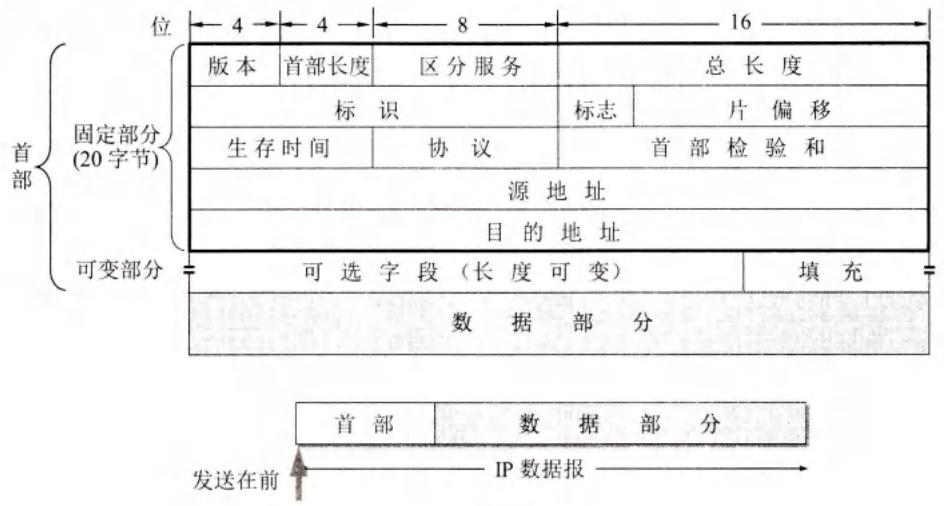
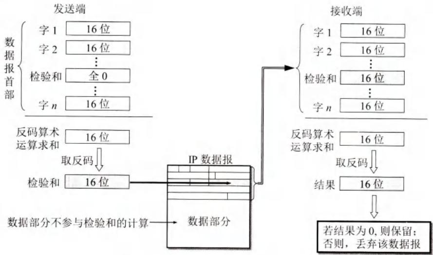
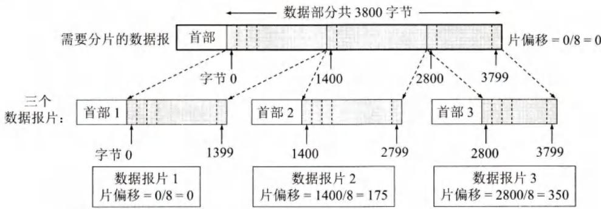
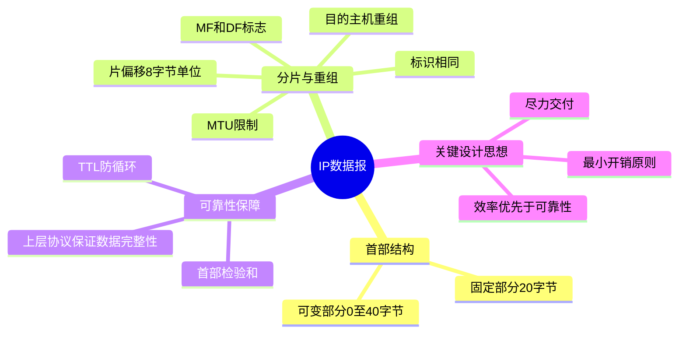

# 第4章-4.2.5-IP数据报的格式

## 基本信息

- **课程**：计算机网络
- \*\*章节": "第4章 4.2.5节 IP数据报的格式
- \*\*日期": "2026-04-26"
- \*\*标签": "#IP数据报 #首部格式 #分片 #TTL #检验和"

***

## 重点内容

### ⭐⭐⭐ 核心概念

1. **IP数据报结构**：首部（固定20字节+可变部分）+ 数据
2. **首部各字段含义**：版本、首部长度、总长度、标识、标志、片偏移、TTL、协议、检验和、源/目的地址
3. **IP数据报分片**：MTU限制、分片与重组
4. **生存时间TTL**：防止数据报无限循环

### ⭐⭐ 关键问题

- 为什么要进行IP数据报分片？
- TTL的作用是什么？
- 首部检验和为什么不检验数据部分？

***

## 详细笔记

### 一、IP数据报概述

#### 1. 数据报结构

```
┌─────────────────────────────────────────────────────────┐
│                      IP数据报                            │
├─────────────────────────────────────────────────────────┤
│  IP首部（20~60字节）                                      │
│  ├── 固定部分（20字节）                                   │
│  └── 可变部分（0~40字节，可选字段）                        │
├─────────────────────────────────────────────────────────┤
│  数据部分（可变长度，最大65515字节）                       │
└─────────────────────────────────────────────────────────┘
```

**首部格式宽度**：32位（4字节）

#### 📷 图4-20 IP数据报的格式



> 📚 **课本出处**: 图4-20 IP数据报由首部和数据两部分组成，首部前20字节固定

***

### 二、首部固定部分（20字节）

#### 📊 IP数据报首部字段详解

| 字段          | 长度  | 说明                               |
| ----------- | --- | -------------------------------- |
| **版本**      | 4位  | IP协议版本，IPv4=4                    |
| **首部长度**    | 4位  | 单位是4字节，最小值5（20字节），最大值15（60字节）    |
| **区分服务**    | 8位  | 旧称服务类型，一般不使用                     |
| **总长度**     | 16位 | 首部+数据之和，最大65535字节                |
| **标识**      | 16位 | 数据报标识，分片时复制到各片                   |
| **标志**      | 3位  | DF（不分片）、MF（更多分片）                 |
| **片偏移**     | 13位 | 分片在原数据报中的位置，单位8字节                |
| **生存时间TTL** | 8位  | 数据报寿命，每经路由器减1                    |
| **协议**      | 8位  | 数据部分使用的协议（TCP=6, UDP=17, ICMP=1） |
| **首部检验和**   | 16位 | 只检验首部，不检验数据                      |
| **源地址**     | 32位 | 发送方IP地址                          |
| **目的地址**    | 32位 | 接收方IP地址                          |

#### 1. 版本（4位）

- 指IP协议的版本
- IPv4：版本号为4
- IPv6：版本号为6
- 通信双方版本必须一致

#### 2. 首部长度（4位）

- **单位**：32位字长（4字节）
- **最小值**：5（二进制0101）→ 20字节（固定部分）
- **最大值**：15（二进制1111）→ 60字节（固定+可变）
- **常用值**：5（20字节，不使用可选字段）

⚠️ **注意**：首部长度必须是4字节的整数倍，不足时用填充字段补齐

#### 3. 区分服务（8位）

- 旧标准中叫"服务类型"
- 1998年改名为"区分服务DS"
- **一般不使用**

#### 4. 总长度（16位）

- **定义**：首部和数据之和的长度
- **单位**：字节
- **最大值**：2^16 - 1 = 65535字节
- **实际很少达到**：受MTU限制

**MTU（最大传送单元）**：

- 数据链路层规定的帧数据字段最大长度
- 以太网MTU = 1500字节
- 超过MTU必须分片

**最小接受长度**：576字节

- 所有主机和路由器必须能接受不超过576字节的数据报
- 上层数据512字节 + 最长首部60字节 + 富余4字节

#### 5. 标识（16位）

- IP软件维护的计数器
- 每产生一个数据报，计数器+1
- **作用**：分片时复制到各分片，用于重组
- **不是序号**：IP是无连接服务

#### 6. 标志（3位）

| 位   | 名称                  | 含义                      |
| --- | ------------------- | ----------------------- |
| 最低位 | MF (More Fragment)  | MF=1：后面还有分片；MF=0：最后一个分片 |
| 中间位 | DF (Don't Fragment) | DF=1：不允许分片；DF=0：允许分片    |
| 最高位 | -                   | 保留未用                    |

#### 7. 片偏移（13位）

- **含义**：分片在原数据报中的相对位置
- **单位**：8字节
- **要求**：除最后一个分片外，其他分片长度必须是8字节的整数倍

#### 8. 生存时间TTL（8位）

- **Time To Live**
- **原始设计**：以秒为单位
- **现在功能**：跳数限制
- **工作方式**：每经一个路由器，TTL减1
- **TTL=0**：丢弃数据报
- **最大值**：255
- **作用**：防止数据报无限循环

**应用场景**：

- TTL=1：只能在本局域网传送
- TTL=255：可经过最多255个路由器

#### 9. 协议（8位）

- 指出数据部分使用的协议
- 目的主机IP层根据此字段将数据上交相应协议

**常用协议字段值**：

| 协议   | 字段值 |
| ---- | --- |
| ICMP | 1   |
| IGMP | 2   |
| TCP  | 6   |
| UDP  | 17  |
| IPv6 | 41  |
| OSPF | 89  |

#### 10. 首部检验和（16位）

- **只检验首部，不检验数据**
- **原因**：数据报每经路由器，首部一些字段会变化（如TTL）
- **计算方法**：反码算术运算

**计算过程**：

1. 发送方：首部划分为16位字序列，检验和字段置0
2. 所有16位字用反码算术相加
3. 将和的反码写入检验和字段
4. 接收方：所有16位字再相加，取反码
5. 结果为0：首部未变化；否则：丢弃数据报

#### 📷 图4-22 IP数据报首部检验和的计算过程



> 📚 **课本出处**: 图4-22 首部检验和采用反码算术运算

#### 11. 源地址（32位）

- 发送IP数据报的主机的IP地址

#### 12. 目的地址（32位）

- 接收IP数据报的主机的IP地址

***

### 三、IP数据报分片

#### 1. 为什么要分片？

**MTU限制**：

- 不同网络有不同的MTU‘ ‘
- IP数据报总长度不能超过下层网络的MTU
- 超过时必须分片

**常见MTU值**：

| 网络类型  | MTU（字节） |
| ----- | ------- |
| 以太网   | 1500    |
| PPPoE | 1492    |
| X.25  | 576     |
| 令牌环网  | 4464    |

#### 2. 分片示例

#### 📷 图4-21 数据报的分片举例



> 📚 **课本出处**: 图4-21 总长度3820字节的数据报分片为3个数据报片

**【例4-1】分片计算**

**已知**：

- 原始数据报总长度：3820字节
- 数据部分：3800字节
- 固定首部：20字节
- 要求：每个分片不超过1420字节

**计算**：

- 每个分片数据部分最大：1420 - 20 = 1400字节
- 需要分片数：⌈3800/1400⌉ = 3片

**分片结果**：

#### 📊 表4-5 IP数据报首部中与分片有关的字段

| <br />    | 总长度  | 标识    | MF | DF | 片偏移 |
| --------- | ---- | ----- | -- | -- | --- |
| **原始数据报** | 3820 | 12345 | 0  | 0  | 0   |
| **数据报片1** | 1420 | 12345 | 1  | 0  | 0   |
| **数据报片2** | 1420 | 12345 | 1  | 0  | 175 |
| **数据报片3** | 1020 | 12345 | 0  | 0  | 350 |

**片偏移计算**：

- 片1：偏移 = 0（从0字节开始）
- 片2：偏移 = 1400/8 = 175（从1400字节开始）
- 片3：偏移 = 2800/8 = 350（从2800字节开始）

**进一步分片**：

- 若数据报片2（1400字节数据）还需分片：
  - 片2-1：数据800字节，偏移175，MF=1
  - 片2-2：数据600字节，偏移275，MF=1

#### 3. 分片与重组

**分片**：

- 在源主机或中间路由器进行
- 每个分片都有独立的IP首部
- 标识字段相同，片偏移不同

**重组**：

- 在目的主机进行
- 根据标识、MF、片偏移重组
- 所有分片到达后才能重组

***

### 四、首部可变部分

#### 1. 选项字段

- **长度**：1\~40字节
- **作用**：支持排错、测量、安全等
- **内容**：多个选项项目拼接

#### 2. 填充字段

- **作用**：补齐为4字节的整数倍
- **内容**：全0

#### 3. 使用情况

- **很少使用**
- 增加路由器处理开销
- **IPv6已取消可变部分**，首部长度固定

***

## 疑问与思考

❓ **疑问**：首部检验和为什么不检验数据部分？这样做的好处和坏处分别是什么？

💡 **解答**：

**好处**：
- 数据报每经过一个路由器，首部中的**TTL、标志、片偏移**等字段都会发生变化，路由器必须重新计算首部检验和。如果不检验数据部分，只需对首部（20字节）做反码算术运算，**大大减少了计算工作量**
- 如果连数据一起检验，每次经过路由器都要对整个数据报（可能数千字节）重新计算，严重影响转发效率

**坏处**：
- 数据部分的比特差错**无法被IP层检测到**，只能依赖上层协议（如TCP的校验和）来保证数据完整性
- 这是IP层"**只负责尽力交付**"设计哲学的体现——把可靠性检查交给上层

> 💡 课本习题4-10进一步追问：当路由器发现首部检验和出错时，直接丢弃数据报而不请求重传，因为IP是无连接协议，路由器并不知道源站是谁。另外，IP检验和不采用CRC而用简单的反码算术，也是为了减少路由器的计算开销。

---

❓ **疑问**：TTL（生存时间）的作用是什么？为什么要设置TTL？

💡 **解答**：

TTL的核心目的是**防止无法交付的数据报在互联网中无限循环**，白白消耗网络资源。

**工作机制**：
- 源主机设置TTL初始值（如64、128、255）
- 每经过一个路由器，TTL减1（现在的TTL单位是**跳数**，不是最初的秒数）
- TTL减为0时，路由器**丢弃**该数据报，并向源主机发送**ICMP时间超过**差错报告报文

**设计演变**：
- **最初设计**：以秒为单位，减去数据报在路由器消耗的时间
- **现在实现**：由于路由器处理时间远小于1秒，改为"跳数限制"，每次转发前TTL减1

**实际应用**：`traceroute`工具正是利用TTL，从TTL=1开始逐步递增发送数据报，根据返回的"时间超过"报文来探测从源到目的路径上的每一个路由器。

> 💡 TTL最大值为255（8位字段），即数据报最多经过255个路由器。若TTL初始值设为1，则只能在同一局域网内传送。

---

❓ **疑问**：IP首部的可选字段（选项字段）是做什么用的？为什么IPv6去掉了它？

💡 **解答**：

**选项字段的作用**：
- 长度为1~40字节，支持**排错、测量、安全**等措施
- 多个选项拼接在一起，不需要分隔符
- 最后用全0的填充字段补齐为4字节的整数倍

**很少使用的原因**：
- 可变长度的首部使路由器处理开销增大（每台路由器都要解析选项）
- 实际网络中极少使用这些功能
- 很多路由器直接忽略选项字段

**IPv6的处理**：
- IPv6取消了可选字段，将首部固定为40字节
- 选项功能改由**扩展首部**实现，通过"下一个首部"字段逐层链接
- 这大大简化了路由器对数据报的处理

> 💡 选项字段的存在体现了IPv4"功能丰富但实现复杂"的特点，而IPv6通过分离固定首部和扩展首部，在灵活性和效率之间找到了更好的平衡。

---

## 总结

### IP数据报首部字段一览

| 字段 | 长度 | 说明 |
|:----:|:----:|:-----|
| **版本** | 4位 | IP协议版本号，IPv4=4，IPv6=6 |
| **首部长度** | 4位 | 单位4字节，最小5（20字节），最大15（60字节） |
| **区分服务** | 8位 | 旧称服务类型，一般不使用 |
| **总长度** | 16位 | 首部+数据之和，最大65535字节 |
| **标识** | 16位 | 计数器递增，分片时复制到各片用于重组 |
| **标志** | 3位 | MF=后面还有分片，DF=不允许分片 |
| **片偏移** | 13位 | 分片在原数据报中的相对位置，单位8字节 |
| **生存时间TTL** | 8位 | 每经路由器减1，为0时丢弃，防止无限循环 |
| **协议** | 8位 | 数据部分的协议类型（TCP=6, UDP=17, ICMP=1） |
| **首部检验和** | 16位 | 只检验首部，不检验数据，采用反码算术运算 |
| **源地址** | 32位 | 发送方IP地址 |
| **目的地址** | 32位 | 接收方IP地址 |
| **可选字段** | 0~40字节 | 排错/测量/安全，很少使用，IPv6已取消 |
| **填充** | 可变 | 全0，补齐为4字节整数倍 |

### 关键参数表

| 参数 | 值 | 说明 |
|:----:|:--:|:-----|
| 固定首部长度 | 20字节 | 所有IP数据报必须具有 |
| 最大首部长度 | 60字节 | 包含40字节可选字段 |
| 最大数据报长度 | 65535字节 | 总长度字段16位的最大值 |
| 以太网MTU | 1500字节 | 超过则必须分片 |
| 最小接受长度 | 576字节 | 所有主机必须能接受 |
| TTL最大值 | 255 | 数据报最多经过255个路由器 |
| 片偏移单位 | 8字节 | 除最后分片外，每片长度须为8字节整数倍 |

### IP核心概念



***

## 核心考点总结

### ⭐⭐⭐ 必考内容

1. **IP数据报首部结构**

```
┌─────────────────────────────────────────────────────────┐
│  版本(4) │ 首部长度(4) │ 区分服务(8)  │    总长度(16)    │
├─────────────────────────────────────────────────────────┤
│           标识(16)          │ 标志(3) │   片偏移(13)    │
├─────────────────────────────────────────────────────────┤
│   生存时间TTL(8)   │    协议(8)    │     检验和(16)     │
├─────────────────────────────────────────────────────────┤
│                   源IP地址(32)                          │
├─────────────────────────────────────────────────────────┤
│                  目的IP地址(32)                         │
├─────────────────────────────────────────────────────────┤
│              可选字段 + 填充（0~40字节）                 │
└─────────────────────────────────────────────────────────┘
```

1. **关键字段取值**

| 字段   | 最小值     | 最大值      | 常用值     |
| ---- | ------- | -------- | ------- |
| 首部长度 | 5（20字节） | 15（60字节） | 5（20字节） |
| 总长度  | 20      | 65535    | 取决于MTU  |
| TTL  | 0       | 255      | 64/128  |

1. **分片计算**

```
分片数 = ⌈数据长度 / (MTU - 首部长度)⌉

片偏移 = 该分片数据起始位置 / 8

MF标志：
- MF=1：后面还有分片
- MF=0：最后一个分片
```

1. **常用协议号**

| 协议   | 字段值 |
| ---- | --- |
| ICMP | 1   |
| TCP  | 6   |
| UDP  | 17  |

### 📌 易混淆点辨析

| 概念       | 说明               |
| -------- | ---------------- |
| **首部长度** | 单位是4字节，最小5（20字节） |
| **总长度**  | 单位是字节，首部+数据      |
| **MTU**  | 数据链路层最大传送单元      |
| **标识**   | 同一数据报的分片标识相同     |
| **片偏移**  | 单位是8字节           |
| **TTL**  | 现在是跳数限制，不是时间     |

### 📝 常见考题类型

1. **计算题**（重点）：
   - 给定数据报长度和MTU，计算分片数量和各分片参数
   - 计算片偏移值
   - 计算首部检验和
2. **简答题**：
   - 说明IP数据报首部的结构
   - 解释TTL的作用
   - 为什么首部检验和不检验数据部分？
3. **分析题**：
   - 分析分片对网络性能的影响
   - 说明DF标志的作用

***

## 相关链接

### 本节涉及图片

- [图4-20 IP数据报格式](../../../images/bf5fc25fe777cc17dffebf3cc108e490670e3cbaa7738da5256c07441e3fc4c2.jpg)
- [图4-21 数据报分片](../../../images/c3f170f60055a2e12ef81bd19d115cde33ad219438b08d551afedac499b5cab9.jpg)
- [图4-22 检验和计算](../../../images/ee0fb77a32381b13da160467a60738f99b1bd851934694a83efa083ce94527a8.jpg)

### 关联章节

- [第4章-4.3-IP层转发分组的过程](./第4章-4.3-IP层转发分组的过程.md) - 基于终点的转发
- [第4章-4.5-IPv6](./第4章-4.5-IPv6.md) - IPv6首部格式

***

*笔记创建时间：2026-04-26*
