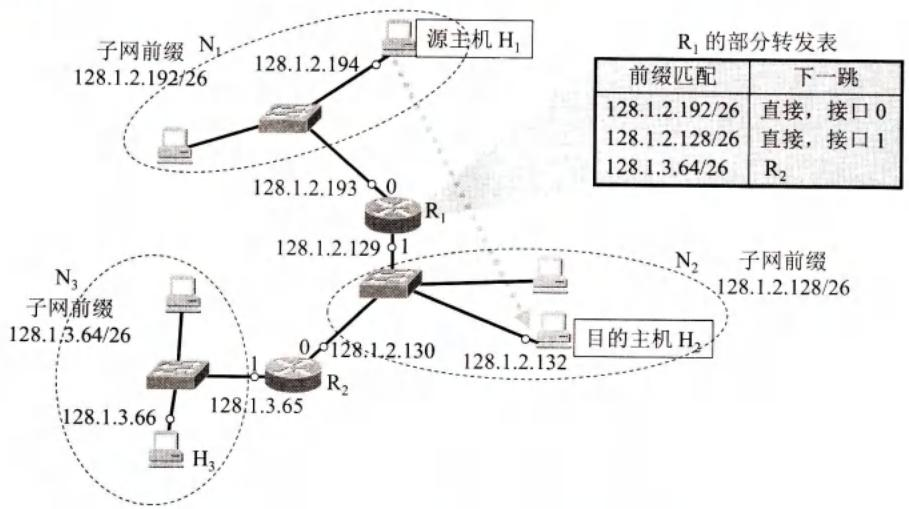
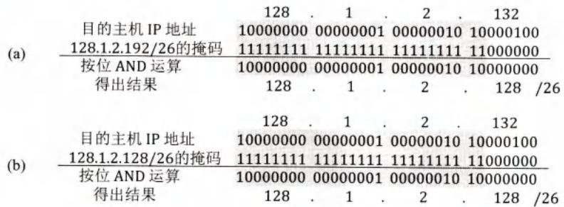
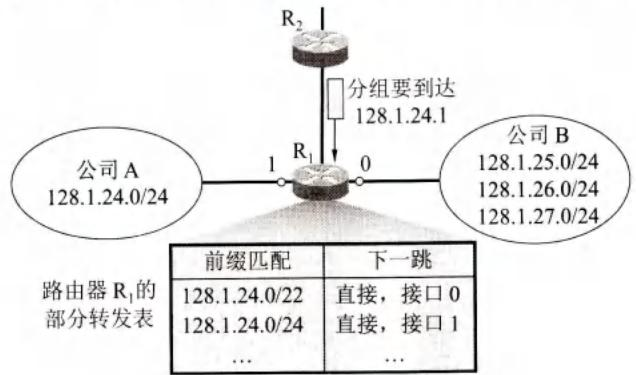
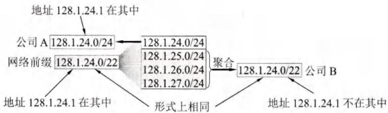
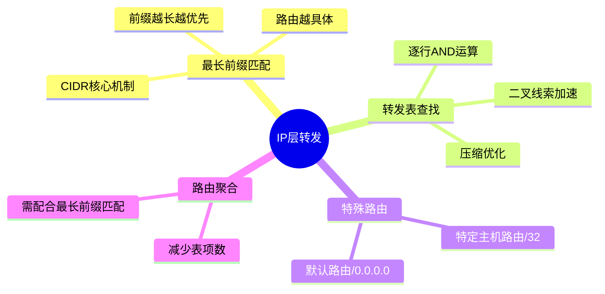

# 第4章-4.3-IP层转发分组的过程

## 基本信息

- **课程**：计算机网络
- **章节**：第4章 4.3节 IP层转发分组的过程
- **日期**：2026-04-26
- **标签**：#IP转发 #路由表 #最长前缀匹配 #二叉线索

***

## 重点内容

### ⭐⭐⭐ 核心概念

1. **基于终点的转发**：根据目的IP地址查找转发表
2. **最长前缀匹配**：查找与目的地址匹配的最长网络前缀
3. **特定主机路由**：为特定主机指定路由
4. **默认路由**：0.0.0.0/0，匹配所有目的地址

### ⭐⭐ 关键问题

- 为什么使用最长前缀匹配而不是精确匹配？
- 如何压缩转发表的大小？
- 二叉线索如何提高查找效率？

***

## 详细笔记

### 一、基于终点的转发

#### 1. 转发原理


**转发过程**：

1. 分组到达路由器
2. 提取分组首部中的**目的IP地址**
3. 用目的地址与转发表中的网络前缀进行匹配
4. 找到匹配项后，按指明的接口转发

#### 2. 压缩转发表

**问题**：互联网主机数太大，如果按目的主机地址查找，转发表会非常庞大

**解决方案**：基于网络前缀转发

- 先查找目的网络（网络前缀）
- 找到目的网络后，直接交付给目的主机
- 网络数 << 主机数，大大压缩转发表

#### 📷 图4-23 源主机H1向目的地址H2发送分组



> 📚 **课本出处**：图4-23 三个子网通过两个路由器互连，展示分组转发过程

**【例4-2】分组转发过程分析**

**场景**：

- 主机H1发送分组到目的地址128.1.2.132（主机H2）
- 需要确定是直接交付还是间接交付

**步骤1：判断是否直接交付**

```
目的地址：128.1.2.132
本网络掩码：/26（255.255.255.192）

AND运算：
  128.1.2.132 = 10000000 00000001 00000010 10000100
& 255.255.255.192 = 11111111 11111111 11111111 11000000
  ---------------------------------------------------
  128.1.2.128   = 10000000 00000001 00000010 10000000

结果128.1.2.128 ≠ 本网络前缀128.1.2.192/26
∴ 需要间接交付，发送给路由器R1
```

**步骤2：路由器R1查找转发表**

| 前缀匹配           | 下一跳   | 接口 |
| -------------- | ----- | -- |
| 128.1.2.192/26 | -     | 0  |
| 128.1.2.128/26 | -     | 1  |
| 128.1.3.0/24   | -     | 2  |
| 0.0.0.0/0      | 默认路由器 | 3  |

**匹配过程**：

1. 第1行：128.1.2.128/26 ≠ 128.1.2.192/26 ❌
2. 第2行：128.1.2.128/26 = 128.1.2.128/26 ✅

**结论**：从接口1直接交付到网络N2上的主机H2

#### 📷 图4-24 目的地址和子网掩码按位进行AND运算



> 📚 **课本出处**：图4-24 (a)与第1行掩码运算不匹配；(b)与第2行掩码运算匹配

***

### 二、最长前缀匹配

#### 1. 问题引入

**场景**：目的地址与多个前缀都匹配，如何选择？

#### 📷 图4-25 分组交给路由器R1进行转发




> 📚 **课本出处**：图4-25 公司B采用路由聚合，三个子网聚合为128.1.24.0/22

**【例4-3】最长前缀匹配**

**场景**：

- 目的地址：128.1.24.1
- 转发表中有两个匹配项：
  - 128.1.24.0/24（公司A）
  - 128.1.24.0/22（公司B的聚合路由）

**匹配结果**：

- 与/24匹配：前24位相同 ✅
- 与/22匹配：前22位相同 ✅

**问题**：两个都匹配，选哪个？

#### 📷 图4-26 公司A和B分到的前缀



> 📚 **课本出处**：图4-26 公司A：128.1.24.0/24；公司B：128.1.24.0/22（聚合）

#### 2. 最长前缀匹配原则

**原则**：选择网络前缀最长的匹配项

**原因**：

- 前缀越长，地址块越小，路由越具体
- /24比/22更具体（更精确）

**本例结论**：

- 选择/24（公司A）而非/22（公司B）
- 分组从接口1转发到公司A

#### 3. 最长前缀匹配的意义

```
转发表中的前缀（按长度排序）：

/32  特定主机路由（最具体）
/24  子网路由
/16  网络路由
/8   大网络路由
/0   默认路由（最不具体）
```

**匹配顺序**：从最长前缀开始查找

***

### 三、使用二叉线索查找转发表

#### 1. 查找算法的需求

**要求**：

- 快速查找（路由器转发速度要求高）
- 支持最长前缀匹配

#### 2. 二叉线索（Binary Trie）

**基本思想**：

- 用IP地址的比特值构建二叉树
- 左分支表示0，右分支表示1
- 在路径上存储网络前缀信息

**示例**：

```
假设有两个前缀：
- 0100（4位）
- 0101（4位）

构建的二叉线索：

        根
       /  \
      0    1
     /
    1
   /
  0
 / \
0   1
|   |
*   *
(0100) (0101)

*表示该节点存储了前缀信息
```

#### 3. 查找过程

**步骤**：

1. 从根节点开始
2. 根据目的地址的每一位，选择左（0）或右（1）分支
3. 沿途记录遇到的所有前缀
4. 到达叶子节点或无法继续时，选择最长的前缀

**示例**：

```
目的地址：010011...

查找路径：根→0→1→0→0→...
          在0100节点记录前缀
          继续查找...
```

#### 4. 压缩优化

**问题**：二叉线索可能很稀疏，浪费空间

**优化方法**：

- **路径压缩**：合并只有一个子节点的节点
- **多分支Trie**：一次检查多位（如4位）

***

### 四、特殊路由

#### 1. 特定主机路由

**定义**：为特定主机指定路由，前缀为/32

**用途**：

- 网络管理员控制网络
- 测试网络连通性
- 安全考虑

**示例**：

```
192.168.1.100/32 → 接口0
```

#### 2. 默认路由

**定义**：前缀为0.0.0.0/0，匹配所有目的地址

**特点**：

- 前缀长度为0，总是匹配
- 优先级最低（最长前缀匹配时最后考虑）

**用途**：

- 连接到互联网
- 减少转发表项目数

**示例**：

```
0.0.0.0/0 → 默认网关192.168.1.1
```

***

## 疑问与思考

❓ **疑问**：最长前缀匹配是如何工作的？为什么前缀越长越优先？

💡 **解答**：

- 路由器转发表中可能存在多个前缀都能匹配同一个目的地址
- 最长前缀匹配原则：选择网络前缀最长（即掩码位数最多）的匹配项
- 前缀越长，对应的地址块越小，路由越具体（more specific）
- 例如目的地址 128.1.24.1 同时匹配 /24 和 /22，选择 /24（更长更精确）
- 查找时可按前缀从长到短排列，找到第一个匹配即可停止

❓ **疑问**：默认路由 0.0.0.0/0 是什么意思？它总能匹配成功吗？

💡 **解答**：

- 默认路由的前缀 0.0.0.0/0 表示网络前缀为 0 位，掩码是全 0
- 用全 0 掩码和任何目的地址做 AND 运算，结果必定是全 0，一定匹配
- 但它的前缀长度为 0，是所有路由中最不具体的，优先级最低
- 只有当转发表中没有任何更长前缀匹配时，才会使用默认路由
- 适用于只有很少对外连接的网络，将所有未知目的的分组交给默认路由器处理

❓ **疑问**：路由聚合（地址聚合）有什么好处？会带来什么问题？

💡 **解答**：

- **好处**：将多个前缀相同的地址块聚合为一个更大的地址块，大大减少转发表项目数
  - 例如公司 B 的 3 个 /24 子网聚合为一个 /22 前缀
  - 减少路由器间交换的路由信息量，提高互联网性能
- **问题**：聚合后的前缀可能和更具体的前缀同时匹配
  - 例如 128.1.24.0/22（聚合）和 128.1.24.0/24（具体）都匹配 128.1.24.1
  - 必须依靠最长前缀匹配原则来正确选择更具体的路由
- 路由聚合可能导致部分地址的路由信息被"隐藏"，需要配合最长前缀匹配使用

***

## 核心考点总结

### ⭐⭐⭐ 必考内容

1. **基于终点的转发流程**

```
提取目的IP地址
    ↓
与转发表中的网络前缀匹配
    ↓
选择最长前缀匹配项
    ↓
按指明的接口转发
```

1. **最长前缀匹配原则**

| 前缀  | 长度  | 优先级      |
| --- | --- | -------- |
| /32 | 32位 | 最高（最具体）  |
| /24 | 24位 | 高        |
| /16 | 16位 | 中        |
| /8  | 8位  | 低        |
| /0  | 0位  | 最低（默认路由） |

**原则**：选择网络前缀最长的匹配项

1. **AND运算判断是否直接交付**

```
目的地址 AND 子网掩码 = 网络地址

若 网络地址 = 本网络前缀 → 直接交付
若 网络地址 ≠ 本网络前缀 → 间接交付（发给路由器）
```

1. **特殊路由**

| 类型     | 前缀  | 用途   |
| ------ | --- | ---- |
| 特定主机路由 | /32 | 特定主机 |
| 默认路由   | /0  | 匹配所有 |

### 📌 易混淆点辨析

| 概念         | 说明              |
| ---------- | --------------- |
| **转发表**    | 由路由表导出，用于实际转发分组 |
| **路由表**    | 由路由选择协议生成       |
| **最长前缀匹配** | 选择最具体的（前缀最长的）路由 |
| **默认路由**   | 0.0.0.0/0，最后匹配  |
| **特定主机路由** | /32，最优先匹配       |

### 📝 常见考题类型

1. **计算题**（重点）：
   - 给定目的地址和转发表，确定转发接口
   - 应用最长前缀匹配原则
   - AND运算判断是否直接交付
2. **简答题**：
   - 为什么使用最长前缀匹配？
   - 二叉线索查找的原理
   - 默认路由的作用
3. **分析题**：
   - 分析路由聚合与最长前缀匹配的关系
   - 给定网络拓扑，构建转发表

***

## 总结

### 转发表结构

| 字段 | 说明 | 示例 |
| --- | --- | --- |
| 网络前缀 | CIDR格式的地址块 | 128.1.24.0/24 |
| 下一跳 | 下一个路由器地址或"-" | - |
| 接口 | 本地转发接口编号 | 0, 1, 2 |

特殊路由项：

| 类型 | 前缀 | 特点 |
| --- | --- | --- |
| 特定主机路由 | a.b.c.d/32 | 最优先匹配，放在转发表最前面 |
| 默认路由 | 0.0.0.0/0 | 最后匹配，处理所有未知目的 |

### 分组转发算法步骤

```
(1) 提取目的IP地址 D
      ↓
(2) 是否有特定主机路由匹配 D？
    ├─ 是 → 按该路由下一跳转发
    └─ 否 → 进入(3)
      ↓
(3) 从最长前缀开始逐行匹配：
    子网掩码 AND D = ?
    ├─ 匹配成功 → 按该行下一跳转发
    └─ 不匹配 → 继续下一行，回到(3)
      ↓
(4) 所有行都不匹配：
    ├─ 有默认路由(0.0.0.0/0) → 交给默认路由器
    └─ 无默认路由 → 报告转发出错
```

### 关键概念



***

## 相关链接

### 本节涉及图片

- [图4-23 分组转发](../../../images/5307ac20bbc253268319341fea992275295278ed770a196bd439213a4a0c0086.jpg)
- [图4-24 AND运算](../../../images/b5cecdda2215b7e59e8706add0aaf0dabba023ac6c4a39787b9daf396ca45a03.jpg)
- [图4-25 路由聚合](../../../images/e6e3961af6279a91ff1ee09f2d01ccc127c2d902f9de9dab4dac3128c8287aaf.jpg)
- [图4-25 转发表](../../../images/9a42658a507ea2a45f701ec7e4eec38648b2019cf50a61e92111fd104cb2aff7.jpg)
- [图4-26 前缀分配](../../../images/c23e98ebd58e405dd10a3c6fdc54e3e29c4defbcbf9be0f52b268f401f59b9c0.jpg)

### 关联章节

- [第4章-4.2.5-IP数据报的格式](./第4章-4.2.5-IP数据报的格式.md) - IP数据报首部
- [第4章-4.6-互联网的路由选择协议](./第4章-4.6-互联网的路由选择协议.md) - 路由表生成

***

*笔记创建时间：2026-04-26*
