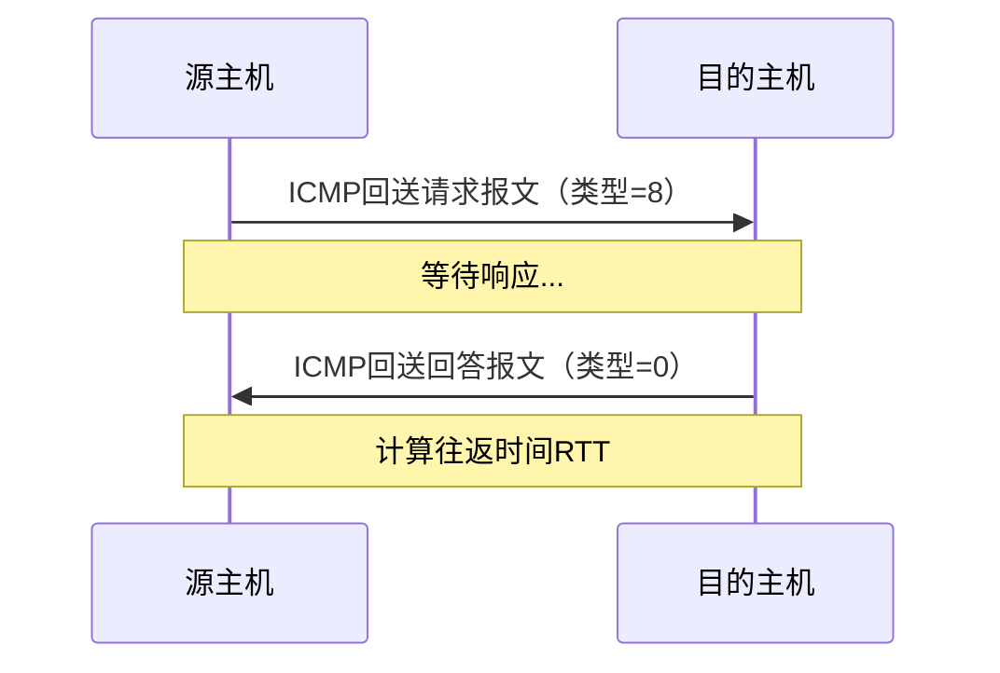
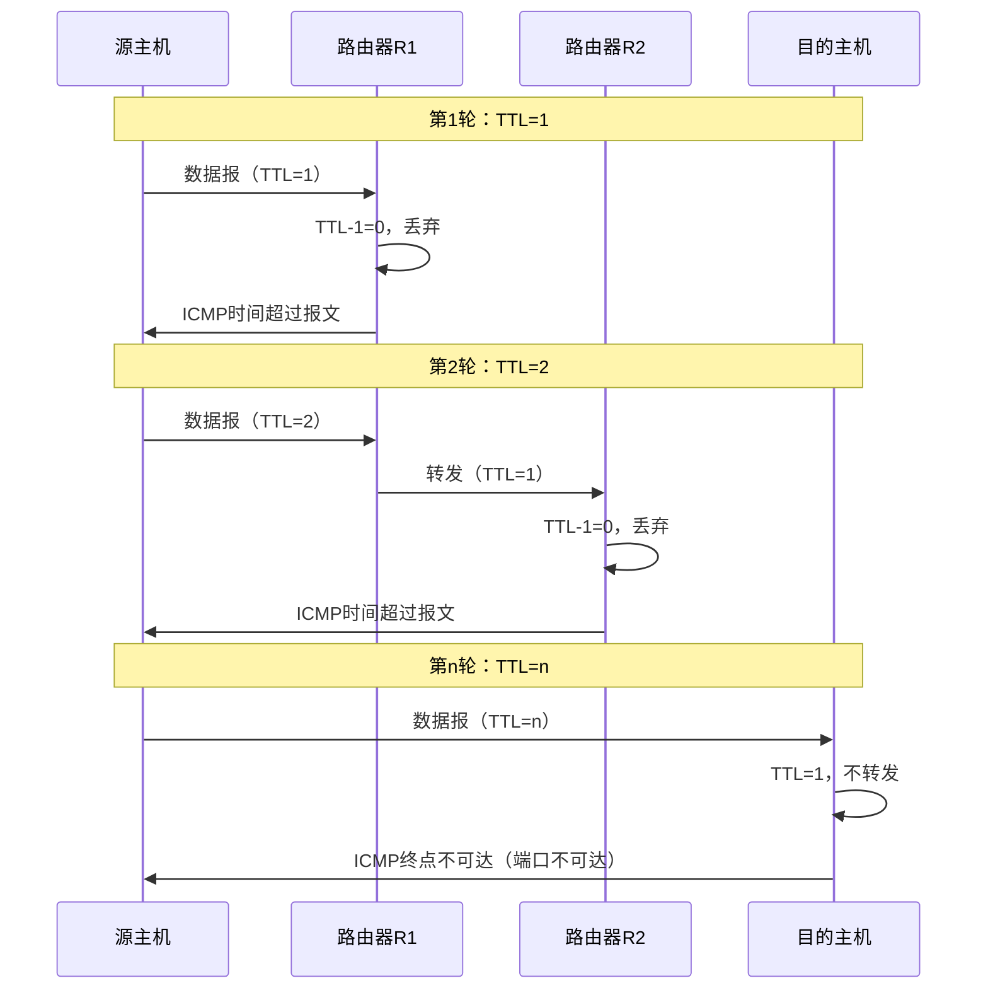

# 第4章-4.4-网际控制报文协议ICMP

## 基本信息
- **课程**：计算机网络
- **章节**：第4章 4.4节 网际控制报文协议ICMP
- **日期**：2026-04-26
- **标签**：#ICMP #差错报告 #PING #traceroute #网络诊断

---

## 重点内容

### ⭐⭐⭐ 核心概念
1. **ICMP作用**：报告差错情况和提供异常报告，是IP层协议
2. **ICMP报文种类**：差错报告报文（4种）+ 询问报文（2种）
3. **ICMP应用**：PING（测试连通性）、traceroute（跟踪路由）

### ⭐⭐ 关键问题
- ICMP为什么被认为是IP层协议而不是高层协议？
- 哪些情况不应发送ICMP差错报告报文？
- PING和traceroute的工作原理？

---

## 详细笔记

### 一、ICMP概述

#### 1. ICMP的作用

**全称**：Internet Control Message Protocol（网际控制报文协议）

**主要功能**：
- ✅ 允许主机或路由器**报告差错情况**
- ✅ 提供**有关异常情况的报告**
- ✅ 提高IP数据报交付成功的机会

**协议层次**：
```
┌─────────────────────────────────────┐
│  应用层                              │
├─────────────────────────────────────┤
│  运输层（TCP/UDP）                   │
├─────────────────────────────────────┤
│  网络层：IP、ICMP、IGMP、ARP         │  ← ICMP在这里
├─────────────────────────────────────┤
│  数据链路层                          │
├─────────────────────────────────────┤
│  物理层                              │
└─────────────────────────────────────┘
```

⚠️ **注意**：ICMP是**IP层协议**，不是高层协议
- 虽然ICMP报文装在IP数据报中
- 但作为IP层数据部分传输

#### 📷 图4-28 ICMP报文的格式


> 📚 **课本出处**：图4-28 ICMP报文前4字节：类型、代码、检验和

**ICMP报文格式**：
- **前4字节**：统一格式
  - 类型（8位）
  - 代码（8位）
  - 检验和（16位）
- **接着4字节**：与ICMP类型有关
- **数据字段**：长度取决于ICMP类型

---

### 二、ICMP报文的种类

#### 📊 表4-6 几种常用的ICMP报文类型

| ICMP报文种类 | 类型的值 | ICMP报文的类型 |
|-------------|---------|---------------|
| **差错报告报文** | 3 | 终点不可达 |
| | 11 | 时间超过 |
| | 12 | 参数问题 |
| | 5 | 改变路由（重定向） |
| **询问报文** | 8或0 | 回送请求或回送回答 |
| | 13或14 | 时间戳请求或时间戳回答 |

#### 1. ICMP差错报告报文

**共有4种**：

##### (1) 终点不可达（类型=3）
- **触发条件**：路由器或主机不能交付数据报
- **场景**：
  - 网络不可达
  - 主机不可达
  - 端口不可达
  - 协议不可达

##### (2) 时间超过（类型=11）
- **触发条件1**：收到TTL=0的数据报
  - 路由器丢弃数据报
  - 向源点发送时间超过报文
  
- **触发条件2**：终点不能在规定时间内收到所有数据报片
  - 丢弃已收到的数据报片
  - 向源点发送时间超过报文

##### (3) 参数问题（类型=12）
- **触发条件**：数据报首部中有的字段值不正确
- **处理**：丢弃数据报，向源点发送参数问题报文

##### (4) 改变路由（重定向）（类型=5）
- **作用**：路由器告诉主机更好的路由
- **场景**：
  - 主机使用默认路由器发送数据报
  - 默认路由器发现有更好的路由
  - 发送改变路由报文给主机
  - 主机更新转发表

#### 📷 图4-29 ICMP差错报告报文的数据字段的内容


> 📚 **课本出处**：图4-29 ICMP差错报告报文包含：ICMP首部8字节 + IP数据报首部 + 数据前8字节

**数据字段组成**：
1. **ICMP首部**：8字节
2. **IP数据报首部**：出错的数据报首部
3. **数据前8字节**：包含运输层端口号和序号信息

**提取前8字节的目的**：
- 得到运输层端口号（TCP/UDP）
- 得到运输层报文发送序号（TCP）
- 便于源点通知高层协议

#### 不应发送ICMP差错报告报文的情况

1. ❌ 对ICMP差错报告报文，不再发送ICMP差错报告报文
2. ❌ 对第一个分片的数据报片的所有后续数据报片，不发送
3. ❌ 对具有多播地址的数据报，不发送
4. ❌ 对具有特殊地址（127.0.0.0或0.0.0.0）的数据报，不发送

#### 2. ICMP询问报文

##### (1) 回送请求和回送回答（类型=8或0）

**用途**：测试目的站是否可达

**过程**：
1. 主机/路由器发送ICMP回送请求报文（类型=8）
2. 目的主机收到后发送ICMP回送回答报文（类型=0）

**应用**：**PING命令**

##### (2) 时间戳请求和时间戳回答（类型=13或14）

**用途**：测量网络往返时延

**过程**：
1. 发送ICMP时间戳请求报文
2. 接收ICMP时间戳回答报文
3. 计算往返时延

---

### 三、ICMP的应用举例

#### 1. PING（Packet InterNet Groper）

**作用**：测试两台主机之间的**连通性**

**特点**：
- 应用层直接使用网络层ICMP
- 不经过运输层TCP或UDP

**工作原理**：


**使用方法**：
```bash
# Windows/Linux/Mac
ping hostname    # hostname可以是域名或IP地址
ping www.example.com
ping 192.168.1.1
```

#### 📷 图4-30 用PING测试主机的连通性


> 📚 **课本出处**：图4-30 PING发送4个ICMP回送请求，显示往返时间和丢包情况

**PING输出结果分析**：
- **发送/接收/丢失**：统计分组数
- **往返时间**：最小值、最大值、平均值
- **TTL**：生存时间
- **丢包原因**：不显示，需进一步诊断

#### 2. traceroute（Windows: tracert）

**作用**：跟踪分组从源点到终点的**路径**

**原理**：利用ICMP时间超过差错报告报文或端口不可达

**工作过程**：



**详细步骤**：
1. 发送UDP数据报到目的主机（使用非法端口号）
2. **第1个数据报**：TTL=1
   - 到达第1个路由器，TTL减为0
   - 路由器丢弃，发送ICMP时间超过报文
   - 获得第1个路由器地址和往返时间
3. **第2个数据报**：TTL=2
   - 到达第2个路由器，TTL减为0
   - 路由器丢弃，发送ICMP时间超过报文
   - 获得第2个路由器地址和往返时间
4. **...**
5. **最后一个数据报**：TTL=n
   - 到达目的主机
   - 因端口不可达，发送ICMP终点不可达报文
   - 跟踪结束

**使用方法**：
```bash
# Windows
tracert hostname

# Linux/Mac
traceroute hostname
```

#### 📷 图4-31 用tracert命令获得目的主机的路由信息


> 📚 **课本出处**：图4-31 traceroute显示每一跳的IP地址和往返时间（每个TTL发送3次）

**输出结果分析**：
- **每一行**：一个路由器（或目的主机）
- **三个时间**：每个TTL值发送3次数据报
- ***号**：该次探测未收到响应（超时）
- **注意**：经过更多路由器不一定花费更长时间（网络拥塞变化）

---

## 疑问与思考

### ❓ 待解决问题
1. 为什么ICMP差错报告报文不再产生ICMP差错报告？
2. PING不通一定是网络不通吗？
3. traceroute显示***可能是什么原因？

### 💡 个人理解
- ICMP是网络诊断的"瑞士军刀"，PING和traceroute是最常用的工具
- ICMP差错报告的设计避免了无限循环（不对差错报告再发差错报告）
- traceroute巧妙地利用了TTL机制，是网络分层的经典应用

---

## 核心考点总结

### ⭐⭐⭐ 必考内容

1. **ICMP报文分类**

```
ICMP报文
├── 差错报告报文（4种）
│   ├── 终点不可达（类型=3）
│   ├── 时间超过（类型=11）
│   ├── 参数问题（类型=12）
│   └── 改变路由（类型=5）
│
└── 询问报文（2种）
    ├── 回送请求/回答（类型=8/0）→ PING
    └── 时间戳请求/回答（类型=13/14）
```

2. **ICMP差错报告报文的数据字段**

```
┌─────────────────────────────────────────┐
│  ICMP首部（8字节）                       │
├─────────────────────────────────────────┤
│  IP数据报首部（出错的数据报）             │
├─────────────────────────────────────────┤
│  IP数据报数据前8字节（含端口号）          │
└─────────────────────────────────────────┘
```

3. **不应发送ICMP差错报告的情况**

- ❌ 对ICMP差错报告报文，不再发送
- ❌ 对分片的后续片，不发送
- ❌ 对多播地址的数据报，不发送
- ❌ 对特殊地址（127.0.0.0或0.0.0.0），不发送

4. **PING工作原理**

```
源主机 --ICMP回送请求(类型=8)--> 目的主机
源主机 <--ICMP回送回答(类型=0)-- 目的主机

应用层直接使用ICMP，不经过TCP/UDP
```

5. **traceroute工作原理**

```
TTL=1  →  第1个路由器返回ICMP时间超过
TTL=2  →  第2个路由器返回ICMP时间超过
...
直到到达目的主机返回ICMP终点不可达
```

### 📌 易混淆点辨析

| 概念 | 说明 |
|-----|------|
| **ICMP** | IP层协议，不是高层协议 |
| **ICMP差错报告** | 单向：路由器/主机 → 源主机 |
| **ICMP询问报文** | 双向：请求 → 回答 |
| **PING** | 使用ICMP回送请求/回答 |
| **traceroute** | 利用TTL和ICMP时间超过/终点不可达 |

### 📝 常见考题类型

1. **简答题**：
   - ICMP的作用和协议层次
   - 列举ICMP差错报告报文的种类
   - PING和traceroute的工作原理

2. **分析题**：
   - 分析为什么ICMP是IP层协议
   - 说明不应发送ICMP差错报告的几种情况
   - traceroute如何利用ICMP实现路径跟踪

3. **应用题**：
   - 给定网络故障现象，分析可能的原因
   - 解释PING输出结果中各项的含义

---

## 相关链接

### 本节涉及图片
- [图4-28 ICMP报文格式](../../images/4e743454b489b28cb2886a114e63790c4e92b0b4f0e6a2262efd25d1c8e2ce26.jpg)
- [图4-29 ICMP差错报告](../../images/ce70b0ce71f193d071935c0be7541f4fd7ae995ebefd178e1af948d8cb0d3fb8.jpg)
- [图4-30 PING测试](../../images/e440ca72abbdfef556be0c1a81af03314a96c85dcfe1b1d983b233758297db0a.jpg)
- [图4-31 traceroute结果](../../images/22f6ec7e80104e1e9d0f2b068c3f6dedc8f8de898ac2f3574395dd38a70c38fb.jpg)

### 关联章节
- [第4章-4.2.5-IP数据报的格式](./第4章-4.2.5-IP数据报的格式.md) - TTL字段
- [第4章-4.5-IPv6](./第4章-4.5-IPv6.md) - ICMPv6

---

*笔记创建时间：2026-04-26*
