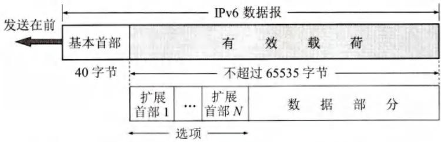
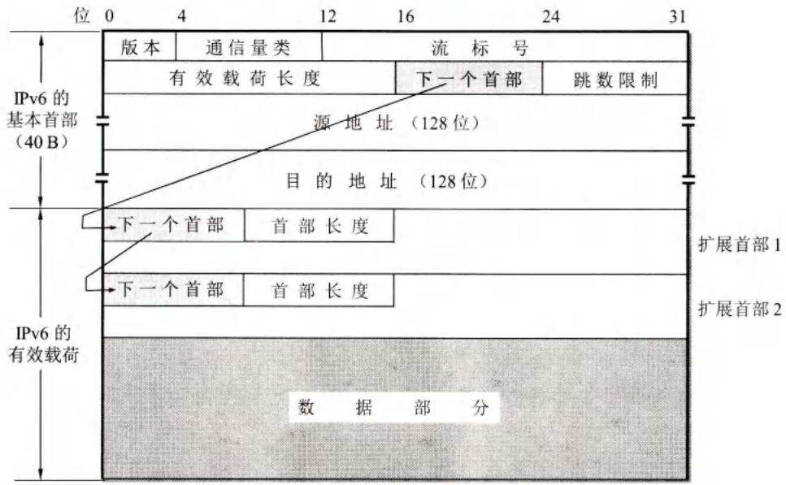
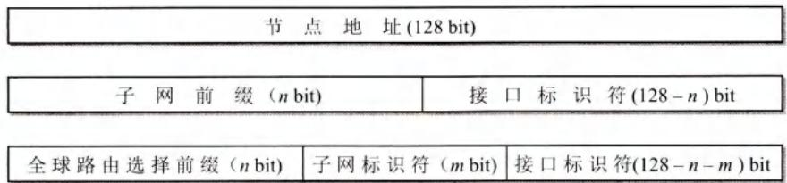
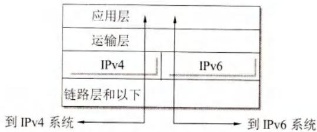
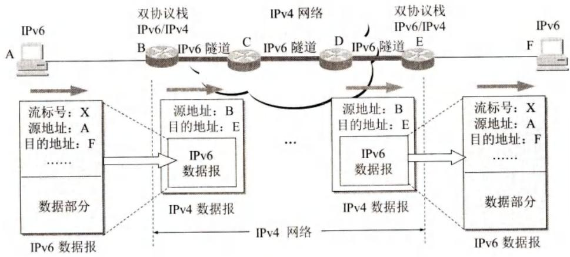

# 第4章-4.5-IPv6

## 基本信息

- **课程**：计算机网络
- **章节**：第4章 4.5节 IPv6
- **日期**：2026-04-26
- **标签**：#IPv6 #128位地址 #冒号十六进制 #双协议栈 #隧道技术

***

## 重点内容

### ⭐⭐⭐ 核心概念

1. **IPv6的引入原因**：IPv4地址耗尽（2011年IANA停止分配）
2. **IPv6主要变化**：128位地址、固定首部40字节、扩展首部、即插即用
3. **IPv6地址表示**：冒号十六进制记法、零压缩
4. **IPv6地址类型**：单播、多播、任播（新增）
5. **过渡策略**：双协议栈、隧道技术

### ⭐⭐ 关键问题

- IPv6相比IPv4有哪些重大改进？
- 为什么要取消首部检验和？
- IPv4向IPv6过渡为什么不能一次性完成？

***

## 详细笔记

### 一、IPv6概述

#### 1. IPv4地址耗尽

**历史节点**：

- **2011年2月3日**：IANA停止向RIR分配IPv4地址
- **2014-2015年**：我国逐步停止向新用户分配IPv4地址
- **解决方案**：全面商用部署IPv6

**IPv4地址数量**：约43亿（2³²）
**IPv6地址数量**：约3.4×10³⁸（2¹²⁸）

**地址空间对比**：

```
IPv4: 2³² ≈ 4.3×10⁹（43亿）
IPv6: 2¹²⁸ ≈ 3.4×10³⁸

IPv6地址空间是IPv4的 2⁹⁶ 倍
```

#### 2. IPv6主要变化

| 特性        | IPv4        | IPv6         |
| --------- | ----------- | ------------ |
| **地址长度**  | 32位         | 128位（增大4倍）   |
| **地址空间**  | 2³²         | 2¹²⁸（增大2⁹⁶倍） |
| **首部长度**  | 可变（20-60字节） | 固定（40字节）     |
| **首部检验和** | 有           | 无（加快处理速度）    |
| **选项**    | 首部可变部分      | 扩展首部         |
| **即插即用**  | 需要DHCP      | 支持自动配置       |
| **QoS支持** | 有限          | 流标号支持资源预分配   |
| **对齐方式**  | 4字节对齐       | 8字节对齐        |

**IPv6的8个主要变化**：

1. **更大的地址空间**：128位，地址空间增大2⁹⁶倍
2. **扩展的地址层次结构**：可划分更多层次
3. **灵活的首部格式**：扩展首部，路由器不处理（除逐跳选项）
4. **改进的选项**：选项放在有效载荷中
5. **允许协议继续扩充**
6. **支持即插即用（自动配置）**：不需要DHCP
7. **支持资源的预分配**：实时视频等应用
8. **首部改为8字节对齐**

***

### 二、IPv6的基本首部

#### 1. IPv6数据报结构

```
┌─────────────────────────────────────────────────────────┐
│                      IPv6数据报                          │
├─────────────────────────────────────────────────────────┤
│  基本首部（固定40字节）                                   │
├─────────────────────────────────────────────────────────┤
│  扩展首部（0个或多个，可选）                               │
├─────────────────────────────────────────────────────────┤
│  数据部分                                                │
└─────────────────────────────────────────────────────────┘
```

#### 📷 图4-32 具有多个可选扩展首部的IPv6数据报的一般形式



> 📚 **课本出处**：图4-32 IPv6数据报 = 基本首部 + 扩展首部（可选）+ 数据

#### 2. IPv6取消的IPv4字段

| IPv4字段    | IPv6处理       |
| --------- | ------------ |
| 首部长度      | 取消（首部固定40字节） |
| 服务类型      | 取消（通信量类字段替代） |
| 总长度       | 取消（改用有效载荷长度） |
| 标识、标志、片偏移 | 取消（放在分片扩展首部） |
| TTL       | 改称跳数限制       |
| 协议        | 改用下一个首部      |
| 首部检验和     | 取消（加快路由器处理）  |
| 选项        | 改用扩展首部       |

#### 3. IPv6基本首部格式

#### 📷 图4-33 IPv6基本首部和有效载荷



> 📚 **课本出处**：图4-33 IPv6基本首部固定40字节，只有8个字段

**IPv6基本首部字段**（8个字段，40字节）：

| 字段         | 长度   | 说明                      |
| ---------- | ---- | ----------------------- |
| **版本**     | 4位   | =6，表示IPv6               |
| **通信量类**   | 8位   | 区分数据报类别或优先级（类似IPv4区分服务） |
| **流标号**    | 20位  | 标识同一流的数据报，支持资源预分配       |
| **有效载荷长度** | 16位  | 基本首部以外的字节数（最大64KB）      |
| **下一个首部**  | 8位   | 相当于IPv4的协议字段            |
| **跳数限制**   | 8位   | 相当于IPv4的TTL             |
| **源地址**    | 128位 | 发送端IP地址                 |
| **目的地址**   | 128位 | 接收端IP地址                 |

**关键字段说明**：

**(1) 流标号（Flow Label）**

- **新概念**：IPv6引入
- **作用**：标识从特定源到特定终点的一系列数据报
- **用途**：实时音频/视频传输，保证服务质量
- **传统数据**：置为0

**(2) 下一个首部（Next Header）**

- **无扩展首部**：指出上层协议（TCP=6, UDP=17）
- **有扩展首部**：标识第一个扩展首部的类型

**(3) 跳数限制（Hop Limit）**

- 作用同IPv4的TTL
- 名称更准确（实际是跳数限制，不是时间）

#### 4. IPv6扩展首部

**六种扩展首部**（按顺序出现）：

| 序号 | 扩展首部     | 说明        |
| -- | -------- | --------- |
| 1  | 逐跳选项     | 每个路由器都需处理 |
| 2  | 路由选择     | 源路由选择     |
| 3  | 分片       | 分片信息      |
| 4  | 鉴别       | 数据完整性鉴别   |
| 5  | 封装安全有效载荷 | 加密        |
| 6  | 目的站选项    | 目的站处理     |

**扩展首部特点**：

- 所有扩展首部第一个字段都是"下一个首部"
- 路由器对扩展首部不处理（除 逐跳选项）
- 提高路由器处理效率

***

### 三、IPv6的地址

#### 1. IPv6地址类型

| 类型                | 说明              |
| ----------------- | --------------- |
| **单播（Unicast）**   | 点对点通信           |
| **多播（Multicast）** | 一点对多点通信         |
| **任播（Anycast）**   | IPv6新增，交付给最近的一个 |

**注意**：IPv6没有广播，广播看作多播的特例

#### 2. IPv6地址表示法

**冒号十六进制记法（Colon Hexadecimal）**：

- 每个16位值用十六进制表示
- 各值之间用冒号分隔

**示例**：

```
点分十进制（128位）→ 冒号十六进制

68E6:8C64:FFFF:FFFF:0:1180:960A:FFFF
```

**零压缩（Zero Compression）**：

- 一连串连续的0可用一对冒号取代
- **限制**：一个地址中只能使用一次

**零压缩示例**：

```
FF05:0:0:0:0:0:B3  →  FF05::B3

0:0:0:0:0:0:0:1    →  ::1（环回地址）

0:0:0:0:0:0:0:0    →  ::（未指明地址）

1080:0:0:0:8:800:200C:417A  →  1080::8:800:200C:417A
```

**结合点分十进制**：

```
0:0:0:0:0:0:128.10.2.1  →  ::128.10.2.1
```

#### 3. IPv6地址分类

#### 📊 表4-7 IPv6的常用地址分类

| 地址类型     | 地址块前缀        | CIDR记法    |
| -------- | ------------ | --------- |
| 未指明地址    | 00...0（128位） | ::/128    |
| 环回地址     | 00...1（128位） | ::1/128   |
| 多播地址     | 11111111     | FF00::/8  |
| 本地站点单播地址 | 1111111011   | FEC0::/10 |
| 本地链路单播地址 | 1111111010   | FE80::/10 |
| 全球单播地址   | -            | 见图4-34    |

**地址类型说明**：

| 类型                     | 用途                   |
| ---------------------- | -------------------- |
| **未指明地址 (::/128)**     | 主机未配置IP地址时作为源地址      |
| **环回地址 (::1/128)**     | 本地测试，同IPv4的127.0.0.1 |
| **多播地址 (FF00::/8)**    | 一点对多点通信              |
| **本地站点地址 (FEC0::/10)** | 内部网络，不连互联网           |
| **本地链路地址 (FE80::/10)** | 单一链路使用，自动配置          |
| **全球单播地址**             | 互联网全局可路由             |

#### 📷 图4-34 IPv6的单播地址的几种划分方法



> 📚 **课本出处**：图4-34 IPv6单播地址可灵活划分：全球路由前缀+子网前缀+接口标识符

***

### 四、从IPv4向IPv6过渡

#### 1. 过渡原则

**为什么不能一次性过渡？**

- 互联网规模太大
- 无法规定一个日期全部改用IPv6

**过渡要求**：

- 逐步演进
- 向后兼容：IPv6系统能接收和转发IPv4分组

#### 2. 过渡策略

#### 策略一：双协议栈（Dual Stack）

**原理**：

- 主机/路由器同时装有IPv4和IPv6两套协议栈
- 既能和IPv6系统通信，也能和IPv4系统通信

**地址选择**：

- 使用DNS查询
- DNS返回IPv4地址 → 使用IPv4
- DNS返回IPv6地址 → 使用IPv6

#### 📷 图4-35 使用双协议栈进行从IPv4到IPv6的过渡



> 📚 **课本出处**：图4-35 双协议栈主机同时具有IPv4和IPv6地址

**缺点**：

- 需要安装两套协议
- 代价较大

#### 策略二：隧道技术（Tunneling）

**原理**：

- IPv6数据报进入IPv4网络时，封装成IPv4数据报
- IPv6数据报作为IPv4数据报的数据部分
- 在IPv4网络中传输，像通过"隧道"
- 离开IPv4网络时，解封装恢复IPv6数据报

#### 📷 图4-36 使用隧道技术进行从IPv4到IPv6的过渡



> 📚 **课本出处**：图4-36 IPv6数据报在IPv4网络中通过隧道传输

**隧道工作过程**：

```
IPv6网络A          IPv4网络（隧道）          IPv6网络B
   |                       |                       |
   |  IPv6数据报           |                       |
   |  源：A  目的：B       |                       |
   ↓                       |                       |
[封装]                    |                       |
   |  IPv4数据报           |                       |
   |  源：隧道入口         |                       |
   |  目的：隧道出口       |                       |
   ↓                       ↓                       ↓
路由器A ──────────────→ 路由器B ──────────────→ 路由器C
   |    在IPv4网络中传输    |                       |
   |                       |                       ↓
   |                       |                    [解封装]
   |                       |                       |
   |                       |                    IPv6数据报
   |                       |                    源：A  目的：B
```

**隧道特点**：

- 对IPv6数据报透明
- IPv6数据报在隧道中不变化
- 隧道入口封装，隧道出口解封装

***

## 疑问与思考

### ❓ 待解决问题

1. IPv6的流标号在实际中应用广泛吗？
2. 为什么IPv6取消了广播？
3. 隧道技术的性能开销如何？

### 💡 个人理解

- IPv6不仅是地址空间的扩展，更是网络协议的全面升级
- 取消首部检验和是工程实践的智慧，依赖链路层和运输层的差错控制
- 双协议栈和隧道技术是过渡期的必要选择，最终目标是纯IPv6网络

***

## 核心考点总结

### ⭐⭐⭐ 必考内容

1. **IPv6相比IPv4的主要变化**

| 方面    | IPv4        | IPv6     |
| ----- | ----------- | -------- |
| 地址长度  | 32位         | 128位     |
| 首部长度  | 20-60字节（可变） | 40字节（固定） |
| 首部检验和 | 有           | 无        |
| 选项    | 首部可变部分      | 扩展首部     |
| 即插即用  | 需DHCP       | 自动配置     |
| QoS支持 | 有限          | 流标号      |

1. **IPv6地址表示法**

```
冒号十六进制：68E6:8C64:FFFF:FFFF:0:1180:960A:FFFF

零压缩：
- FF05:0:0:0:0:0:B3  →  FF05::B3
- 0:0:0:0:0:0:0:1    →  ::1（环回）
- 0:0:0:0:0:0:0:0    →  ::（未指明）

注意：一个地址只能使用一次零压缩
```

1. **IPv6地址类型**

| 类型   | CIDR      | 用途         |
| ---- | --------- | ---------- |
| 未指明  | ::/128    | 未配置IP时的源地址 |
| 环回   | ::1/128   | 本地测试       |
| 多播   | FF00::/8  | 一点对多点      |
| 本地链路 | FE80::/10 | 单一链路       |
| 全球单播 | -         | 互联网全局      |

1. **IPv4向IPv6过渡**

| 策略   | 原理             | 特点        |
| ---- | -------------- | --------- |
| 双协议栈 | 同时运行IPv4和IPv6  | 代价大，需两套协议 |
| 隧道技术 | IPv6封装在IPv4中传输 | 透明，性能好    |

### 📌 易混淆点辨析

| 概念           | 说明                         |
| ------------ | -------------------------- |
| **IPv6地址长度** | 128位，是IPv4的4倍（不是地址空间4倍）    |
| **零压缩**      | 只能用一次，避免歧义                 |
| **流标号**      | 用于实时应用，传统数据置0              |
| **下一个首部**    | 无扩展首部时指上层协议，有扩展首部时指第一个扩展首部 |
| **任播**       | IPv6新增，交付给最近的一个            |

### 📝 常见考题类型

1. **简答题**：
   - IPv6相比IPv4有哪些主要改进？
   - 为什么IPv6取消了首部检验和？
   - 说明IPv4向IPv6过渡的两种策略
2. **计算/转换题**：
   - IPv6地址的零压缩表示
   - IPv6地址空间计算
3. **分析题**：
   - 比较双协议栈和隧道技术的优缺点
   - 分析IPv6扩展首部的作用

***

## 相关链接

### 本节涉及图片

- [图4-32 IPv6数据报结构](../../../images/aac5cb5d51eb5fd0607c51c4f9c0edf77793ed68cb92cf8fbfebfa02f76e3d1c.jpg)
- [图4-33 IPv6首部](../../../images/db07316a159ed5ac3c35e13386cc3dc3de0e545b9d8b65d0ed814c16f0c991d6.jpg)
- [图4-34 IPv6单播地址划分](../../../images/c03d20498c67f2493d4b3965e64105a9915175bafe83809dc66de0f9710e1d2a.jpg)
- [图4-35 双协议栈](../../../images/a74d812338c13dc5fdbc95b1eaac1fee7167dac22e3e97acfaa050be92df7ee5.jpg)
- [图4-36 隧道技术](../../../images/98b6cc0b3a275a3f30453016e15ba3c8fe7dca92e41f16cf54c424338999a24c.jpg)

### 关联章节

- [第4章-4.2.5-IP数据报的格式](./第4章-4.2.5-IP数据报的格式.md) - IPv4首部格式对比
- [第4章-4.4-网际控制报文协议ICMP](./第4章-4.4-网际控制报文协议ICMP.md) - ICMPv6

***

*笔记创建时间：2026-04-26*
