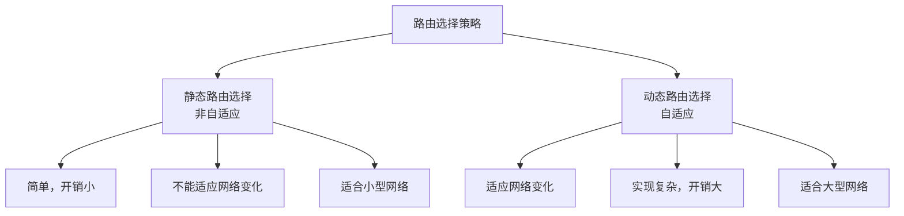
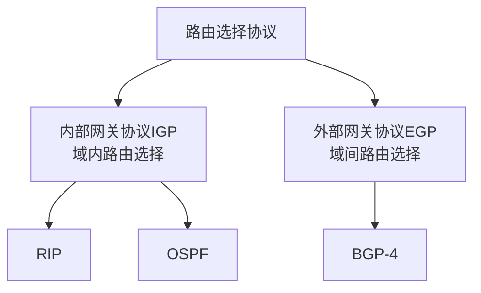
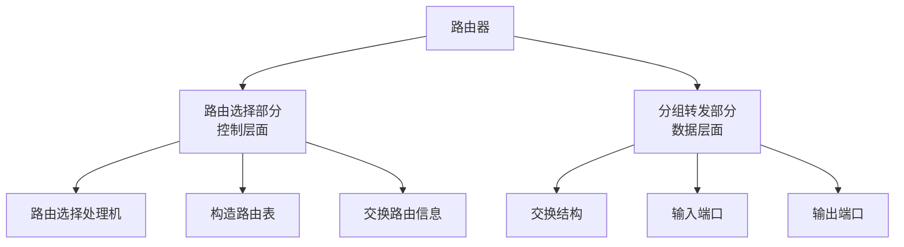

# 第4章-4.6-互联网的路由选择协议

## 基本信息
- **课程**：计算机网络
- **章节**：第4章 4.6节 互联网的路由选择协议
- **日期**：2026-04-26
- **标签**：#路由选择 #RIP #OSPF #BGP #自治系统 #距离向量 #链路状态

---

## 重点内容

### ⭐⭐⭐ 核心概念
1. **路由选择协议分类**：
   - 内部网关协议IGP：RIP、OSPF
   - 外部网关协议EGP：BGP-4
2. **自治系统AS**：单一技术管理下的一组网络和路由器
3. **RIP**：距离向量协议，最大跳数15，使用UDP端口520
4. **OSPF**：链路状态协议，使用Dijkstra算法，使用IP协议89
5. **BGP**：路径向量协议，使用TCP端口179

### ⭐⭐⭐ 关键对比

| 特性 | RIP | OSPF | BGP |
|-----|-----|------|-----|
| **类型** | 距离向量 | 链路状态 | 路径向量 |
| **范围** | AS内部 | AS内部 | AS之间 |
| **算法** | Bellman-Ford | Dijkstra (SPF) | 路径向量 |
| **度量** | 跳数 | 代价（带宽） | 策略/路径 |
| **交换对象** | 相邻路由器 | 所有路由器（洪泛） | 边界路由器 |
| **传输协议** | UDP 520 | IP 89 | TCP 179 |
| **收敛速度** | 慢（坏消息传播慢） | 快 | 较快 |
| **网络规模** | 小型网络 | 大型网络 | 互联网级别 |

---

## 详细笔记

### 一、路由选择协议的基本概念

#### 1. 理想的路由算法特点

| 特点 | 说明 |
|-----|------|
| **正确完整** | 分组一定能到达目的网络 |
| **计算简单** | 不增加太多额外开销 |
| **自适应性** | 适应通信量和拓扑变化 |
| **稳定性** | 收敛于可接受的解 |
| **公平性** | 对所有用户平等 |
| **最佳性** | 平均时延最小，吞吐量最大 |

#### 2. 路由选择策略分类



#### 3. 分层次的路由选择协议

**为什么要分层次？**
1. 互联网规模太大，路由表会非常大
2. 许多单位不愿意暴露内部网络细节

**自治系统（AS, Autonomous System）**：
- 单一技术管理下的许多网络、IP地址以及路由器
- 使用一种内部路由选择协议和共同的度量
- 对其他AS表现出单一的路由选择策略

#### 📷 图4-39 自治系统和内部网关协议、外部网关协议


> 📚 **课本出处**：图4-39 自治系统内部使用IGP，自治系统之间使用EGP

**协议分类**：



---

### 二、内部网关协议RIP

#### 1. RIP概述

**全称**：Routing Information Protocol（路由信息协议）

**特点**：
- 分布式基于**距离向量**的路由选择协议
- 互联网标准协议
- 最大优点：**简单**

**"距离"定义**：
- 到直接连接的网络：距离 = 1
- 到非直接连接的网络：距离 = 经过的路由器数 + 1
- 最大距离：**15**（16表示不可达）
- 只适用于**小型互联网**

#### 2. RIP的三个要点

| 要点 | 内容 |
|-----|------|
| **和谁交换** | 仅和**相邻路由器**交换 |
| **交换什么** | 当前本路由器知道的**全部信息**（整个路由表） |
| **何时交换** | 按固定时间间隔（**30秒**），拓扑变化时也通告 |

#### 3. 距离向量算法

**对相邻路由器X发来的RIP报文，执行**：

```
步骤1：修改RIP报文
    - 下一跳都改为X
    - 所有距离加1

步骤2：对修改后的每个项目
    IF 目的网络不在路由表中:
        添加到路由表
    ELSE IF 下一跳是X:
        替换原项目（最新信息）
    ELSE IF 收到的距离 < 原距离:
        更新项目
    ELSE:
        不处理

步骤3：3分钟未收到更新
    将相邻路由器标记为不可达（距离=16）
```

**【例4-4】路由表更新示例**

路由器R₆的原路由表：

| 目的网络 | 距离 | 下一跳 |
|---------|------|--------|
| Net2 | 3 | R₄ |
| Net3 | 4 | R₅ |

收到R₄发来的更新信息：

| 目的网络 | 距离 | 下一跳 |
|---------|------|--------|
| Net1 | 3 | R₁ |
| Net2 | 4 | R₂ |
| Net3 | 1 | 直接 |

**修改后**（距离+1，下一跳改为R₄）：

| 目的网络 | 距离 | 下一跳 |
|---------|------|--------|
| Net1 | 4 | R₄ |
| Net2 | 5 | R₄ |
| Net3 | 2 | R₄ |

**更新后R₆的路由表**：

| 目的网络 | 距离 | 下一跳 | 说明 |
|---------|------|--------|------|
| Net1 | 4 | R₄ | 新增 |
| Net2 | 5 | R₄ | 替换（下一跳相同） |
| Net3 | 2 | R₄ | 更新（距离更短） |

#### 📷 图4-40 RIP2的报文用UDP用户数据报传送


> 📚 **课本出处**：图4-40 RIP报文使用UDP端口520传送

**RIP报文特点**：
- 使用**UDP**传送，端口**520**
- 最多包含**25个路由**
- RIP2支持CIDR和简单鉴别

#### 4. RIP的缺点：坏消息传播得慢

#### 📷 图4-41 协议RIP的缺点：坏消息传播得慢


> 📚 **课本出处**：图4-41 当网络故障时，RIP需要较长时间才能传播到所有路由器

**问题描述**：
1. R₁到Net1的链路故障，R₁将距离改为16
2. 但R₂可能在R₁发送更新前，先发送自己的路由表给R₁
3. R₂的路由表："Net1, 2, R₁"
4. R₁收到后更新为："Net1, 3, R₂"
5. 这样循环，直到距离都变为16

**解决**：
- 设置最大距离16为不可达
- 水平分割（Split Horizon）
- 毒性逆转（Poison Reverse）

---

### 三、内部网关协议OSPF

#### 1. OSPF概述

**全称**：Open Shortest Path First（开放最短路径优先）

**特点**：
- **开放**：公开发表，不受厂商控制
- **最短路径优先**：使用Dijkstra SPF算法
- 克服RIP的缺点，1989年开发

**与RIP的本质区别**：使用**链路状态协议**（而非距离向量）

#### 2. OSPF的三个要点

| 要点 | RIP | OSPF |
|-----|-----|------|
| **和谁交换** | 相邻路由器 | **所有路由器**（洪泛法） |
| **交换什么** | 到所有网络的距离和下一跳 | **链路状态**（相邻路由器和度量） |
| **何时交换** | 固定间隔（30秒） | 链路状态变化或定期（30分钟） |

#### 3. 链路状态协议特点

**链路状态数据库**：
- 所有路由器最终建立**一致的**全网拓扑结构图
- 每个路由器知道全网有多少路由器、如何连接、代价多少
- 使用Dijkstra算法计算最短路径

**优点**：
- 数据库能较快更新
- **收敛快**（< 100ms）
- 没有"坏消息传播得慢"的问题

#### 4. 区域划分

#### 📷 图4-42 OSPF划分为两种不同的区域


> 📚 **课本出处**：图4-42 OSPF将自治系统划分为区域，减少通信量

**区域类型**：

| 类型 | 说明 | 标识符 |
|-----|------|--------|
| **主干区域** | 连通其他区域 | 0.0.0.0 |
| **区域边界路由器** | 连接主干区域和其他区域 | - |
| **主干路由器** | 在主干区域内的路由器 | - |
| **自治系统边界路由器** | 连接其他自治系统 | - |

**划分区域的好处**：
- 洪泛法交换信息局限在区域内
- 减少全网通信量
- 适用于大规模自治系统

#### 5. OSPF的其他特点

| 特点 | 说明 |
|-----|------|
| **灵活度量** | 代价可以是费用、距离、时延、带宽等（1-65535） |
| **负载均衡** | 多条相同代价路径可分配通信量 |
| **鉴别功能** | 保证仅在可信赖路由器间交换信息 |
| **支持CIDR** | 支持可变长子网划分和无分类编址 |
| **序号机制** | 32位序号，5秒增1，600年不重复 |

#### 6. OSPF的五种分组类型

| 类型 | 名称 | 作用 |
|-----|------|------|
| 类型1 | **问候(Hello)** | 发现和维持邻站可达性 |
| 类型2 | **数据库描述** | 给出链路状态数据库摘要 |
| 类型3 | **链路状态请求** | 请求特定链路状态详细信息 |
| 类型4 | **链路状态更新** | 洪泛法更新链路状态（核心） |
| 类型5 | **链路状态确认** | 对更新的确认 |

#### 📷 图4-43 OSPF分组用IP数据报传送


> 📚 **课本出处**：图4-43 OSPF直接用IP数据报传送（协议字段=89）

**OSPF传输特点**：
- 直接使用**IP数据报**传送（协议字段=**89**）
- 不用UDP，数据报很短
- 不必分片，减少重传

**Hello分组**：
- 每**10秒**交换一次
- **40秒**未收到则认为不可达

#### 📷 图4-44 用可靠的洪泛法发送更新分组


> 📚 **课本出处**：图4-44 收到更新分组后要发送确认，避免重复转发

**可靠洪泛法**：
- 收到更新分组后发送确认
- 重复更新只需发送一次确认
- 转发时排除上游路由器

---

### 四、外部网关协议BGP

#### 1. BGP的主要特点

**全称**：Border Gateway Protocol（边界网关协议）

**版本**：BGP-4（目前使用最多）

**为什么AS之间不能用RIP/OSPF？**

1. **规模太大**：主干网路由器转发表可达50万个网络前缀
2. **策略考虑**：需要政治、安全、经济方面的策略

**BGP的特点**：
- 力求选择**较好**的路由（非最佳）
- 采用**路径向量**路由选择协议
- 交换**可达性**信息（可到达/不可到达）

#### 2. BGP路由

**路由器类型**：
- **边界路由器**：连接其他AS
- **内部路由器**：AS内部

#### 📷 图4-45 AS之间的eBGP连接和AS内部的iBGP连接


> 📚 **课本出处**：图4-45 eBGP连接不同AS，iBGP连接AS内部

**两种BGP连接**：

| 连接类型 | 说明 | 范围 |
|---------|------|------|
| **eBGP** | 外部BGP连接 | 不同AS的边界路由器之间 |
| **iBGP** | 内部BGP连接 | 同一AS内部的路由器之间 |

**BGP连接特点**：
- 使用**TCP**连接（端口**179**）
- 半永久性连接
- iBGP必须是**全连通**的

#### 📷 图4-47 BGP在iBGP和eBGP上运行


> 📚 **课本出处**：图4-47 每个AS运行IGP，iBGP和eBGP上运行BGP

#### 3. BGP路由选择

**选择顺序**：

1. **本地偏好(LOCAL-PREF)**：选择偏好值最高的
2. **AS跳数最少**：选择经过AS数量少的路由
3. **热土豆算法**：尽快离开本AS
4. **BGP标识符最小**：选择BGP ID数值最小的

#### 📷 图4-50 LOCAL-PREF值较高的路由优先


> 📚 **课本出处**：图4-50 通过设置LOCAL-PREF值控制路由偏好

#### 📷 图4-51 根据经过AS跳数的多少选择BGP路由


> 📚 **课本出处**：图4-51 选择经过AS数量少的路由

#### 📷 图4-52 热土豆路由选择算法的应用举例


> 📚 **课本出处**：图4-52 热土豆算法：尽快离开本AS

#### 4. BGP的四种报文

| 报文类型 | 作用 |
|---------|------|
| **OPEN** | 建立BGP连接，协商参数 |
| **UPDATE** | 通告路由信息，撤销路由 |
| **KEEPALIVE** | 周期性证实连通性 |
| **NOTIFICATION** | 发送检测到的差错 |

#### 📷 图4-53 BGP报文用TCP报文传送


> 📚 **课本出处**：图4-53 BGP报文作为TCP数据部分传送

**KEEPALIVE机制**：
- 保持时间计时器（Hold Timer）
- 保持时间通常180秒
- KEEPALIVE间隔 = 保持时间/3 = 60秒
- 保持时间为0则不发送KEEPALIVE

---

### 五、路由器的构成

#### 1. 路由器的结构

#### 📷 图4-54 典型的路由器的结构


> 📚 **课本出处**：图4-54 路由器分为路由选择部分和分组转发部分

**两大部分**：



**交换结构**：
- 根据**转发表**处理分组
- 将输入端口的分组转发到合适的输出端口
- 是"在路由器中的网络"

---

## 核心考点总结

### ⭐⭐⭐ 必考对比表

| 对比项 | RIP | OSPF | BGP |
|-------|-----|------|-----|
| **协议类型** | 距离向量 | 链路状态 | 路径向量 |
| **适用范围** | AS内部 | AS内部 | AS之间 |
| **核心算法** | Bellman-Ford | Dijkstra SPF | 路径向量 |
| **度量标准** | 跳数（最大15） | 代价（带宽） | 策略/路径 |
| **交换方式** | 仅相邻路由器 | 洪泛法（所有路由器） | 边界路由器 |
| **传输协议** | UDP 520 | IP 89 | TCP 179 |
| **收敛速度** | 慢（坏消息传播慢） | 快（<100ms） | 较快 |
| **适用规模** | 小型网络 | 大型网络 | 互联网级别 |
| **主要缺点** | 跳数限制、收敛慢 | 复杂、开销大 | 策略复杂 |

### ⭐⭐⭐ 关键概念

1. **自治系统AS**
   - 单一技术管理下的网络和路由器集合
   - 使用统一的内部路由协议
   - 对外表现为一致的路由策略

2. **距离向量 vs 链路状态**

| 距离向量（RIP） | 链路状态（OSPF） |
|---------------|----------------|
| 只知道到目的地的距离和下一跳 | 知道全网拓扑结构 |
| 定期交换整个路由表 | 触发更新+定期更新 |
| 收敛慢 | 收敛快 |
| 好消息传得快，坏消息传得慢 | 没有此问题 |

3. **BGP路径选择顺序**
   ```
   1. LOCAL-PREF（本地偏好）最高
   2. AS跳数最少
   3. 热土豆算法（尽快离开本AS）
   4. BGP标识符最小
   ```

### 📝 常见考题类型

1. **简答题**：
   - 比较RIP和OSPF的主要区别
   - 说明为什么AS之间使用BGP而不是OSPF
   - 解释RIP"坏消息传播得慢"的原因

2. **计算题**：
   - 距离向量算法的路由表更新
   - OSPF区域划分后的路由计算

3. **分析题**：
   - 分析三种路由协议的适用场景
   - 解释BGP路由选择过程

---

## 相关链接

### 本节涉及图片
- [图4-39 自治系统](../../images/0df96bc9ce4b4cfd18b01fd9791c65d7b4e99fd6c9a1907aeb4d1976b1521c82.jpg)
- [图4-40 RIP报文](../../images/c5f7ad9e294a6f37468b60d9b616430424e5056a83331fe44c86e7252b74c6e4.jpg)
- [图4-41 RIP坏消息传播慢](../../images/79b5d5307022671af01db3f8209a0521473cff57f4219f8e0b23a39dbd4cbef1.jpg)
- [图4-42 OSPF区域划分](../../images/643085c380e3b9661cf1bc83c97b52e6e4d4d1f8eeaf17243a3a6aa2d2238d69.jpg)
- [图4-43 OSPF分组](../../images/e35485281cab68b4d52ac5f5fbb03cac12cca17e9a36855ba6d1d743abf6ea4e.jpg)
- [图4-44 可靠洪泛法](../../images/a14e0d15c5d002d8ec7653911bbf9e17b9d9a344b9f4f55c9dcb669280948dfa.jpg)
- [图4-45 BGP连接](../../images/75891ee60cba801da1ad969f0fccba7c524d8e243ff1f78ef6196f7aea0ae199.jpg)
- [图4-47 BGP运行](../../images/5727f6bfd320591ec5b5767c21b210ffec6faea78f98abfff1f189f71c16f43.jpg)
- [图4-50 LOCAL-PREF](../../images/c87bfc6423add311599b5767c21b210ffec6faea78f98abfff1f189f71c16f43.jpg)
- [图4-51 AS跳数](../../images/6fcef2c33e26e2201e8e746d67ca48abecd3b72e455df581d1370205d1abd875.jpg)
- [图4-52 热土豆算法](../../images/c7591d83822f363189f386a9d0adf0d7dba91aa416aa004f9cbeffb65fa03c1b.jpg)
- [图4-53 BGP报文](../../images/49b030ccc3bc7e143f9392527f404cd99d96df13a43cbcb085302937b706fdbf.jpg)
- [图4-54 路由器结构](../../images/1fbf9ff8c16dcc88d06674a8108ce1cfdd63a1ce10941c1e4759d766bfc0d8e2.jpg)

### 关联章节
- [第4章-4.3-IP层转发分组的过程](./第4章-4.3-IP层转发分组的过程.md) - 转发表和路由表

---

*笔记创建时间：2026-04-26*
