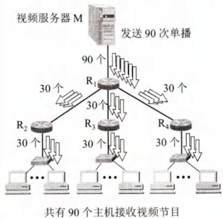
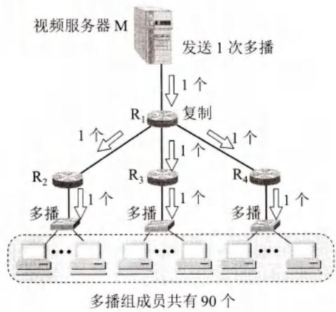
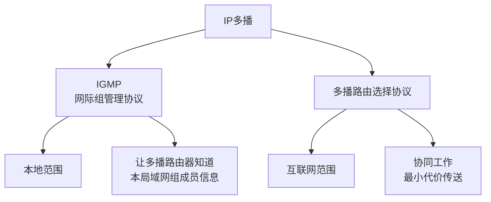
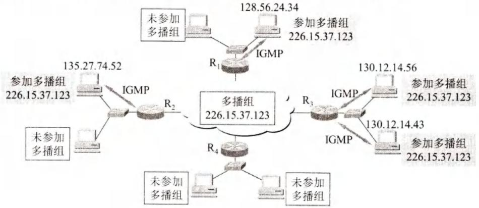
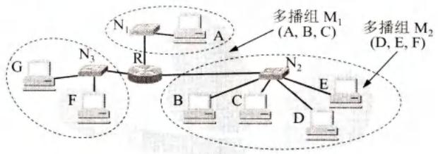

# 第4章-4.7-IP多播

## 基本信息
- **课程**：计算机网络
- **章节**：第4章 4.7节 IP多播
- **日期**：2026-04-26
- **标签**：#IP多播 #D类地址 #IGMP #多播路由

---

## 重点内容

### ⭐⭐ 核心概念
1. **IP多播**：一对多通信，节约网络资源
2. **多播地址**：D类地址（224.0.0.0 ~ 239.255.255.255）
3. **两种协议**：
   - IGMP：网际组管理协议（本地范围）
   - 多播路由选择协议：互联网范围
4. **硬件多播**：D类IP地址映射到以太网多播地址

### ⭐⭐ 关键问题
- 多播相比单播的优势？
- IGMP的作用范围？
- 多播路由选择为什么比单播复杂？

---

## 详细笔记

### 一、IP多播的基本概念

#### 1. 为什么需要多播？

**应用场景**：
- 实时信息交付（新闻、股市行情）
- 软件更新
- 交互式会议
- 视频直播

**多播 vs 单播**：

#### 📷 图4-58 单播与多播的比较





> 📚 **课本出处**：图4-58 向90台主机传送视频，单播需发送90个副本，多播只需发送1次

**单播方式**：
- 视频服务器向90台主机发送
- 需要发送90个单播
- 同一个视频分组发送90个副本

**多播方式**：
- 视频服务器只需发送1次
- 路由器R1复制成3个副本
- 分别向R2、R3、R4各转发1个
- 局域网利用硬件多播功能，无需复制

**优势**：当多播组成员成千上万时，可明显减轻网络资源消耗。

#### 2. 多播路由器

**定义**：能够运行多播协议的路由器

**功能**：
- 转发多播数据报
- 也可转发普通单播IP数据报

#### 3. 多播IP地址

**D类地址**：
- 前四位：**1110**
- 范围：**224.0.0.0 ~ 239.255.255.255**
- 可标志 **2²⁸** 个多播组（超过2.6亿）

**特点**：
- 只能用于**目的地址**，不能用于源地址
- 不产生**ICMP差错报文**
- PING多播地址永远不会收到响应

**协议字段值**：2（表示使用IGMP）

#### 4. IP多播分类

| 类型 | 说明 |
|-----|------|
| **本地硬件多播** | 只在本局域网上进行 |
| **互联网多播** | 在互联网范围进行 |

**注意**：互联网多播最后阶段仍需在局域网上用硬件多播交付。

---

### 二、在局域网上进行硬件多播

#### 1. 以太网多播地址

**IANA拥有的以太网地址块**：
- 高24位：**00-00-5E**
- 范围：00-00-5E-00-00-00 ~ 00-00-5E-FF-FF-FF

**多播地址标识**：
- MAC地址第1字节最低位为**1**即为多播地址

**TCP/IP使用的以太网多播地址**：
- 范围：**01-00-5E-00-00-00 ~ 01-00-5E-7F-FF-FF**
- 数量：**2²³** 个

#### 2. D类IP地址与以太网多播地址的映射

#### 📷 图4-59 D类IP地址与以太网多播地址的映射关系


> 📚 **课本出处**：图4-59 D类IP地址28位中只有后23位映射到以太网多播地址

**映射规则**：
- D类IP地址：前4位固定（1110），后28位可用
- 以太网多播地址：前25位固定（01-00-5E + 0），后23位可用
- **映射关系**：D类IP后23位 → 以太网多播地址后23位

**多对一映射**：
- 28位 → 23位，**5位丢失**
- 多个D类IP可能映射到同一个以太网多播地址

**示例**：
```
IP多播地址 224.128.64.32  →  01-00-5E-00-40-20
IP多播地址 224.0.64.32    →  01-00-5E-00-40-20
```

**IP层过滤**：
- 收到多播数据报的主机需在IP层过滤
- 丢弃不是本主机要接收的数据报

---

### 三、网际组管理协议IGMP和多播路由选择协议

#### 1. IP多播需要两种协议



#### 📷 图4-60 IGMP使多播路由器知道多播组成员信息



> 📚 **课本出处**：图4-60 IGMP仅在本地使用，不知道成员数和分布

**IGMP特点**：
- **本地使用范围**
- 不知道IP多播组包含的成员数
- 不知道成员分布在哪些网络
- 仅让本地多播路由器知道本局域网是否有主机参加/退出多播组

#### 📷 图4-61 用来说明多播路由选择的例子



> 📚 **课本出处**：图4-61 多播路由选择比单播复杂，需考虑组成员动态变化

**多播路由选择的复杂性**：

| 情况 | 说明 |
|-----|------|
| **组成员动态变化** | 主机可随时加入/离开，网络拓扑未变但路由需更新 |
| **源和目的不对称** | E向F发送与F向E发送可能经过不同路径 |
| **非成员可发送** | 未加入多播组的主机也可发送多播数据报 |
| **经过网络无成员** | 多播数据报可通过没有组成员的网络 |

**多播路由器转发依据**：
- 不能仅根据目的地址
- 还要考虑数据报从**哪里来**和到**哪里去**

#### 2. 网际组管理协议IGMP

**版本**：
- IGMPv1（1989年，RFC 1112，互联网标准STD5）
- IGMPv3（2002年，RFC 3376，最新）

**协议层次**：
- 使用IP数据报传递报文
- 向IP提供服务
- 属于网际协议IP的组成部分

**工作阶段**：

**第一阶段：加入多播组**
1. 主机向多播地址发送IGMP报文
2. 声明要成为该组成员
3. 本地多播路由器收到后，利用多播路由选择协议转发成员关系

**第二阶段：维持成员关系**
1. 多播路由器周期性探询本地主机
2. 只要有主机响应，就认为组活跃
3. 多次探询无响应，认为主机已离开

**IGMP优化措施**：
- 避免多播控制信息给网络增加大量开销
- 设计精细，开销小

---

## 核心考点总结

### ⭐⭐ 必考内容

1. **多播地址**

| 项目 | 内容 |
|-----|------|
| **地址类型** | D类地址 |
| **地址范围** | 224.0.0.0 ~ 239.255.255.255 |
| **前4位** | 1110 |
| **可标志组数** | 2²⁸（超过2.6亿） |
| **使用限制** | 只能用于目的地址 |
| **ICMP差错** | 不产生 |

2. **以太网多播地址映射**

```
D类IP地址：     1110 + 28位多播组ID
                 ↓
                 取后23位
                 ↓
以太网多播地址： 01-00-5E + 0 + 23位
```

**注意**：多对一映射，IP层需过滤

3. **两种协议对比**

| 协议 | 范围 | 作用 |
|-----|------|------|
| **IGMP** | 本地局域网 | 让多播路由器知道本局域网组成员信息 |
| **多播路由选择协议** | 互联网范围 | 协同工作，最小代价传送多播数据报 |

4. **多播路由选择复杂性**

- 组成员动态变化（与拓扑变化无关）
- 源和目的路径可能不对称
- 非成员可以发送多播数据报
- 数据报可通过无成员的网络

### 📌 易混淆点辨析

| 概念 | 说明 |
|-----|------|
| **多播 vs 广播** | 多播是点到多点，广播是点到所有 |
| **IGMP范围** | 仅本地使用，不是全局管理协议 |
| **多播地址映射** | 28位→23位，多对一，需IP层过滤 |
| **MBONE** | 虚拟多播主干网，用于试验 |

### 📝 常见考题类型

1. **简答题**：
   - 多播相比单播的优势
   - IGMP的作用和工作阶段
   - 多播路由选择为什么比单播复杂

2. **计算题**：
   - D类IP地址与以太网多播地址的映射

3. **分析题**：
   - 分析多播路由选择的复杂性来源

---

## 相关链接

### 本节涉及图片
- [图4-58 单播与多播](../../../images/4bba98eb85520a8a8aacf372cd7ce9dd11134b714741c046bf67799f24736383.jpg)
- [图4-59 地址映射](../../../images/20fab1b2490bcb0d70826b1a209519fc8681fc81bd227e97a9c4675eead0cd9.jpg)
- [图4-60 IGMP作用](../../../images/9153e8a399f862341851c621ac0586c1b0caab8edef520f80df00a77930f0cf3.jpg)
- [图4-61 多播路由选择](../../../images/c70acd73a5c6aa9fd37c12bff9e0631f7348a7c2820b737e9121c6e6a982b9ba.jpg)

### 关联章节
- [第4章-4.2-网际协议IP](./第4章-4.2-网际协议IP.md) - IP地址分类

---

*笔记创建时间：2026-04-26*
