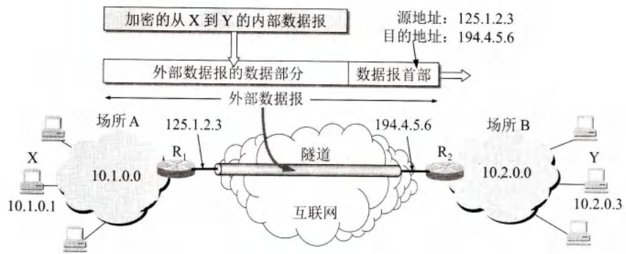
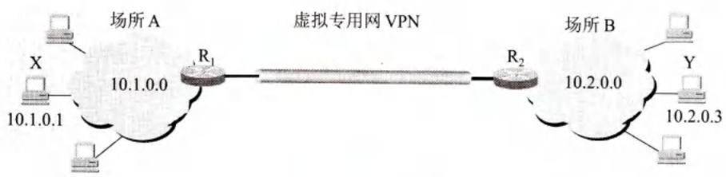
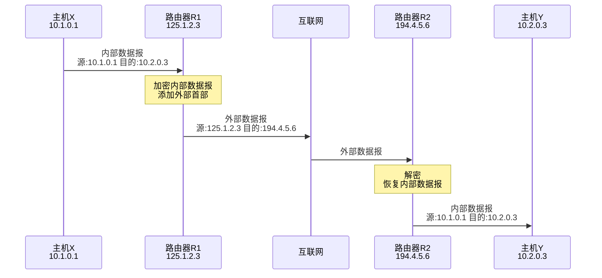
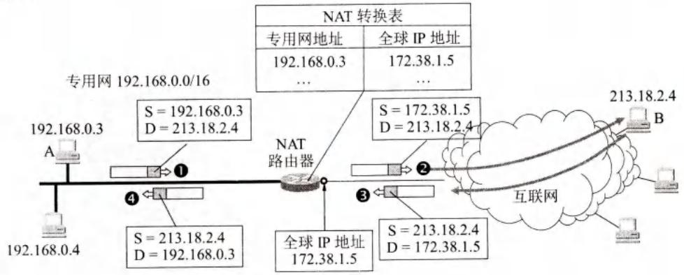

# 第4章-4.8-虚拟专用网VPN和网络地址转换NAT

## 基本信息

- **课程**：计算机网络
- **章节**：第4章 4.8节 虚拟专用网VPN和网络地址转换NAT
- **日期**：2026-04-26
- **标签**：#VPN #NAT #NAPT #专用地址 #隧道技术

***

## 重点内容

### ⭐⭐ 核心概念

1. **专用地址（私有地址）**：RFC1918规定的三段地址，仅用于内部通信
2. **VPN**：利用公用互联网作为通信载体，通过隧道技术实现专用网效果
3. **NAT**：网络地址转换，将本地地址转换为全球IP地址
4. **NAPT**：网络地址与端口号转换，多个主机共享一个全球IP地址

### ⭐⭐ 关键问题

- 专用地址的范围有哪些？
- VPN为什么称为"虚拟"？
- NAT和NAPT的区别？
- 为什么专用网内主机不能直接充当服务器？

***

## 详细笔记

### 一、虚拟专用网VPN

#### 1. 专用地址（Private Address）

**问题背景**：

- 机构内部使用本地地址
- 若与互联网IP地址重合，会出现**地址二义性**

**RFC1918规定的专用地址**：

| 地址块                | 范围                             | 相当于      |
| ------------------ | ------------------------------ | -------- |
| **10.0.0.0/8**     | 10.0.0.0 \~ 10.255.255.255     | 1个A类网络   |
| **172.16.0.0/12**  | 172.16.0.0 \~ 172.31.255.255   | 16个B类网络  |
| **192.168.0.0/16** | 192.168.0.0 \~ 192.168.255.255 | 256个C类网络 |

**专用地址特点**：

- 只能用于**机构内部通信**
- **不能**用于和互联网主机通信
- 互联网路由器对目的地址是专用地址的数据报**一律不转发**
- 也叫**可重用地址**（reusable address）

**专用网**：采用专用IP地址的互连网络

- 全世界可能有多个专用网使用相同IP地址
- 不会引起麻烦，因为仅在机构内部使用

#### 2. VPN的概念

**应用场景**：

- 大型机构的部门分布在世界各地
- 需要经常交换信息

**两种实现方法**：

| 方法       | 说明            | 缺点   |
| -------- | ------------- | ---- |
| **租用专线** | 租用电信公司通信线路    | 租金太高 |
| **VPN**  | 利用公用互联网作为通信载体 | 成本低  |

**VPN（Virtual Private Network）**：

- **虚拟**：没有真正使用通信专线，效果上和真正的专用网一样
- **专用网**：为本机构主机用于机构内部通信

**VPN特点**：

- 通信必须经过公用的互联网
- 需要**加密**保证数据安全
- 需要专门硬件和软件配置

#### 3. VPN的类型

| 类型                    | 说明            |
| --------------------- | ------------- |
| **内联网（Intranet VPN）** | 场所A和B都属于同一个机构 |
| **外联网（Extranet VPN）** | 有外部机构（合作伙伴）参加 |
| **远程接入VPN**           | 流动员工通过拨号接入    |

**注意**：内联网和外联网都基于TCP/IP协议。

#### 4. VPN的工作原理（隧道技术）

#### 📷 图4-64 用隧道技术实现虚拟专用网





> 📚 **课本出处**：图4-64 使用IP隧道技术实现VPN，内部数据报加密后封装在外部数据报中

**示例场景**：

- 场所A网络地址：10.1.0.0
- 场所B网络地址：10.2.0.0
- 路由器R1全球地址：125.1.2.3 
- 路由器R2全球地址：194.4.5.6

**通信过程**：



**隧道概念**：

- 数据报从R1到R2可能经过很多网络和路由器
- 逻辑上看，R1到R2好像是一条直通的点对点链路
- 这条逻辑链路就是"**隧道**"

***

### 二、网络地址转换NAT

#### 1. NAT概述

**应用场景**：

- 专用网内部主机已分配本地IP地址
- 想与互联网上的主机通信
- 不需要加密

**NAT（Network Address Translation）**：

- 1994年提出
- 在专用网连接互联网的路由器上安装NAT软件
- 装有NAT软件的路由器称为**NAT路由器**

**NAT路由器要求**：

- 至少有一个有效的**外部全球IP地址**

#### 2. NAT工作原理

#### 📷 图4-65 NAT路由器的工作原理



> 📚 **课本出处**：图4-65 NAT通过转换表将本地地址转换为全球IP地址

**示例**：

- 专用网：192.168.0.0
- 主机A本地地址：192.168.0.3
- NAT路由器全球地址：172.38.1.5
- 互联网主机B地址：213.18.2.4

**通信过程**：

| 步骤 | 方向    | 数据报 | 源地址         | 目的地址        |
| -- | ----- | --- | ----------- | ----------- |
| ①  | A→B   | 内部  | 192.168.0.3 | 213.18.2.4  |
| ②  | NAT转发 | 外部  | 172.38.1.5  | 213.18.2.4  |
| ③  | B→A   | 应答  | 213.18.2.4  | 172.38.1.5  |
| ④  | NAT转发 | 内部  | 213.18.2.4  | 192.168.0.3 |

**NAT转换表**：

| 方向 | 本地地址        | 全球地址        |
| -- | ----------- | ----------- |
| 出  | 192.168.0.3 | 172.38.1.5  |
| 入  | 172.38.1.5  | 192.168.0.3 |

**NAT特点**：

- 主机B不知道A的专用地址（192.168.0.3）
- 即使知道也不能使用（互联网路由器不转发专用地址）
- NAT路由器有n个全球IP地址，最多n台主机同时接入互联网

#### 3. NAT的局限性

**必须由专用网内主机发起通信**：

- 若外部主机发起通信，NAT路由器不知道转换为哪个本地IP地址
- 专用网内部主机**不能直接充当服务器**

#### 4. NAPT（网络地址与端口号转换）

**问题**：如何使更多主机共享有限的全球IP地址？

**解决方案**：使用**端口号**区分不同主机

#### 📊 表4-9 NAPT地址转换表举例

| 方向 | 字段           | 原先的IP地址和端口号       | 转换后的IP地址和端口号      |
| -- | ------------ | ----------------- | ----------------- |
| 出  | 源IP:TCP源端口   | 192.168.0.3:30000 | 172.38.1.5:40001  |
| 出  | 源IP:TCP源端口   | 192.168.0.4:30000 | 172.38.1.5:40002  |
| 入  | 目的IP:TCP目的端口 | 172.38.1.5:40001  | 192.168.0.3:30000 |
| 入  | 目的IP:TCP目的端口 | 172.38.1.5:40002  | 192.168.0.4:30000 |

**NAPT特点**：

- 多个主机**共享一个全球IP地址**
- 通过不同**端口号**区分不同主机
- 可同时和互联网上不同主机通信

**端口号说明**：

- 端口号仅在本主机中有意义
- 不同主机可以选择相同端口号（巧合）
- NAPT转换为不同的新端口号

**NAT vs NAPT**：

| 类型        | 全称                                   | 转换内容     | 特点           |
| --------- | ------------------------------------ | -------- | ------------ |
| **传统NAT** | Network Address Translation          | 仅IP地址    | 一个全球IP对应一台主机 |
| **NAPT**  | Network Address and Port Translation | IP地址+端口号 | 多个主机共享一个全球IP |

#### 5. NAT/NAPT的层次问题

**普通路由器**：

- 转发IP数据报时，源/目的IP地址**不改变**
- 工作在**网络层**

**NAT路由器**：

- 转发IP数据报时，**更换IP地址**
- 工作在**网络层**

**NAPT路由器**：

- 还要查看和转换**运输层端口号**
- 跨越网络层和运输层

**争议**：

- NAPT操作没有严格按照层次关系
- 但NAT/NAPT已成为互联网重要构件

***

## 核心考点总结

### ⭐⭐ 必考内容

1. **专用地址范围**

| 地址块            | 范围                             | 网络数    |
| -------------- | ------------------------------ | ------ |
| 10.0.0.0/8     | 10.0.0.0 \~ 10.255.255.255     | 1个A类   |
| 172.16.0.0/12  | 172.16.0.0 \~ 172.31.255.255   | 16个B类  |
| 192.168.0.0/16 | 192.168.0.0 \~ 192.168.255.255 | 256个C类 |

1. **VPN要点**

```
虚拟专用网VPN
├── 虚拟：没有真正使用专线，效果如同专用网
├── 专用网：为本机构内部通信
├── 隧道技术：内部数据报加密后封装在外部数据报中
└── 类型：内联网、外联网、远程接入VPN
```

1. **NAT/NAPT对比**

| 特性     | NAT      | NAPT     |
| ------ | -------- | -------- |
| 转换内容   | IP地址     | IP地址+端口号 |
| 全球IP使用 | 一对一      | 多对一      |
| 主机并发数  | 受全球IP数限制 | 受端口号数量限制 |
| 服务器能力  | 不能       | 不能       |

1. **NAT局限性**

- 必须由专用网内主机发起通信
- 专用网内主机不能直接充当服务器

### 📌 易混淆点辨析

| 概念         | 说明                  |
| ---------- | ------------------- |
| **专用地址**   | 仅内部使用，互联网不转发        |
| **VPN隧道**  | 逻辑上的直通链路，实际经过多个网络   |
| **NAT转换**  | 出：本地→全球；入：全球→本地     |
| **NAPT端口** | 不同主机可共享全球IP，通过端口号区分 |

### 📝 常见考题类型

1. **简答题**：
   - 列举三段专用地址范围
   - 说明VPN的工作原理
   - 解释NAT和NAPT的区别
2. **分析题**：
   - 为什么专用网内主机不能直接充当服务器？
   - NAPT如何突破NAT的主机数量限制？
3. **应用题**：
   - 给定网络拓扑，分析VPN通信过程
   - 填写NAT/NAPT转换表

***

## 相关链接

### 本节涉及图片

- [图4-64 VPN隧道技术](../../../images/7cf23a6fb5294998347e990e8a011bcdb7ebab2d93f0b15f4bb8c5ab56497cff.jpg)
- [图4-64 VPN构成](../../../images/5a5ee9883790dcf438bd8395fa882264bbfb9c4c35fc1bf866955609cc43a32d.jpg)
- [图4-65 NAT工作原理](../../../images/9c6537f76b6fd4e32869c22189d84e577789d50b46af6985867097ff99048615.jpg)

### 关联章节

- [第4章-4.2.1~4.2.2-虚拟互连网络与IP地址](./第4章-4.2.1~4.2.2-虚拟互连网络与IP地址.md) - IP地址
- [第4章-4.5-IPv6](./第4章-4.5-IPv6.md) - IPv6过渡技术

***

*笔记创建时间：2026-04-26*
