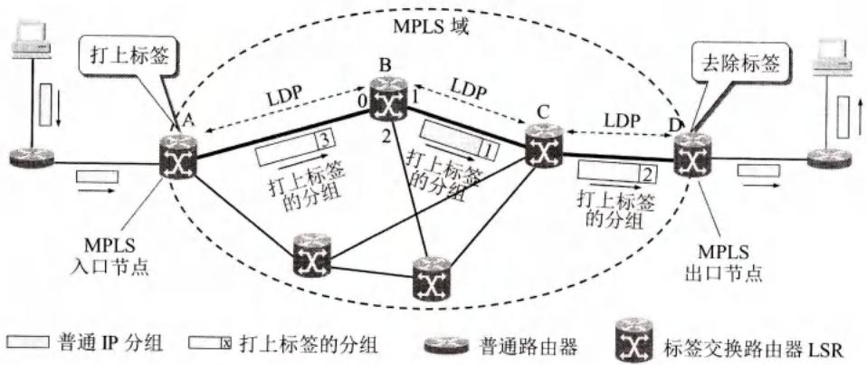
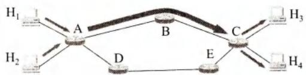
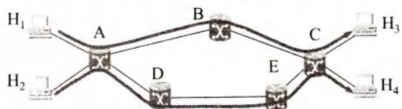
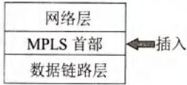
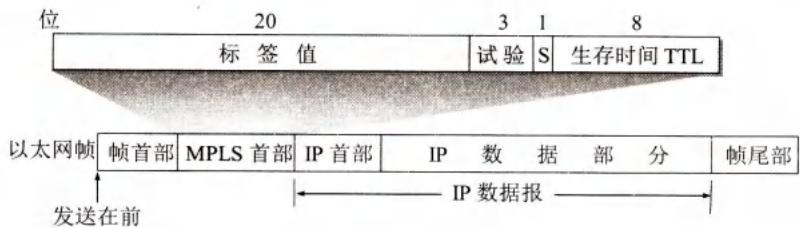

# 第4章-4.9-多协议标签交换MPLS

## 基本信息

- **课程**：计算机网络
- **章节**：第4章 4.9节 多协议标签交换MPLS
- **日期**：2026-04-26
- **标签**：#MPLS #标签交换 #FEC #流量工程 #段路由

***

## 重点内容

### ⭐⭐ 核心概念

1. **MPLS**：在IP数据报上添加固定长度标签，用硬件进行快速转发
2. **标签交换路径LSP**：入口LSR确定整个转发路径
3. **转发等价类FEC**：按照同样方式对待的IP数据报集合
4. **MPLS首部**：4字节，包含标签值、试验位、S位、TTL

### ⭐⭐ 关键问题

- MPLS为什么比传统IP转发快？
- 什么是显式路由选择？
- FEC的作用是什么？

***

## 详细笔记

### 一、MPLS概述

#### 1. MPLS的产生背景

**提出时间**：1997年IETF成立MPLS工作组

**成为标准**：2001年1月（RFC3031, 3032）

**技术来源**：

- 思科公司的标签交换（Tag Switching）
- Ipsilon公司的IP交换（IP Switching）

**"多协议"含义**：MPLS上层可以采用多种协议

#### 2. MPLS的基本思想

**核心思想**：

- 每个分组携带一个叫作**标签**的小整数
- 交换机读取标签，用标签值检索转发表
- 比查找路由表转发分组**快得多**

**与ATM的关系**：

- 都采用面向连接的工作方式
- 但MPLS没有取代IP，而是作为**IP增强技术**

#### 3. MPLS的三个特点

| 特点              | 说明         |
| --------------- | ---------- |
| **支持面向连接的服务质量** | 可提供QoS保证   |
| **支持流量工程**      | 均衡网络负载     |
| **有效支持VPN**     | 基于标签的VPN实现 |

***

### 二、MPLS的工作原理

#### 1. 传统IP转发的缺点

**问题**：

- 分组每到一个路由器都要查找转发表
- 按照"最长前缀匹配"原则找下一跳
- 网络大时，查找转发表花费很多时间
- 突发性通信量可能导致缓存溢出

#### 2. MPLS的基本工作过程

#### 📷 图4-66 MPLS协议的基本原理



> 📚 **课本出处**：图4-66 MPLS在入口处给IP数据报打标签，之后根据标签转发

**MPLS域（MPLS Domain）**：

- 包含许多彼此相邻的路由器
- 所有路由器都是**标签交换路由器LSR**（Label Switching Router）

**LSR功能**：

- **标签交换功能**：快速转发
- **路由选择功能**：构造转发表

**工作过程**：


**详细步骤**：

**(1) 建立标签交换路径LSP**

- 各LSR使用**标签分配协议LDP**交换报文
- 找出和特定标签相对应的路径
- 构造转发表

**(2) 入口节点打标签**

- IP数据报进入MPLS域
- 入口节点给数据报**打上标签**（插入MPLS首部）
- 按照转发表转发给下一个LSR 

**(3) 标签交换和标签对换**

- 每个LSR做两件事：**转发** + **更换标签**
- **标签对换（label swapping）**：入标签 → 出标签
- 标签仅在两个LSR之间有意义

**(4) 出口节点去除标签**

- IP数据报离开MPLS域
- 出口节点**去除MPLS标签**
- 按照普通转发方法继续转发

#### 3. 显式路由选择

**传统路由选择**：

- 每一个路由器逐跳进行路由选择
- 每个路由器独立决定下一跳

**MPLS显式路由选择**：

- 由**入口LSR确定**整个转发路径
- 就像一条虚连接

***

### 三、转发等价类FEC

#### 1. FEC的概念

**FEC（Forwarding Equivalence Class）**：

- 路由器按照**同样方式对待**的IP数据报 
- "同样方式"：从同样接口转发到同样下一跳，同样服务类别和丢弃优先级

#### 2. FEC的划分方法

| FEC类型          | 说明            |
| -------------- | ------------- |
| **目的IP前缀匹配**   | 相当于普通IP路由器    |
| **源地址+目的地址相同** | 特定主机对         |
| **服务质量需求**     | 具有某种QoS需求的数据报 |

**特点**：

- 划分方法不受限制
- 由网络管理员控制
- 非常灵活

#### 3. FEC用于负载均衡

#### 📷 图4-67 FEC用于负载均衡





> 📚 **课本出处**：图4-67 利用FEC可使网络负载较为均衡（流量工程）

**传统路由选择的问题**：

- 只能选择最短路径A→B→C
- 可能导致最短路径过载

**MPLS的解决方案**：

- 设置两种FEC
- H₁→H₃：路径A→B→C
- H₂→H₄：路径A→D→E→C
- 使网络负载均衡

**流量工程（Traffic Engineering, TE）**：

- 均衡网络负载的做法
- 也称为通信量工程

***

### 四、MPLS首部的位置与格式

#### 1. MPLS首部的位置

#### 📷 图4-68 MPLS首部的位置



> 📚 **课本出处**：图4-68 MPLS首部位于第二层和第三层之间

**位置**：

- 在**第二层和第三层之间**
- 以太网帧首部 和 IP数据报首部 之间

**以太网类型字段**：

- 单播：**8847₁₆**
- 多播：**8848₁₆**

#### 2. MPLS首部格式

#### 📷 图4-69 MPLS首部的格式



> 📚 **课本出处**：图4-69 MPLS首部共4字节，包含4个字段

**MPLS首部字段**（共4字节）：

| 字段       | 长度  | 说明            |
| -------- | --- | ------------- |
| **标签值**  | 20位 | 标签标识符，最多2²⁰个流 |
| **试验**   | 3位  | 保留用于试验        |
| **S（栈）** | 1位  | 标签栈使用         |
| **TTL**  | 8位  | 防止在MPLS域中兜圈子  |

**标签容量**：

- 20位标签值
- 理论上可容纳**1,048,576**个流
- 实际中通常需要人工管理，不会使用很大数目

***

### 五、新一代的MPLS：段路由SR

#### 1. 传统MPLS的问题

| 问题          | 说明                |
| ----------- | ----------------- |
| **控制协议复杂**  | LDP协议复杂，扩展性差      |
| **运行维护困难**  | 维护难度大             |
| **无法灵活调度**  | 无法基于时延或带宽进行流量调度   |
| **RSVP复杂**  | 需要RSVP进行资源预留，信令复杂 |
| **不支持ECMP** | 不支持等价多路径路由选择      |

#### 2. 段路由选择协议SR

**全称**：Segment Routing（段路由选择协议）

**特点**：

- 保留了MPLS的主要特点
- 更加简单
- **不需要LDP协议**

**"段"（Segment）**：

- 就是**标签**
- 转发指令的标识符

**工作原理**：

1. 由**源节点**为报文指定路径
2. 将路径转换成有序的**段列表**（Segment List）
3. 段列表即MPLS标签栈，封装在分组首部
4. 网络节点执行首部中的指令（标签）进行转发

**SDN控制器**：

- 收集全网拓扑信息和链路状态信息
- 计算分组应传送的整个路径
- 给分组分配SR标签

#### 3. SR的演进

| 类型          | 说明                       |
| ----------- | ------------------------ |
| **SR-MPLS** | 基于MPLS的段路由               |
| **SRv6**    | 向IPv6演进，直接利用IPv6字段作为标签寻址 |

***

## 核心考点总结

### ⭐⭐ 必考内容

1. **MPLS基本概念**

| 项目       | 内容                                     |
| -------- | -------------------------------------- |
| **全称**   | MultiProtocol Label Switching（多协议标签交换） |
| **核心思想** | 给IP数据报添加标签，用硬件快速转发                     |
| **位置**   | 第二层和第三层之间                              |
| **特点**   | 面向连接、支持QoS、支持流量工程、支持VPN                |

1. **MPLS工作过程**

```
入口节点(ingress) → LSR → LSR → 出口节点(egress)
    ↓                    ↓           ↓
  打标签              标签对换      去除标签
  确定LSP             转发+换标签    普通转发
```

1. **MPLS首部格式**（4字节）

| 字段   | 位数 | 作用    |
| ---- | -- | ----- |
| 标签值  | 20 | 标签标识符 |
| 试验   | 3  | 保留    |
| S（栈） | 1  | 标签栈   |
| TTL  | 8  | 生存时间  |

1. **关键概念对比**

| 概念       | 说明                    |
| -------- | --------------------- |
| **LSR**  | 标签交换路由器，具有标签交换和路由选择功能 |
| **LSP**  | 标签交换路径，入口LSR确定整个路径    |
| **LDP**  | 标签分配协议，用于交换标签信息       |
| **FEC**  | 转发等价类，同样方式对待的数据报集合    |
| **标签对换** | 入标签更换为出标签             |
| **显式路由** | 入口LSR确定整个路径（vs 逐跳路由）  |

### 📌 易混淆点辨析

| 概念                 | 说明                          |
| ------------------ | --------------------------- |
| **MPLS vs ATM**    | 都采用面向连接，但MPLS是IP增强技术，未取代IP  |
| **标签 vs IP地址**     | 标签仅在两个LSR之间有意义，不是全局的        |
| **MPLS转发 vs IP转发** | MPLS根据标签转发（快），IP根据最长前缀匹配（慢） |
| **SR vs 传统MPLS**   | SR不需要LDP，由源节点指定路径           |

### 📝 常见考题类型

1. **简答题**：
   - MPLS的基本工作原理
   - 什么是FEC？有什么作用？
   - MPLS首部包含哪些字段？
2. **对比题**：
   - 比较MPLS转发和传统IP转发的区别
   - 比较显式路由和逐跳路由
3. **分析题**：
   - 分析MPLS如何实现流量工程
   - 段路由SR相比传统MPLS有什么改进？

***

## 相关链接

### 本节涉及图片

- [图4-66 MPLS基本原理](../../../images/132f74dc44bd2170b51445e5f2ab55d79eb8af318d8e4c520f1a6a286783aee0.jpg)
- [图4-67a 传统路由选择](../../../images/217a26ae23d61fe7fefcc4d29c2ada8aa7fa0ba46446690ffdafe1ba7dbf9ae5.jpg)
- [图4-67b MPLS负载均衡](../../../images/5f9e79316624f11867028b64f6d765db652b0a3307a477818cd92ff2e41cea8d.jpg)
- [图4-68 MPLS首部位置](../../../images/18807391f276602993c5e55be411467a20dbcbc08622a6ee0fb021d6615f9edb.jpg)
- [图4-69 MPLS首部格式](../../../images/ae0267a1423432e8bcb36d0097969cf7c50a2ad2e8776b32aa113a5702bec9e3.jpg)

### 关联章节

- [第4章-4.10-软件定义网络SDN简介](./第4章-4.10-软件定义网络SDN简介.md) - SDN控制器与SR

***

*笔记创建时间：2026-04-26*
