# 第4章 网络层

## 基本信息
- **课程**：计算机网络
- **章节**：第4章 网络层
- **日期**：2026-04-26
- **标签**：#网络层 #IP协议 #路由 #子网划分 #CIDR #IPv6

---

## 重点内容

### ⭐⭐⭐ 核心概念
1. **网络层两种服务**：虚电路服务 vs 数据报服务（互联网采用数据报）
2. **IP地址编址**：分类编址（A/B/C类）→ 划分子网 → CIDR无分类编址
3. **IP地址与MAC地址的关系**：网络层 vs 数据链路层地址
4. **ARP协议**：IP地址→MAC地址的解析
5. **IP数据报格式**：首部各字段含义
6. **路由选择协议**：RIP、OSPF、BGP

### ⭐⭐ 关键问题
- 为什么互联网选择数据报服务而非虚电路服务？
- CIDR如何解决IP地址枯竭问题？
- 最长前缀匹配原理
- IPv6相比IPv4的改进

---

## 详细笔记

### 一、网络层的几个重要概念

#### 1. 网络层提供的两种服务

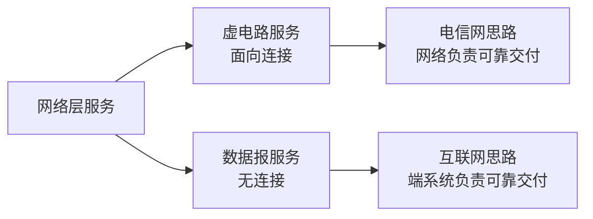

#### 📷 图4-1 网络层提供的两种服务

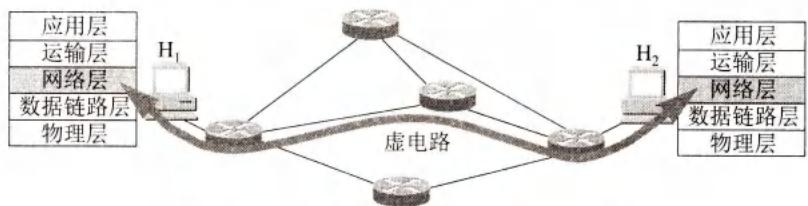

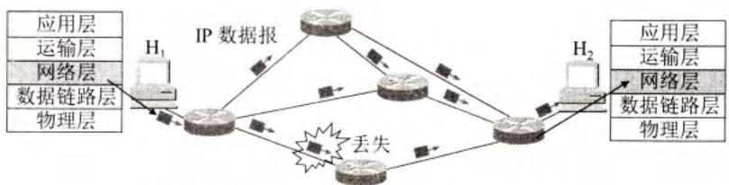

> 📚 **课本出处**：图4-1(a)虚电路服务需要建立连接；(b)数据报服务每个分组独立传送

#### 📊 表4-1 虚电路服务与数据报服务的对比

| 对比方面 | 虚电路服务 | 数据报服务 |
|---------|-----------|-----------|
| **思路** | 可靠通信由网络保证 | 可靠通信由用户主机保证 |
| **连接建立** | 必须有 | 不需要 |
| **终点地址** | 连接建立时用，分组用虚电路号 | 每个分组都有完整IP地址 |
| **分组转发** | 同一路由转发 | 独立查找转发表转发 |
| **节点故障** | 所有虚电路中断 | 可能丢失分组，路由变化 |
| **分组顺序** | 按发送顺序到达 | 不一定按序到达 |
| **差错处理** | 网络或主机负责 | 用户主机负责 |

**互联网的选择**：采用**数据报服务**
- ✅ 网络层设计简单
- ✅ 路由器简单、价格低廉
- ✅ 运行方式灵活
- ✅ 适应多种应用

#### 2. 网络层的两个层面

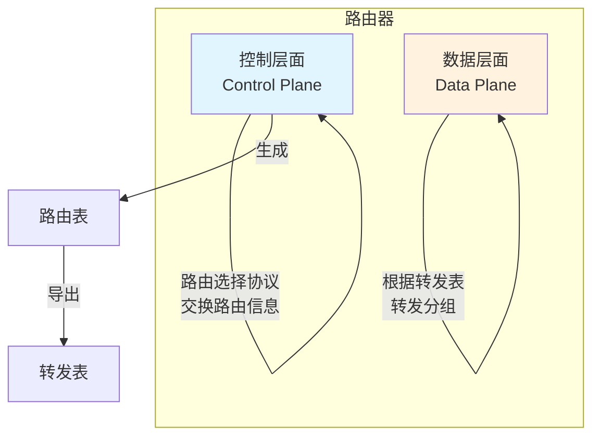

#### 📷 图4-2 网络层的数据层面和控制层面

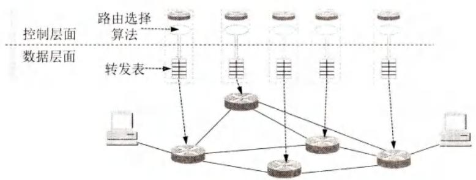

> 📚 **课本出处**：图4-2 数据层面负责转发分组，控制层面负责生成路由表

**两个层面的特点**：

| 层面 | 功能 | 速度 | 实现方式 |
|-----|------|------|---------|
| **数据层面** | 根据转发表转发分组 | 纳秒级(10⁻⁹s) | 硬件转发 |
| **控制层面** | 交换路由信息，生成路由表 | 秒级 | 软件计算 |

#### 📷 图4-3 软件定义网络SDN中的控制层面和数据层面

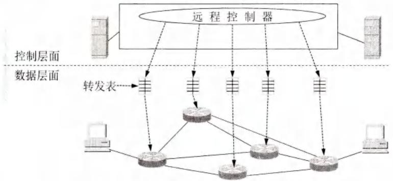

> 📚 **课本出处**：图4-3 SDN将控制层面集中，路由器只保留数据层面

**SDN特点**：
- 远程控制器集中控制
- 路由器之间不再交换路由信息
- 控制器计算最佳路由，生成转发表
- 路由器只负责转发分组

---

### 二、网际协议IP

#### 1. 虚拟互连网络

**中间设备的层次**：

| 层次 | 中间设备 | 功能 |
|-----|---------|------|
| 物理层 | 转发器(repeater) | 信号放大 |
| 数据链路层 | 网桥/交换机(bridge/switch) | 帧转发 |
| **网络层** | **路由器(router)** | **分组转发、路由选择** |
| 网络层以上 | 网关(gateway) | 协议转换 |

⚠️ **注意**：用转发器或网桥连接的网络仍是一个网络（从网络层看）

#### 📷 图4-4 网际协议IP及其配套协议

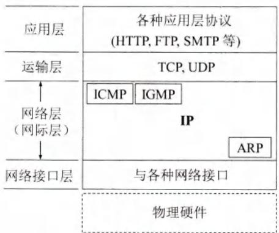

> 📚 **课本出处**：图4-4 ARP在最下层（IP常用），ICMP和IGMP在上层（使用IP）

**与IP配套的协议**：
- **ARP**（地址解析协议）：IP地址 → MAC地址
- **ICMP**（网际控制报文协议）：差错报告、诊断
- **IGMP**（网际组管理协议）：多播组管理

#### 📷 图4-5 IP网的概念

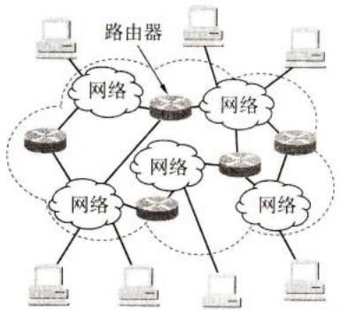

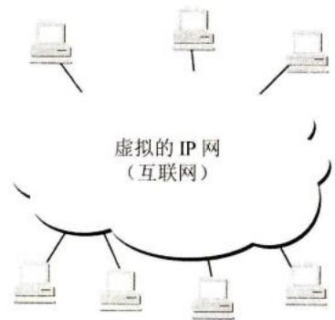

> 📚 **课本出处**：图4-5 虚拟互连网络隐藏了底层物理网络的异构性

**虚拟互连网络的意义**：
- 各种物理网络异构性客观存在
- 使用IP协议使它们在网络层看起来像一个统一网络
- 主机通信时看不见互连网络的具体细节

#### 📷 图4-6 分组在互联网中的传送

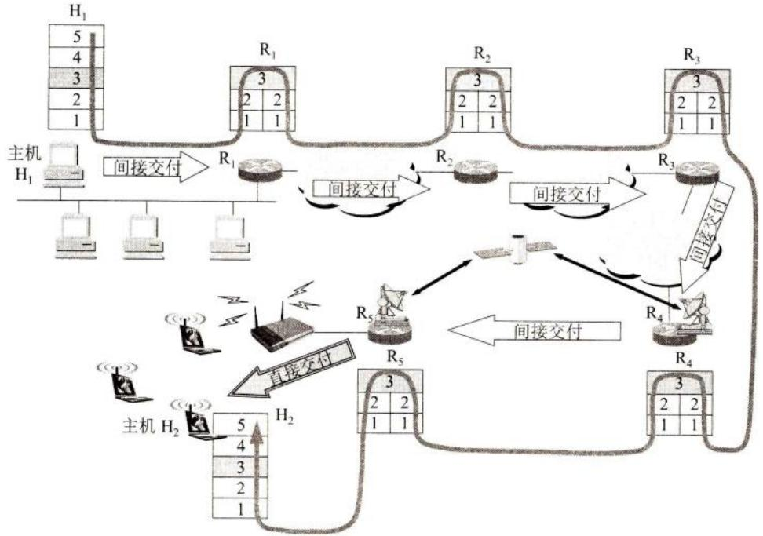

> 📚 **课本出处**：图4-6 分组从H1经R1→R2→R5直接交付到H2

**直接交付 vs 间接交付**：
- **直接交付**：源和目的在同一网络，不经过路由器
- **间接交付**：源和目的在不同网络，必须经过路由器转发

#### 📷 图4-7 源主机向目的主机发送分组

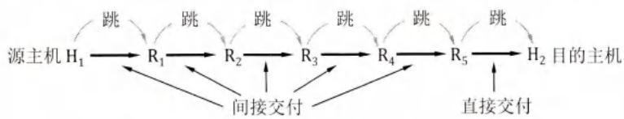

> 📚 **课本出处**：图4-7 简化表示：省略路由器之间的网络和无关主机

---

### 三、IP地址

#### 1. 分类的IP地址（历史）

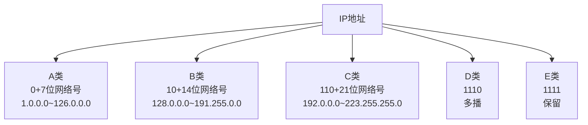

**分类地址的问题**：
- A类网络主机太多（1677万+）
- C类网络主机太少（254个）
- IP地址浪费严重
- 路由表膨胀

#### 📊 表4-2 一般不指派的特殊IP地址

| 网络号 | 主机号 | 源地址 | 目的地址 | 含义 |
|-------|-------|-------|---------|------|
| 0 | 0 | 可以 | 不可 | 本网络上的本主机（DHCP） |
| 0 | X | 可以 | 不可 | 本网络上主机号为X的主机 |
| 全1 | 全1 | 不可 | 可以 | 只在本网络广播（不转发） |
| Y | 全1 | 不可 | 可以 | 对网络Y的所有主机广播 |
| 127 | 非全0/全1 | 可以 | 可以 | 本地软件环回测试 |

#### 2. 无分类编址CIDR ⭐⭐⭐

**CIDR的要点**：

**(1) 网络前缀**
- 网络前缀长度n可变（0~32）
- 斜线记法：IP地址/n
- 例：128.14.35.7/20，前20位是网络前缀

**(2) 地址块**
- 网络前缀相同的连续IP地址组成CIDR地址块
- 地址数 = 2^(32-n)
- 例：/20地址块有2^12 = 4096个地址

**(3) 地址掩码（子网掩码）**
- 1的个数 = 网络前缀长度
- 网络地址 = IP地址 AND 掩码

#### 📷 图4-11 CIDR表示的IP地址

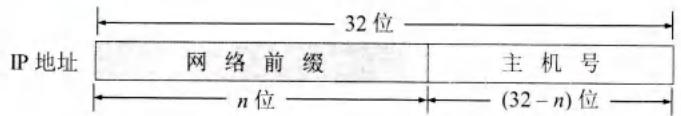

> 📚 **课本出处**：图4-11 CIDR网络前缀长度可变

#### 📷 图4-12 从IP地址算出网络地址

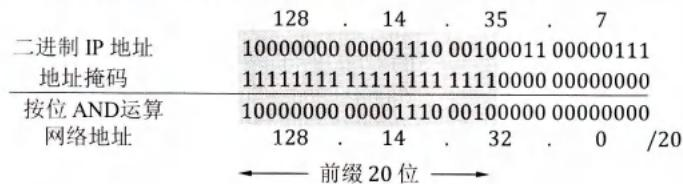

> 📚 **课本出处**：图4-12 IP地址与掩码进行AND运算得到网络地址

**计算示例**：
```
IP地址：128.14.35.7/20

二进制IP：  10000000 00001110 00100011 00000111
掩码(/20)：11111111 11111111 11110000 00000000
           ----------------------------------- AND
网络地址：  10000000 00001110 00100000 00000000
           = 128.14.32.0/20
```

#### 📊 表4-3 常用的CIDR地址块

| 前缀长度 | 掩码 | 地址数 | 相当于 |
|---------|------|-------|-------|
| /13 | 255.248.0.0 | 512K | 8个B类或2048个C类 |
| /16 | 255.255.0.0 | 64K | 1个B类或256个C类 |
| /20 | 255.255.240.0 | 4K | 16个C类 |
| /24 | 255.255.255.0 | 256 | 1个C类 |
| /30 | 255.255.255.252 | 4 | 点对点链路 |

#### 📷 图4-13 CIDR地址块划分举例

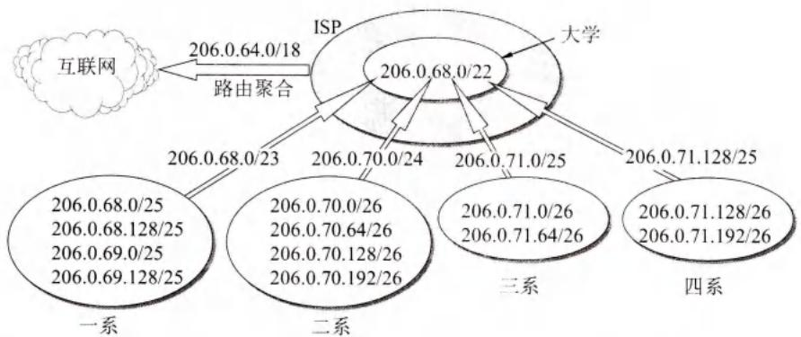

> 📚 **课本出处**：图4-13 ISP拥有206.0.64.0/18，大学分配206.0.68.0/22

**路由聚合（构造超网）**：
- 用较大的CIDR地址块代替多个小地址块
- 减少转发表项目数
- 缩短查找时间

#### 3. IP地址的特点

1. **分等级结构**：网络前缀 + 主机号
2. **标志主机和链路的接口**：多归属主机有多个IP地址
3. **相同前缀 = 同一网络**：转发器/交换机连接的局域网仍为一个网络
4. **网络平等**：所有分配到前缀的网络地位平等

#### 📷 图4-14 需要IP地址的地方

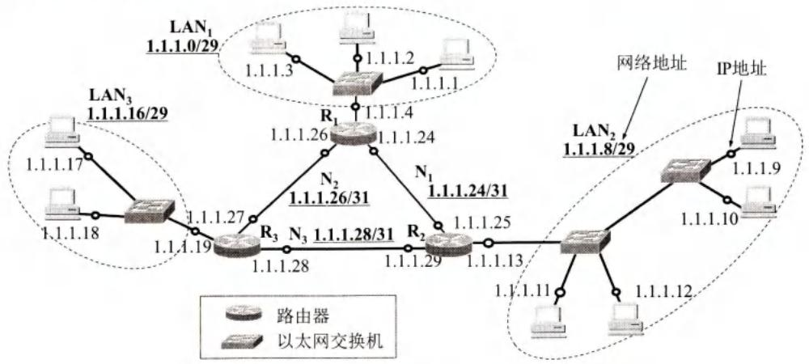

> 📚 **课本出处**：图4-14 小圆圈表示需要IP地址的接口

---

## 疑问与思考

### ❓ 待解决问题
1. 为什么分类IP地址会造成地址浪费？
2. CIDR如何解决路由表膨胀问题？
3. IPv4向IPv6过渡的具体方案？

### 💡 个人理解
- 互联网选择数据报服务是"端到端原则"的体现
- CIDR是IP地址编址的重大改进，提高了地址利用率
- 网络层的两个层面分离是SDN的核心理念
- 路由聚合是CIDR带来的重要好处

---

## 核心考点总结

### ⭐⭐⭐ 必考内容

1. **网络层两种服务对比**

| 特性 | 虚电路 | 数据报 |
|-----|-------|-------|
| 连接 | 需要建立 | 不需要 |
| 地址 | 虚电路号 | 完整IP地址 |
| 路由 | 固定 | 独立选择 |
| 可靠性 | 网络保证 | 主机保证 |

2. **CIDR编址** ⭐⭐⭐

```
IP地址 ::= {<网络前缀>, <主机号>}

斜线记法：128.14.35.7/20
- 前20位：网络前缀
- 后12位：主机号
- 地址块大小：2^12 = 4096
```

3. **地址掩码计算**

```
网络地址 = IP地址 AND 子网掩码

例：192.168.1.100/24
掩码：255.255.255.0
网络地址：192.168.1.0
```

4. **特殊地址块**

| 前缀 | 用途 |
|-----|------|
| /32 | 主机路由 |
| /31 | 点对点链路 |
| /0 | 默认路由 |

### 📌 易混淆点辨析

| 概念 | 说明 |
|-----|------|
| **网络前缀** | CIDR中的网络号部分，长度可变 |
| **地址掩码** | 32位，1表示网络前缀，0表示主机号 |
| **网络地址** | 主机号全0的地址，标识网络 |
| **广播地址** | 主机号全1的地址 |
| **路由聚合** | 用大的CIDR块代替多个小的 |
| **构造超网** | CIDR的另一种说法 |

### 📝 常见考题类型

1. **计算题**：
   - 给定IP地址和掩码，计算网络地址
   - 给定地址块，计算可用地址范围
   - 路由聚合，合并多个地址块

2. **简答题**：
   - 比较虚电路和数据报服务
   - 说明CIDR的优点
   - 解释网络层两个层面的作用

3. **分析题**：
   - 分析SDN对传统网络架构的改变
   - 说明IP地址与MAC地址的区别

---

## 相关链接

### 本节涉及图片
- [图4-1 虚电路服务](../../../images/0f7c0cf2bbed4f94a9d3181f1ae703be170fc058e091f7f811fe82032a3c6c37.jpg)
- [图4-1 数据报服务](../../../images/73734c369d27d4ca6ea9ce261ed6d721bc03f3ba060adf81090d54c439cb9f24.jpg)
- [图4-2 网络层的两个层面](../../../images/923a69377551753d26b5a5991a7ad26340db5c5ab4a1e9b91520f34195b16975.jpg)
- [图4-3 SDN架构](../../../images/04628d459fb8fc1937721064b4f069908042c3f767bac236faaf33513798c1de.jpg)
- [图4-4 IP配套协议](../../../images/f6a2405c14197ab345fe9e43bdf2d3484db80c7770ee4afefc8ac8fbcda89bac.jpg)
- [图4-5 实际互连网络](../../../images/2111c20d560afb8a4f74dbeb3efb7c57efc1ab3827e4ec374faea00a9389a953.jpg)
- [图4-5 虚拟IP网](../../../images/dacd8cdedf3cfdf0a65cff6ac14eb4830a94a9b1270954f363b3ad2964149e7b.jpg)
- [图4-6 分组传送](../../../images/71e6904caae138d1fe19297f38c2f7b2733b8aa4cff417a572d37abec0e76c25.jpg)
- [图4-7 简化传输路径](../../../images/58b208c5fe622ae66bdf65478ae904a23e909ed5e2056b55f2e15b66f1d0da4f.jpg)
- [图4-11 CIDR地址](../../../images/731cb2968fba4755573527adc00c0d7d866c4273162ed2d41b0768582908cca4.jpg)
- [图4-12 地址掩码运算](../../../images/8d36d3051cb42eafbaeb2dae4a3e9b054b78f5cde783c9d8a21ab588cd670d6b.jpg)
- [图4-13 CIDR划分](../../../images/543120d372726e22e12c6d81f6d14c5ac66be19c7420a6b71cf05c2ad8665ec2.jpg)
- [图4-14 IP地址位置](../../../images/e472609dd7624aa3970535099058095243809bd121dfb4bd3e05ff4cf3e8d854.jpg)

### 关联章节
- [第3章 数据链路层](./第3章-数据链路层.md) - MAC地址、ARP协议
- [第5章 运输层](./第5章-运输层.md) - TCP/UDP协议
- [第6章 应用层](./第6章-应用层.md) - DNS、HTTP等应用协议

---

*笔记创建时间：2026-04-26*
