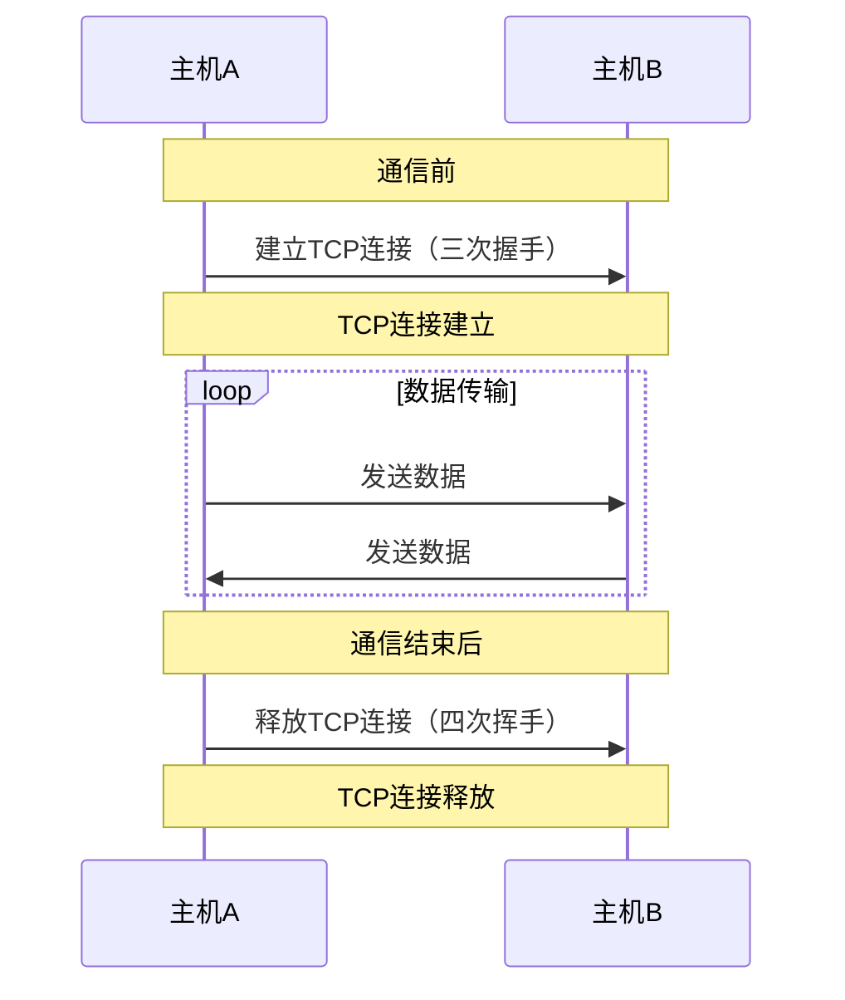
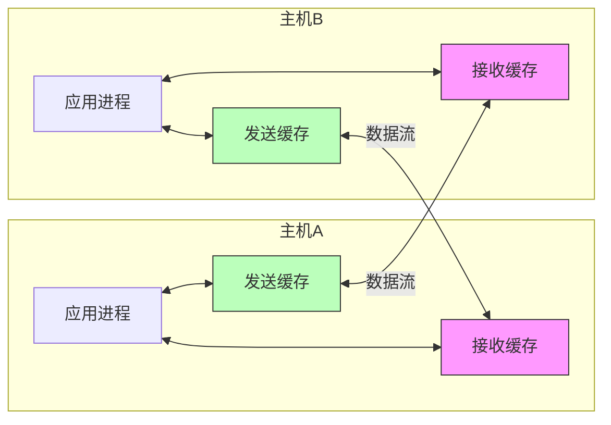
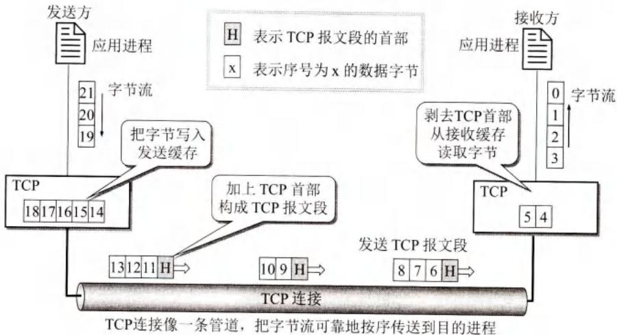
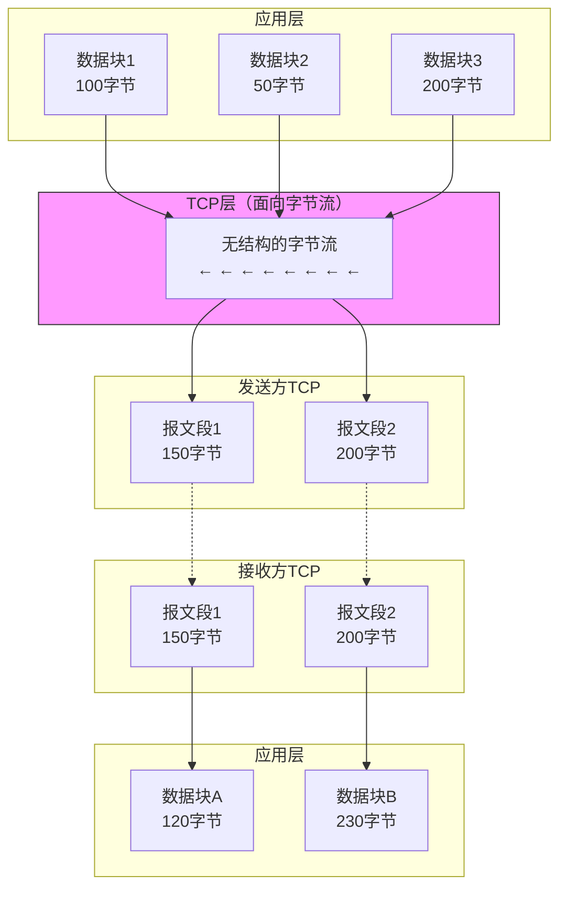
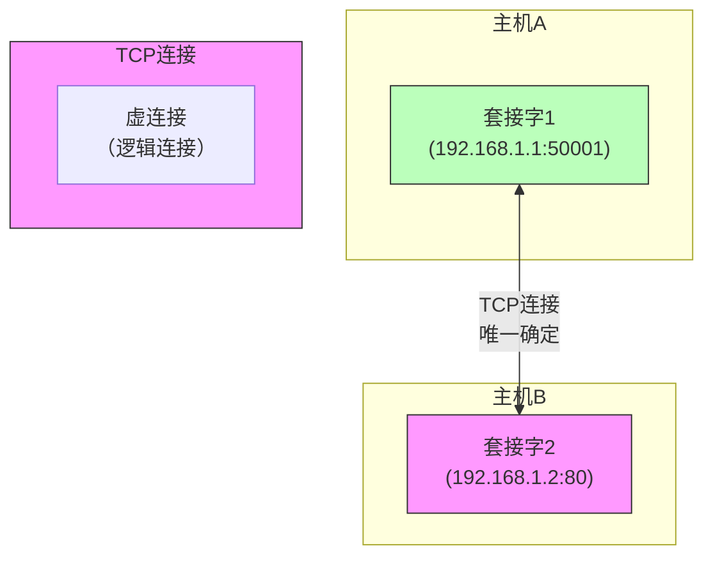
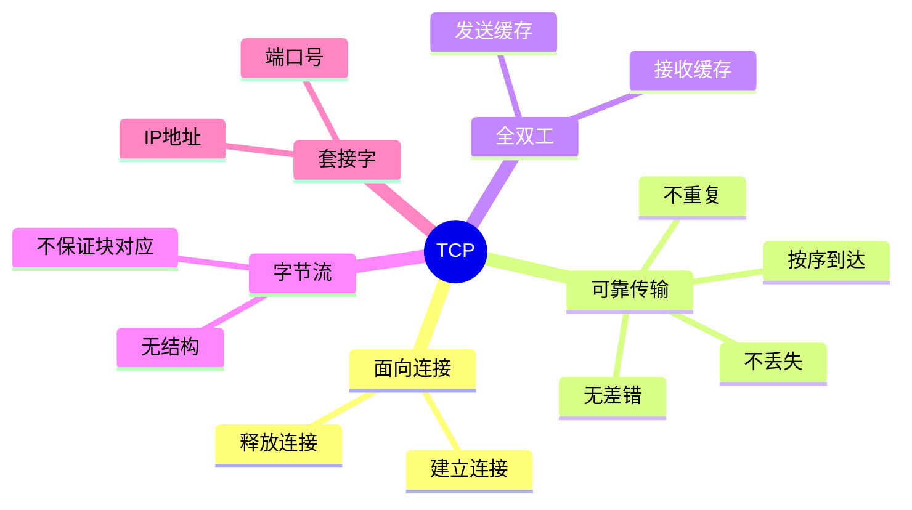

# 第5章 传输控制协议 TCP概述（5.3）

## 基本信息

- **课程**：计算机网络
- **章节**：第5章 运输层 - 5.3 传输控制协议 TCP概述
- **日期**：2026-04-02
- **标签**：#TCP #面向连接 #可靠传输 #字节流 #套接字

***

## 重点内容

### TCP的5个最主要特点

> 📌 **TCP是TCP/IP体系中非常复杂的协议**

| 特点        | 说明                    |
| --------- | --------------------- |
| **面向连接**  | 使用前建立连接，使用后释放连接       |
| **点对点**   | 每条TCP连接只能有两个端点，一对一    |
| **可靠交付**  | 无差错、不丢失、不重复、按序到达      |
| **全双工通信** | 双方随时都能发送数据，有发送/接收缓存   |
| **面向字节流** | 数据看作无结构字节流，不保证数据块对应关系 |

***

## 详细笔记

### 5.3.1 TCP最主要的特点

#### 1. 面向连接



**类比打电话**：

- 通话前要先拨号**建立连接**
- 通话结束后要挂机**释放连接**

#### 2. 点对点（一对一）

- 每条TCP连接**只能有两个端点**
- **不支持**广播或多播
- 连接是**一对一**的

#### 3. 可靠交付

通过TCP连接传送的数据：

- ✅ **无差错**
- ✅ **不丢失**
- ✅ **不重复**
- ✅ **按序到达**

#### 4. 全双工通信



**特点**：

- 通信双方的应用进程在**任何时候**都能发送数据
- 连接两端都设有**发送缓存**和**接收缓存**
- **发送时**：应用进程把数据传给TCP缓存后就可以做其他事，TCP在合适时发送
- **接收时**：TCP把收到的数据放入缓存，上层应用在合适时读取

#### 5. 面向字节流





**关键概念**：

- **流（stream）**：流入或流出进程的字节序列
- TCP把应用数据看成**无结构的字节流**
- TCP**不知道**所传送字节流的含义
- **不保证**接收方收到的数据块和发送方发出的数据块大小对应
- 但接收方收到的**字节流必须和发送方发出的完全一样**

**示例**：

- 发送方：10个数据块 → TCP
- 接收方：TCP可能只用4个数据块交付给应用
- 但字节流内容完全一致

**重要说明**：

- TCP连接是**虚连接（逻辑连接）**，不是物理连接
- TCP报文段先*传到IP*层，加IP首部
- 再到数据链路层，加首部和尾部
- 最后才发送到物理链路

**与UDP的区别**：

- **UDP**：发送的报文长度由应用进程给出，保留报文边界
- **TCP**：根据对方窗口值和网络拥塞程度，决定报文段包含多少字节
  - 数据块太长 → 划分为短一些的数据块
  - 数据块太短 → 等待积累足够多字节再发送

***

### 5.3.2 TCP的连接

#### TCP连接的端点：套接字（Socket）

> ⭐ **TCP把连接作为最基本的抽象**

**套接字定义**（RFC 793）：

$$
\text{套接字 socket} = (\text{IP地址} : \text{端口号})
$$

**示例**：

- IP地址：192.3.4.5
- 端口号：80
- 套接字：`(192.3.4.5:80)`

#### TCP连接的确定

$$
\text{TCP连接} := {\text{socket}\_1, \text{socket}\_2} = {(\text{IP}\_1: \text{port}\_1), (\text{IP}\_2: \text{port}\_2)}
$$



**关键点**：

- TCP连接由**两个套接字**唯一确定
- 是**两个套接字之间的连接**
- 同一个IP地址可以有**多个不同的TCP连接**
- 同一个端口号可以出现在**多个不同的TCP连接中**

#### 套接字的形象理解

```
    应用层
      │
      ▼
┌─────────────┐
│   套接字    │ ← 像插座/插口（软件抽象）
│  (socket)   │
└─────────────┘
      │
      ▼
   运输层
```

**类比**：

- 一条TCP连接就像一条**电缆线**
- 两端各有一个**插头**
- 把插头插入\*\*插座（socket）\*\*后，两个进程就可以通信
- "套接字"成为socket的标准译名

#### 注意：socket的多重含义

同一个名词socket在不同上下文中有不同意思：

| 含义             | 说明                     |
| -------------- | ---------------------- |
| **RFC 793定义**  | 端口号拼接到IP地址 `(IP:port)` |
| **Socket API** | 应用编程接口，运输层和应用层的接口      |
| **socket函数**   | Socket API中的一个函数名      |
| **socket端点**   | 调用socket函数的端点          |
| **socket描述符**  | socket函数的返回值           |
| **socket实现**   | 操作系统内核中的Berkeley实现     |

> ⚠️ **注意**：本章使用的是RFC 793定义的socket（IP地址:端口号）

***

## 疑问与思考

❓ **疑问**：为什么TCP是面向字节流，而UDP是面向报文？

💡 **解答**：

- **TCP**：需要实现可靠传输、流量控制、拥塞控制，必须灵活处理字节流
  - 可以根据网络状况调整报文段大小
  - 可以合并或拆分数据块
  - 适合需要可靠传输的应用
- **UDP**：简单快速，不需要这些控制机制
  - 直接封装应用层报文
  - 保留报文边界
  - 适合实时应用

❓ **疑问**：TCP连接是"虚连接"，这是什么意思？

💡 **解答**：

- TCP连接是**逻辑上的连接**，不是物理连接
- 数据实际传输要经过：TCP → IP → 数据链路层 → 物理层
- 每一层都加上自己的首部/尾部
- 对应用层来说，好像有一条直接的端到端连接

❓ **疑问**：同一个端口号如何出现在多个TCP连接中？

💡 **解答**：

- 服务器端口号固定（如Web服务器端口80）
- 不同客户端连接同一个服务器端口
- 每个连接由**不同的套接字对**唯一标识
- 例如：
  - 连接1：(192.168.1.2:50001, 192.168.1.1:80)
  - 连接2：(192.168.1.3:50002, 192.168.1.1:80)

***

## 总结

### TCP vs UDP 对比

| 特性       | TCP          | UDP           |
| -------- | ------------ | ------------- |
| **连接**   | 面向连接         | 无连接           |
| **通信方式** | 点对点（一对一）     | 一对一、一对多、多对多   |
| **可靠性**  | 可靠交付         | 尽最大努力交付       |
| **数据单位** | 面向字节流        | 面向报文          |
| **拥塞控制** | 有            | 无             |
| **首部大小** | 20字节（最小）     | 8字节           |
| **适用场景** | 文件传输、网页浏览、邮件 | 实时视频、DNS、IP电话 |

### TCP核心概念



### 关键公式

$$
\text{套接字} = (\text{IP地址} : \text{端口号})
$$

$$
\text{TCP连接} = {(\text{IP}\_1: \text{port}\_1), (\text{IP}\_2: \text{port}\_2)}
$$

***

## 相关链接

- 上一节：5.2 用户数据报协议 UDP
- 下一节：5.4 可靠传输的工作原理
- 后续内容：
  - 5.5 TCP报文段的首部格式
  - 5.6 TCP可靠传输的实现
  - 5.7 TCP的流量控制
  - 5.8 TCP的拥塞控制
  - 5.9 TCP的运输连接管理

