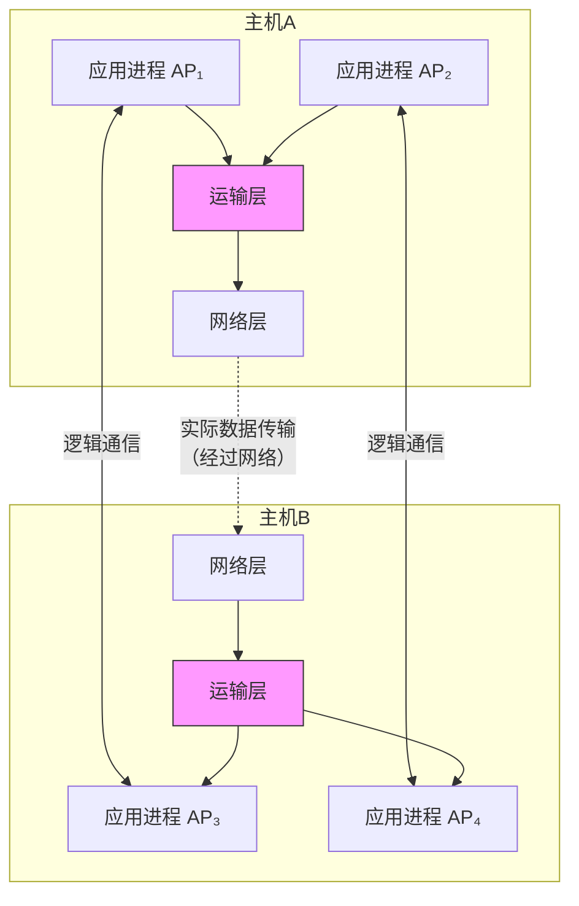
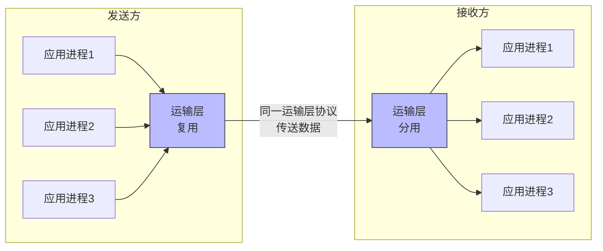
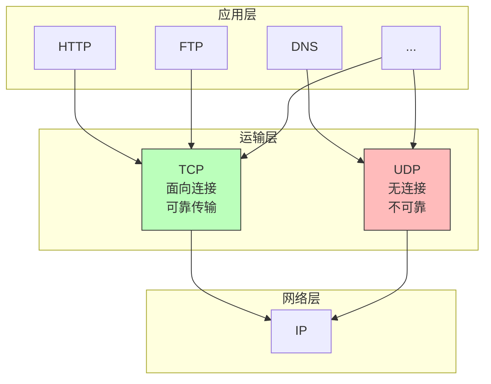
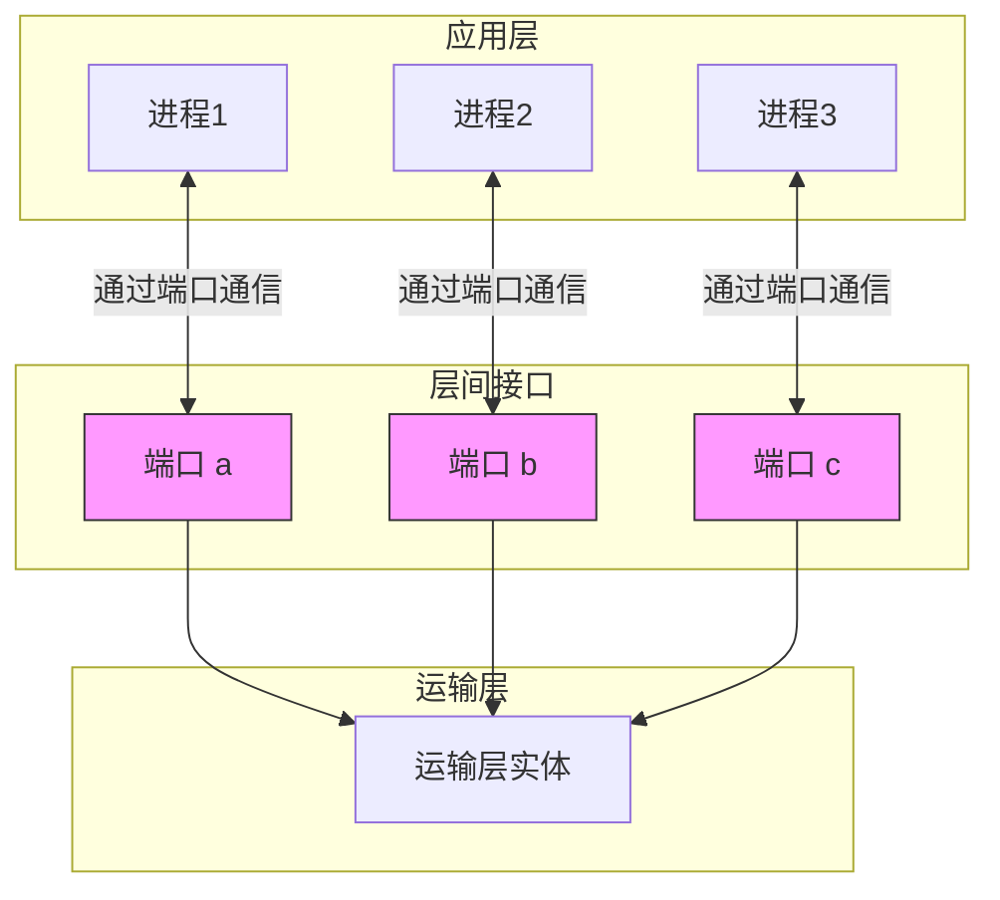
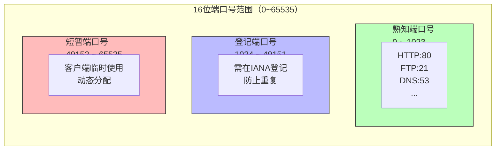

# 第5章 运输层协议概述（5.1）

## 基本信息

- **课程**：计算机网络
- **章节**：第5章 运输层 - 5.1 运输层协议概述
- **日期**：2026-04-02
- **标签**：#运输层 #TCP #UDP #端口 #复用分用

***

## 重点内容

### 运输层的核心作用

> 📌 **运输层为应用进程之间提供逻辑通信**




### 网络层 vs 运输层

| 对比项      | 网络层         | 运输层             |
| -------- | ----------- | --------------- |
| **通信对象** | 主机 ↔ 主机     | 进程 ↔ 进程（端到端）    |
| **服务范围** | 为主机之间通信提供服务 | 为应用进程之间通信提供服务   |
| **IP作用** | 把分组送到目的主机   | 把分组交付给目的进程      |
| **关键功能** | 路由选择、IP寻址   | 复用/分用、差错检测、可靠传输 |

***

## 详细笔记

### 5.1.1 进程之间的通信

#### 为什么需要运输层？

IP协议能把分组送到目的主机，但分组还停留在主机的**网络层**，没有交付给应用进程。

> ⭐ **真正进行通信的实体是主机中的应用进程**

- 端到端的通信 = 应用进程之间的通信
- 一台主机中经常有**多个应用进程**同时和另一台主机的多个应用进程通信

#### 复用（Multiplexing）与分用（Demultiplexing）



**复用**：发送方不同的应用进程都可以使用同一个运输层协议传送数据（需要加上适当的首部）

**分用**：接收方的运输层在剥去报文的首部后能够把这些数据正确交付目的应用进程

#### 逻辑通信的含义

- 从应用层来看，只要把报文交给运输层，就能传送到对方运输层
- 好像这种通信是沿水平方向直接传送数据
- 但事实上两个运输层之间**并没有物理连接**
- 数据的传送是经过多个层次传送的

#### 运输层的差错检测

- 运输层要对收到的报文进行**差错检测**
- 网络层的IP数据报首部检验和**只检验首部**，不检查数据部分
- 运输层检验**整个报文**（首部+数据）

#### 屏蔽网络核心细节

运输层向高层用户屏蔽了下面网络核心的细节：

- 网络拓扑
- 路由选择协议
- 网络的具体实现

应用进程看见的是好像在两个运输层实体之间有一条**端到端的逻辑通信信道**。

***

### 5.1.2 运输层的两个主要协议

#### TCP/IP运输层的两个主要协议

| 协议      | 全称                                     | 标准文档          |
| ------- | -------------------------------------- | ------------- |
| **UDP** | 用户数据报协议 (User Datagram Protocol)       | RFC 768, STD6 |
| **TCP** | 传输控制协议 (Transmission Control Protocol) | RFC 793, STD7 |




#### UDP vs TCP 对比

| 特性       | UDP       | TCP       |
| -------- | --------- | --------- |
| 连接       | 无连接       | 面向连接      |
| 可靠性      | 不可靠交付     | 可靠交付      |
| 确认机制     | 不需要确认     | 需要确认      |
| 广播/多播    | 支持        | 不支持       |
| **开销**   | 小（首部8字节）  | 大（首部20字节） |
| **适用场景** | 实时应用、简单传输 | 文件传输、可靠通信 |

**UDP特点**：

- 发送数据之前不需要先建立连接
- 收到UDP报文后不需要给出任何确认
- 非常简单，某些情况下最有效

**TCP特点**：

- 传送数据之前必须先建立连接，结束后要释放连接
- 提供可靠的、面向连接的运输服务
- 增加了许多开销：确认、流量控制、计时器、连接管理等

#### 常见应用使用的运输层协议

| 应用       | 应用层协议      | 运输层协议   |
| -------- | ---------- | ------- |
| 名字转换     | DNS        | UDP     |
| 文件传送     | TFTP       | UDP     |
| 路由选择     | RIP        | UDP     |
| IP地址配置   | DHCP       | UDP     |
| 网络管理     | SNMP       | UDP     |
| IP电话     | 专用协议       | UDP     |
| 流式多媒体    | 专用协议       | UDP     |
| **电子邮件** | **SMTP**   | **TCP** |
| **远程终端** | **TELNET** | **TCP** |
| **万维网**  | **HTTP**   | **TCP** |
| **文件传送** | **FTP**    | **TCP** |

***

### 5.1.3 运输层的端口

#### 为什么需要端口？

**问题**：

1. 不同操作系统使用不同格式的进程标识符
2. 进程的创建和撤销是动态的
3. 需要利用目的主机提供的功能，而不需要知道具体进程

**解决方案**：设置抽象的"门"——**协议端口(port)**



#### 端口的定义

- **软件端口**：应用层与运输层之间的抽象接口
- **硬件端口**：路由器/交换机上的物理接口（完全不同概念）
- 端口号：16位正整数（0\~65535）
- **端口号只具有本地意义**，不同计算机的相同端口号没有关联

#### 端口号的分类



**1. 服务器端使用的端口号**

- **熟知端口号**（0\~1023）：IANA指派给最重要的应用程序
  - FTP: 21
  - TELNET: 23
  - SMTP: 25
  - DNS: 53
  - TFTP: 69
  - HTTP: 80
  - HTTPS: 443
- **登记端口号**（1024\~49151）：没有熟知端口号的应用程序使用，需向IANA登记

**2. 客户端使用的端口号**（49152\~65535）

- 又称为**短暂端口号**或临时端口号
- 仅在客户进程运行时动态选择
- 通信结束后被系统收回

#### 套接字（Socket）

> ⭐ **套接字 = (IP地址 : 端口号)**

```
套接字 socket = (IP地址 : 端口号)
```

例如：`(192.168.1.1 : 80)`

- 唯一标识网络中的一个进程
- 通信需要知道对方的IP地址和端口号

**类比寄信**：

- IP地址 = 通信地址（找到住所）
- 端口号 = 收件人姓名（住所中的具体人）

***

## 疑问与思考

❓ **疑问**：为什么UDP和TCP需要不同的端口号空间？

💡 **解答**：

- UDP和TCP的端口是**相互独立**的
- 同一个端口号可以在UDP和TCP中同时使用
- 例如：DNS使用UDP端口53，也可以使用TCP端口53

❓ **疑问**：为什么熟知端口号只到1023？

💡 **解答**：

- 历史原因：早期UNIX系统只有root用户才能使用0\~1023端口
- 安全考虑：防止普通用户冒充系统服务
- 便于管理：IANA集中管理最重要的服务端口

***

## 总结

### 核心概念

1. **运输层的本质**：为应用进程提供**端到端的逻辑通信**
2. **复用与分用**：多个应用进程共享运输层，运输层正确交付数据给目的进程
3. **两种协议**：
   - **UDP**：无连接、不可靠、简单高效
   - **TCP**：面向连接、可靠传输、功能丰富
4. **端口的作用**：
   - 标识应用层与运输层的接口
   - 实现进程间通信的寻址
   - 套接字 = IP地址 + 端口号

### 关键公式

$$
\text{套接字(socket)} = (\text{IP地址} : \text{端口号})
$$

### 端口范围记忆

| 范围           | 类型   | 用途      |
| ------------ | ---- | ------- |
| 0\~1023      | 熟知端口 | 系统服务    |
| 1024\~49151  | 登记端口 | 用户服务    |
| 49152\~65535 | 短暂端口 | 客户端临时使用 |

***

## 相关链接

- 下一节：5.2 用户数据报协议 UDP
- 相关概念：套接字编程、进程间通信
- 实验：使用`netstat`命令查看端口使用情况

