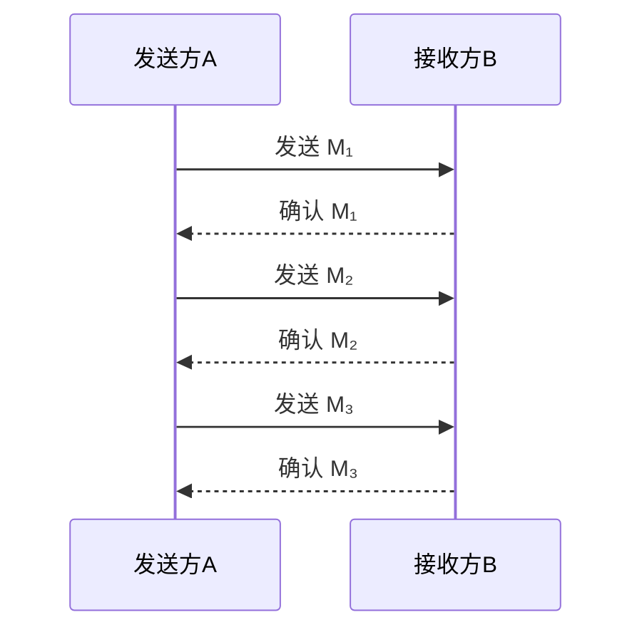
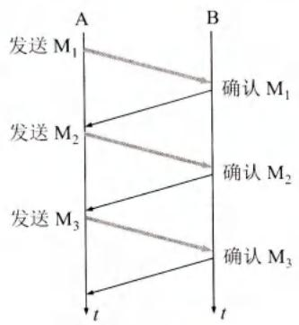
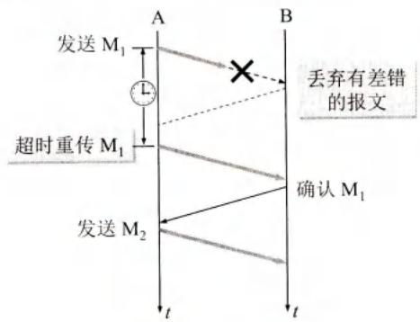
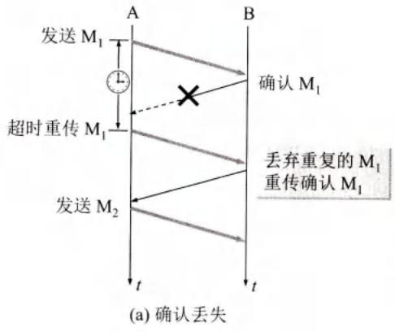
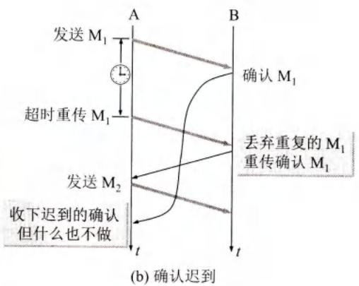
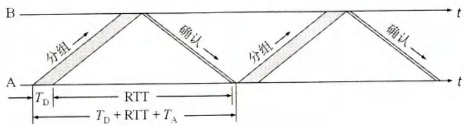
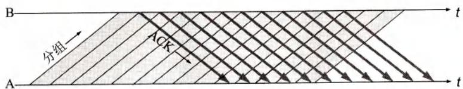
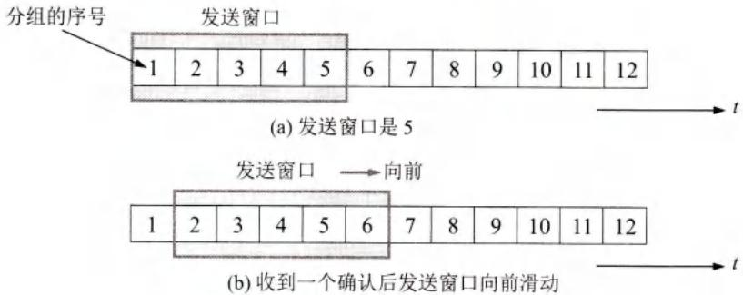

# 可靠传输的工作原理

## 基本信息
- **课程**：计算机网络（第8版）
- **章节**：第5章 5.4节 可靠传输的工作原理
- **日期**：2026-04-11
- **标签**：#TCP #可靠传输 #ARQ #停止等待 #滑动窗口

---

## 重点内容

### ⭐⭐⭐ 核心概念
1. **停止等待协议** - 最基本的可靠传输协议
2. **超时重传机制** - 实现可靠传输的关键
3. **连续ARQ协议** - 提高信道利用率的流水线传输
4. **滑动窗口机制** - TCP可靠传输的核心

### 📌 考试重点
- 停止等待协议的三种情况（无差错、出现差错、确认丢失/迟到）
- 信道利用率计算公式
- Go-back-N机制
- 累积确认的优缺点

---

## 详细笔记

### 一、为什么需要可靠传输？

TCP发送的报文段交给IP层传送，但**IP层只能提供"尽最大努力服务"**，是不可靠的传输。因此TCP必须采取措施来实现可靠传输。

**理想的传输条件**（现实中不存在）：
1. 传输信道不产生差错
2. 接收方总能及时处理收到的数据

实际网络中需要通过**确认和重传机制**来实现可靠传输。

---

### 二、停止等待协议 ⭐⭐⭐

#### 1. 基本原理

"停止等待"就是每发送完一个分组就停止发送，等待对方确认，收到确认后再发送下一个分组。

#### 2. 三种情况分析

##### 情况1：无差错情况

- A发送分组M₁，暂停等待
- B收到M₁后发送确认
- A收到确认后继续发送M₂

##### 情况2：出现差错

- M₁在传输中丢失或出现差错
- B检测到差错后**丢弃分组，不做任何响应**
- A设置**超时计时器**，超时后**重传**M₁

**⚠️ 注意三点：**
1. A发送完分组后必须**暂时保留副本**（用于重传）
2. 分组和确认分组都**必须编号**
3. 超时时间应比**平均往返时间RTT更长**

##### 情况3：确认丢失和确认迟到

**确认丢失：**

- B的确认丢失，A超时后重传M₁
- B收到重复的M₁，**丢弃重复分组**，**重新发送确认**

**确认迟到：**

- 确认迟到，A超时重传
- 之后A收到迟到的确认，**收下后丢弃，不做任何处理**

---

### 三、信道利用率分析

停止等待协议简单，但**信道利用率太低**！

**信道利用率公式：**

$$U = \frac{T_D}{T_D + RTT + T_A}$$

其中：
- $T_D$：发送分组时间
- $RTT$：往返时间
- $T_A$：发送确认时间

**例子：** 1200km信道，RTT=20ms，分组1200bit，发送速率1Mbit/s
- 信道利用率 $U = 5.66\%$

如果发送速率提高到10Mbit/s，$U = 0.596\%$，信道大部分时间空闲！

---

### 四、流水线传输 ⭐⭐⭐

为了提高效率，采用**流水线传输**：发送方可连续发送多个分组，不必每发完一个就等待确认。

---

### 五、连续ARQ协议 ⭐⭐⭐

#### 1. 发送窗口

发送方维持一个**发送窗口**，位于窗口内的分组可以连续发送，无需等待确认。

**窗口滑动规则：**
- 每收到一个确认，窗口向前滑动一个分组位置
- 如果窗口大小为5，收到第1个分组的确认后，可以发送第6个分组

#### 2. 累积确认

接收方采用**累积确认**：对按序到达的最后一个分组发送确认，表示到这个分组为止的所有分组都已正确收到。

**优点：** 容易实现，确认丢失不必重传
**缺点：** 不能及时反映接收方已正确收到的分组信息

#### 3. Go-back-N（回退N）

**问题场景：**
- 发送方发送了前5个分组
- 第3个分组丢失
- 接收方只能对前2个分组发出确认
- 发送方需要**重传第3、4、5个分组**

这就是**Go-back-N**：需要退回来重传已发送过的N个分组。

---

## 核心概念总结

| 概念 | 说明 |
|------|------|
| **停止等待协议** | 发送一个分组，等待确认后再发下一个 |
| **超时重传** | 超时未收到确认则重传分组 |
| **ARQ** | 自动重传请求，重传自动进行 |
| **发送窗口** | 允许连续发送的分组范围 |
| **累积确认** | 对按序到达的最后一个分组确认 |
| **Go-back-N** | 某个分组丢失需重传该分组及之后的所有分组 |
| **流水线传输** | 连续发送多个分组，提高信道利用率 |

---

## 疑问与思考

### ❓ 待解决问题
1. 超时计时器的重传时间如何动态调整？
2. 选择重传（SR）与Go-back-N的区别是什么？
3. TCP实际使用的是哪种ARQ协议？

### 💡 个人理解
- 停止等待协议虽然简单，但在长距离、高带宽网络中效率极低
- 滑动窗口协议是TCP的精髓，实现了可靠性和效率的平衡
- 累积确认简化了实现，但可能导致不必要的重传

---

## 相关链接

- 上一节：[第5章-5.3-TCP传输控制协议概述](./第5章-5.3-TCP传输控制协议概述.md)
- 下一节：第5章-5.5-TCP报文段的首部格式
- 课本出处：第5章 5.4节，图5-8至图5-12

---

## 插图说明

| 图号 | 内容 | 说明 |
|------|------|------|
| 图5-8 | 停止等待协议 | (a)无差错情况 (b)超时重传 |
| 图5-9 | 确认丢失和确认迟到 | (a)确认丢失 (b)确认迟到 |
| 图5-10 | 信道利用率 | 停止等待协议的低效率 |
| 图5-11 | 流水线传输 | 提高信道利用率 |
| 图5-12 | 连续ARQ协议 | 发送窗口和滑动机制 |
