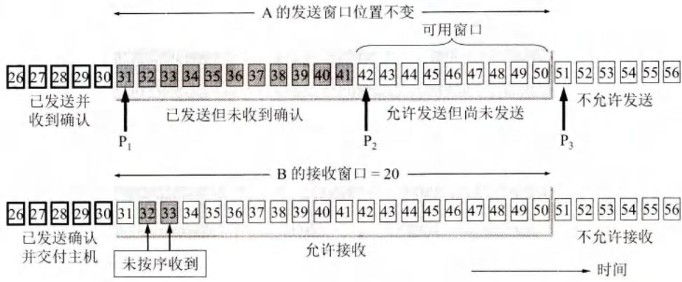
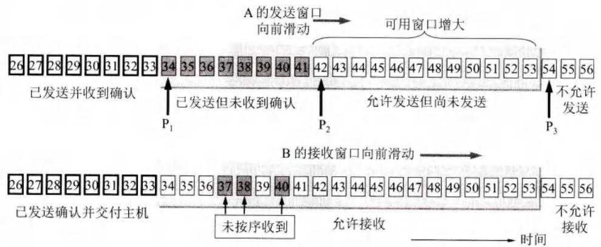
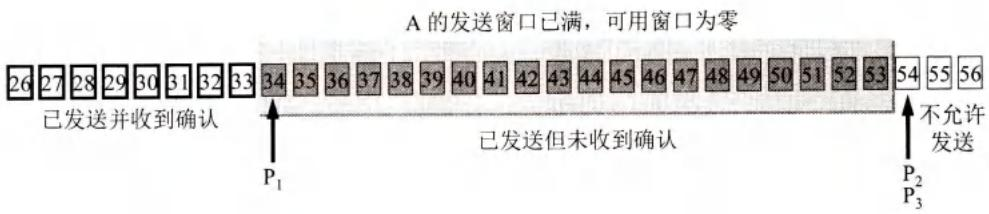
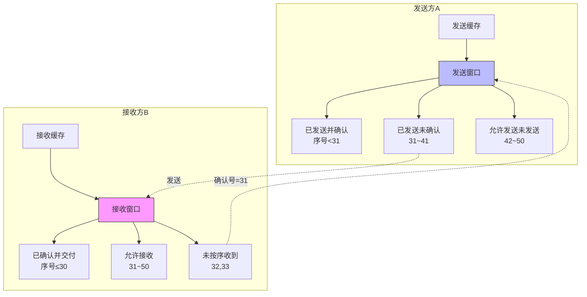
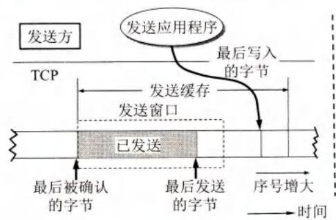
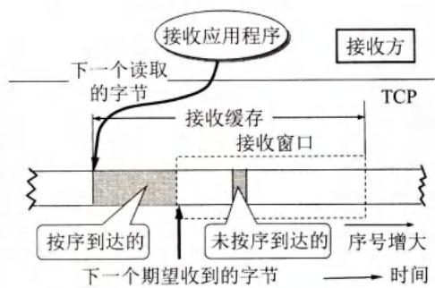
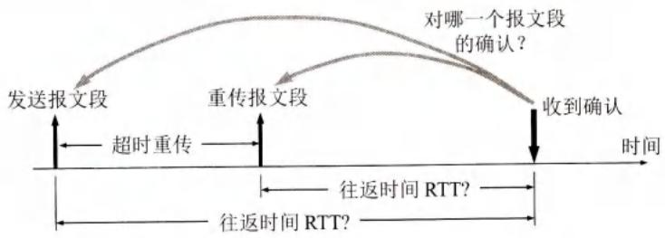
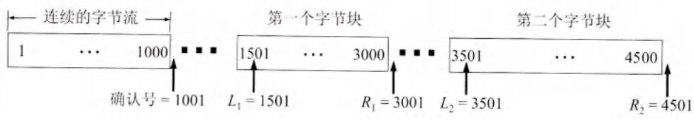

# TCP可靠传输的实现

## 基本信息
- **课程**：计算机网络（第8版）
- **章节**：第5章 5.6节 TCP可靠传输的实现
- **日期**：2026-04-11
- **标签**：#TCP #滑动窗口 #超时重传 #RTO #SACK #可靠传输

---

## 重点内容

### ⭐⭐⭐ 核心概念
1. **以字节为单位的滑动窗口** - TCP可靠传输的核心机制
2. **发送窗口的三个指针** - P₁、P₂、P₃
3. **超时重传时间RTO** - 自适应算法
4. **Karn算法** - 处理重传时的RTT测量问题
5. **选择确认SACK** - 只重传丢失的数据

### 📌 考试重点
- 滑动窗口的三个部分和三个指针
- 发送窗口与接收窗口的关系
- RTO的计算公式
- Karn算法的原理
- SACK的工作原理和限制

---

## 详细笔记

### 一、以字节为单位的滑动窗口 ⭐⭐⭐

#### 1. 基本概念

TCP的滑动窗口是**以字节为单位**的（不是以报文段为单位！）

**假设场景：**
- A收到B的确认报文段：窗口=20字节，确认号=31
- 这意味着：B期望收到序号31，已收到序号30为止的数据

#### 2. 发送窗口的三个部分

```
发送窗口 = 已发送但未确认 + 允许发送但未发送
```

**三个指针：**
- **P₁**：已发送并已收到确认的后沿
- **P₂**：已发送但未收到确认的前沿
- **P₃**：允许发送的前沿

**窗口计算：**
```
发送窗口 = P₃ - P₁ = 20字节（序号31~50）
已发送但未确认 = P₂ - P₁（序号31~41）
可用窗口 = P₃ - P₂（序号42~50）
```

#### 3. 窗口滑动过程

**初始状态（图5-14）：**
- 发送窗口：序号31~50（共20字节）
- 已发送并确认：序号<31
- 不允许发送：序号>50

**发送数据后（图5-15）：**



- A发送了序号31~41（11字节）
- 窗口位置未变
- 但窗口内状态变化：
  - 31~41：已发送但未收到确认（灰色）
  - 42~50：允许发送但尚未发送

**收到确认后（图5-16）：**



- B收到序号31，发送确认号=34
- A的发送窗口向前滑动3个序号
- 新的发送窗口：序号34~53
- 可用窗口增大

**窗口满时（图5-17）：**



- 发送窗口已满，可用窗口为0
- 必须停止发送，等待确认

#### 4. 发送窗口与接收窗口的关系



#### 5. 缓存与窗口的关系



**发送缓存存放：**
1. 发送应用程序准备发送的数据
2. TCP已发送但尚未收到确认的数据



**接收缓存存放：**
1. 按序到达但尚未被应用读取的数据
2. 未按序到达的数据

**重要原则：**
> 发送窗口通常只是发送缓存的一部分
> 接收窗口 ≤ 接收缓存大小

---

### 二、超时重传时间的选择 ⭐⭐⭐

#### 1. 问题的复杂性

**为什么复杂？**
- TCP下层是互联网环境
- 报文段可能经过不同速率的网络
- 每个IP数据报选择的路由可能不同

**设置原则：**
- 太短 → 不必要的重传，增加网络负荷
- 太长 → 网络空闲时间增大，降低效率

#### 2. 自适应算法

**RTT（往返时间）**：报文段发出时间到收到确认时间之差

**加权平均往返时间 RTTₛ：**

$$\text{新的 RTT}_S = (1 - \alpha) \times \text{旧的 RTT}_S + \alpha \times \text{新的 RTT 样本}$$

- RFC 6298推荐：α = 1/8 = 0.125

**RTT偏差加权平均值 RTTᴅ：**

$$\text{新的 RTT}_D = (1 - \beta) \times \text{旧的 RTT}_D + \beta \times |\text{RTT}_S - \text{新的 RTT 样本}|$$

- 推荐：β = 1/4 = 0.25

**超时重传时间 RTO：**

$$\text{RTO} = \text{RTT}_S + 4 \times \text{RTT}_D$$

#### 3. Karn算法

**问题（图5-19）：**



> 收到确认时，无法判断是对原报文段的确认还是对重传报文段的确认

**Karn算法：**
- 报文段重传了，就不采用其往返时间样本
- 每次重传，RTO增大为原来的2倍
- 不再重传时，才按公式计算RTO

---

### 三、选择确认 SACK ⭐⭐⭐

#### 1. 问题背景

**场景：**
- 收到的报文段无差错，但未按序号
- 中间缺少一些序号的数据
- **能否只重传缺少的数据？**

**答案：可以！** 使用选择确认（Selective ACK）

#### 2. SACK工作原理

**接收方（图5-20）：**



- 收到不连续的字节流，形成不连续的字节块
- 先收下这些数据，暂存于接收窗口
- 把边界信息告诉发送方

**字节块边界：**
- 每个字节块有两个边界：左边界和右边界
- 左边界 = 字节块的第一个字节序号
- 右边界 - 1 = 字节块的最后一个字节序号

**SACK选项限制：**
- 选项长度最多40字节
- 一个边界需4字节（32位序号）
- 最多报告4个字节块（8个边界 = 32字节）
- 还需2字节：选项类型 + 选项长度

#### 3. SACK使用条件

1. 建立TCP连接时，双方协商"允许SACK"
2. 确认号字段用法不变
3. 增加SACK选项报告不连续字节块边界

**注意：** SACK文档未指明发送方如何响应，大多数实现还是重传所有未被确认的数据块。

---

## 四、核心要点总结

### ⭐⭐⭐ 关键公式

```
发送窗口 = P₃ - P₁
已发送但未确认 = P₂ - P₁
可用窗口 = P₃ - P₂

新的 RTTₛ = (1-α) × 旧RTTₛ + α × 新RTT样本
RTO = RTTₛ + 4 × RTTᴅ
```

### ⭐⭐⭐ 关键概念

| 概念 | 说明 |
|------|------|
| **发送窗口** | 允许连续发送的字节范围 |
| **接收窗口** | 允许接收的字节范围 |
| **可用窗口** | 允许发送但尚未发送的字节数 |
| **累积确认** | 对按序到达的最高序号确认 |
| **RTO** | 超时重传时间 |
| **SACK** | 选择确认，只重传丢失的数据 |

### 📌 考试重点

1. **滑动窗口的三个指针**（P₁、P₂、P₃）
2. **发送窗口与接收窗口的关系**
3. **超时重传时间的自适应算法**
4. **Karn算法的作用**
5. **SACK的工作原理和限制**

---

## 疑问与思考

### ❓ 待解决问题
1. 为什么TCP选择以字节为单位而不是以报文段为单位？
2. 发送窗口前沿向后收缩会产生什么问题？
3. SACK在实际应用中的普及程度如何？

### 💡 个人理解
- 以字节为单位的滑动窗口提供了更精细的流量控制
- 三个指针的设计使得窗口状态描述非常清晰
- Karn算法巧妙解决了重传时的RTT测量难题
- SACK虽然理论上很好，但实际实现复杂，普及度有限

---

## 相关链接

- 上一节：[第5章-5.5-TCP报文段的首部格式](./第5章-5.5-TCP报文段的首部格式.md)
- 下一节：5.7 TCP的流量控制
- 课本出处：第5章 5.6节，图5-14至图5-20
- RFC文档：RFC 6298 (RTO计算)、RFC 2018 (SACK)

---

## 插图说明

| 图号 | 内容 | 说明 |
|------|------|------|
| 图5-14 | 发送窗口构造 | 根据B的窗口值构造发送窗口 |
| 图5-15 | 发送数据后 | 已发送但未确认的状态 |
| 图5-16 | 窗口滑动 | 收到确认后窗口向前滑动 |
| 图5-17 | 窗口满 | 可用窗口为0，停止发送 |
| 图5-18 | 缓存与窗口 | 发送缓存和接收缓存的关系 |
| 图5-19 | RTT测量问题 | 无法判断确认对应哪个报文段 |
| 图5-20 | SACK | 不连续字节块的边界标记 |
