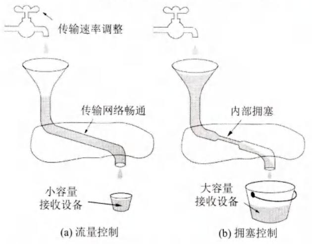
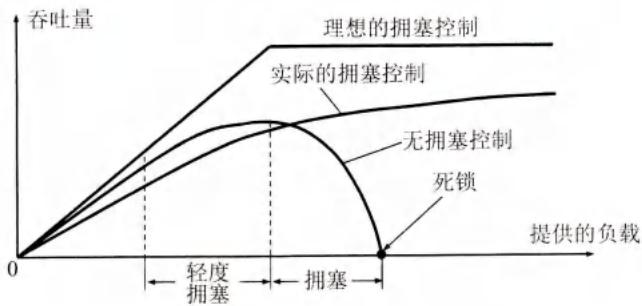
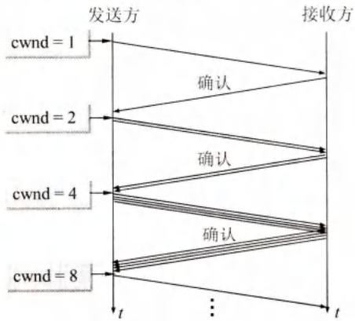
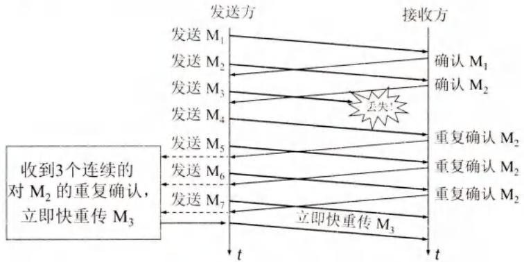
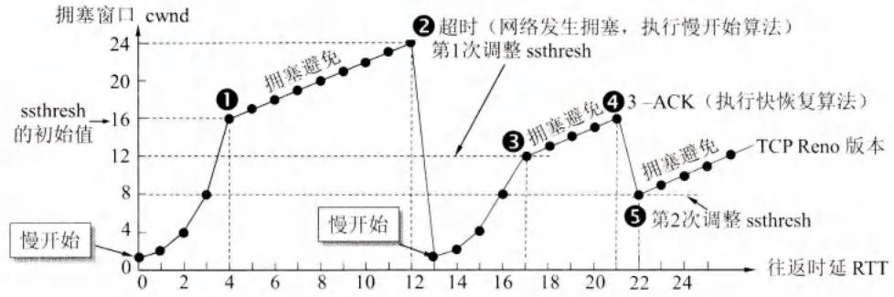

# TCP的拥塞控制

## 基本信息
- **课程**：计算机网络（第8版）
- **章节**：第5章 5.8节 TCP的拥塞控制
- **日期**：2026-04-11
- **标签**：#TCP #拥塞控制 #慢开始 #拥塞避免 #快重传 #快恢复 #AIMD

---

## 重点内容

### ⭐⭐⭐ 核心概念
1. **拥塞的定义** - 对资源的需求超过可用资源
2. **拥塞窗口 cwnd** - 发送方维持的状态变量
3. **慢开始门限 ssthresh** - 慢开始和拥塞避免的分界点
4. **四种算法** - 慢开始、拥塞避免、快重传、快恢复
5. **AIMD算法** - 加法增大、乘法减小
6. **发送窗口上限** - Min[rwnd, cwnd]

### 📌 考试重点
- 拥塞控制与流量控制的区别
- 慢开始算法的指数增长规律
- 拥塞避免的线性增长规律
- 超时和3个重复ACK的不同处理
- AIMD算法的含义
- 快重传和快恢复的工作原理

---

## 详细笔记

### 一、拥塞控制的一般原理 ⭐⭐⭐

#### 1. 什么是拥塞？

> **拥塞（Congestion）**：在某段时间，若对网络中某一资源的需求超过了该资源所能提供的可用部分，网络的性能就要变坏。

**拥塞条件：**

$$\sum \text{对资源的需求} > \text{可用资源}$$

#### 2. 拥塞控制 vs 流量控制



| 对比项 | **流量控制** | **拥塞控制** |
|--------|-------------|-------------|
| **控制对象** | 发送方 vs 接收方 | 发送方 vs 网络 |
| **范围** | 端到端（点对点） | 全局性（整个网络） |
| **目的** | 防止接收方缓存溢出 | 防止网络资源过载 |
| **手段** | 接收窗口 rwnd | 拥塞窗口 cwnd |
| **信息来源** | 接收方反馈 | 发送方超时判断 |

**比喻说明：**
- **流量控制**：水桶太小，来不及接收（接收方限制）
- **拥塞控制**：管道狭窄，水流堵塞（网络限制）

#### 3. 拥塞控制的作用



**三种情况：**
1. **理想的拥塞控制**：吞吐量等于提供的负载，直到饱和
2. **实际的拥塞控制**：吞吐量增长速率逐渐减小
3. **无拥塞控制**：吞吐量先增后降，最终死锁

**拥塞状态：**
- 轻度拥塞：吞吐量明显小于理想吞吐量
- 拥塞：吞吐量随负载增大而下降
- 死锁：吞吐量下降到零

---

### 二、TCP的拥塞控制方法 ⭐⭐⭐

#### 1. 核心概念

**拥塞窗口 cwnd (congestion window)：**
- 发送方维持的状态变量
- 大小取决于网络的拥塞程度
- 动态变化

**慢开始门限 ssthresh (slow-start threshold)：**
- 防止拥塞窗口增长过大
- 初始值可设为发送窗口最大容许值

**发送方窗口上限：**

$$\text{发送方窗口的上限值} = \text{Min}[\text{rwnd}, \text{cwnd}]$$

#### 2. 慢开始算法 (Slow Start)

**思路：**
- 由小到大逐渐增大注入到网络的数据字节
- 试探网络负荷情况

**初始拥塞窗口（RFC 5681）：**

| SMSS大小 | 初始cwnd |
|---------|---------|
| SMSS > 2190字节 | min(2×SMSS, 2个报文段) |
| 1095 < SMSS ≤ 2190字节 | min(3×SMSS, 3个报文段) |
| SMSS ≤ 1095字节 | min(4×SMSS, 4个报文段) |

**增长规律：**
- 每收到一个对新报文段的确认，cwnd加1
- 每经过一个RTT，cwnd加倍
- **指数增长**



**示例：**
```
RTT 0: cwnd = 1  （发送1个报文段）
RTT 1: cwnd = 2  （收到1个确认，加1）
RTT 2: cwnd = 4  （收到2个确认，加2）
RTT 3: cwnd = 8  （收到4个确认，加4）
...
```

#### 3. 拥塞避免算法 (Congestion Avoidance)

**触发条件：**
- 当 cwnd ≥ ssthresh 时，改用拥塞避免算法

**增长规律：**
- 每经过一个RTT，cwnd加1
- **线性增长**（加法增大 AI）

**注意：**
> "拥塞避免"并非完全避免拥塞，而是让拥塞窗口增长得缓慢些，使网络不容易出现拥塞。

#### 4. 快重传算法 (Fast Retransmit)

**问题：**
- 个别报文段丢失，但网络并未拥塞
- 发送方超时，误认为网络拥塞
- 错误地启动慢开始，降低传输效率

**解决方案：**
- 接收方立即发送确认（不等待捎带）
- 收到失序报文段也立即发出重复确认
- 发送方收到**3个重复确认**，立即重传



**快重传过程：**
1. 接收方收到M₁、M₂，发送确认
2. 接收方未收到M₃，但收到M₄
3. 接收方立即发送对M₂的重复确认
4. 接收方收到M₅、M₆，继续发送对M₂的重复确认
5. 发送方收到3个对M₂的重复确认
6. 发送方立即重传M₃（快重传）

**效果：** 使整个网络吞吐量提高约20%

#### 5. 快恢复算法 (Fast Recovery)

**触发条件：**
- 收到3个重复确认（不是超时）

**处理步骤：**
1. 调整门限值：ssthresh = cwnd / 2
2. 设置拥塞窗口：cwnd = ssthresh
3. 执行拥塞避免算法

**与超时的区别：**

| 事件 | ssthresh | cwnd | 后续算法 |
|------|---------|------|---------|
| **超时** | cwnd / 2 | 1 | 慢开始 |
| **3个重复ACK** | cwnd / 2 | ssthresh | 拥塞避免 |

#### 6. 拥塞控制完整流程



**流程说明：**
1. **初始**：cwnd = 1，ssthresh = 16
2. **慢开始阶段**（点①前）：cwnd指数增长，每RTT加倍
3. **点①**：cwnd = 16 = ssthresh，改用拥塞避免
4. **拥塞避免阶段**（点①到点②）：cwnd线性增长，每RTT加1
5. **点②**：超时，网络拥塞
   - ssthresh = cwnd / 2 = 12
   - cwnd = 1，执行慢开始
6. **点③**：cwnd = 12 = ssthresh，改用拥塞避免
7. **拥塞避免阶段**（点③到点④）：cwnd线性增长
8. **点④**：收到3个重复ACK
   - ssthresh = cwnd / 2 = 8
   - cwnd = 8，执行拥塞避免
9. **拥塞避免阶段**（点④后）：cwnd线性增长

---

### 三、AIMD算法 ⭐⭐⭐

**加法增大（Additive Increase）：**
- 在拥塞避免阶段，每经过一个RTT，cwnd加1
- 窗口缓慢增大

**乘法减小（Multiplicative Decrease）：**
- 出现超时或3个重复ACK
- ssthresh = cwnd / 2
- cwnd减小一半或重置为1

**AIMD = AI + MD**

---

### 四、主动队列管理 AQM

#### 1. 尾部丢弃策略的问题

**FIFO队列：**
- 队列满时，所有新到达的分组都被丢弃

**问题：**
- 一连串分组丢失
- 多个TCP连接同时进入慢开始
- **全局同步（Global Synchronization）**
- 通信量突然下降，之后又突然增大

#### 2. RED（随机早期检测）

**原理：**
- 不要等到队列满时才丢弃
- 在队列长度达到警戒值时，主动丢弃分组
- 提醒发送方放慢发送速率

**算法步骤：**
1. 计算平均队列长度
2. 若平均队列长度 < 最小门限 → 入队
3. 若平均队列长度 > 最大门限 → 丢弃
4. 若在两者之间 → 按概率p丢弃

---

## 五、核心要点总结

### ⭐⭐⭐ 关键公式

```
拥塞窗口 cwnd 每次的增加量 = min(N, SMSS)

ssthresh = cwnd / 2

发送方窗口的上限值 = Min[rwnd, cwnd]
```

### ⭐⭐⭐ 四种算法总结

| 算法 | 触发条件 | cwnd变化 | ssthresh变化 | 后续状态 |
|------|---------|---------|-------------|---------|
| **慢开始** | cwnd < ssthresh | 每RTT加倍 | 不变 | 指数增长 |
| **拥塞避免** | cwnd ≥ ssthresh | 每RTT加1 | 不变 | 线性增长 |
| **快重传** | 收到3个重复ACK | 不变 | cwnd/2 | 快恢复 |
| **快恢复** | 快重传后 | = ssthresh | 不变 | 拥塞避免 |

### ⭐⭐⭐ 拥塞控制流程图

```
开始
  ↓
cwnd = 1, ssthresh = 16
  ↓
cwnd < ssthresh? ──是──→ 慢开始（指数增长）
  ↓ 否
拥塞避免（线性增长）
  ↓
超时？ ──是──→ ssthresh = cwnd/2, cwnd = 1
  ↓ 否              ↓
3个ACK? ──是──→ ssthresh = cwnd/2, cwnd = ssthresh
  ↓ 否
继续拥塞避免
```

### 📌 考试重点

1. **拥塞控制与流量控制的区别**
2. **慢开始算法的指数增长规律**
3. **拥塞避免的线性增长规律**
4. **超时和3个重复ACK的不同处理**
5. **AIMD算法的含义**
6. **快重传和快恢复的工作原理**

---

## 疑问与思考

### ❓ 待解决问题
1. 为什么慢开始一开始要设置cwnd = 1？
2. 快恢复算法中cwnd为什么要+3？
3. RED为什么不再推荐使用？

### 💡 个人理解
- 慢开始的"慢"不是增长慢，而是从小开始试探
- 超时是最严重的拥塞表现，需要彻底重启
- 3个重复ACK说明只是个别报文段丢失，网络并未崩溃
- AIMD设计巧妙，实现了网络的公平性和稳定性

---

## 相关链接

- 上一节：[第5章-5.7-TCP的流量控制](./第5章-5.7-TCP的流量控制.md)
- 下一节：5.9 TCP的运输连接管理
- 课本出处：第5章 5.8节，图5-22至图5-27
- RFC文档：RFC 5681 (TCP拥塞控制)、RFC 2309 (RED)

---

## 插图说明

| 图号 | 内容 | 说明 |
|------|------|------|
| 图5-22 | 流量控制和拥塞控制的比喻 | 水龙头与水桶的比喻 |
| 图5-23 | 拥塞控制所起的作用 | 理想vs实际的吞吐量曲线 |
| 图5-24 | 慢开始算法 | cwnd指数增长 |
| 图5-25 | 拥塞窗口变化 | 完整的拥塞控制过程 |
| 图5-26 | 快重传示意 | 3个重复ACK触发重传 |
| 图5-27 | 拥塞控制流程图 | 完整的控制流程 |
