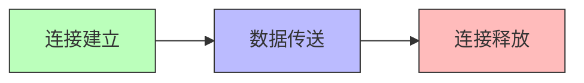

# TCP的运输连接管理

## 基本信息

- **课程**：计算机网络（第8版）
- **章节**：第5章 5.9节 TCP的运输连接管理
- **日期**：2026-04-11
- **标签**：#TCP #连接建立 #连接释放 #三次握手 #四次挥手 #状态机

***

## 重点内容

### ⭐⭐⭐ 核心概念

1. **TCP连接的三个阶段** - 连接建立、数据传送、连接释放
2. **三报文握手** - TCP连接建立过程
3. **四报文握手** - TCP连接释放过程
4. **TIME-WAIT状态** - 等待2MSL的原因
5. **TCP有限状态机** - 11种状态及转换

### 📌 考试重点

- 三次握手的详细过程（序号、确认号变化）
- 为什么需要三次握手（防止已失效连接请求）
- 四次挥手的详细过程
- TIME-WAIT状态的作用（2MSL）
- 保活计时器的作用

***

## 详细笔记

### 一、TCP连接概述 ⭐⭐⭐

#### 1. TCP连接的三个阶段



#### 2. 连接建立要解决的三个问题

1. **使每一方能够确知对方的存在**
2. **允许双方协商一些参数**（最大窗口值、窗口扩大选项、时间戳选项、服务质量等）
3. **能够对运输实体资源进行分配**（缓存大小、连接表中的项目等）

#### 3. 客户-服务器方式

- **客户（Client）**：主动发起连接建立的应用进程
- **服务器（Server）**：被动等待连接建立的应用进程

***

### 二、TCP的连接建立（三报文握手）⭐⭐⭐


#### 握手过程详解

**初始状态：**

- A（客户）：CLOSED
- B（服务器）：CLOSED → 创建TCB → LISTEN

**第一次握手（SYN）：**

- A向B发送连接请求报文段
- **SYN = 1**，**seq = x**（初始序号）
- 不能携带数据，但要消耗一个序号
- A进入 **SYN-SENT**（同步已发送）状态

**第二次握手（SYN + ACK）：**

- B收到请求，如同意建立连接，向A发送确认
- **SYN = 1**，**ACK = 1**
- **seq = y**（B的初始序号）
- **ack = x + 1**（确认收到A的SYN）
- 不能携带数据，但要消耗一个序号
- B进入 **SYN-RCVD**（同步收到）状态

**第三次握手（ACK）：**

- A收到B的确认后，向B给出确认
- **ACK = 1**
- **seq = x + 1**
- **ack = y + 1**（确认收到B的SYN）
- 可以携带数据，如果不携带数据则不消耗序号
- A进入 **ESTABLISHED**（已建立连接）状态
- B收到A的确认后也进入 **ESTABLISHED** 状态

#### 为什么需要三次握手？

**防止已失效的连接请求报文段突然又传送到B，产生错误。**

**异常场景：**

1. A发出第一个连接请求，但在网络中长时间滞留
2. A重传连接请求，建立连接，传输数据，释放连接
3. 第一个连接请求在连接释放后才到达B
4. B误认为是新的连接请求，发送确认
5. **如果没有第三次握手：** B发出确认后连接就建立了，但A不会理睬，B的资源被浪费
6. **有了第三次握手：** A不会向B的确认发出确认，B收不到确认，就知道A没有要求建立连接

***

### 三、TCP的连接释放（四报文握手）⭐⭐⭐


#### 释放过程详解

**初始状态：** A和B都处于 **ESTABLISHED** 状态

**第一次挥手（FIN）：**

- A的应用进程通知TCP释放连接
- A发送连接释放报文段
- **FIN = 1**，**seq = u**（前面已传送数据的最后一个字节序号+1）
- 即使不携带数据，也消耗一个序号
- A进入 **FIN-WAIT-1**（终止等待1）状态

**第二次挥手（ACK）：**

- B收到释放报文段后发出确认
- **ACK = 1**，**seq = v**，**ack = u + 1**
- B进入 **CLOSE-WAIT**（关闭等待）状态
- **半关闭状态**：A到B方向的连接释放，但B到A方向的连接未关闭
- A收到确认后进入 **FIN-WAIT-2**（终止等待2）状态

**第三次挥手（FIN + ACK）：**

- B如果没有数据要发送，应用进程通知TCP释放连接
- B发送连接释放报文段
- **FIN = 1**，**ACK = 1**，**seq = w**，**ack = u + 1**
- B进入 **LAST-ACK**（最后确认）状态

**第四次挥手（ACK）：**

- A收到B的连接释放报文段后发出确认
- **ACK = 1**，**seq = u + 1**，**ack = w + 1**
- A进入 **TIME-WAIT**（时间等待）状态
- B收到确认后进入 **CLOSED** 状态

#### TIME-WAIT状态（2MSL）⭐⭐⭐

**MSL（Maximum Segment Lifetime）**：最长报文段寿命，RFC 793建议为2分钟

**A在TIME-WAIT状态必须等待2MSL的原因：**

1. **保证A发送的最后一个ACK报文段能够到达B**
   - 如果ACK丢失，B会超时重传FIN + ACK
   - A在2MSL时间内收到重传的FIN + ACK
   - A重传ACK，重新启动2MSL计时器
   - 最后A和B都正常进入CLOSED状态
2. **防止已失效的连接请求报文段出现在本连接中**
   - 经过2MSL，本连接持续时间内产生的所有报文段都从网络中消失
   - 下一个新连接中不会出现旧的连接请求报文段

**注意：** B结束TCP连接的时间比A早一些

***

### 四、保活计时器（Keepalive Timer）

**场景：** 客户与服务器建立TCP连接后，客户端主机突然出故障

**机制：**

- 服务器每收到一次客户数据，重新设置保活计时器（通常2小时）
- 若2小时没有收到客户数据，发送探测报文段
- 以后每隔75秒发送一次探测报文段
- 若一连发送10个探测报文段后仍无响应，关闭连接

***

### 五、TCP的有限状态机 ⭐⭐⭐


#### 11种状态

| 状态              | 英文    | 说明                   |
| --------------- | ----- | -------------------- |
| **CLOSED**      | 关闭    | 没有连接                 |
| **LISTEN**      | 收听    | 等待连接请求               |
| **SYN-SENT**    | 同步已发送 | 已发送SYN，等待确认          |
| **SYN-RCVD**    | 同步收到  | 收到SYN，发送SYN+ACK，等待确认 |
| **ESTABLISHED** | 已建立   | 连接已建立，可以传送数据         |
| **FIN-WAIT-1**  | 终止等待1 | 已发送FIN，等待确认          |
| **FIN-WAIT-2**  | 终止等待2 | 收到ACK，等待对方的FIN       |
| **CLOSE-WAIT**  | 关闭等待  | 收到FIN，发送ACK，等待应用关闭   |
| **CLOSING**     | 关闭中   | 同时关闭                 |
| **LAST-ACK**    | 最后确认  | 已发送FIN，等待最后的ACK      |
| **TIME-WAIT**   | 时间等待  | 等待2MSL               |

#### 状态转换说明

- **粗实线箭头**：客户进程的正常变迁
- **粗虚线箭头**：服务器进程的正常变迁
- **细线箭头**：异常变迁

***

## 六、核心要点总结

### ⭐⭐⭐ 三次握手 vs 四次挥手

| 对比       | **三次握手（建立连接）** | **四次挥手（释放连接）**       |
| -------- | -------------- | -------------------- |
| **目的**   | 建立连接，同步序号      | 释放连接，关闭双向通道          |
| **报文段数** | 3个             | 4个                   |
| **控制位**  | SYN, ACK       | FIN, ACK             |
| **特殊情况** | 第二次可拆成两个       | 第二次和第三次不能合并（可能有数据传输） |

### ⭐⭐⭐ 关键序号和确认号变化

**三次握手：**

```
A → B: SYN=1, seq=x
B → A: SYN=1, ACK=1, seq=y, ack=x+1
A → B: ACK=1, seq=x+1, ack=y+1
```

**四次挥手：**

```
A → B: FIN=1, seq=u
B → A: ACK=1, seq=v, ack=u+1
B → A: FIN=1, ACK=1, seq=w, ack=u+1
A → B: ACK=1, seq=u+1, ack=w+1
```

### 📌 考试重点

1. **三次握手的详细过程**（序号、确认号变化）
2. **为什么需要三次握手**（防止已失效连接请求）
3. **四次挥手的详细过程**
4. **TIME-WAIT状态的作用**（2MSL）
5. **保活计时器的作用**

***

## 疑问与思考

### ❓ 待解决问题

1. 为什么连接建立是三次握手，而释放是四次挥手？
2. 如果第三次握手丢失会怎样？
3. TIME-WAIT状态等待2MSL是否可以缩短？

### 💡 个人理解

- 三次握手是为了防止已失效的连接请求造成错误
- 四次挥手是因为TCP是全双工的，需要分别关闭两个方向的连接
- TIME-WAIT的2MSL是为了确保最后的ACK能被对方收到，并清除旧连接的报文段
- 有限状态机清晰地展示了TCP连接的各种状态和转换条件

***

## 相关链接

- 上一节：[第5章-5.8-TCP的拥塞控制](./第5章-5.8-TCP的拥塞控制.md)
- 本章总结：第5章 运输层重要概念
- 课本出处：第5章 5.9节，图5-28至图5-30
- RFC文档：RFC 793 (TCP)

***

## 插图说明

| 图号    | 内容            | 说明          |
| ----- | ------------- | ----------- |
| 图5-28 | 用三报文握手建立TCP连接 | 三次握手过程及状态变化 |
| 图5-29 | TCP连接释放的过程    | 四次挥手过程及状态变化 |
| 图5-30 | TCP的有限状态机     | 11种状态及转换关系  |

