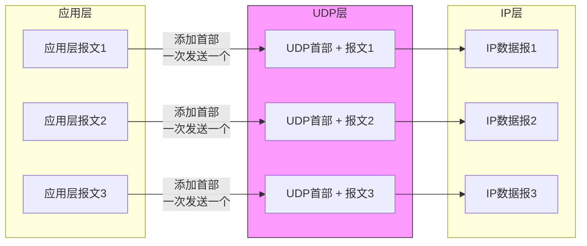
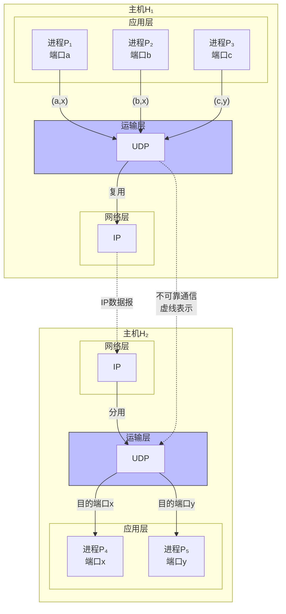
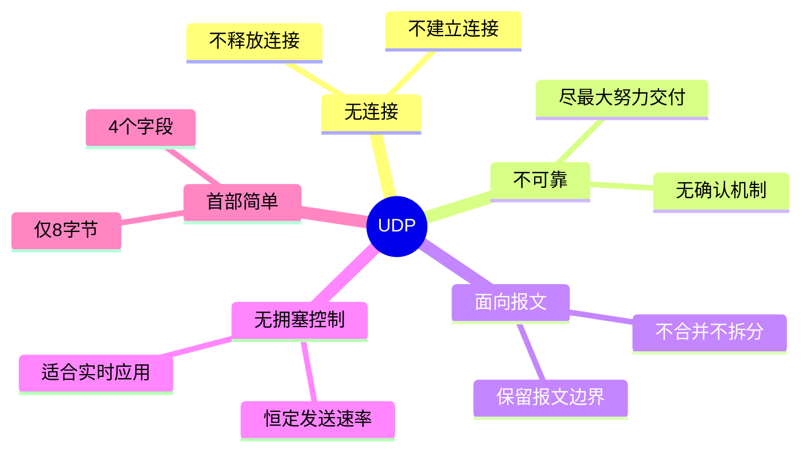

# 第5章 用户数据报协议 UDP（5.2）

## 基本信息

- **课程**：计算机网络
- **章节**：第5章 运输层 - 5.2 用户数据报协议 UDP
- **日期**：2026-04-02
- **标签**：#UDP #无连接 #不可靠传输 #面向报文 #端口

***

## 重点内容

### UDP的主要特点

> 📌 **UDP只在IP的数据报服务之上增加了很少的功能**

1. **复用和分用**的功能
2. **差错检测**的功能

### UDP特点总结

| 特点         | 说明              |
| ---------- | --------------- |
| **无连接**    | 发送数据前不需要建立连接    |
| **不可靠**    | 尽最大努力交付，不保证可靠   |
| **面向报文**   | 保留应用层报文边界       |
| **无拥塞控制**  | 网络拥塞不会降低发送速率    |
| **支持多种通信** | 一对一、一对多、多对一、多对多 |
| **首部开销小**  | 仅8字节            |

***

## 详细笔记

### 5.2.1 UDP概述

#### UDP的6个主要特点

**1. UDP是无连接的**

- 发送数据之前**不需要建立连接**
- 发送数据结束时也**没有连接可释放**
- 减少了开销和发送数据之前的时延

**2. UDP使用尽最大努力交付**

- **不保证可靠交付**
- 主机**不需要维持复杂的连接状态表**
- 适合对实时性要求高、可容忍少量丢失的应用

**3. UDP是面向报文的**




**关键点**：

- 发送方UDP对应用层报文**既不合并，也不拆分**
- **保留报文边界**：应用层交给UDP多长的报文，UDP就照样发送
- 一次发送**一个完整的报文**
- 接收方UDP去除首部后**原封不动**交付上层

**应用程序需要注意报文大小**：

- 报文太长 → IP层需要分片 → 降低IP层效率
- 报文太短 → IP首部相对长度太大 → 降低IP层效率

**4. UDP没有拥塞控制**

- 网络出现拥塞**不会使源主机的发送速率降低**
- 适合**实时应用**：
  - IP电话
  - 实时视频会议
  - 流媒体传输

> 💡 **实时应用的特点**：要求恒定速率发送，允许丢失一些数据，但不允许太大时延

**⚠️ 注意**：虽然UDP没有拥塞控制，但当很多源主机同时发送高速率实时视频流时，网络可能发生严重拥塞。

**改进措施**：应用进程本身可以增加提高可靠性的措施，如：

- 前向纠错
- 重传已丢失的报文（在不影响实时性的前提下）

**5. UDP支持多种交互通信**

- **一对一**
- **一对多**（多播）
- **多对一**
- **多对多**

**6. UDP首部开销小**

- UDP首部：**8字节**
- TCP首部：**20字节**

#### UDP通信和端口号的关系




**通信关系示例**：

- P₁ → P₄（端口a → 端口x）
- P₂ → P₄（端口b → 端口x）【多对一】
- P₃ → P₅（端口c → 端口y）

**复用功能**：多个应用进程通过各自的端口传送到运输层后，共用一个网络层协议

**分用功能**：接收方根据首部中的**目的端口号**，分别传送到相应端口

***

### 5.2.2 UDP的首部格式

#### UDP用户数据报结构


```
 0                   1                   2                   3
 0 1 2 3 4 5 6 7 8 9 0 1 2 3 4 5 6 7 8 9 0 1 2 3 4 5 6 7 8 9 0 1
+-+-+-+-+-+-+-+-+-+-+-+-+-+-+-+-+-+-+-+-+-+-+-+-+-+-+-+-+-+-+-+-+
|          源端口 (16位)          |          目的端口 (16位)         |
+-+-+-+-+-+-+-+-+-+-+-+-+-+-+-+-+-+-+-+-+-+-+-+-+-+-+-+-+-+-+-+-+
|          长度 (16位)            |          检验和 (16位)          |
+-+-+-+-+-+-+-+-+-+-+-+-+-+-+-+-+-+-+-+-+-+-+-+-+-+-+-+-+-+-+-+-+
|                             数据                               |
+-+-+-+-+-+-+-+-+-+-+-+-+-+-+-+-+-+-+-+-+-+-+-+-+-+-+-+-+-+-+-+-+
```

**首部共8字节，4个字段，每个字段2字节**

#### 首部各字段说明

| 字段       | 长度  | 说明                          |
| -------- | --- | --------------------------- |
| **源端口**  | 2字节 | 源端口号，需要对方回信时选用，不需要时可用全0     |
| **目的端口** | 2字节 | 目的端口号，**终点交付报文时必须使用**       |
| **长度**   | 2字节 | UDP用户数据报的长度，**最小值是8**（仅有首部） |
| **检验和**  | 2字节 | 检测UDP用户数据报在传输中是否有错，有错就丢弃    |

#### 伪首部与检验和计算


```
 0                   1                   2                   3
 0 1 2 3 4 5 6 7 8 9 0 1 2 3 4 5 6 7 8 9 0 1 2 3 4 5 6 7 8 9 0 1
+-+-+-+-+-+-+-+-+-+-+-+-+-+-+-+-+-+-+-+-+-+-+-+-+-+-+-+-+-+-+-+-+
|                    源IP地址 (32位)                             |
+-+-+-+-+-+-+-+-+-+-+-+-+-+-+-+-+-+-+-+-+-+-+-+-+-+-+-+-+-+-+-+-+
|                    目的IP地址 (32位)                           |
+-+-+-+-+-+-+-+-+-+-+-+-+-+-+-+-+-+-+-+-+-+-+-+-+-+-+-+-+-+-+-+-+
|   零 (8位)   |  协议 (8位)   |         UDP长度 (16位)          |
+-+-+-+-+-+-+-+-+-+-+-+-+-+-+-+-+-+-+-+-+-+-+-+-+-+-+-+-+-+-+-+-+
|          源端口 (16位)          |          目的端口 (16位)         |
+-+-+-+-+-+-+-+-+-+-+-+-+-+-+-+-+-+-+-+-+-+-+-+-+-+-+-+-+-+-+-+-+
|          长度 (16位)            |          检验和 (16位)          |
+-+-+-+-+-+-+-+-+-+-+-+-+-+-+-+-+-+-+-+-+-+-+-+-+-+-+-+-+-+-+-+-+
|                             数据                               |
+-+-+-+-+-+-+-+-+-+-+-+-+-+-+-+-+-+-+-+-+-+-+-+-+-+-+-+-+-+-+-+-+

                    ↑ 伪首部（12字节，仅用于计算检验和）
                    ↑ UDP首部（8字节）
                    ↑ 数据
```

**伪首部的作用**：

- 仅用于计算检验和
- 不向下传送，也不向上递交
- 包含IP地址信息，确保数据报送到正确的主机

#### IP首部 vs 伪首部 对比

| 特性 | **IP首部** | **伪首部** |
|------|-----------|-----------|
| **所属层次** | 网络层 | 运输层（计算检验和时临时使用） |
| **实际传输** | ✅ 真正随数据报传输 | ❌ 不传输，仅用于计算 |
| **主要功能** | IP路由、分片、寻址 | 检验和计算时验证IP地址 |
| **存在位置** | IP数据报的前部 | UDP/TCP检验和计算时临时添加 |
| **字段内容** | 版本、首部长度、TTL、协议等 | 源IP、目的IP、0、协议、长度 |

**检验和计算步骤**：

1. 发送方：将首部和数据一起计算检验和，填入检验和字段
2. 接收方：重新计算检验和，与收到的检验和比较
3. 不一致则丢弃该数据报

***

## 疑问与思考

❓ **疑问**：为什么UDP要保留报文边界？有什么优缺点？

💡 **解答**：

- **优点**：
  - 应用程序可以精确控制每个报文的发送
  - 接收方知道报文的精确边界
  - 适合需要报文完整性的应用（如DNS）
- **缺点**：
  - 报文大小受限制（最大65507字节）
  - 报文太长需要IP分片，降低效率
  - 报文太短则首部开销比例大

❓ **疑问**：UDP没有拥塞控制，为什么实时应用喜欢用它？

💡 **解答**：

- 实时应用要求**恒定速率**发送
- TCP的拥塞控制会在网络拥塞时降低速率，导致**时延抖动**
- 实时应用可以容忍少量丢失，但不能容忍**太大时延**
- UDP简单快速，没有连接建立和释放的开销

❓ **疑问**：UDP检验和是可选的吗？

💡 **解答**：

- 源主机可以**不计算检验和**（将检验和字段置为全0）
- 但建议**总是使用检验和**，因为IP的检验和不检查数据部分
- 如果检验和计算结果为全0，则写入全1（即65535）

***

## 总结

### UDP核心特点



### UDP首部格式（8字节）

| 字段   | 长度  | 作用          |
| ---- | --- | ----------- |
| 源端口  | 16位 | 标识发送方进程     |
| 目的端口 | 16位 | 标识接收方进程（必须） |
| 长度   | 16位 | UDP数据报总长度   |
| 检验和  | 16位 | 差错检测        |

### 适用场景

✅ **适合使用UDP的应用**：

- DNS（域名解析）
- 实时视频/音频（IP电话、视频会议）
- 简单文件传输（TFTP）
- 网络管理（SNMP）
- 路由协议（RIP）

❌ **不适合使用UDP的应用**：

- 需要可靠传输的文件传输
- 网页浏览（HTTP）
- 电子邮件（SMTP）

***

## 相关链接

- 上一节：5.1 运输层协议概述
- 下一节：5.3 传输控制协议 TCP概述
- 对比学习：UDP vs TCP
- 实验：使用Wireshark抓包分析UDP数据报

