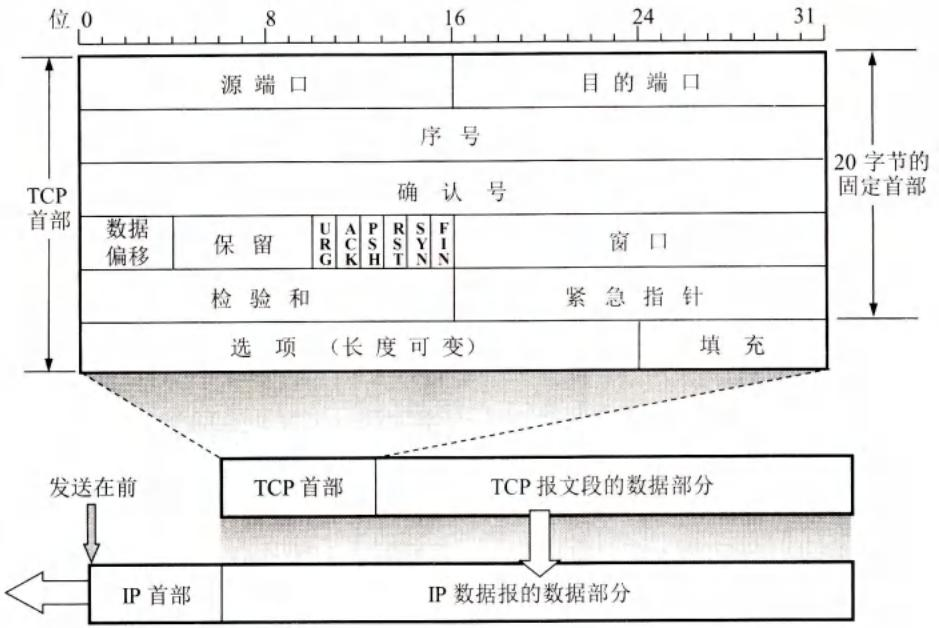
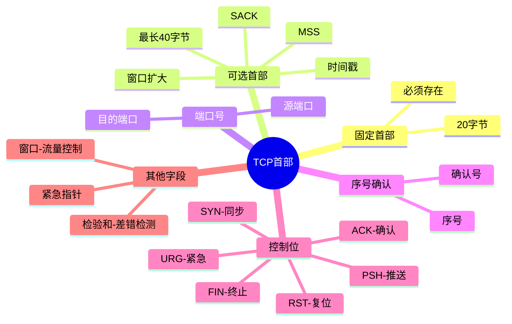

# TCP报文段的首部格式

## 基本信息
- **课程**：计算机网络（第8版）
- **章节**：第5章 5.5节 TCP报文段的首部格式
- **日期**：2026-04-11
- **标签**：#TCP #首部格式 #控制位 #序号 #确认号 #窗口

---

## 重点内容

### ⭐⭐⭐ 核心概念
1. **TCP首部结构** - 固定20字节 + 可选40字节选项
2. **序号和确认号** - TCP可靠传输的基础
3. **六个控制位** - URG、ACK、PSH、RST、SYN、FIN
4. **窗口字段** - 流量控制的关键
5. **选项字段** - MSS、窗口扩大、时间戳、SACK

### 📌 考试重点
- 序号和确认号的计算关系
- 六个控制位的含义和使用场景（特别是ACK、SYN、FIN）
- 窗口字段的作用
- 数据偏移字段的含义
- MSS的定义和作用

---

## 详细笔记

### 一、TCP首部概述

> 📌 **TCP的全部功能都体现在它首部中各字段的作用**

**首部结构：**
- **固定部分**：前20字节（必须存在）
- **可选部分**：4n字节（n为整数，最大40字节）
- **最小长度**：20字节
- **最大长度**：60字节（20+40）



---

### 二、TCP首部各字段详解

#### 1. 源端口和目的端口（各2字节）

- **源端口**：发送方的端口号
- **目的端口**：接收方的端口号
- **作用**：实现TCP的分用功能

---

#### 2. 序号（4字节）⭐⭐⭐

**范围**：$[0, 2^{32} - 1]$，共 $2^{32}$ 个序号

**关键概念：**
- TCP是**面向字节流**的，每个字节都按顺序编号
- 序号字段值 = 本报文段所发送的**第一个数据字节**的序号

**示例：**
> 报文段序号 = 301，数据长度 = 100字节
> - 第一个字节序号：301
> - 最后一个字节序号：400
> - 下一个报文段序号：401

**序号循环**：使用 $\mod 2^{32}$ 运算

---

#### 3. 确认号（4字节）⭐⭐⭐

**定义**：期望收到对方**下一个报文段的第一个数据字节**的序号

**重要规则：**
> 若确认号 = N，则表明：**到序号 N-1 为止的所有数据都已正确收到**

**示例：**
> B收到A发来的报文段（序号=501，数据长度=200字节，即序号501~700）
> - B期望收到下一个序号：701
> - B发送的确认号 = **701**

---

#### 4. 数据偏移（4位）

**含义**：TCP报文段的数据起始处距离报文段起始处的距离

**实际作用**：指出TCP首部长度

**注意：**
- 单位是**32位字**（4字节）
- 最大值为15 → 最大首部长度 = 15 × 4 = **60字节**
- 选项长度不能超过40字节

---

#### 5. 保留（6位）

- 保留为今后使用
- 目前应置为0

---

#### 6. 控制位（6位）⭐⭐⭐

| 控制位 | 名称 | 作用 |
|--------|------|------|
| **URG** | 紧急 | URG=1时，紧急指针字段有效 |
| **ACK** | 确认 | ACK=1时，确认号字段有效 |
| **PSH** | 推送 | 尽快交付应用进程 |
| **RST** | 复位 | 连接出现严重差错，必须释放 |
| **SYN** | 同步 | 连接建立时同步序号 |
| **FIN** | 终止 | 释放连接 |

**详细说明：**

**🔴 URG（紧急）**
- URG=1：表明有紧急数据
- 与**紧急指针**配合使用
- 紧急数据插入到报文段数据的最前面

**🟢 ACK（确认）** ⭐⭐⭐
- ACK=1：确认号字段有效
- ACK=0：确认号无效
- **TCP规定**：连接建立后所有传送的报文段都必须把ACK置1

**🔵 PSH（推送）**
- 发送方：立即创建报文段发送
- 接收方：尽快交付应用进程
- 很少使用

**🟡 RST（复位）**
- RST=1：连接出现严重差错
- 必须释放连接，重新建立
- 也可用于拒绝非法报文段

**🟣 SYN（同步）** ⭐⭐⭐
- 连接建立时使用
- SYN=1, ACK=0：连接请求报文段
- SYN=1, ACK=1：连接接受报文段

**⚫ FIN（终止）**
- FIN=1：发送方数据已发送完毕
- 要求释放运输连接

---

#### 7. 窗口（2字节）⭐⭐⭐

**范围**：$[0, 2^{16} - 1]$（即0~65535字节）

**含义**：发送本报文段的一方的**接收窗口**

**作用**：告诉对方从确认号算起，允许发送的数据量

**示例：**
> 确认号=701，窗口=1000
> 含义：从701号算起，还可接收1000字节（序号701~1700）

**特点**：窗口值**动态变化**

---

#### 8. 检验和（2字节）

**检验范围**：首部 + 数据

**计算方法**：
- 添加12字节**伪首部**（与UDP类似）
- 伪首部第4字段：协议号改为**6**（TCP协议号）
- 伪首部第5字段：改为**TCP长度**

#### 9. 紧急指针（2字节）

**条件**：URG=1时才有意义

**含义**：本报文段中紧急数据的字节数

**作用**：指出紧急数据的末尾位置

**特点**：即使窗口为0也可发送紧急数据

---

#### 10. 选项（长度可变，最长40字节）

**常见选项：**

| 选项 | 作用 |
|------|------|
| **MSS** | 最大报文段长度 |
| **窗口扩大** | 扩大窗口大小（用于高带宽时延网络） |
| **时间戳** | 计算RTT、防止序号绕回 |
| **SACK** | 选择确认 |

##### MSS（最大报文段长度）

**定义**：TCP报文段中**数据字段**的最大长度

**注意**：MSS ≠ 整个TCP报文段的最大长度
> MSS = TCP报文段长度 - TCP首部长度

**为什么要规定MSS？**
- MSS太小 → 网络利用率低（首部开销大）
- MSS太大 → IP层需要分片 → 降低效率

**默认值**：536字节
- 可接受的报文段长度 = 536 + 20 = **556字节**

##### 窗口扩大选项

**问题**：16位窗口字段最大64KB，对于卫星信道等高带宽时延网络不够

**解决**：窗口扩大选项，移位值S最大为14
- 新窗口最大值 = $2^{(16+14)} - 1 = 2^{30} - 1$

##### 时间戳选项（10字节）

**两个功能：**
1. **计算RTT**：发送方放入时间戳，接收方回送
2. **防止序号绕回（PAWS）**：高速网络中区分新旧报文段

---

## 三、核心要点总结

### ⭐⭐⭐ 必须记住的公式

```
确认号 = N  →  到序号 N-1 为止的数据都已正确收到

套接字 socket = (IP地址 : 端口号)

TCP连接 = {socket₁, socket₂}
```

### ⭐⭐⭐ 控制位记忆口诀

```
URG - 紧急数据
ACK - 确认有效
PSH - 推送交付
RST - 复位连接
SYN - 同步序号（建立连接）
FIN - 终止连接（释放连接）
```

### 伪首部构造规则

```
伪首部 = 源IP(4B) + 目的IP(4B) + 0(1B) + 协议(1B) + 长度(2B) = 12B

协议号：TCP=6，UDP=17
```

### 📌 考试重点

1. **序号和确认号的关系**
2. **六个控制位的含义和使用场景**
3. **窗口字段的作用**
4. **数据偏移字段的含义**
5. **MSS的含义和作用**

---

## 疑问与思考

❓ **疑问**：为什么TCP首部检验和要包含伪首部？

💡 **解答**：

- 伪首部包含**源IP和目的IP**，用于验证报文段是否到达正确的目的主机
- 伪首部包含**协议号**（TCP=6），用于区分是TCP还是UDP
- 这样即使端口号正确，如果IP地址出错也能检测出来
- 跨层验证思想：运输层借助网络层信息增强可靠性

❓ **疑问**：数据偏移字段为什么以32位字为单位，而不是直接以字节为单位？

💡 **解答**：

- TCP首部必须是**4字节（32位）的整数倍**，这是为了对齐内存访问
- 数据偏移字段只有**4位**，最大值为15，若以字节为单位只能表示15字节，远远不够
- 以32位字为单位：最大值15 x 4 = **60字节**，足够覆盖20字节固定首部+40字节选项

❓ **疑问**：紧急指针和URG控制位配合使用时，紧急数据如何在接收端处理？

💡 **解答**：

- 发送方设置URG=1，并在紧急指针字段写入紧急数据的**末尾位置**
- 紧急数据被插入到报文段数据的**最前面**
- 接收方的TCP收到URG=1的报文段后，会**尽快**将紧急数据交付给应用进程
- 即使窗口为0，紧急数据**仍然可以发送**，不受流量控制限制
- 典型场景：Telnet中用户按Ctrl+C中断操作

❓ **疑问**：为什么TCP规定连接建立后所有报文段ACK都必须置1？

💡 **解答**：

- 连接建立后，双方都处于**数据传输状态**，需要确认机制保证可靠性
- ACK=1表示确认号字段有效，对方可以据此判断哪些数据已正确收到
- 这是TCP**可靠传输**的基石，确保每一段数据都能被确认
- 只有**第一次握手**的连接请求报文段ACK=0（此时还没有需要确认的数据）

❓ **疑问**：MSS默认值536字节是怎么来的？为什么不设更大？

💡 **解答**：

- IPv4规定主机必须能接受**最小576字节**的IP数据报
- 减去IP首部20字节+TCP首部20字节，剩余**536字节**给数据
- MSS太小：首部开销占比大，网络利用率低
- MSS太大：IP层需要分片，降低转发效率
- 实际通信中双方会在连接建立时**协商MSS值**

---

## 总结

### TCP首部字段对比

| 字段 | 长度 | 作用 | 关键说明 |
| --- | --- | --- | --- |
| **源端口** | 2字节 | 发送方端口号 | 与目的端口配合实现分用 |
| **目的端口** | 2字节 | 接收方端口号 | 标识接收方应用进程 |
| **序号** | 4字节 | 本报文段第一个数据字节的序号 | 范围 $[0, 2^{32}-1]$，面向字节流 |
| **确认号** | 4字节 | 期望收到下一个字节的序号 | 确认号=N表示到N-1为止数据已正确收到 |
| **数据偏移** | 4位 | TCP首部长度 | 单位32位字，最大60字节 |
| **保留** | 6位 | 保留将来使用 | 目前置为0 |
| **控制位** | 6位 | 连接管理与状态控制 | URG/ACK/PSH/RST/SYN/FIN |
| **窗口** | 2字节 | 接收窗口大小 | 范围 $[0, 2^{16}-1]$，动态变化 |
| **检验和** | 2字节 | 首部+数据的差错检测 | 需添加12字节伪首部 |
| **紧急指针** | 2字节 | 紧急数据末尾位置 | 仅URG=1时有效 |
| **选项** | 0~40字节 | 扩展功能 | MSS/窗口扩大/时间戳/SACK |

### TCP核心概念



### 关键要点

1. **首部结构**：固定20字节 + 可选40字节，最大60字节，数据偏移字段以32位字为单位
2. **序号与确认号**：TCP可靠传输的基石，确认号N表示序号N-1及之前的数据已全部正确收到
3. **六个控制位**：URG/ACK/PSH/RST/SYN/FIN，完成连接管理、状态控制和紧急数据处理
4. **窗口字段**：实现流量控制，值动态变化，告知对方自己的接收能力
5. **伪首部检验和**：跨层验证，确保报文段到达正确的主机和协议
6. **选项字段**：MSS控制分段大小、窗口扩大支持高带宽网络、时间戳计算RTT和防绕回

---

## 相关链接

- 上一节：[第5章-5.4-可靠传输的工作原理](./第5章-5.4-可靠传输的工作原理.md)
- 下一节：5.6 TCP可靠传输的实现
- 课本出处：第5章 5.5节，图5-13
- 相关概念：UDP首部格式、伪首部、检验和计算

---

## 插图说明

| 图号 | 内容 | 说明 |
|------|------|------|
| 图5-13 | TCP报文段的首部格式 | TCP首部各字段布局 |
