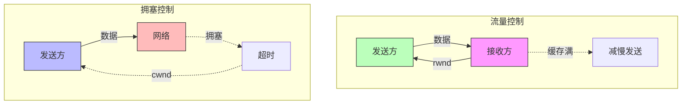
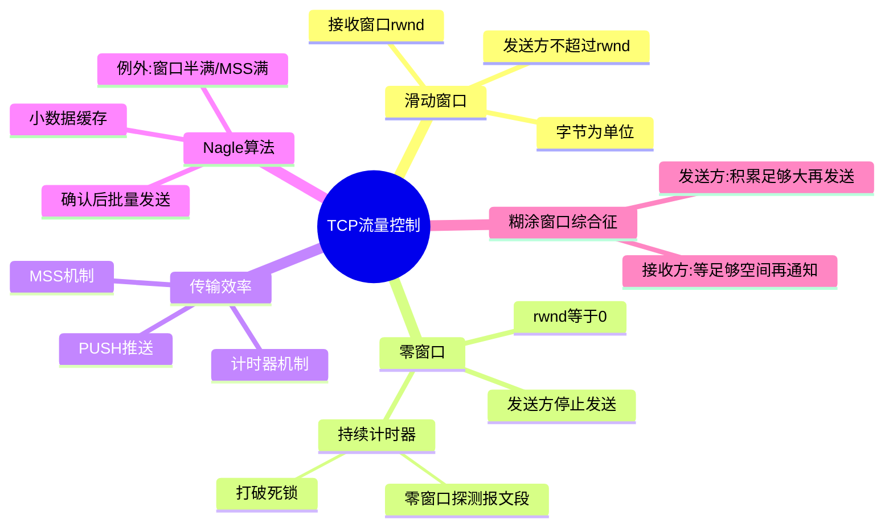

# TCP的流量控制

## 基本信息
- **课程**：计算机网络（第8版）
- **章节**：第5章 5.7节 TCP的流量控制
- **日期**：2026-04-11
- **标签**：#TCP #流量控制 #滑动窗口 #零窗口 #Nagle算法

---

## 重点内容

### ⭐⭐⭐ 核心概念
1. **流量控制的定义** - 让发送方发送速率不要太快
2. **利用滑动窗口实现流量控制** - 通过接收窗口rwnd控制
3. **零窗口问题** - 死锁的产生和解决
4. **持续计时器** - 解决零窗口死锁
5. **Nagle算法** - 提高传输效率
6. **糊涂窗口综合征** - 小窗口导致效率低下

### 📌 考试重点
- 流量控制的工作原理
- 零窗口问题的产生和解决方案
- Nagle算法的作用和原理
- 流量控制与拥塞控制的区别

---

## 详细笔记

### 一、利用滑动窗口实现流量控制 ⭐⭐⭐

#### 1. 什么是流量控制？

> **流量控制（Flow Control）**：让发送方的发送速率不要太快，要让接收方来得及接收。

**为什么需要流量控制？**
- 发送方发送过快 → 接收方来不及接收 → 数据丢失
- 利用**滑动窗口机制**可以很方便地实现流量控制

#### 2. 流量控制的工作原理


**场景说明：**
- A向B发送数据
- 连接建立时，B告诉A："我的接收窗口 rwnd = 400"
- 每个报文段100字节，序号初始值=1

**三次流量控制过程：**

| 时间 | 接收窗口 rwnd | 说明 |
|------|--------------|------|
| 初始 | 400 | 允许A发送序号1~400 |
| 第一次控制 | 300 | 窗口减小到300 |
| 第二次控制 | 100 | 窗口减小到100 |
| 第三次控制 | 0 | 不允许发送（零窗口） |

**关键点：**
- TCP窗口单位是**字节**，不是报文段
- B向A发送的报文段都设置 **ACK = 1**（确认号字段才有效）
- 发送窗口不能超过接收方给出的接收窗口值

#### 3. 零窗口问题与死锁

**问题场景：**
1. B向A发送了零窗口报文段（rwnd = 0）
2. 之后B的接收缓存有了空间，发送 rwnd = 400
3. **但这个报文段丢失了！**
4. A一直等待非零窗口通知
5. B一直等待A发送数据
6. **死锁！**

**解决方案：持续计时器（Persistence Timer）**

```
机制：
1. 收到零窗口通知 → 启动持续计时器
2. 计时器到期 → 发送零窗口探测报文段（仅1字节数据）
3. 对方确认探测报文段时给出当前窗口值
   - 窗口仍为0 → 重新设置持续计时器
   - 窗口不为0 → 打破死锁，继续发送
```

---

### 二、TCP的传输效率 ⭐⭐⭐

#### 1. TCP报文段发送时机

**三种机制：**

| 机制 | 说明 |
|------|------|
| **MSS机制** | 缓存数据达到MSS字节时发送 |
| **推送（PUSH）** | 应用进程要求立即发送 |
| **计时器机制** | 计时器到期时发送 |

#### 2. Nagle算法

**问题：** 交互式应用（如TELNET）效率低
- 发送1个字符 → 21字节TCP报文段 → 41字节IP数据报
- 接收确认 → 40字节确认报文
- 回显字符 → 又要41+40字节
- **总共162字节传输1个字符！**

**Nagle算法：**
1. 第一个数据字节立即发送
2. 后续字节缓存起来
3. 收到第一个字节的确认后，发送缓存中的所有数据
4. 收到前一个报文段的确认后再发送下一个

**例外情况（立即发送）：**
- 数据达到发送窗口大小的一半
- 数据达到报文段最大长度

#### 3. 糊涂窗口综合征（Silly Window Syndrome）

**问题场景：**
- 接收方缓存已满
- 应用进程每次只读取**1个字节**
- 接收窗口变为**1个字节**
- 发送方发送**1个字节**数据
- **效率极低！**

**解决方案：**

**接收方：**
- 等待缓存有足够空间容纳一个最长报文段
- 或等待缓存有一半空闲空间
- 才发送确认并通知窗口大小

**发送方：**
- 不要发送太小的报文段
- 积累数据到足够大的报文段
- 或达到接收方缓存空间的一半

---

### 三、流量控制 vs 拥塞控制对比

| 对比项 | **流量控制** | **拥塞控制** |
|--------|-------------|-------------|
| **控制对象** | 发送方 vs 接收方 | 发送方 vs 网络 |
| **范围** | 端到端（点对点） | 全局性（整个网络） |
| **目的** | 防止接收方缓存溢出 | 防止网络资源过载 |
| **手段** | 接收窗口 rwnd | 拥塞窗口 cwnd |
| **信息来源** | 接收方反馈 | 发送方超时判断 |



---

## 四、核心要点总结

### ⭐⭐⭐ 关键概念

| 概念 | 说明 |
|------|------|
| **流量控制** | 端到端，防止发送过快导致接收方来不及接收 |
| **接收窗口 rwnd** | 接收方告诉发送方的窗口大小 |
| **零窗口** | rwnd = 0，发送方停止发送 |
| **持续计时器** | 解决零窗口死锁问题 |
| **Nagle算法** | 减少小报文段数量，提高效率 |
| **糊涂窗口综合征** | 小窗口导致效率低下的问题 |

### 📌 考试重点

1. **流量控制的工作原理**
2. **零窗口问题的产生和解决**
3. **Nagle算法的工作原理**
4. **流量控制与拥塞控制的区别**

---

## 疑问与思考

❓ **疑问**：流量控制与拥塞控制有什么本质区别？它们控制的对象分别是什么？

💡 **解答**：

- **流量控制**：是**端到端**的问题，控制对象是**发送方与接收方之间**的速率匹配
  - 目的：防止发送方发送过快，导致接收方来不及接收
  - 手段：通过接收窗口 rwnd 由接收方告知发送方
  - 课本比喻：水桶太小，来不及接收注入的水，需要把水龙头拧小（图5-22(a)）
- **拥塞控制**：是**全局性**的过程，控制对象是**整个网络**的资源负载
  - 目的：防止过多的数据注入网络，使路由器或链路不至于过载
  - 手段：通过拥塞窗口 cwnd 由发送方根据网络状况判断
  - 课本比喻：水管中有狭窄的地方不通畅，需要把水龙头拧小以减缓堵塞（图5-22(b)）
- **两者容易混淆的原因**：某些拥塞控制算法也是向发送方发送控制报文，告诉发送方放慢速率，这与流量控制的形式相似
- 📚 出处：第5章 5.7节与5.8节"流量控制和拥塞控制的区别"

❓ **疑问**：当接收方发送零窗口通知（rwnd=0）后，为什么不能简单地等接收方重新发窗口更新？会出现什么问题？

💡 **解答**：

- **问题**：假设B向A发送了零窗口报文段后，B的接收缓存有了空间并发送 rwnd=400 的报文段，但该报文段**在传送过程中丢失了**
- **后果**：A一直在等待B发送的非零窗口通知，B也一直在等待A发送数据，形成**死锁（deadlock）**
- **解决**：TCP为每个连接设置**持续计时器（Persistence Timer）**
  - 收到零窗口通知后启动持续计时器
  - 计时器到期时发送**零窗口探测报文段**（仅携带1字节数据）
  - 对方在确认探测报文段时给出当前窗口值
    - 窗口仍为0 → 重新设置持续计时器
    - 窗口不为0 → 打破死锁，继续正常通信
- 📚 出处：第5章 5.7.1节"持续计时器"

❓ **疑问**：什么是糊涂窗口综合征（Silly Window Syndrome）？为什么说它会导致TCP性能严重下降？

💡 **解答**：

- **现象**：接收方缓存已满，应用进程每次只读取1字节，导致接收窗口仅为1字节
  - 接收方发送确认，窗口=1字节
  - 发送方发送1字节数据，IP数据报却是41字节（40字节首部+1字节数据）
  - 接收方再发确认，窗口仍为1字节，如此循环
- **危害**：每个报文段只携带1字节有效数据，却需要40字节首部开销，**网络利用率极低**
- **解决方案**：
  - **接收方**：等待缓存有足够空间容纳一个最长报文段，或等待缓存有一半空闲空间时，才发送确认并通知窗口大小
  - **发送方**：不要发送太小的报文段，积累数据到足够大的报文段，或达到接收方缓存空间的一半
  - 两种方法**配合使用**效果最佳
- 📚 出处：第5章 5.7.2节"糊涂窗口综合征"

❓ **疑问**：Nagle算法在现代网络中是否仍然适用？它有什么例外情况？

💡 **解答**：

- **适用性**：Nagle算法在交互式应用（如TELNET/SSH）中仍然有意义，能有效减少网络上小报文段的数量
- **但现代改进**：很多应用（如X11、游戏）禁用Nagle算法（TCP_NODELAY），因为延迟敏感场景下缓存等待会增加时延
- **Nagle算法的两个立即发送例外**：
  1. 数据已达到发送窗口大小的一半
  2. 数据已达到报文段的最大长度（MSS）
- **核心思想**：在数据到达较快而网络速率较慢时，Nagle算法可明显减少所用的网络带宽
- 📚 出处：第5章 5.7.2节"Nagle算法"

---

## 总结

### 流量控制 vs 拥塞控制

| 特性       | 流量控制              | 拥塞控制               |
| -------- | ----------------- | ------------------- |
| **控制对象** | 发送方 vs 接收方        | 发送方 vs 网络           |
| **控制范围** | 端到端（点对点）         | 全局性（整个网络）          |
| **控制目的** | 防止接收方缓存溢出        | 防止网络资源过载            |
| **控制手段** | 接收窗口 rwnd         | 拥塞窗口 cwnd           |
| **信息来源** | 接收方显式反馈           | 发送方根据超时等间接判断       |
| **调整方式** | 接收方告知窗口大小         | 发送方自行探测和调整          |
| **课本比喻** | 水桶太小，拧小水龙头（图5-22a） | 水管堵塞，拧小水龙头（图5-22b） |

### 核心概念



### 滑动窗口流量控制要点

| 要点 | 说明 |
|------|------|
| **窗口单位** | TCP窗口以**字节**为单位，不是报文段 |
| **rwnd** | 接收方通过确认报文中的窗口字段告知发送方 |
| **发送限制** | 发送窗口不能超过接收方给出的rwnd值 |
| **ACK标志** | B向A发送的报文段都设置ACK=1，确认号字段才有效 |
| **零窗口** | rwnd=0时发送方暂停发送 |
| **持续计时器** | 收到零窗口通知后启动，到期发送探测报文段防止死锁 |
| **Nagle算法** | 减少小报文段数量，提高网络带宽利用率 |
| **糊涂窗口** | 双方配合：接收方等足够空间，发送方积累足够数据 |

***

## 相关链接

- 上一节：[第5章-5.6-TCP可靠传输的实现](./第5章-5.6-TCP可靠传输的实现.md)
- 下一节：5.8 TCP的拥塞控制
- 课本出处：第5章 5.7节，图5-21
- RFC文档：RFC 896 (Nagle算法)

---

## 插图说明

| 图号 | 内容 | 说明 |
|------|------|------|
| 图5-21 | 利用可变窗口进行流量控制举例 | 三次
