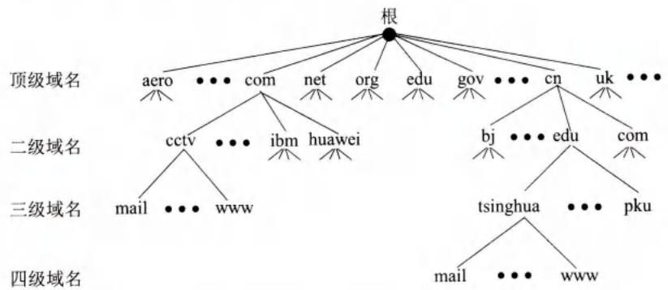
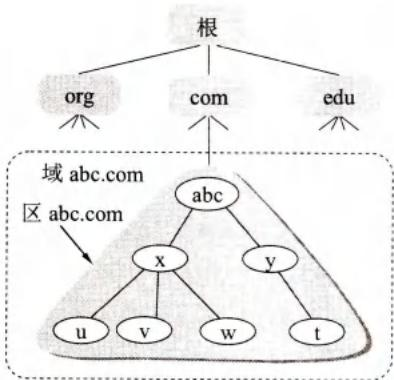
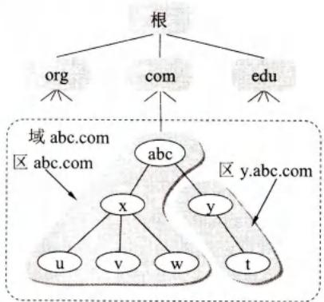
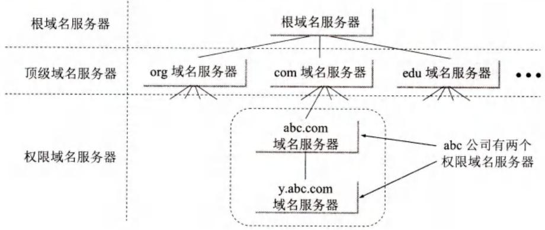
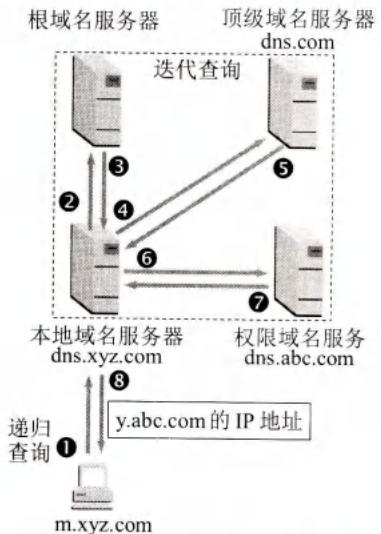
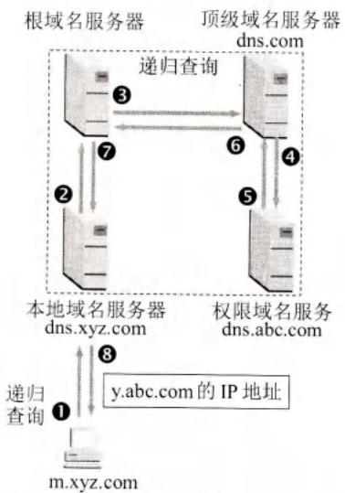

# 第6章-6.1-域名系统DNS

## 基本信息

- **课程**：计算机网络
- **章节**：第6章 6.1节 域名系统DNS
- **日期**：2026-06-14
- **标签**：#DNS #域名解析 #域名服务器 #递归查询 #迭代查询 #高速缓存

***

## 重点内容

### ⭐⭐⭐ 核心概念

1. **DNS**：分布式数据库系统，将域名解析为IP地址，使用UDP，客户/服务器方式
2. **域名结构**：层次树状，标号用点隔开，级别最低在最左，最高在最右
3. **顶级域名TLD**：国家顶级域名(nTLD)、通用顶级域名(gTLD)、基础结构域名(arpa)
4. **四种域名服务器**：根、顶级、权限、本地域名服务器
5. **递归查询**：本地域名服务器负责找到答案；**迭代查询**：逐个查询直至找到
6. **高速缓存**：存放最近查询结果，减轻根服务器负荷，设置超时计时器

### ⭐⭐ 关键问题

- 为什么DNS采用分布式而不是集中式？
- 迭代查询和递归查询的区别是什么？
- 高速缓存如何提高DNS查询效率？
- 区和域的关系是什么？

***

## 详细笔记

### 一、域名系统概述

**DNS (Domain Name System)** 是互联网的命名系统，将便于记忆的域名转换为IP地址。

**核心特点**：
- **分布式数据库系统**：不是集中式，避免单点故障
- **客户/服务器方式**：应用进程调用解析程序，向本地域名服务器查询
- **使用UDP**：减少开销，本地解析效率高
- **联机运行**：大多数解析在本地完成，少量需要互联网通信

**解析过程要点**：
1. 应用进程调用解析程序，发送DNS请求报文（UDP）到本地域名服务器
2. 本地域名服务器查找域名，返回IP地址
3. 若本地无法回答，则向其他域名服务器查询，直至找到答案

***

### 二、互联网的域名结构

互联网采用**层次树状结构**命名方法。

**域名语法**：标号(label)序列，用点号隔开
- 例：`mail.cctv.com` = mail(三级) + cctv(二级) + com(顶级)
- 级别最低的域名写在**最左边**，最高的写在**最右边**
- 完整域名不超过 **255** 个字符，每个标号不超过 **63** 个字符

#### 📷 图6-1 互联网的域名空间



> 📚 **课本出处**：图6-1 域名空间是倒过来的树，根在最上面但没有名字，顶级域名下有二级、三级域名。

**顶级域名TLD三大类**：

| 类型 | 说明 | 示例 |
|------|------|------|
| **国家顶级域名 nTLD** | ISO 3166规定 | cn(中国), us(美国), uk(英国) |
| **通用顶级域名 gTLD** | 20个通用域 | com, net, org, edu, gov, mil 等 |
| **基础结构域名** | 只有一个 | arpa（反向域名解析） |

**我国二级域名**：
- **类别域名**（7个）：ac(科研), com(企业), edu(教育), gov(政府), mil(国防), net(网络服务), org(非营利)
- **行政区域名**（34个）：bj(北京), js(江苏) 等

> 域名是**逻辑概念**，不代表物理位置，与IP子网无关。

***

### 三、域名服务器

#### 1. 区(zone)的概念

- **区**：域名服务器管辖的范围
- 区 **≤** 域，不可能大于域
- 各单位可根据情况划分多个区

#### 📷 图6-2 DNS划分区的举例





> 📚 **课本出处**：图6-2 区是域的子集，abc.com可只设一个区，也可划分为abc.com和y.abc.com两个区。

#### 📷 图6-3 树状结构的DNS域名服务器



> 📚 **课本出处**：图6-3 DNS域名服务器也是层次结构，每个服务器只管辖域名体系的一部分。

#### 2. 四种域名服务器类型

| 类型 | 作用 | 特点 |
|------|------|------|
| **根域名服务器** | 最高层次，知道所有顶级域名服务器 | 13个域名(a-m)，全球1375个实际服务器，使用任播技术 |
| **顶级域名服务器** | 管理顶级域名下的所有二级域名 | 如com、org、cn等 |
| **权限域名服务器** | 保存该区中所有主机的域名到IP映射 | 由各单位自行设置 |
| **本地域名服务器** | 用户主机直接查询的默认服务器 | 也称为默认域名服务器 |

#### 3. 域名解析过程

#### 📷 图6-4 DNS查询举例





> 📚 **课本出处**：图6-4 迭代查询中本地域名服务器逐个查询根→顶级→权限；递归查询中其他服务器代替本地完成查询。

**两种查询方式**：

| 查询方式 | 工作方式 | 特点 |
|----------|----------|------|
| **递归查询** | 主机→本地域名服务器，本地服务器负责找到答案 | 用户主机只需查询一次 |
| **迭代查询** | 本地域名服务器逐个向根→顶级→权限查询 | 每次返回下一个应查询的服务器地址 |

**典型查询步骤**（迭代查询）：
1. 主机 m.xyz.com 向本地域名服务器 dns.xyz.com 递归查询
2. 本地域名服务器向根域名服务器迭代查询
3. 根返回顶级域名服务器 dns.com 的IP地址
4. 本地向顶级域名服务器查询
5. 顶级返回权限域名服务器 dns.abc.com 的IP地址
6. 本地向权限域名服务器查询
7. 权限返回 y.abc.com 的IP地址
8. 本地把结果告诉主机

> 共使用8个UDP报文。

#### 4. 高速缓存

- 存放最近查询过的域名和映射信息
- 可大大减轻根域名服务器负荷，减少DNS查询报文数量
- 设置计时器（如两天），超时后需重新获取
- 主机中也维护高速缓存，启动时下载本地域名服务器数据库

***

## 疑问与思考

### ❓ 待解决问题

#### 1. 为什么DNS采用分布式而不是集中式？

**📚 课本出处**：第6章 6.1.1节

如果整个互联网只使用一个域名服务器：
1. **过负荷无法工作**：互联网规模太大，单台服务器无法承受所有查询
2. **单点故障**：一旦域名服务器故障，整个互联网瘫痪
3. **维护困难**：需要频繁更新全球所有主机的映射信息

分布式DNS的优势：
- 大多数解析在本地完成，效率高
- 单个服务器故障不影响整体运行
- 各域独立管理，维护灵活

#### 2. 迭代查询和递归查询的区别是什么？

**📚 课本出处**：第6章 6.1.3节

| 对比项 | 递归查询 | 迭代查询 |
|--------|----------|----------|
| 发起方 | 用户主机→本地域名服务器 | 本地域名服务器→其他域名服务器 |
| 工作方式 | 本地服务器必须返回最终答案 | 每次返回下一个应查询的服务器地址 |
| 负担 | 本地域名服务器负担较重 | 各域名服务器负担分散 |
| 报文数 | 相同（8个UDP报文） | 相同（8个UDP报文） |

实际中，主机到本地域名服务器使用递归查询，本地域名服务器到其他服务器通常使用迭代查询。

#### 3. 高速缓存如何提高DNS查询效率？

**📚 课本出处**：第6章 6.1.3节

高速缓存存放最近查询过的域名和从何处获得映射信息的记录。

- **直接命中**：如果不久前已查询过 y.abc.com，本地域名服务器直接返回缓存结果，无需向根服务器查询
- **部分命中**：如果缓存中有顶级域名服务器 dns.com 的IP地址，可直接向顶级查询，跳过根服务器
- **减轻负荷**：大大减少根域名服务器的查询压力和互联网上的DNS报文数量
- **超时机制**：设置计时器（如两天），超时后重新获取，保证数据准确性

### 💡 个人理解

- DNS是互联网的"电话簿"，没有DNS，用户只能记住IP地址上网，互联网不可能普及。
- 根域名服务器虽然只有13个域名，但实际有1375台物理服务器分布全球，使用任播技术让用户访问最近的服务器。
- 迭代查询和递归查询各有利弊：递归查询对主机简单，但服务器负担重；迭代查询分散负担，但需要多次交互。
- 高速缓存是DNS高效运行的关键，因为域名到IP的绑定并不经常改变。

***

## 核心考点总结

### ⭐⭐⭐ 必考内容

1. **DNS核心特点**

| 项目 | 内容 |
|------|------|
| 全称 | Domain Name System |
| 作用 | 域名 → IP地址 |
| 协议 | UDP（减少开销） |
| 架构 | 分布式数据库，客户/服务器 |
| 解析方式 | 本地解析为主，少量互联网通信 |

2. **域名结构**

```
根(无名称)
├── 顶级域名TLD
│   ├── com（通用）
│   ├── cn（国家）
│   └── arpa（反向）
├── 二级域名
│   └── cctv, tsinghua, etc.
└── 三级域名
    └── mail, www, etc.
```

3. **四种域名服务器**

| 类型 | 层次 | 作用 |
|------|------|------|
| 根域名服务器 | 最高 | 知道所有顶级域名服务器IP |
| 顶级域名服务器 | 第二 | 管理该顶级域下的二级域名 |
| 权限域名服务器 | 第三 | 保存该区所有主机的域名→IP映射 |
| 本地域名服务器 | 默认 | 用户主机直接查询的服务器 |

4. **查询方式对比**

| 对比项 | 递归查询 | 迭代查询 |
|--------|----------|----------|
| 方向 | 主机→本地 | 本地→根→顶级→权限 |
| 返回内容 | 最终IP地址 | 下一个查询目标地址 |
| 负担 | 本地服务器重 | 各服务器分散 |

5. **高速缓存作用**
- 存放最近查询结果
- 减轻根服务器负荷
- 减少DNS查询报文
- 设置超时计时器（如2天）

### 📌 易混淆点辨析

| 概念 | 说明 |
|------|------|
| **域(domain)** | 名字空间中的一个管理划分，是一个逻辑概念 |
| **区(zone)** | 域名服务器实际管辖的范围，是域的子集 |
| **递归查询** | 查询者要求被查询者必须返回最终答案 |
| **迭代查询** | 被查询者返回下一个应查询的服务器地址 |
| **根域名服务器** | 13个域名(a-m)，全球1375个实际服务器 |
| **任播(anycast)** | 路由器找到离用户最近的根域名服务器 |

### 📝 常见考题类型

1. **简答题**：
   - 为什么DNS采用分布式而不是集中式？
   - 说明迭代查询和递归查询的区别
   - 高速缓存如何提高DNS查询效率？
   - 区和域的关系是什么？
2. **选择题/判断题**：
   - DNS使用TCP协议（✗，使用UDP）
   - 区可以大于域（✗）
   - 根域名服务器只有13台机器（✗，13个域名，1375台服务器）
   - 域名中的点与IP地址中的点一一对应（✗）
   - 高速缓存可减轻根域名服务器负荷（✓）
3. **分析题**：
   - 给定查询场景，画出迭代查询和递归查询的过程
   - 分析高速缓存在DNS系统中的作用

***

## 相关链接

### 本节涉及图片

- [图6-1 互联网的域名空间](../../../images/f7ed655f3d0a4ee16538e381fec5d8eeccbac5bd10c65ec12540b606d651276c.jpg)
- [图6-2(a) 一个区](../../../images/2a6512d8ed37a7970886600d44b2eabf8e420521e864557d27e8ed62af17d6a2.jpg)
- [图6-2(b) 两个区](../../../images/c8d840b0dd553ed57029b66c67500c0b1b8020c99c2ee1c0b89bc8f69b0f85e6.jpg)
- [图6-3 树状结构的DNS域名服务器](../../../images/c01fee1d37576a6d939eb5c885daecc0852a73241fe8f456e5c62f213ac5ff9a.jpg)
- [图6-4(a) 本地域名服务器采用迭代查询](../../../images/e48b380ab58032923ad189a4eb0b993311b68b8d248810b7412c8deb3ba3699d.jpg)
- [图6-4(b) 本地域名服务器采用递归查询](../../../images/c1611bdef35dab273a4e07f0229dc3a4308d3d92aba4f8852273565f69a28824.jpg)

### 关联章节

- [第5章-5.3-运输层协议概述](../../第5章-运输层/第5章-5.3-运输层协议概述.md) - UDP协议
- 第6章后续小节 - FTP、HTTP、SMTP等应用层协议

***

*笔记创建时间：2026-06-14*
