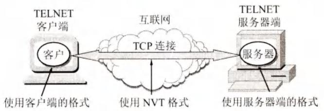
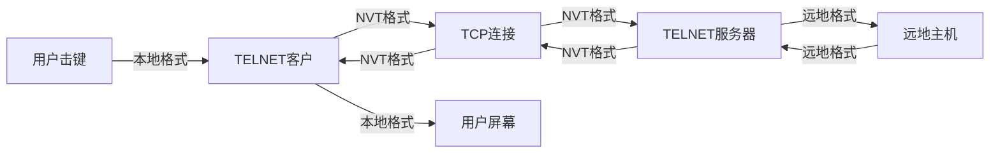

# 第6章-6.3-远程终端协议TELNET

## 基本信息

- **课程**：计算机网络
- **章节**：第6章 6.3节 远程终端协议TELNET
- **日期**：2026-06-14
- **标签**：#TELNET #远程终端 #NVT #终端仿真 #客户服务器

***

## 重点内容

### ⭐⭐⭐ 核心概念

1. **TELNET**：简单的远程终端协议，通过TCP连接登录远地主机
2. **透明服务**：用户感觉键盘和显示器直接连在远地主机上
3. **终端仿真协议**：将用户击键传到远地主机，返回输出到用户屏幕
4. **NVT (Network Virtual Terminal)**：统一不同系统差异的标准格式
5. **选项协商**：客户和服务器可商定使用更多终端功能

### ⭐⭐ 关键问题

- TELNET如何解决不同操作系统之间的差异？
- 什么是网络虚拟终端NVT？
- TELNET现在为什么较少使用？

***

## 详细笔记

### 一、TELNET概述

**TELNET** 是一个简单的远程终端协议 [RFC 854, STD8]。

**基本功能**：
- 用户通过 **TCP连接** 注册（登录）到远地另一台主机
- 将用户的击键传到远地主机
- 将远地主机的输出通过TCP连接返回到用户屏幕
- **透明服务**：用户感觉键盘和显示器直接连在远地主机上
- 又称为**终端仿真协议**

**工作方式**：客户/服务器方式
- 本地系统运行 **TELNET客户进程**
- 远地主机运行 **TELNET服务器进程**

> TELNET现在已较少使用（计算机功能越来越强，SSH等更安全协议替代），可作为历史资料了解。

***

### 二、网络虚拟终端NVT

不同计算机和操作系统的差异：
- 行结束：有的用CR，有的用LF，有的用CR-LF
- 中断程序：有的用Control-C，有的用ESC

**NVT (Network Virtual Terminal)**：TELNET定义的标准格式，用来统一不同系统的差异。

#### 📷 图6-6 TELNET使用网络虚拟终端NVT格式

> 📚 **课本出处**：图6-6 客户把用户击键转换为NVT格式送给服务器，服务器再转换为远地系统格式。

**NVT格式**：
- 所有通信使用 **8位一个字节**
- **7位ASCII码**传送数据
- **高位置1**时用作控制命令
- 标准行结束控制符：**CR-LF**

**选项协商(Option Negotiation)**：TELNET客户和服务器可商定使用更多终端功能，协商双方是平等的。

***

## 疑问与思考

### ❓ 待解决问题

#### 1. TELNET如何解决不同操作系统之间的差异？

**📚 课本出处**：第6章 6.3节

TELNET通过定义**网络虚拟终端NVT**来解决不同系统的差异：

1. **统一数据格式**：所有通信都使用8位一个字节，7位ASCII码传送数据
2. **统一控制字符**：定义标准行结束控制符为CR-LF，统一中断等控制命令的表示
3. **双向转换**：
   - 客户软件把用户击键和命令转换为NVT格式，送交服务器
   - 服务器软件把收到的数据从NVT格式转换为远地系统所需格式
   - 返回数据时，服务器把远地格式转换为NVT格式，本地客户再转换为本地格式

#### 2. TELNET现在为什么较少使用？

**📚 课本出处**：第6章 6.3节

主要原因：
1. **计算机功能越来越强**：本地计算机已能完成大部分任务，不需要频繁登录远地主机
2. **安全性问题**：TELNET以明文传输数据（包括密码），容易被窃听
3. **替代协议出现**：SSH（Secure Shell）提供了加密的远程登录功能，更安全可靠

因此，TELNET现在主要作为历史资料了解，实际应用中已被SSH取代。

### 💡 个人理解

- TELNET的NVT思想很有价值：通过定义中间标准格式，让不同系统能够互相通信。这种思想在后来的很多协议中都有体现。
- TELNET的衰落说明：协议不仅要功能完善，还要考虑安全性。明文传输在现代网络环境中是不可接受的。
- 虽然现在很少直接使用TELNET，但理解它有助于理解远程登录的基本原理和SSH的改进之处。

***

## 核心考点总结

### ⭐⭐⭐ 必考内容

1. **TELNET核心特点**

| 项目 | 内容 |
|------|------|
| 协议 | TCP |
| 架构 | 客户/服务器 |
| 功能 | 远程登录、终端仿真 |
| 特点 | 透明服务 |

2. **NVT (Network Virtual Terminal)**

| 项目 | 内容 |
|------|------|
| 作用 | 统一不同系统的差异 |
| 数据格式 | 8位字节，7位ASCII码 |
| 控制命令 | 高位置1 |
| 行结束符 | CR-LF |

3. **TELNET工作过程**

### 📌 易混淆点辨析

| 概念 | 说明 |
|------|------|
| **TELNET** | 远程终端协议，明文传输，现在较少使用 |
| **NVT** | 网络虚拟终端，统一不同系统的标准格式 |
| **终端仿真** | 让用户感觉直接连在远地主机上 |
| **选项协商** | TELNET客户和服务器商定使用更多功能 |
| **SSH** | 安全的远程登录协议，替代TELNET |

### 📝 常见考题类型

1. **简答题**：
   - TELNET如何解决不同操作系统之间的差异？
   - 什么是NVT？
   - TELNET现在为什么较少使用？
2. **选择题/判断题**：
   - TELNET使用UDP协议（✗，使用TCP）
   - NVT使用7位ASCII码传送数据（✓）
   - TELNET是安全的远程登录协议（✗）
   - TELNET现在已完全被SSH取代（✓，实际应用中）

***

## 相关链接

### 本节涉及图片

- [图6-6 TELNET使用网络虚拟终端NVT格式](../../../images/1551e839aae4d18fe3fa45cbb611a01fe9f7e8fd870740cc0339e2437baf8129.jpg)

### 关联章节

- [第6章-6.2-文件传送协议](./第6章-6.2-文件传送协议.md) - FTP也是客户/服务器方式
- 第6章后续小节 - 万维网、电子邮件等应用层协议

***

*笔记创建时间：2026-06-14*
