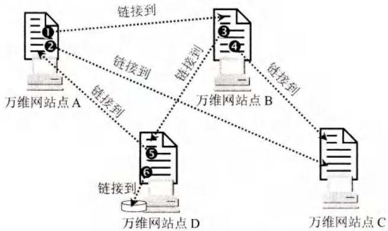
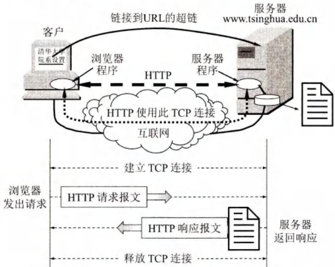
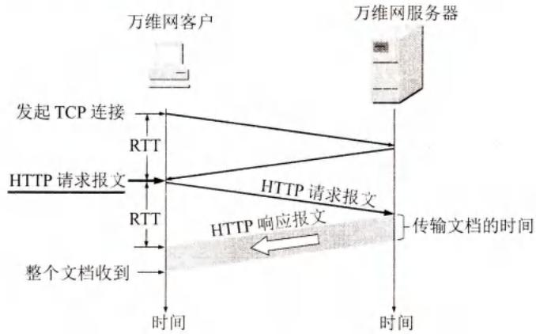
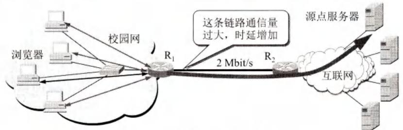
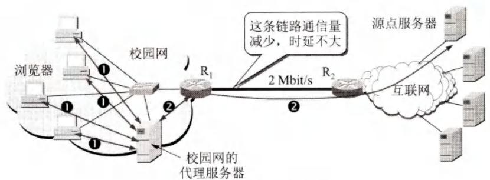
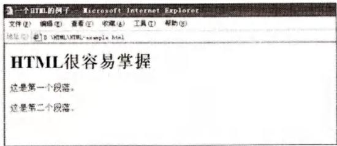
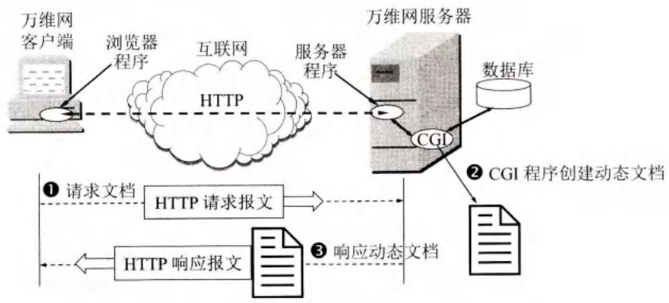
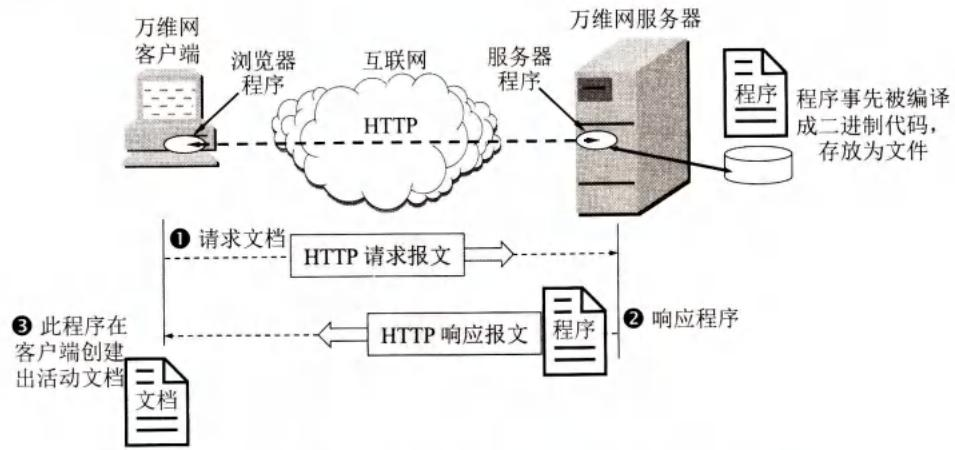

# 第6章-6.4-万维网WWW

## 基本信息

- **课程**：计算机网络
- **章节**：第6章 6.4节 万维网WWW
- **日期**：2026-06-14
- **标签**：#WWW #HTTP #URL #HTML #代理服务器 #搜索引擎 #CGI

***

## 重点内容

### ⭐⭐⭐ 核心概念

1. **万维网**：分布式超媒体系统，客户/服务器方式，用链接访问异地文档
2. **URL**：统一资源定位符，格式为 `协议://主机名:端口/路径`
3. **HTTP**：面向事务，TCP端口80，无连接、无状态
4. **HTTP/1.0**：非持续连接，每文档2RTT；**HTTP/1.1**：持续连接（非流水线/流水线）
5. **代理服务器**：万维网高速缓存，减轻链路费担，提高访问速度
6. **HTML**：超文本标记语言；**CGI**：通用网关接口，创建动态文档
7. **搜索引擎**：全文检索（Google/百度）vs 分类目录（雅虎/新浪）

### ⭐⭐ 关键问题

- HTTP为什么是无状态的？优缺点是什么？
- 持续连接和非持续连接的区别？
- 代理服务器的工作原理和优点？
- 静态文档、动态文档、活动文档的区别？
- 全文检索和分类目录搜索引擎的区别？

***

## 详细笔记

### 一、万维网概述

**万维网 WWW (World Wide Web)** 是一个大规模的、联机式的信息储藏所，用链接方法从一个站点访问另一个站点。

#### 📷 图6-7 万维网提供分布式服务



> 📚 **课本出处**：图6-7 万维网站点可相隔数千公里，通过链接访问其他站点的文档。

**核心概念**：
- **超文本(hypertext)**：包含指向其他文档链接的文本
- **超媒体(hypermedia)**：超文本的扩充，还包含图形、图像、声音、视频等
- **分布式**：信息分布在互联网上，各文档独立管理
- **客户/服务器方式**：浏览器是客户，万维网服务器运行服务器程序

**万维网必须解决的四个问题**：

| 问题 | 解决方案 |
|------|----------|
| 怎样标志万维网文档？ | **URL** 统一资源定位符 |
| 用什么协议实现链接？ | **HTTP** 超文本传送协议 |
| 怎样显示不同风格的文档？ | **HTML** 超文本标记语言 |
| 怎样方便找到所需信息？ | **搜索引擎** |

***

### 二、统一资源定位符URL

**URL格式**：

```
协议://主机名:端口/路径
```

| 组成部分 | 说明 | 示例 |
|----------|------|------|
| **协议** | 访问资源使用的协议 | http, ftp |
| **主机名** | 文档存放主机的域名 | www.tsinghua.edu.cn |
| **端口** | 协议默认端口可省略 | HTTP默认80 |
| **路径** | 文档在主机中的位置 | /publis/h/.../index.html |

> URL中"协议"和"主机名"不区分大小写，"路径"有时区分大小写。

***

### 三、超文本传送协议HTTP

**HTTP** 是面向事务的应用层协议，使用 **TCP端口80**。

#### 📷 图6-8 万维网的工作过程



> 📚 **课本出处**：图6-8 服务器进程监听端口80，建立TCP连接后，浏览器请求页面，服务器返回响应。

**HTTP核心特点**：

| 特点 | 说明 |
|------|------|
| **使用TCP** | 保证可靠传输 |
| **无连接** | 交换报文前不需要先建立HTTP连接 |
| **无状态** | 服务器不记得访问过的客户 |

#### 📷 图6-9 请求一个万维网文档所需的时间



> 📚 **课本出处**：图6-9 请求文档时间 = 2RTT + 文档传输时间。

**请求文档时间（HTTP/1.0）**：

$$
\text{总时间} = 2\text{RTT} + \text{文档传输时间}
$$

- 1个RTT：建立TCP连接（三报文握手）
- 1个RTT：请求和接收文档
- TCP握手第三个报文携带HTTP请求

#### HTTP版本演进

| 版本 | 连接方式 | 特点 |
|------|----------|------|
| **HTTP/1.0** | 非持续连接 | 每请求一个文档需2RTT，服务器负担重 |
| **HTTP/1.1** | **持续连接** | 发送响应后保持连接，支持非流水线和流水线 |
| **HTTP/2** | 复用TCP连接 | 并行响应、二进制编码帧、首部压缩 |

**持续连接的两种方式**：

| 方式 | 特点 |
|------|------|
| **非流水线** | 收到前一个响应后才能发下一个请求，每个对象花费1RTT |
| **流水线** | 收到响应前可连续发送请求，所有对象只需1RTT |

#### 代理服务器

**代理服务器(proxy server)** 又称为万维网高速缓存(Web cache)。

#### 📷 图6-10 代理服务器的作用





> 📚 **课本出处**：图6-10 代理服务器暂存最近请求和响应，相同请求直接返回缓存，减轻链路费担。

**代理服务器工作流程**：
1. 浏览器向代理服务器发送HTTP请求
2. 若代理有缓存，直接返回响应
3. 若无缓存，代理向源点服务器请求，缓存后再返回给浏览器

***

### 四、万维网的文档

#### 1. HTML

**HTML (HyperText Markup Language)** 是制作万维网页面的标准语言。

#### 📷 图6-12 在屏幕上显示的HTML文档



> 📚 **课本出处**：图6-12 HTML文档用标签定义结构，浏览器解释后显示。

**相关技术**：

| 技术 | 说明 |
|------|------|
| **XML** | 可扩展标记语言，传输数据而非显示数据 |
| **XHTML** | 可扩展超文本标记语言，更严格的HTML版本 |
| **CSS** | 层叠样式表，定义HTML文档的布局和样式 |

#### 2. 动态万维网文档

| 类型 | 说明 | 创建方式 |
|------|------|----------|
| **静态文档** | 内容不变，存放于服务器 | 直接编写HTML |
| **动态文档** | 内容在访问时动态创建 | 应用程序+CGI |
| **活动文档** | 程序在浏览器端运行，连续更新 | Java applet |

**CGI (Common Gateway Interface)**：通用网关接口，定义动态文档的创建规则。

#### 📷 图6-13 扩充了功能的万维网服务器



> 📚 **课本出处**：图6-13 增加CGI程序处理浏览器数据，创建动态文档。

#### 📷 图6-14 活动文档由服务器发送过来的程序在客户端创建



> 📚 **课本出处**：图6-14 活动文档程序在浏览器端运行，可连续改变屏幕显示。

***

### 五、万维网的信息检索系统

**搜索引擎** 两大类：

| 类型 | 代表 | 工作原理 | 特点 |
|------|------|----------|------|
| **全文检索搜索引擎** | Google、百度、Bing | 蜘蛛程序收集信息，建立索引数据库 | 信息量大，可能过时 |
| **分类目录搜索引擎** | 雅虎、新浪、搜狐 | 人工审核编辑，按分类目录查询 | 准确性高，内容有限 |

#### 📷 图6-15 两种检索的区别


> 📚 **课本出处**：图6-15 全文检索输入关键词搜索；分类检索按类别逐级查找。

***

### 六、博客和微博 / 社交网站

- **博客(Blog)**：网络日志，个人发布文章的平台
- **微博(Microblog)**：短消息形式的社交媒体，如Twitter、新浪微博
- **社交网站(SNS)**：如Facebook、微信、QQ空间，用于建立社交关系网络

***

## 疑问与思考

### ❓ 待解决问题

#### 1. HTTP为什么是无状态的？优缺点是什么？

**📚 课本出处**：第6章 6.4.3节

HTTP的无状态(stateless)是指：同一个客户第二次访问同一个服务器上的页面时，服务器的响应与第一次相同，因为服务器不记得曾经访问过的这个客户。

**优点**：
- 简化了服务器的设计
- 使服务器更容易支持大量并发的HTTP请求
- 不需要维护客户状态信息，节省服务器资源

**缺点**：
- 无法识别同一客户的连续请求
- 无法实现有状态的交互（如购物车）
- 解决方法：使用Cookie技术，在客户端保存状态信息

#### 2. 持续连接和非持续连接的区别？

**📚 课本出处**：第6章 6.4.3节

| 对比项 | 非持续连接(HTTP/1.0) | 持续连接(HTTP/1.1) |
|--------|---------------------|-------------------|
| TCP连接 | 每请求一个文档新建一个连接 | 发送响应后保持连接 |
| 时间开销 | 2RTT/文档 | 1RTT/文档（非流水线）或 1RTT/所有文档（流水线） |
| 服务器负担 | 重（频繁建立/释放连接） | 轻 |
| 并行连接 | 浏览器可开5~10个并行连接 | 在同一连接上连续请求 |

#### 3. 代理服务器的工作原理和优点？

**📚 课本出处**：第6章 6.4.3节

**工作原理**：
1. 浏览器向代理服务器发送HTTP请求
2. 若代理服务器已缓存该对象，直接返回响应
3. 若无缓存，代理向源点服务器请求，获取后缓存并返回给浏览器

**优点**：
- 减少访问互联网的时延
- 减轻链路费担（校园网出口链路）
- 减少互联网上的通信量
- 提高访问速度

#### 4. 静态文档、动态文档、活动文档的区别？

**📚 课本出处**：第6章 6.4.4节

| 类型 | 内容特点 | 创建方式 | 运行位置 |
|------|----------|----------|----------|
| **静态文档** | 内容不变 | 直接编写HTML | 服务器 |
| **动态文档** | 访问时动态创建 | CGI程序 | 服务器 |
| **活动文档** | 连续改变显示 | Java applet等 | 浏览器端 |

### 💡 个人理解

- HTTP/1.0的非持续连接设计简单，但效率低下。HTTP/1.1的持续连接是重大改进，而HTTP/2的并行响应和二进制帧进一步优化了性能。
- 代理服务器是现代CDN（内容分发网络）的基础思想，通过在靠近用户的地方缓存内容，大大提高访问速度。
- 动态文档和活动文档的区别在于：动态文档在服务器端生成，内容创建后固定；活动文档把程序发送到客户端运行，可以持续更新显示。
- 搜索引擎的两种类型各有优劣，现在大多数网站同时提供全文检索和分类目录功能。

***

## 核心考点总结

### ⭐⭐⭐ 必考内容

1. **HTTP核心特点**

| 项目 | 内容 |
|------|------|
| 协议 | TCP，端口80 |
| 特点 | 面向事务、无连接、无状态 |
| 请求时间(1.0) | 2RTT + 文档传输时间 |

2. **HTTP版本对比**

| 版本 | 连接方式 | 特点 |
|------|----------|------|
| HTTP/1.0 | 非持续连接 | 每文档2RTT |
| HTTP/1.1 | 持续连接 | 非流水线(1RTT/文档)、流水线(1RTT/所有) |
| HTTP/2 | 复用TCP | 并行响应、二进制帧、首部压缩 |

3. **URL格式**

```
协议://主机名:端口/路径
```

- HTTP默认端口：80（可省略）
- 协议和主机名不区分大小写
- 路径有时区分大小写

4. **代理服务器**
- 又称万维网高速缓存(Web cache)
- 暂存最近请求和响应
- 优点：减少时延、减轻链路负担、提高速度

5. **三种文档对比**

| 类型 | 特点 | 技术 |
|------|------|------|
| 静态文档 | 内容不变 | HTML |
| 动态文档 | 访问时创建 | CGI |
| 活动文档 | 客户端运行，连续更新 | Java applet |

6. **搜索引擎对比**

| 类型 | 代表 | 特点 |
|------|------|------|
| 全文检索 | Google、百度 | 蜘蛛程序、索引数据库、信息量大 |
| 分类目录 | 雅虎、新浪 | 人工审核、按分类查询、准确性高 |

### 📌 易混淆点辨析

| 概念 | 说明 |
|------|------|
| **HTTP无连接** | 交换报文前不需要先建立HTTP连接（但使用TCP连接） |
| **HTTP无状态** | 服务器不记得访问过的客户 |
| **持续连接** | HTTP/1.1特性，发送响应后保持TCP连接 |
| **流水线方式** | 收到响应前可连续发送请求 |
| **代理服务器** | 万维网高速缓存，暂存请求和响应 |
| **CGI** | 通用网关接口，创建动态文档的标准 |
| **HTML** | 超文本标记语言，不是应用层协议 |
| **XML** | 传输数据；HTML是显示数据 |

### 📝 常见考题类型

1. **简答题**：
   - HTTP为什么是无状态的？优缺点？
   - 持续连接和非持续连接的区别？
   - 代理服务器的工作原理和优点？
   - 静态文档、动态文档、活动文档的区别？
   - 全文检索和分类目录搜索引擎的区别？
2. **计算题**：
   - 计算请求一个万维网文档所需的时间（2RTT + 传输时间）
   - 比较HTTP/1.0和HTTP/1.1访问多个对象的时间
3. **选择题/判断题**：
   - HTTP使用UDP协议（✗）
   - HTTP是无状态的（✓）
   - HTTP/1.1默认使用持续连接（✓）
   - 代理服务器只能工作在客户端（✗）
   - HTML是应用层协议（✗）
   - CGI用于创建动态文档（✓）

***

## 相关链接

### 本节涉及图片

- [图6-7 万维网提供分布式服务](../../../images/9405391d9da2750b2e83cd8613be1f67a63a031f639de0d0113fa85460a117af.jpg)
- [图6-8 万维网的工作过程](../../../images/92c28ede49f11120cf2fb52d1e645af43bb1b84a5be41bc76bfe03f4c61bf8f2.jpg)
- [图6-9 请求一个万维网文档所需的时间](../../../images/c3a26aeab4d33a558895e8007547d67fc195697fdf916c2460ef80ea1df345e9.jpg)
- [图6-10(a) 不使用代理服务器](../../../images/966ef077075d0395dc6a1e8c0f0615fd756cee2a3f7b92f1cce5e03611989303.jpg)
- [图6-10(b) 使用代理服务器](../../../images/ec7b0880b4263626277d6e09b75839b74488121ea7b3a43979b8c4f69d961c36.jpg)
- [图6-12 在屏幕上显示的HTML文档](../../../images/151a38d359db4b5fab75a5baf69926f86d8c3c89ea538accec61a08a02b10a5f.jpg)
- [图6-13 扩充了功能的万维网服务器](../../../images/c8bb8773b084363009ab9b428188785582ebee0c4a7cdc9d8b94db965866b3d3.jpg)
- [图6-14 活动文档由服务器发送过来的程序在客户端创建](../../../images/d4af620189b78d5f34b81b8ca6682d7b3daa7fdbdf0cf5e2d1d3cc8c1ba71b02.jpg)
- [图6-15(a) 全文检索举例](../../../images/0fbce7c357405ea8996f1590d9b8432f2747fe74fea43a34ff2d861b4dd7fb33.jpg)
- [图6-15(b) 分类检索举例](../../../images/dd0fbbcbbefafe43fd4bcb20329c763913765d263ca2833b507de690018ccce9.jpg)

### 关联章节

- [第6章-6.1-域名系统DNS](./第6章-6.1-域名系统DNS.md) - URL中的主机名需要DNS解析
- [第6章-6.2-文件传送协议](./第6章-6.2-文件传送协议.md) - FTP也可通过URL访问
- [第5章-5.3-运输层协议概述](../../第5章-运输层/第5章-5.3-运输层协议概述.md) - HTTP使用TCP传输

***

*笔记创建时间：2026-06-14*
