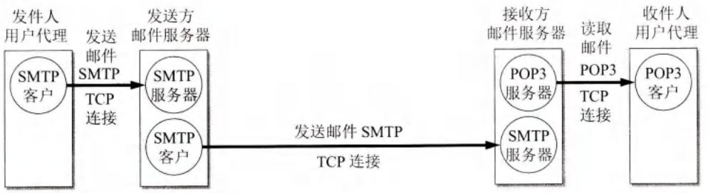
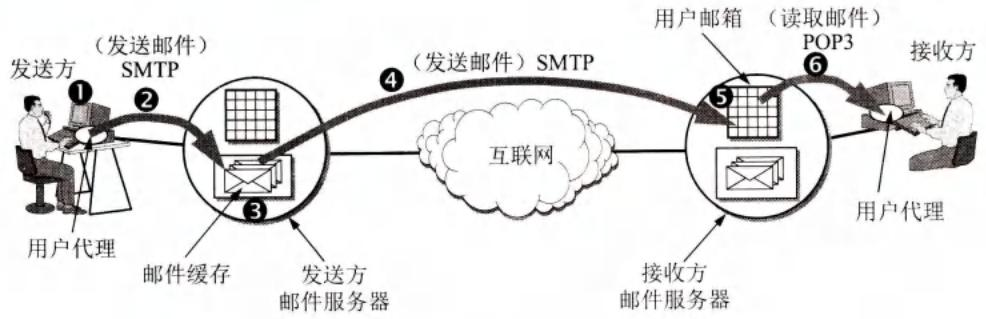
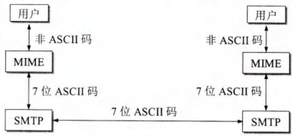

# 第6章-6.5-电子邮件

## 基本信息

- **课程**：计算机网络
- **章节**：第6章 6.5节 电子邮件
- **日期**：2026-06-14
- **标签**：#电子邮件 #SMTP #POP3 #IMAP #MIME #用户代理 #邮件服务器

***

## 重点内容

### ⭐⭐⭐ 核心概念

1. **电子邮件系统三构件**：用户代理UA、邮件服务器、邮件协议
2. **SMTP**：简单邮件传送协议，TCP端口25，用于发送邮件，"推"方式
3. **POP3**：邮局协议第3版，用于读取邮件，"拉"方式，读取后通常删除
4. **IMAP**：网际报文存取协议，联机协议，邮件保存在服务器，可分类管理
5. **MIME**：通用互联网邮件扩充，支持多媒体和非ASCII码
6. **Webmail**：基于万维网的电子邮件，浏览器与服务器用HTTP，服务器之间用SMTP

### ⭐⭐ 关键问题

- SMTP通信的三个阶段？
- POP3和IMAP的主要区别？
- MIME解决了SMTP的什么问题？
- 为什么发送邮件用SMTP，读取邮件用POP3/IMAP？
- 电子邮件地址格式？

***

## 详细笔记

### 一、电子邮件概述

**电子邮件系统的三个主要组成构件**：

| 构件 | 功能 |
|------|------|
| **用户代理UA** | 用户与电子邮件系统的接口（Outlook, Foxmail等） |
| **邮件服务器** | 发送和接收邮件，24小时不间断工作 |
| **邮件协议** | SMTP（发送）、POP3/IMAP（读取） |

#### 📷 图6-16 电子邮件的最主要的组成构件

> 📚 **课本出处**：图6-16 电子邮件系统由用户代理、邮件服务器和邮件协议组成。

**发送邮件的6个步骤**：
1. 发件人撰写邮件
2. 用户代理用SMTP将邮件发给发送方邮件服务器
3. 邮件暂存在发送方邮件服务器缓存队列
4. 发送方邮件服务器与接收方邮件服务器建立TCP连接，发送邮件
5. 接收方邮件服务器将邮件放入收件人邮箱
6. 收件人用POP3/IMAP读取邮件

**两种通信方式**：
- **推(push)**：SMTP客户把邮件"推"给SMTP服务器
- **拉(pull)**：POP3客户把邮件从POP3服务器"拉"过来

**电子邮件地址格式**：

$$
\text{用户名} @ \text{邮件服务器的域名}
$$

***

### 二、简单邮件传送协议SMTP

**SMTP** 使用 **TCP端口25**，客户-服务器方式。

**SMTP通信的三个阶段**：

| 阶段 | 内容 |
|------|------|
| **连接建立** | SMTP客户与服务器建立TCP连接，发送HELO命令 |
| **邮件传送** | MAIL FROM → RCPT TO → DATA → 发送邮件内容 |
| **连接释放** | 发送QUIT命令，释放TCP连接 |

**SMTP的缺点**：
- 发送不需要鉴别（方便垃圾邮件）
- 限于传送7位ASCII码
- 传送明文，不利于保密

**ESMTP (Extended SMTP)**：RFC5321扩充，增加了客户端鉴别、二进制报文、TLS安全传输等。使用EHLO代替HELO。

***

### 三、电子邮件的信息格式

**邮件内容首部关键字**：

| 关键字 | 说明 |
|--------|------|
| **To:** | 收件人电子邮件地址 |
| **Subject:** | 邮件主题 |
| **Cc:** | 抄送 |
| **Bcc:** | 盲复写副本（暗送） |
| **From:** | 发件人地址（系统自动填入） |
| **Date:** | 发信日期（系统自动填入） |
| **Reply-To:** | 对方回信地址 |

***

### 四、邮件读取协议POP3和IMAP

| 协议 | 全称 | 特点 |
|------|------|------|
| **POP3** | 邮局协议第3版 | 简单、功能有限；读取后通常删除邮件 |
| **IMAP** | 网际报文存取协议 | 复杂、联机协议；邮件保存在服务器，可分类管理 |

**POP3和IMAP对比**：

| 功能 | IMAP | POP3 |
|------|------|------|
| 阅读/标记/移动/删除 | 客户端与邮箱同步 | 仅在客户端 |
| 创建文件夹 | 客户端与邮箱同步 | 仅在客户端 |
| 保存草稿 | 客户端与邮箱同步 | 仅在客户端 |
| 垃圾邮件文件夹 | 支持 | 不支持 |
| 广告邮件文件夹 | 支持 | 不支持 |

**注意**：SMTP用于发送邮件，POP3/IMAP用于读取邮件，不要混淆。

***

### 五、基于万维网的电子邮件

- **Webmail**：通过浏览器收发邮件（Gmail、163邮箱、QQ邮箱等）
- 浏览器与邮件服务器之间使用 **HTTP**
- 邮件服务器之间仍然使用 **SMTP**

***

### 六、通用互联网邮件扩充MIME

**SMTP的缺点**：
1. 不能传送可执行文件或二进制对象
2. 限于7位ASCII码，无法传送中文等非英语文字
3. 拒绝超过一定长度的邮件
4. 某些实现未完全按标准

**MIME**：没有改动或取代SMTP，增加了邮件主体结构，定义了传送非ASCII码的编码规则。

#### 📷 图6-17 MIME和SMTP的关系

> 📚 **课本出处**：图6-17 MIME在SMTP基础上扩充，支持多媒体邮件。

**MIME新增的5个邮件首部字段**：
1. **MIME-Version**: MIME版本号
2. **Content-Description**: 邮件主体说明
3. **Content-Id**: 邮件唯一标识符
4. **Content-Transfer-Encoding**: 内容传送编码
5. **Content-Type**: 邮件主体数据类型和子类型

**内容传送编码**：

| 编码 | 适用场景 | 特点 |
|------|----------|------|
| **7位ASCII码** | 纯英文文本 | 不做转换 |
| **quoted-printable** | 少量非ASCII码（如汉字） | 非ASCII码用`=XX`表示，开销约200% |
| **base64** | 任意二进制文件 | 24位→32位，开销25% |

**MIME内容类型**：

| 内容类型 | 子类型举例 |
|----------|------------|
| text | plain, html, xml |
| image | gif, jpeg |
| audio | basic, mpeg |
| video | mpeg, mp4 |
| application | pdf, javascript, zip |
| multipart | mixed, alternative |

***

## 疑问与思考

### ❓ 待解决问题

#### 1. SMTP通信的三个阶段？

**📚 课本出处**：第6章 6.5.2节

| 阶段 | 主要命令/响应 |
|------|--------------|
| **连接建立** | 建立TCP连接 → 服务器返回220 → 客户发送HELO → 服务器返回250 OK |
| **邮件传送** | MAIL FROM → RCPT TO → DATA → 发送邮件内容 → <CRLF>.<CRLF>结束 → 250 OK |
| **连接释放** | QUIT → 服务器返回221（服务关闭）→ 释放TCP连接 |

#### 2. POP3和IMAP的主要区别？

**📚 课本出处**：第6章 6.5.4节

| 对比项 | POP3 | IMAP |
|--------|------|------|
| 复杂性 | 简单 | 复杂 |
| 工作方式 | 下载后通常删除 | 联机协议，邮件保留在服务器 |
| 多设备访问 | 不便（已下载的邮件在其他设备上看不到） | 方便（任何设备都能看到相同邮件） |
| 文件夹管理 | 仅在客户端 | 客户端与服务器同步 |
| 部分下载 | 不支持 | 支持（可先下载正文，后下载附件） |

#### 3. MIME解决了SMTP的什么问题？

**📚 课本出处**：第6章 6.5.6节

SMTP有以下限制：
- 不能传送二进制文件
- 限于7位ASCII码，无法传送中文等非英语文字
- 拒绝超过一定长度的邮件

MIME的解决方法：
- 不改动SMTP，增加邮件主体结构
- 定义传送非ASCII码的编码规则（quoted-printable、base64）
- 定义多媒体内容类型（text、image、audio、video等）
- 使MIME邮件可在现有的电子邮件程序和协议下传送

#### 4. 为什么发送邮件用SMTP，读取邮件用POP3/IMAP？

**📚 课本出处**：第6章 6.5.1节

因为通信方向不同：
- **SMTP是"推"**：发送方主动把邮件推给接收方的邮件服务器
- **POP3/IMAP是"拉"**：接收方主动从自己的邮件服务器拉取邮件

另外，用户计算机不一定能运行邮件服务器程序（存储空间、CPU、24小时在线等限制），所以邮件先存储在邮件服务器，用户方便时再读取。

### 💡 个人理解

- SMTP/POP3/IMAP是电子邮件的三大核心协议，各自分工明确：SMTP负责发送，POP3/IMAP负责读取。
- IMAP比POP3更适合现代多设备使用场景，因为邮件保存在服务器，任何设备都能看到一致的邮件状态。
- MIME的设计很聪明：不改动现有SMTP协议，通过增加首部字段和编码规则，就实现了多媒体邮件的支持，保证了向后兼容。
- Webmail的本质是用HTTP替代了用户代理的功能，但底层仍然依赖SMTP在服务器之间传送邮件。

***

## 核心考点总结

### ⭐⭐⭐ 必考内容

1. **电子邮件系统三构件**

| 构件 | 功能 | 示例 |
|------|------|------|
| 用户代理UA | 用户接口 | Outlook, Foxmail |
| 邮件服务器 | 发送/接收/存储邮件 | 24小时工作 |
| 邮件协议 | 发送和读取 | SMTP, POP3, IMAP |

2. **协议对比**

| 协议 | 端口 | 功能 | 方向 | 工作方式 |
|------|------|------|------|----------|
| **SMTP** | TCP 25 | 发送邮件 | 推(push) | 客户-服务器 |
| **POP3** | TCP 110 | 读取邮件 | 拉(pull) | 客户-服务器 |
| **IMAP** | TCP 143 | 读取邮件 | 拉(pull) | 客户-服务器 |
| **HTTP** | TCP 80 | Webmail | 请求-响应 | 浏览器-服务器 |

3. **POP3 vs IMAP**

| 功能 | POP3 | IMAP |
|------|------|------|
| 邮件存储位置 | 下载到本地后删除 | 保留在服务器 |
| 多设备一致性 | 差 | 好 |
| 文件夹管理 | 本地 | 与服务器同步 |
| 部分下载 | 不支持 | 支持 |

4. **MIME核心**
- 不改变SMTP，增加邮件主体结构
- 三种编码：7位ASCII、quoted-printable、base64
- 五种新增首部：MIME-Version、Content-Description、Content-Id、Content-Transfer-Encoding、Content-Type
- 内容类型：text、image、audio、video、application、multipart

### 📌 易混淆点辨析

| 概念 | 说明 |
|------|------|
| **SMTP** | 用于发送邮件（用户代理→发送方服务器，发送方服务器→接收方服务器） |
| **POP3/IMAP** | 用于读取邮件（用户代理←接收方服务器） |
| **HELO vs EHLO** | HELO是标准SMTP，EHLO是ESMTP扩展 |
| **推 vs 拉** | SMTP是推，POP3/IMAP是拉 |
| **MIME** | 不是取代SMTP，而是在SMTP基础上扩充 |
| **quoted-printable** | 开销约200%，适合少量非ASCII码 |
| **base64** | 开销25%，适合任意二进制文件 |

### 📝 常见考题类型

1. **简答题**：
   - 电子邮件系统的组成构件及各自功能？
   - SMTP通信的三个阶段？
   - POP3和IMAP的主要区别？
   - MIME解决了SMTP的什么问题？如何解决的？
   - 为什么发送邮件用SMTP，读取邮件用POP3/IMAP？
2. **选择题/判断题**：
   - SMTP使用TCP端口25（✓）
   - POP3使用TCP端口110（✓）
   - IMAP是"推"方式（✗，是"拉"）
   - MIME取代了SMTP（✗，是扩充）
   - Webmail不需要SMTP（✗，服务器之间仍用SMTP）
   - base64编码开销是25%（✓）

***

## 相关链接

### 本节涉及图片

- [图6-16 电子邮件的最主要的组成构件1](../../../images/b00439d337f7055aa72a5dc893360a088dcb1dd87505913d4d1d0bf546175436.jpg)
- [图6-16 电子邮件的最主要的组成构件2](../../../images/730f2a238b9ada3f33e2977215710d2f1d2dcd546fe4574c39b0b067efa0024f.jpg)
- [图6-17 MIME和SMTP的关系](../../../images/6f4f72e5bb648a6702468a1c81e1ed33337fd46d1be88e1c32fba0a262b9846b.jpg)

### 关联章节

- [第6章-6.1-域名系统DNS](./第6章-6.1-域名系统DNS.md) - 邮件服务器域名需要DNS解析
- [第6章-6.4-万维网WWW](./第6章-6.4-万维网WWW.md) - Webmail使用HTTP协议
- [第5章-5.3-运输层协议概述](../../第5章-运输层/第5章-5.3-运输层协议概述.md) - SMTP/POP3/IMAP都使用TCP

***

*笔记创建时间：2026-06-14*
