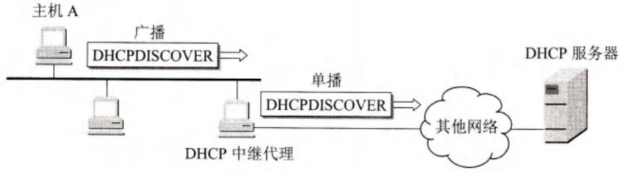
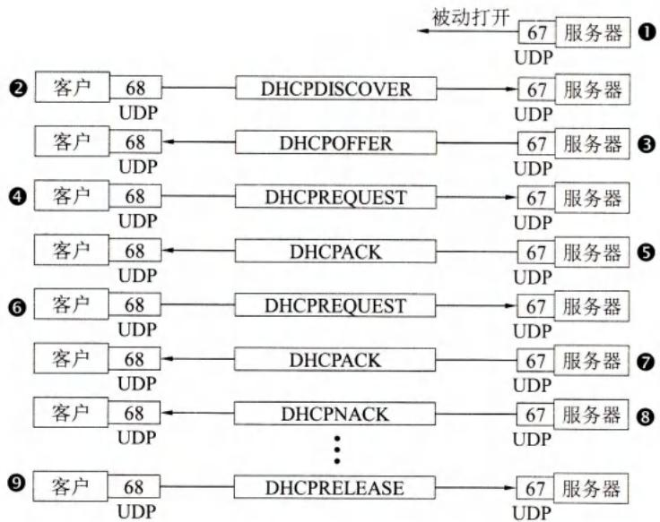

# 第6章-6.6-动态主机配置协议DHCP

## 基本信息

- **课程**：计算机网络
- **章节**：第6章 6.6节 动态主机配置协议DHCP
- **日期**：2026-06-14
- **标签**：#DHCP #动态主机配置 #即插即用 #租用期 #中继代理

***

## 重点内容

### ⭐⭐⭐ 核心概念

1. **DHCP**：动态主机配置协议，提供即插即用连网，自动获取IP地址等配置信息
2. **需要配置的参数**：IP地址、子网掩码、默认路由器IP、域名服务器IP
3. **UDP协议**：DHCP客户端口68，DHCP服务器端口67
4. **DHCP中继代理**：路由器转发广播报文为单播报文，减少DHCP服务器数量
5. **租用期(lease period)**：临时IP地址的有效时间，由服务器决定
6. **工作过程**：发现(DHCPDISCOVER)→提供(DHCPOFFER)→请求(DHCPREQUEST)→确认(DHCPACK)

### ⭐⭐ 关键问题

- DHCP为什么使用广播发送发现报文？
- DHCP中继代理的作用？
- 租用期过半和87.5%时分别做什么？
- DHCP和手动配置IP地址的优缺点？

***

## 详细笔记

### 一、DHCP概述

**DHCP (Dynamic Host Configuration Protocol)** 提供**即插即用连网 (plug-and-play networking)**，允许计算机加入新网络时自动获取IP地址，无需手工配置。

**需要配置的协议参数**：

| 参数 | 说明 |
|------|------|
| IP地址 | 主机的网络地址 |
| 子网掩码 | 区分网络号和主机号 |
| 默认路由器IP | 默认网关 |
| 域名服务器IP | DNS服务器地址 |

**DHCP使用UDP协议**：
- DHCP客户端口：**68**
- DHCP服务器端口：**67**

***

### 二、DHCP中继代理

不愿在每个网络都设DHCP服务器（数量太多），因此使用**DHCP中继代理**（通常是一台路由器）。

| 过程 | 方式 |
|------|------|
| 主机→中继代理 | 广播发送DHCP发现报文 |
| 中继代理→服务器 | 单播转发发现报文 |
| 服务器→中继代理 | 单播发送提供报文 |
| 中继代理→主机 | 发回提供报文 |

#### 📷 图6-18 DHCP中继代理以单播方式转发发现报文



> 📚 **课本出处**：图6-18 DHCP中继代理收到广播报文后，以单播方式转发给DHCP服务器。

***

### 三、租用期

DHCP分配的IP地址是**临时的**，有效时间称为**租用期 (lease period)**。
- 租用期由DHCP服务器决定（如1小时）
- 用4字节二进制表示，单位秒，范围1秒~136年

***

### 四、DHCP工作过程

#### 📷 图6-19 DHCP协议的工作过程



> 📚 **课本出处**：图6-19 DHCP客户通过发现→提供→请求→确认获取IP地址。

| 步骤 | 过程 |
|------|------|
| ① | DHCP服务器被动打开UDP端口67，等待报文 |
| ② | DHCP客户从UDP端口68发送**DHCP发现报文** (DHCPDISCOVER)，目的IP全1（广播），源IP全0 |
| ③ | 收到发现报文的服务器都发送**DHCP提供报文** (DHCPOFFER)，客户可能收到多个 |
| ④ | 客户选择一个服务器，发送**DHCP请求报文** (DHCPREQUEST) |
| ⑤ | 被选择的服务器发送**确认报文** (DHCPACK)，客户进入**已绑定状态**，IP与MAC绑定 |
| ⑥ | 租用期过半(T₁=0.5T)，客户发送请求报文要求更新租用期 |
| ⑦ | 服务器同意则发回确认报文，客户获得新租用期 |
| ⑧ | 服务器不同意则发回否认报文(DHCPNACK)，客户停止使用IP，重新申请 |
| ⑨ | 客户可随时发送**释放报文** (DHCPRELEASE)提前终止租用期 |

**T₁和T₂计时器**：
- T₁ = 0.5T：请求更新租用期
- T₂ = 0.875T：若服务器不响应，重新发送请求

***

## 疑问与思考

### ❓ 待解决问题

#### 1. DHCP为什么使用广播发送发现报文？

**📚 课本出处**：第6章 6.6节

因为DHCP客户此时还不知道DHCP服务器在什么地方，也不知道自己的IP地址（还没有分配），所以：
- 目的IP地址置为全1（255.255.255.255），广播给本地网络所有主机
- 源IP地址设为全0（0.0.0.0），因为还没有自己的IP地址
- 只有DHCP服务器才会对此广播报文进行回答

#### 2. DHCP中继代理的作用？

**📚 课本出处**：第6章 6.6节

不愿意在每个网络上都设置一个DHCP服务器，否则DHCP服务器数量太多。DHCP中继代理（通常是一台路由器）的作用：
- 收到主机广播的发现报文后，以单播方式向DHCP服务器转发
- 收到服务器的提供报文后，再发回给主机
- 实现跨网络的DHCP服务，减少服务器数量

#### 3. 租用期过半和87.5%时分别做什么？

**📚 课本出处**：第6章 6.6节

| 时间点 | 动作 |
|--------|------|
| **0.5T（T₁超时）** | 发送DHCPREQUEST请求更新租用期 |
| **0.875T（T₂超时）** | 若服务器未响应，重新发送DHCPREQUEST |
| **T（租用期结束）** | 必须停止使用IP地址 |

这样设计的好处：
- 0.5T时提前请求更新，给服务器足够的响应时间
- 0.875T时再次请求，作为备份机制
- 避免租用期结束后才请求，导致IP地址中断

#### 4. DHCP和手动配置IP地址的优缺点？

**📚 课本出处**：第6章 6.6节

| 配置方式 | 优点 | 缺点 |
|----------|------|------|
| **手动配置** | 固定不变，适合服务器 | 麻烦、容易出错、不适合移动设备 |
| **DHCP自动配置** | 即插即用、方便移动、减少错误 | IP地址临时，可能变化 |

### 💡 个人理解

- DHCP的"即插即用"是现代网络的基础，没有DHCP，大型网络的管理将极其困难。
- DHCP中继代理的设计很巧妙，用路由器转发广播为单播，既减少了服务器数量，又解决了广播不能跨路由器的问题。
- 租用期机制设计合理：0.5T和0.875T两个时间点确保了IP地址的连续性，不会因为服务器短暂不响应就导致断网。
- DHCP发现报文的源IP为全0、目的IP为全1，这是一个特殊但合理的场景——客户还没有IP地址，但必须发送报文。

***

## 核心考点总结

### ⭐⭐⭐ 必考内容

1. **DHCP基本概念**

| 项目 | 内容 |
|------|------|
| 全称 | Dynamic Host Configuration Protocol |
| 功能 | 自动配置IP地址等网络参数 |
| 特点 | 即插即用连网 |
| 协议 | UDP |
| 客户端口 | 68 |
| 服务器端口 | 67 |

2. **需要配置的参数**

| 参数 | 说明 |
|------|------|
| IP地址 | 主机网络地址 |
| 子网掩码 | 区分网络号和主机号 |
| 默认路由器IP | 默认网关 |
| 域名服务器IP | DNS服务器地址 |

3. **DHCP工作过程**

```
DHCPDISCOVER（发现）→ DHCPOFFER（提供）→ DHCPREQUEST（请求）→ DHCPACK（确认）
```

| 报文类型 | 方向 | 说明 |
|----------|------|------|
| DHCPDISCOVER | 客户→服务器（广播） | 发现DHCP服务器 |
| DHCPOFFER | 服务器→客户 | 提供IP地址等配置信息 |
| DHCPREQUEST | 客户→服务器 | 请求使用提供的IP地址 |
| DHCPACK | 服务器→客户 | 确认，客户进入已绑定状态 |
| DHCPNACK | 服务器→客户 | 否认，客户需重新申请 |
| DHCPRELEASE | 客户→服务器 | 客户提前终止租用期 |

4. **租用期机制**

| 时间点 | 动作 |
|--------|------|
| 0.5T（T₁） | 请求更新租用期 |
| 0.875T（T₂） | 服务器未响应则重新请求 |
| T（结束） | 停止使用IP地址 |

5. **DHCP中继代理**
- 通常是一台路由器
- 将广播的发现报文以单播转发给DHCP服务器
- 减少DHCP服务器数量

### 📌 易混淆点辨析

| 概念 | 说明 |
|------|------|
| **DHCP发现报文源IP** | 全0（0.0.0.0），因为还没有分配IP地址 |
| **DHCP发现报文目的IP** | 全1（255.255.255.255），广播 |
| **DHCP端口** | 客户68，服务器67（UDP） |
| **已绑定状态** | IP地址和MAC地址完成绑定，可以开始使用 |
| **租用期** | 临时IP地址的有效时间，由服务器决定 |
| **DHCP vs 静态IP** | DHCP自动分配、临时；静态手动配置、永久 |

### 📝 常见考题类型

1. **简答题**：
   - DHCP的作用和特点？
   - DHCP工作过程的四个主要步骤？
   - DHCP中继代理的作用？
   - 租用期过半和87.5%时分别做什么？
   - 为什么DHCP发现报文的源IP是全0？
2. **选择题/判断题**：
   - DHCP使用TCP协议（✗，使用UDP）
   - DHCP服务器端口是67（✓）
   - DHCP客户端口是68（✓）
   - DHCP分配的IP地址是永久的（✗，是临时的）
   - DHCP中继代理通常是一台路由器（✓）
   - 租用期由客户决定（✗，由服务器决定）

***

## 相关链接

### 本节涉及图片

- [图6-18 DHCP中继代理以单播方式转发发现报文](../../../images/13c845c64b3876b95d396420e5ae03237dd348e1a46e527acb77e5bf8fe82769.jpg)
- [图6-19 DHCP协议的工作过程](../../../images/27aba71d2b1b795463d9375bc0459256f15f198c7df1e4ac5f0dc2882a622df0.jpg)

### 关联章节

- [第6章-6.1-域名系统DNS](./第6章-6.1-域名系统DNS.md) - DHCP需要配置域名服务器IP
- [第6章-6.5-电子邮件](./第6章-6.5-电子邮件.md) - 邮件服务器也可使用DHCP获取IP
- [第4章-4.2-网际协议IP](../../第4章-网络层/第4章-4.2-网际协议IP.md) - IP地址分配相关
- [第4章-4.3-划分子网和构造超网](../../第4章-网络层/第4章-4.3-划分子网和构造超网.md) - 子网掩码配置相关

***

*笔记创建时间：2026-06-14*
