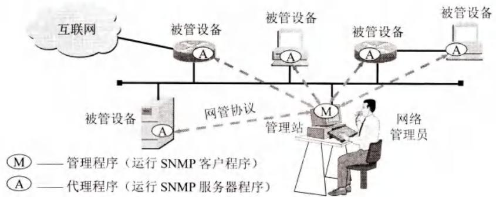
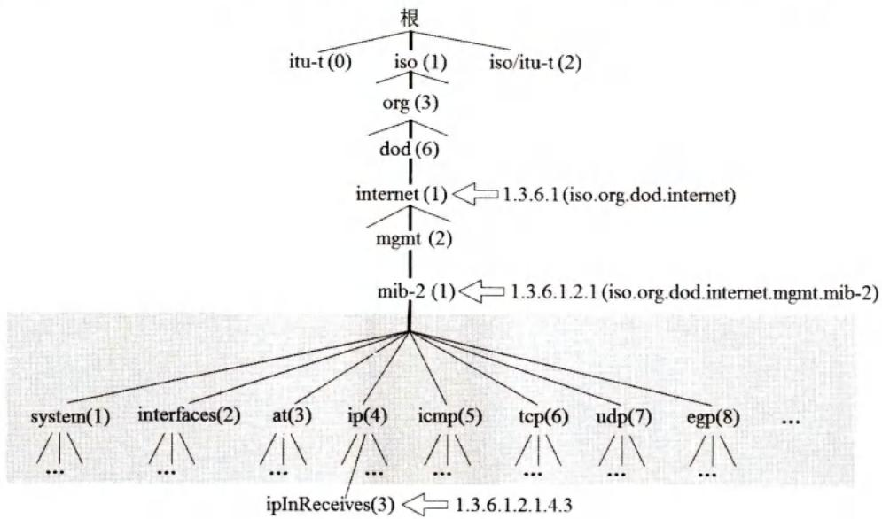
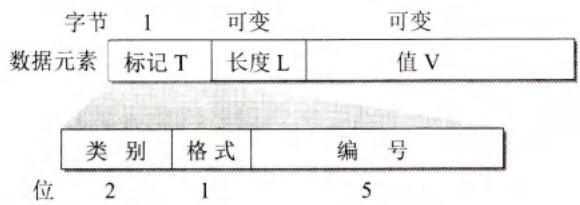

# 第6章-6.7-简单网络管理协议SNMP

## 基本信息

- **课程**：计算机网络
- **章节**：第6章 6.7节 简单网络管理协议SNMP
- **日期**：2026-06-14
- **标签**：#SNMP #网络管理 #SMI #MIB #代理 #陷阱 #探询

***

## 重点内容

### ⭐⭐⭐ 核心概念

1. **SNMP**：简单网络管理协议，设计思想是尽可能简单
2. **网络管理三构件**：管理站、被管设备、代理(agent)
3. **SNMP三部分**：SMI（建立规则）、MIB（变量说明）、SNMP（完成动作）
4. **SMI**：管理信息结构，定义对象命名规则、数据类型、编码规则（TLV）
5. **MIB**：管理信息库，被管对象的集合，对象命名树1.3.6.1.2.1下
6. **探询(polling)**：管理进程定时发送探询信息
7. **陷阱(trap)**：代理检测到事件时主动发送的信息
8. **UDP端口**：代理161（Get/Set/响应），管理端162（trap）

### ⭐⭐ 关键问题

- SNMP三部分各自的作用？
- 探询和陷阱的区别和各自优缺点？
- 为什么SNMP使用UDP而不是TCP？
- 对象命名树的结构？

***

## 详细笔记

### 一、网络管理的基本概念

**网络管理**：对硬件、软件和人力的使用、综合与协调，对网络资源进行监视、测试、配置、分析、评价和控制。

**网络管理模型的主要构件**：

| 构件 | 说明 |
|------|------|
| **管理站（管理器）** | 网络管理系统的核心，运行管理程序，由网络管理员操作 |
| **被管设备** | 主机、路由器、打印机等，包含被管对象 |
| **代理(agent)** | 被管设备中运行的程序，与管理站通信 |
| **网络管理协议** | 管理站和代理之间的通信规则 |

#### 📷 图6-20 网络管理的一般模型



> 📚 **课本出处**：图6-20 管理程序（M）与代理程序（A）按客户-服务器方式工作。

**SNMP核心设计思想**：尽可能简单。

**SNMP版本**：SNMPv1 → SNMPv2 → SNMPv3（最大改进是安全特性）

**委托代理(proxy agent)**：当网络元素不使用SNMP协议时，提供协议转换和过滤功能。

**SNMP三部分**：

| 部分 | 作用 | 类比程序设计 |
|------|------|-------------|
| **SMI** | 定义命名对象和对象类型的规则 | 编程语言规则 |
| **MIB** | 创建命名对象，规定类型 | 变量说明 |
| **SNMP** | 完成网管动作（读写对象值） | 存储/改变变量值 |

***

### 二、管理信息结构SMI

SMI功能：
1. 被管对象怎样命名
2. 存储被管对象的数据类型
3. 管理数据如何编码

#### 1. 被管对象的命名

所有被管对象必须处在**对象命名树(object naming tree)**上。

#### 📷 图6-21 SMI规定所有被管对象必须在命名树上



> 📚 **课本出处**：图6-21 对象命名树根下有三个顶级对象：ITU-T(0)、ISO(1)、ISO/ITU-T联合(2)。

**重要节点**：internet节点的对象标识符为 **1.3.6.1**
- mgmt(2) → mib-2(1) → 对象标识符 **1.3.6.1.2.1**

#### 2. 数据类型

| 简单类型 | 说明 |
|----------|------|
| INTEGER | 4字节整数 |
| OCTET STRING | 字节串 |
| OBJECT IDENTIFIER | 对象标识符 |
| IPAddress | 4字节IP地址 |
| Counter32 | 计数器，到最大值回0 |
| TimeTicks | 时间计数，1/100秒为单位 |

#### 3. 编码方法

**BER (Basic Encoding Rule)**：T-L-V编码

#### 📷 图6-22 用TLV方法进行编码



> 📚 **课本出处**：图6-22 T字段(类型)-L字段(长度)-V字段(值)。

| 字段 | 说明 |
|------|------|
| **T (Tag)** | 数据类型，1字节 |
| **L (Length)** | V字段长度 |
| **V (Value)** | 数据值 |

***

### 三、管理信息库MIB

**MIB**：在互联网网管框架中被管对象的集合，是一个虚拟的信息存储器。

**mib-2包含的信息类别**：

| 类别 | 标号 | 信息 |
|------|------|------|
| system | (1) | 主机或路由器的操作系统 |
| interfaces | (2) | 各种网络接口 |
| ip | (4) | IP软件 |
| icmp | (5) | ICMP软件 |
| tcp | (6) | TCP软件 |
| udp | (7) | UDP软件 |

**示例**：ipInReceives（收到的IP数据报数）的对象标识符为 **1.3.6.1.2.1.4.3.0**

***

### 四、SNMP的协议数据单元和报文

**两种基本管理功能**：

| 操作 | 功能 | 报文 |
|------|------|------|
| **读** | 检测被管对象状况 | Get |
| **写** | 改变被管对象状况 | Set |

**探询(polling)**：管理进程定时向被管设备周期性发送探询信息。
- 好处：系统简单，限制管理信息通信量
- 缺点：不够灵活，设备数目不能太多，开销较大

**陷阱(trap)**：被管对象代理检测到事件时，不经询问主动发送的信息。
- 仅在严重事件发生时发送
- 信息简单，字节数少

**SNMP使用无连接的UDP**：
- 代理端使用熟知端口 **161**（接收Get/Set，发送响应）
- 管理端使用熟知端口 **162**（接收trap报文）

***

## 疑问与思考

### ❓ 待解决问题

#### 1. SNMP三部分各自的作用？

**📚 课本出处**：第6章 6.7.1节

| 部分 | 作用 | 类比 |
|------|------|------|
| **SMI** | 建立规则：命名对象、定义数据类型、编码规则 | 编程语言的语法规则 |
| **MIB** | 对变量进行说明：创建命名对象、规定类型 | 程序中的变量声明 |
| **SNMP** | 完成网管动作：读取和改变对象值 | 程序中的赋值和操作语句 |

三者关系：SMI建立规则 → MIB按规则说明变量 → SNMP按规则操作变量。

#### 2. 探询和陷阱的区别和各自优缺点？

**📚 课本出处**：第6章 6.7.4节

| 机制 | 方向 | 触发方式 | 优点 | 缺点 |
|------|------|----------|------|------|
| **探询(polling)** | 管理站→代理 | 定时周期性发送 | 系统简单，限制通信量 | 不够灵活，设备数受限，开销大 |
| **陷阱(trap)** | 代理→管理站 | 事件触发，主动发送 | 及时报告严重事件，信息简单 | 参数受限 |

SNMP结合两者：用探询维持实时监视，用陷阱报告特殊事件。

#### 3. 为什么SNMP使用UDP而不是TCP？

**📚 课本出处**：第6章 6.7.4节

- **开销小**：UDP是无连接的，报文开销比TCP小很多
- **简单**：符合SNMP"尽可能简单"的设计思想
- **实时性**：网络管理需要定时探询，UDP更适合周期性发送
- **陷阱机制**：trap需要代理主动发送，UDP更适合这种单向通知

缺点：UDP不保证可靠交付，但网络管理报文可以容忍偶尔的丢失。

#### 4. 对象命名树的结构？

**📚 课本出处**：第6章 6.7.2节

```
根
├── 0: ITU-T
├── 1: ISO
│   └── 3: org
│       └── 6: dod (美国国防部)
│           └── 1: internet
│               ├── 1: directory
│               ├── 2: mgmt (管理)
│               │   └── 1: mib-2 → 1.3.6.1.2.1
│               ├── 3: experimental
│               └── 4: private
└── 2: ISO/ITU-T联合
```

### 💡 个人理解

- SNMP的"简单"是相对于OSI网络管理标准而言的，但发展到SNMPv3后，安全特性的加入使协议已经相当庞大。
- SMI、MIB、SNMP三者的分工非常清晰，类似于编程语言中的语法规则、变量声明和程序语句，这种类比有助于理解。
- 探询和陷阱的结合是SNMP高效的关键：探询保证常规监控，陷阱保证异常及时上报。
- 对象命名树采用层次结构，就像DNS的域名树一样，通过点分数字标识唯一路径。

***

## 核心考点总结

### ⭐⭐⭐ 必考内容

1. **SNMP基本概念**

| 项目 | 内容 |
|------|------|
| 全称 | Simple Network Management Protocol |
| 设计思想 | 尽可能简单 |
| 版本 | SNMPv1, SNMPv2, SNMPv3（最大改进：安全特性） |
| 传输协议 | UDP |
| 代理端口 | 161（Get/Set/响应） |
| 管理端口 | 162（trap） |

2. **SNMP三部分**

| 部分 | 全称 | 作用 |
|------|------|------|
| SMI | Structure of Management Information | 建立命名和编码规则 |
| MIB | Management Information Base | 被管对象的集合 |
| SNMP | Simple Network Management Protocol | 读写对象值，完成网管动作 |

3. **两种管理机制**

| 机制 | 方向 | 特点 |
|------|------|------|
| 探询(polling) | 管理站→代理 | 定时周期性，维持实时监视 |
| 陷阱(trap) | 代理→管理站 | 事件触发，报告特殊事件 |

4. **SMI核心**
- 对象命名树：所有被管对象必须在树上
- internet节点：1.3.6.1
- mib-2节点：1.3.6.1.2.1
- 编码：T-L-V（类型-长度-值）

5. **MIB核心**
- 虚拟信息存储器
- 常见类别：system, interfaces, ip, icmp, tcp, udp

### 📌 易混淆点辨析

| 概念 | 说明 |
|------|------|
| **管理站 vs 代理** | 管理站运行管理程序（客户），代理运行代理程序（服务器） |
| **SMI vs MIB** | SMI是规则，MIB是按规则定义的对象集合 |
| **探询 vs 陷阱** | 探询是管理站主动问，陷阱是代理主动报 |
| **代理 vs 委托代理** | 代理运行在被管设备上，委托代理用于协议转换 |
| **端口161 vs 162** | 161是代理接收Get/Set，162是管理站接收trap |

### 📝 常见考题类型

1. **简答题**：
   - SNMP的设计思想？
   - SNMP三部分及其作用？
   - 探询和陷阱的区别？
   - 为什么SNMP使用UDP？
   - 对象命名树中internet和mib-2的标识符？
2. **选择题/判断题**：
   - SNMP使用TCP协议（✗，使用UDP）
   - SNMP代理端口是161（✓）
   - SNMP管理站接收trap的端口是162（✓）
   - SNMPv3最大改进是安全特性（✓）
   - 探询是代理主动向管理站发送信息（✗，是管理站向代理发送）
   - 陷阱是代理检测到事件时主动发送（✓）
   - SMI定义被管对象的具体值（✗，SMI定义规则，不定义具体值）

***

## 相关链接

### 本节涉及图片

- [图6-20 网络管理的一般模型](../../../images/e04bab27258410b27b951e2d1b2fbae9116efc8a5c798f16a9214a8ee1b0c675.jpg)
- [图6-21 SMI规定所有被管对象必须在命名树上](../../../images/36cc692137355669a6c3e0506868e34991a06a9cbcc3a1fc086d077a4a90390f.jpg)
- [图6-22 用TLV方法进行编码](../../../images/efc51208e556e92d867d8ef547b2b852781e5bec40cfd7d3b2e9bb6e807694ec.jpg)

### 关联章节

- [第5章-5.1-运输层协议概述](../../第5章-运输层/第5章-5.1-运输层协议概述.md) - SNMP使用UDP
- [第6章-6.1-域名系统DNS](./第6章-6.1-域名系统DNS.md) - 对象命名树与DNS域名树的类比

***

*笔记创建时间：2026-06-14*
