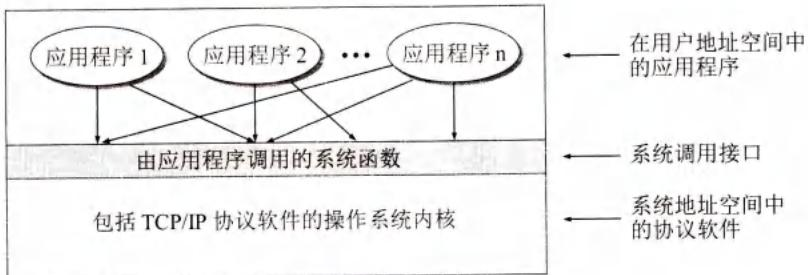
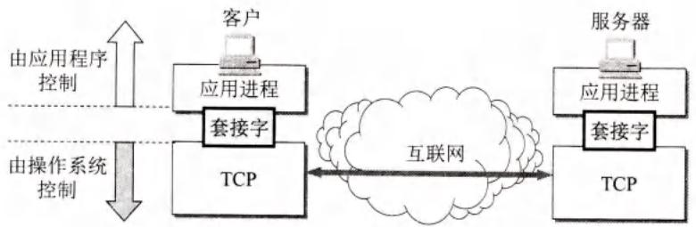
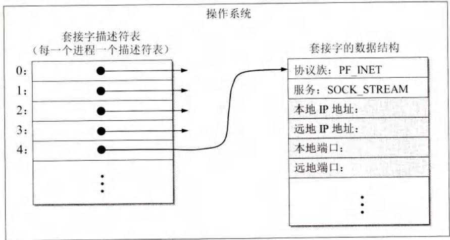
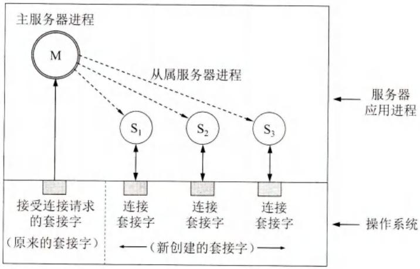
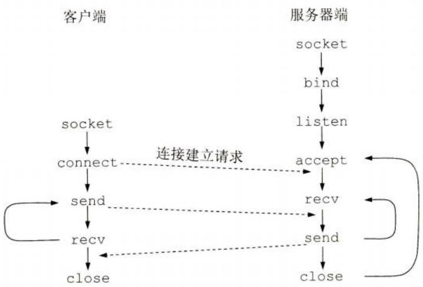

# 第6章-6.8-应用进程跨越网络的通信

## 基本信息

- **课程**：计算机网络
- **章节**：第6章 6.8节 应用进程跨越网络的通信
- **日期**：2026-06-14
- **标签**：#套接字 #socket #系统调用 #API #网络编程

***

## 重点内容

### ⭐⭐⭐ 核心概念

1. **系统调用(system call)**：应用程序和操作系统之间传递控制权的机制
2. **API (应用编程接口)**：定义标准系统调用函数，如套接字接口、WinSock
3. **套接字(socket)**：应用进程和运输层协议之间的接口
4. **套接字描述符**：操作系统分配的整数，标识网络通信资源
5. **常用系统调用**：socket、bind、listen、accept、connect、send、recv、close
6. **并发服务器**：主进程接受连接，创建从属进程处理连接

### ⭐⭐ 关键问题

- 套接字的作用？
- TCP服务器和客户端的系统调用顺序？
- UDP服务器和TCP服务器的系统调用区别？
- 并发服务器如何实现同时处理多个连接？

***

## 详细笔记

### 一、系统调用和应用编程接口

**系统调用(system call)**：应用程序和操作系统之间传递控制权的机制。

**应用编程接口API**：系统调用接口，定义标准的系统调用函数。最著名的API：
- **套接字接口(socket interface)**：Berkeley UNIX
- **WinSock**：Windows版本
- **TLI**：AT&T UNIX系统V

#### 📷 图6-26 多个应用进程使用系统调用的机制



> 📚 **课本出处**：图6-26 应用进程通过系统调用接口获得操作系统服务。

**套接字(socket)**：应用进程和运输层协议之间的接口。

#### 📷 图6-27 套接字成为应用进程与运输层协议的接口



> 📚 **课本出处**：图6-27 套接字是应用进程和TCP/UDP之间的接口。

**套接字描述符(socket descriptor)**：操作系统分配的整数标识符，代表网络通信所需资源的总和。

#### 📷 图6-28 调用socket创建套接字



> 📚 **课本出处**：图6-28 套接字数据结构包含协议族、服务类型、本地和远地地址及端口。

***

### 二、几种常用的系统调用

#### 1. 连接建立阶段

| 系统调用 | 作用 | 使用方 |
|----------|------|--------|
| **socket()** | 创建套接字，分配资源 | 客户和服务器 |
| **bind()** | 指明套接字的本地地址（端口号+IP） | 主要是服务器 |
| **listen()** | 设置套接字为被动方式，接受连接请求 | TCP服务器 |
| **accept()** | 提取客户的连接请求，创建新套接字 | TCP服务器 |
| **connect()** | 与远地服务器建立连接（主动打开） | TCP客户 |

#### 📷 图6-29 并发方式工作的服务器



> 📚 **课本出处**：图6-29 主服务器进程用原套接字接受请求，为每个连接创建从属服务器进程和新套接字。

**并发服务器工作方式**：
- 主服务器进程调用accept，为每个新连接创建新套接字
- 同时创建从属服务器进程处理新连接
- 主服务器继续用原套接字接受下一个请求

#### 2. 数据传送阶段

| 系统调用 | 作用 |
|----------|------|
| **send()** | 传送数据 |
| **recv()** | 接收数据 |

#### 3. 连接释放阶段

| 系统调用 | 作用 |
|----------|------|
| **close()** | 释放连接，撤销套接字 |

#### 📷 图6-30 系统调用使用顺序的例子



> 📚 **课本出处**：图6-30 TCP连接中系统调用的使用顺序。

**TCP服务器系统调用顺序**：
```
socket() → bind() → listen() → accept() → recv()/send() → close()
```

**TCP客户系统调用顺序**：
```
socket() → connect() → send()/recv() → close()
```

> **注意**：UDP服务器不使用listen和accept，因为UDP是无连接的。

***

## 疑问与思考

### ❓ 待解决问题

#### 1. 套接字的作用？

**📚 课本出处**：第6章 6.8.1节

套接字(socket)是应用进程和运输层协议之间的接口：
- 应用进程通过套接字请求操作系统分配网络通信资源
- 操作系统用套接字描述符（小整数）标识这些资源
- 应用进程的所有网络操作（建立连接、收发数据等）都通过套接字描述符进行
- 通信完毕后，通过close关闭套接字，操作系统回收资源

#### 2. TCP服务器和客户端的系统调用顺序？

**📚 课本出处**：第6章 6.8.2节

**TCP服务器**：
```
socket() → bind() → listen() → accept() → [recv()/send()循环] → close()
```

**TCP客户**：
```
socket() → connect() → [send()/recv()循环] → close()
```

#### 3. UDP服务器和TCP服务器的系统调用区别？

**📚 课本出处**：第6章 6.8.2节

| 区别 | TCP服务器 | UDP服务器 |
|------|-----------|-----------|
| listen() | 需要 | 不需要 |
| accept() | 需要 | 不需要 |
| connect() | 被动等待连接 | 无连接 |
| 工作方式 | 面向连接 | 无连接 |

UDP服务器在创建套接字并bind后，直接使用recvfrom/sendto收发数据，不需要建立连接。

#### 4. 并发服务器如何实现同时处理多个连接？

**📚 课本出处**：第6章 6.8.2节

并发服务器的工作方式：
1. 主服务器进程调用accept接受连接请求
2. accept为每个新连接创建一个**新套接字**（连接套接字）
3. 主服务器进程创建一个**从属服务器进程**来处理该连接
4. 从属进程使用新套接字与客户通信
5. 主服务器进程继续用原套接字调用accept，接受下一个连接请求

这样，任一时刻服务器中有一个主进程和零个或多个从属进程同时运行。

### 💡 个人理解

- 套接字的概念是网络编程的核心，理解套接字描述符、套接字数据结构对于后续学习网络编程非常重要。
- bind的作用很容易被忽略：服务器必须bind到熟知端口号，这样客户才知道连接哪个端口；而客户通常不需要bind，由系统自动分配临时端口。
- listen和accept是TCP服务器特有的：listen将套接字设为被动模式，accept真正接受连接并创建新套接字。
- 并发服务器的实现方式（主进程+从属进程）是理解高性能服务器设计的基础。

***

## 核心考点总结

### ⭐⭐⭐ 必考内容

1. **套接字基本概念**

| 项目 | 内容 |
|------|------|
| 套接字(socket) | 应用进程和运输层协议的接口 |
| 套接字描述符 | 操作系统分配的整数，标识网络资源 |
| API | 应用编程接口，如Berkeley套接字、WinSock |

2. **常用系统调用**

| 系统调用 | 作用 | 使用方 |
|----------|------|--------|
| socket() | 创建套接字 | 客户和服务器 |
| bind() | 绑定本地地址 | 主要是服务器 |
| listen() | 设为被动方式 | TCP服务器 |
| accept() | 接受连接，创建新套接字 | TCP服务器 |
| connect() | 主动建立连接 | TCP客户 |
| send() | 发送数据 | 双方 |
| recv() | 接收数据 | 双方 |
| close() | 关闭套接字 | 双方 |

3. **TCP系统调用顺序**

- **服务器**：socket → bind → listen → accept → recv/send → close
- **客户**：socket → connect → send/recv → close

4. **UDP与TCP服务器的区别**
- UDP服务器不使用listen和accept
- UDP使用recvfrom/sendto代替recv/send

### 📌 易混淆点辨析

| 概念 | 说明 |
|------|------|
| **套接字 vs 套接字描述符** | 套接字是数据结构，描述符是标识它的整数 |
| **bind()** | 服务器绑定熟知端口，客户通常不调用bind |
| **listen()** | 仅TCP服务器使用，设为被动接受连接 |
| **accept()** | 创建新套接字处理连接，原套接字继续监听 |
| **connect()** | TCP客户主动发起连接（三次握手） |
| **并发服务器** | 主进程接受请求，从属进程处理连接 |

### 📝 常见考题类型

1. **简答题**：
   - 套接字的作用？
   - TCP服务器和客户端的系统调用顺序？
   - UDP服务器和TCP服务器的系统调用区别？
   - 并发服务器如何实现同时处理多个连接？
2. **选择题/判断题**：
   - 套接字是应用进程和运输层之间的接口（✓）
   - UDP服务器需要使用listen和accept（✗）
   - bind()主要是服务器使用的（✓）
   - accept()会创建一个新的套接字（✓）
   - 客户进程需要调用listen()（✗）

***

## 相关链接

### 本节涉及图片

- [图6-26 多个应用进程使用系统调用的机制](../../../images/ae44b0c65021f0e11ba2a4e57b2cbb2d5e7453841725ab0fdb06fc5b698cbf62.jpg)
- [图6-27 套接字成为应用进程与运输层协议的接口](../../../images/823edd0f117ac953fb3645120bc3a23763f222368917ffaf1e2fdb1b6e40239b.jpg)
- [图6-28 调用socket创建套接字](../../../images/d483efedef5fee30f4d5c2d77ef0a4a56c92fdb00c0cff949071be02c95ddbf3.jpg)
- [图6-29 并发方式工作的服务器](../../../images/2bded44e7394608ad6e5b78177d1040ef36068bd1a8783f5aa8824de99734941.jpg)
- [图6-30 系统调用使用顺序的例子](../../../images/3b40617aee6ad096377b669634ec88c2620e8b372f30391fd31a89362ba41027.jpg)

### 关联章节

- [第5章-5.3-运输层协议概述](../../第5章-运输层/第5章-5.3-运输层协议概述.md) - 套接字是应用进程和运输层的接口
- [第5章-5.5-TCP报文段的首部格式](../../第5章-运输层/第5章-5.5-TCP报文段的首部格式.md) - TCP连接建立（三次握手）
- [第6章-6.1-域名系统DNS](./第6章-6.1-域名系统DNS.md) - 网络应用使用套接字通信

***

*笔记创建时间：2026-06-14*
