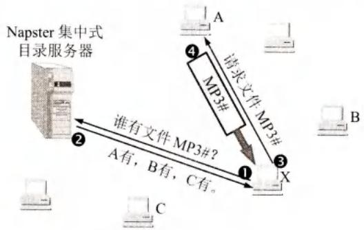
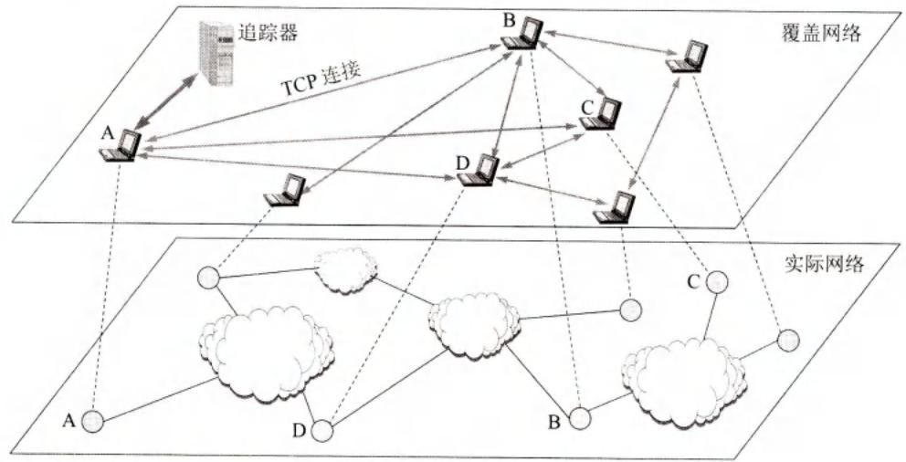
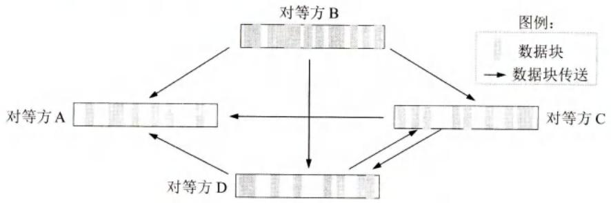
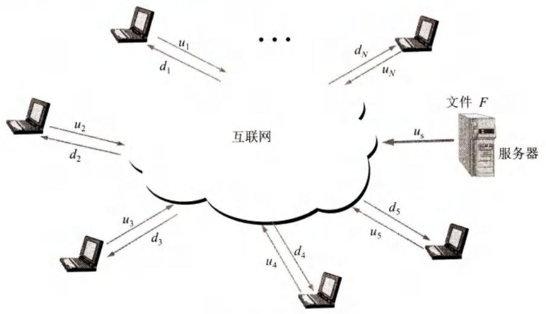
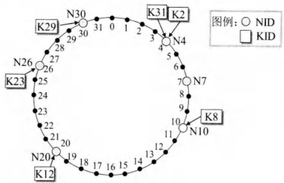
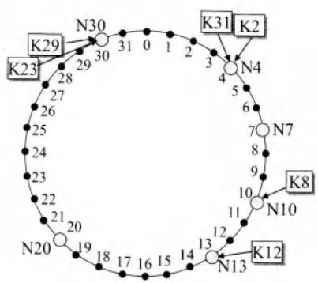
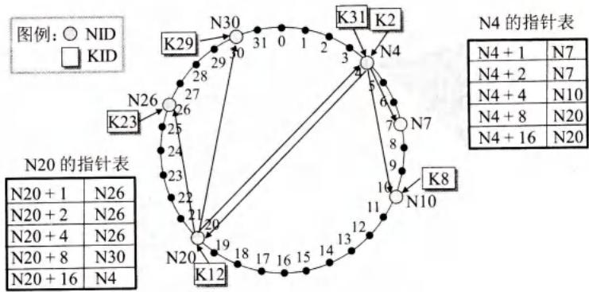

# 第6章-6.9-P2P应用

## 基本信息

- **课程**：计算机网络
- **章节**：第6章 6.9节 P2P应用
- **日期**：2026-06-14
- **标签**：#P2P #Napster #BitTorrent #BT #DHT #Chord #文件分发

***

## 重点内容

### ⭐⭐⭐ 核心概念

1. **P2P**：对等网络，没有固定服务器，对等方直接交互
2. **Napster**：第一代P2P，集中式目录+分散式传输
3. **BT (BitTorrent)**：第三代P2P，洪流、追踪器、文件块、最稀有的优先、疏通机制
4. **P2P文件分发分析**：P2P方式分发时间增长缓慢，优于客户-服务器方式
5. **DHT**：分布式散列表，用于P2P中搜索对象
6. **Chord算法**：环形覆盖网络，使用指针表加速查找至O(log₂N)

### ⭐⭐ 关键问题

- Napster的工作方式及其缺点？
- BT的"最稀有的优先"和"疏通"机制？
- 客户-服务器和P2P文件分发时间的对比？
- Chord环的映射规则和查找效率？

***

## 详细笔记

### 一、P2P应用概述

**P2P (Peer-to-Peer)**：没有（或极少）固定服务器，绝大多数交互使用对等方式进行。

**P2P文件分发的优势**：不使用集中式媒体服务器，文件在普通用户之间传输，解决了集中式服务器的瓶颈问题。

***

### 二、具有集中目录服务器的P2P工作方式

**Napster**：第一代P2P文件共享程序。

| 特点 | 说明 |
|------|------|
| 文件定位 | **集中式**（客户-服务器方式），目录服务器存储索引 |
| 文件传输 | **分散式**（P2P方式），用户之间直接传输 |
| 缺点 | 可靠性差、性能瓶颈、侵犯版权 |

#### 📷 图6-31 Napster的工作过程

> 📚 **课本出处**：图6-31 用户X向目录服务器查询→获取IP地址列表→选择下载地点→P2P传输。

***

### 三、具有全分布式结构的P2P文件共享程序

**第二代：Gnutella**：不使用集中式目录服务器，使用**洪泛法**查询。

**第三代：BT (BitTorrent)**：

| 概念 | 说明 |
|------|------|
| **洪流(torrent)** | 参与某个文件分发的所有对等方集合 |
| **追踪器(tracker)** | 基础设施节点，跟踪洪流中的对等方 |
| **文件块(chunk)** | 数据单元，典型大小256KB |
| **最稀有的优先** | 优先请求副本最少的文件块 |
| **已疏通的(unchoked)** | 接收数据率最高的4个相邻对等方 |

#### 📷 图6-32 在覆盖网络中对等方的相邻关系

> 📚 **课本出处**：图6-32 对等方A与B、C、D建立TCP连接成为相邻对等方。

#### 📷 图6-33 对等方之间互相传送文件数据块

> 📚 **课本出处**：图6-33 多个对等方之间同时互相传送不同的数据块。

**BT的两个重要决策**：
1. **请求哪些文件块**：最稀有的优先（rarest first）
2. **向谁发送文件块**：优先传给接收数据率最高的4个相邻对等方（已疏通）；每隔30秒随机选一个额外对等方发送

***

### 四、P2P文件分发的分析

#### 📷 图6-34 文件分发的例子

> 📚 **课本出处**：图6-34 N台主机从服务器下载文件F，分析客户-服务器和P2P方式的分发时间。

**客户-服务器方式**：

$$
T_{\mathrm{cs}} = \max \left\{ \frac{NF}{u_{\mathrm{s}}}, \frac{F}{d_{\min}} \right\}
$$

- $N$：主机数，$F$：文件长度，$u_s$：服务器上传速率，$d_{\min}$：最慢主机下载速率
- 主机数增大时，$T_{\mathrm{cs}}$ 与 $N$ 成正比

**P2P方式**：

$$
T_{\mathrm{P2P}} \geqslant \max \left\{ \frac{F}{u_{\mathrm{s}}}, \frac{F}{d_{\min}}, \frac{NF}{u_{\mathrm{T}}} \right\}
$$

- $u_{\mathrm{T}} = u_s + u_1 + u_2 + \ldots + u_N$：系统总上传速率
- 当 $N$ 很大时，$T_{\mathrm{P2P}}$ 增长缓慢，因为每个对等方也参与上传

**示例**：$F/u = 1$小时，$u_s = 10u$，$N = 30$
- 客户-服务器：$T_{\mathrm{cs}} = 3$ 小时
- P2P：$T_{\mathrm{P2P}} = 0.75$ 小时

***

### 五、在P2P对等方中搜索对象

**分布式散列表DHT (Distributed Hash Table)**：由大量对等方共同维护的散列表。

**Chord算法**：
- 使用SHA-1散列函数，标识符160位
- 节点按标识符值排成**环形覆盖网络**

#### 📷 图6-35 基于DHT的Chord环

> 📚 **课本出处**：图6-35 Chord环上节点NID映射到环上，KID映射到最接近的下一个NID。

**映射规则**：
- 节点标识符NID → 环上对应点
- 资源名标识符KID → 最接近的下一个NID（顺时针方向）

**查找效率**：
- 顺序遍历：$O(N)$ 步
- 使用**指针表(finger table)**：$O(\log_2 N)$ 步

#### 📷 图6-36 节点N4和N20的指针表

> 📚 **课本出处**：图6-36 指针表指向多个后继节点，加速查找（类似二分查找）。

***

## 疑问与思考

### ❓ 待解决问题

#### 1. Napster的工作方式及其缺点？

**📚 课本出处**：第6章 6.9.1节

**工作方式**：
1. 所有用户向Napster目录服务器报告自己拥有的文件
2. 目录服务器建立动态数据库，存储文件索引信息
3. 用户查询时，向目录服务器发出查询（客户-服务器方式）
4. 目录服务器返回存放文件的IP地址
5. 用户从指定地址下载文件（P2P方式）

**特点**：文件定位集中，文件传输分散。

**缺点**：
- 可靠性差（目录服务器单点故障）
- 性能瓶颈（用户多时）
- 侵犯版权（被法院判决间接侵害版权，被迫关闭）

#### 2. BT的"最稀有的优先"和"疏通"机制？

**📚 课本出处**：第6章 6.9.2节

**最稀有的优先(rarest first)**：
- 优先请求在相邻对等方中副本最少的文件块
- 原因：避免拥有稀有文件块的对等方退出洪流后无法收集完整文件

**疏通(unchoked)机制**：
- A持续测量从相邻对等方接收数据的速率
- 确定速率最高的4个相邻对等方，称为"已疏通的"
- A优先向这4个对等方发送文件块
- 每隔10秒重新计算数据率，可能修改这4个对等方
- 每隔30秒随机找一个额外对等方发送文件块，促进互惠

#### 3. 客户-服务器和P2P文件分发时间的对比？

**📚 课本出处**：第6章 6.9.3节

| 方式 | 分发时间 | 随N增长 |
|------|----------|---------|
| 客户-服务器 | $T_{cs} = \max\{NF/u_s, F/d_{min}\}$ | 与N成正比 |
| P2P | $T_{P2P} \geqslant \max\{F/u_s, F/d_{min}, NF/u_T\}$ | 增长缓慢 |

P2P优势：每个对等方也参与上传，系统总上传能力随N增加而增加。

#### 4. Chord环的映射规则和查找效率？

**📚 课本出处**：第6章 6.9.4节

**映射规则**：
- NID按标识符值映射到Chord环上对应点
- KID映射到与其值最接近的下一个NID（顺时针方向）

**查找效率**：
- 顺序遍历：$O(N)$ 步
- 使用指针表(finger table)：$O(\log_2 N)$ 步（类似二分查找）

### 💡 个人理解

- P2P的演进反映了去中心化的趋势：从Napster的半集中式，到Gnutella的全分布式洪泛，再到BT的追踪器协调，最后到DHT的结构化查找。
- BT的设计非常精巧：最稀有的优先保证文件块的多样性，疏通机制激励用户上传（互惠原则），随机选择额外对等方防止新用户无法加入。
- P2P文件分发的数学分析清楚地展示了其可扩展性优势：客户-服务器方式的服务器是瓶颈，而P2P方式中每个用户都是服务器。
- Chord环的指针表设计巧妙，通过增加少量指针将查找复杂度从线性降到对数，是分布式系统中经典的权衡设计。

***

## 核心考点总结

### ⭐⭐⭐ 必考内容

1. **三代P2P文件共享程序对比**

| 代 | 代表 | 特点 |
|----|------|------|
| 第一代 | Napster | 集中式目录+分散传输 |
| 第二代 | Gnutella | 全分布式，洪泛法查询 |
| 第三代 | BT | 洪流、追踪器、文件块、最稀有的优先 |

2. **BT核心机制**

| 概念 | 说明 |
|------|------|
| 洪流(torrent) | 参与文件分发的对等方集合 |
| 追踪器(tracker) | 跟踪洪流中的对等方 |
| 文件块(chunk) | 典型256KB |
| 最稀有的优先 | 优先请求副本最少的文件块 |
| 已疏通(unchoked) | 接收数据率最高的4个对等方，优先发送 |

3. **文件分发时间公式**

**客户-服务器**：

$$
T_{cs} = \max \left\{ \frac{NF}{u_s}, \frac{F}{d_{min}} \right\}
$$

**P2P**：

$$
T_{P2P} \geqslant \max \left\{ \frac{F}{u_s}, \frac{F}{d_{min}}, \frac{NF}{u_T} \right\}
$$

4. **DHT和Chord**
- DHT：分布式散列表，大量对等方共同维护
- Chord：环形覆盖网络
- 映射规则：KID → 最接近的下一个NID（顺时针）
- 查找效率：指针表加速到 $O(\log_2 N)$

### 📌 易混淆点辨析

| 概念 | 说明 |
|------|------|
| **Napster定位 vs 传输** | 定位集中（客户-服务器），传输分散（P2P） |
| **BT追踪器** | 只跟踪对等方，不存储文件 |
| **最稀有的优先** | 优先请求副本少的文件块，保证多样性 |
| **疏通机制** | 优先给上传速率高的对等方发送，激励互惠 |
| **P2P优势** | 每个对等方参与上传，总上传能力随N增加 |
| **Chord环** | 逻辑环，地理上相邻节点可能相距很远 |

### 📝 常见考题类型

1. **简答题**：
   - Napster的工作方式及其缺点？
   - BT的"最稀有的优先"和"疏通"机制？
   - 客户-服务器和P2P文件分发时间的对比？
   - Chord环的映射规则和查找效率？
2. **计算题**：
   - 给定参数计算客户-服务器和P2P的分发时间
3. **选择题/判断题**：
   - Napster的文件传输是集中的（✗，是分散的）
   - BT的追踪器存储文件内容（✗，只跟踪对等方）
   - P2P方式的分发时间随N线性增长（✗，增长缓慢）
   - Chord环顺序查找需要O(N)步（✓）
   - 使用指针表后Chord查找需要O(log₂N)步（✓）

***

## 相关链接

### 本节涉及图片

- [图6-31 Napster的工作过程](../../../images/58755f3a866897b5666b9cebfb78df56a02f1ec0fcd9394b6734769467891dda.jpg)
- [图6-32 在覆盖网络中对等方的相邻关系](../../../images/899d0a18aa7b93582d21278fa79794a4b5699c785e7f6aef92b6548bccedb9e6.jpg)
- [图6-33 对等方之间互相传送文件数据块](../../../images/5be325c20be6d82ed8902b2d5206f7ee0b723e8d90c2c9a5857e3de6998c067d.jpg)
- [图6-34 文件分发的例子](../../../images/7212d35a291d184c49db68f12f129553838297b18d62474d5224304eeb339d77.jpg)
- [图6-35 基于DHT的Chord环](../../../images/c6c6073df87305ded39cdd196769a5af8cf67f70e6a3a51c8e188ce52859f590.jpg)
- [图6-35 Chord环变化](../../../images/9a51f00699f363cdaa612f3feea71e9648cf634c489258f684d356f521abbc65.jpg)
- [图6-36 节点N4和N20的指针表](../../../images/80a7782453ce811d1a95c390e9dc66aa6ad6f7ed1ea9357c1a0d07323ab16cf8.jpg)

### 关联章节

- [第6章-6.1-域名系统DNS](./第6章-6.1-域名系统DNS.md) - DNS与DHT的类比（结构化vs非结构化命名）
- [第6章-6.8-应用进程跨越网络的通信](./第6章-6.8-应用进程跨越网络的通信.md) - P2P对等方使用套接字通信

***

*笔记创建时间：2026-06-14*
