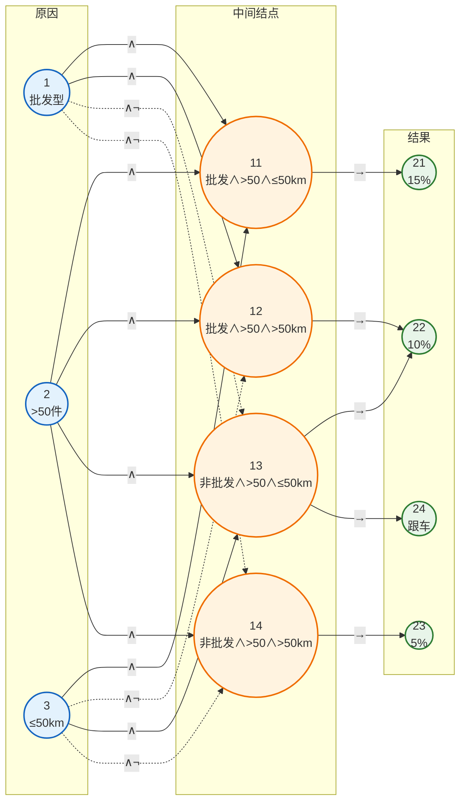

# 第13章 习题解答

## 基本信息
- **课程**：软件工程（第3版）
- **章节**：第13章 软件测试
- **日期**：2026-05-12
- **标签**：#软件测试 #习题解答 #白盒测试 #黑盒测试

---

## 习题13.3 逻辑覆盖测试用例设计

### 题目

某模块的流程图如图13.18所示。试根据**判定覆盖**、**条件覆盖**、**判定/条件覆盖**、**条件组合覆盖**、**路径覆盖**等覆盖标准分别设计最少的测试用例。

#### 📷 图13.18 待测试模块的流程图


> 📚 **课本出处**：习题13.3 流程图展示了成绩评定模块的逻辑结构

### 流程图分析

#### 程序逻辑说明

该流程图描述了一个成绩评定模块：
- **输入**：X（成绩1）、Y（成绩2）
- **输出**：T（评定结果）

#### 判定和条件分析

**判定A**：`X >= 80 and Y >= 80`
- 条件A1：X >= 80
- 条件A2：Y >= 80

**判定B**：`X + Y >= 140 and (X >= 90 or Y >= 90)`
- 条件B1：X + Y >= 140
- 条件B2：X >= 90
- 条件B3：Y >= 90

#### 执行路径

| 路径 | 描述 | T值 |
|------|------|-----|
| 路径1 | A为真 | T=1 |
| 路径2 | A为假，B为真 | T=2 |
| 路径3 | A为假，B为假 | T=3 |

---

### 1. 语句覆盖

语句覆盖是指选择足够的测试用例，使得运行这些测试用例时，被测程序的每个语句至少执行一次。

本例中，需要覆盖3个赋值语句（T=1, T=2, T=3）。

满足语句覆盖标准的测试用例如表13.X所示。

**表 13.X 满足语句覆盖标准的测试用例**

| 测试数据 | 预期结果 | 执行路径 | 覆盖语句 |
|---------|---------|---------|---------|
| X=85,Y=85 | T=1 | 路径1 | T=1 |
| X=90,Y=60 | T=2 | 路径2 | T=2 |
| X=70,Y=70 | T=3 | 路径3 | T=3 |

由于每个语句至少要执行一次，所以满足语句覆盖标准的测试用例至少有3个。

---

### 2. 判定覆盖

判定覆盖是指选择足够的测试用例，使得运行这些测试用例时，被测程序的每个判定的所有可能结果都至少执行一次。

本例中，判定A有"真"和"假"两个结果，判定B也有"真"和"假"两个结果。

满足判定覆盖标准的测试用例如表13.Y所示。

**表 13.Y 满足判定覆盖标准的测试用例**

| 测试数据 | 预期结果 | 执行路径 | 判定A | 判定B |
|---------|---------|---------|-------|-------|
| X=85,Y=85 | T=1 | 路径1 | 真 | - |
| X=90,Y=60 | T=2 | 路径2 | 假 | 真 |
| X=70,Y=70 | T=3 | 路径3 | 假 | 假 |

由于一个判定至少有"真"和"假"两个结果，所以满足判定覆盖标准的测试用例至少有3个。

由于判定覆盖要求对每个判定的每个分支都至少执行一次，所以，程序中的所有语句也必定都至少执行一次。因此，满足判定覆盖标准的测试用例也一定满足语句覆盖标准。

---

### 3. 条件覆盖

条件覆盖是指选择足够的测试用例，使得运行这些测试用例时，被测程序的每个判定中的每个条件的所有可能结果都至少出现一次。

本例中，判定A中各种条件的所有可能结果是：$X \geqslant 80$，$X < 80$，$Y \geqslant 80$，$Y < 80$。

判定B中各种条件的所有可能结果是：$X+Y \geqslant 140$，$X+Y < 140$，$X \geqslant 90$，$X < 90$，$Y \geqslant 90$，$Y < 90$。

选择适当的测试用例，不难覆盖上述这些条件的所有可能结果。

满足条件覆盖标准的测试用例如表13.Z所示。

**表 13.Z 满足条件覆盖标准的测试用例**

| 测试数据 | 预期结果 | 执行路径 | 覆盖的条件 |
|---------|---------|---------|-----------|
| X=90,Y=90 | T=1 | 路径1 | $X \geqslant 80$，$Y \geqslant 80$，$X \geqslant 90$，$Y \geqslant 90$ |
| X=70,Y=90 | T=2 | 路径2 | $X < 80$，$Y \geqslant 80$，$X+Y \geqslant 140$，$X < 90$，$Y \geqslant 90$ |
| X=70,Y=70 | T=3 | 路径3 | $X < 80$，$Y < 80$，$X+Y < 140$，$X < 90$，$Y < 90$ |

由于一个条件至少有"真"和"假"两个结果，所以满足条件覆盖标准的测试用例至少有两个。本例中，由于判定A和判定B的条件相互关联，所以满足条件覆盖标准的测试用例至少需要3个。

条件覆盖通常比判定覆盖强，但有时虽然每个条件的所有可能结果都出现过，但判定表达式的某些可能结果并未出现。如上面的测试用例满足了条件覆盖标准，但判定B为"假"的结果在路径2中并未单独验证。

---

### 4. 判定/条件覆盖

判定/条件覆盖是指选择足够的测试用例，使得运行这些测试用例时，被测程序的每个判定的所有可能结果都至少执行一次，并且，每个判定中的每个条件的所有可能结果都至少出现一次。

显然，满足判定/条件覆盖标准的测试用例一定也满足判定覆盖、条件覆盖、语句覆盖标准。

满足判定/条件覆盖标准的测试用例如表13.W所示。

**表 13.W 满足判定/条件覆盖标准的测试用例**

| 测试数据 | 预期结果 | 执行路径 | 判定A | 判定B | 覆盖的条件 |
|---------|---------|---------|-------|-------|-----------|
| X=90,Y=90 | T=1 | 路径1 | 真 | - | $X \geqslant 80$，$Y \geqslant 80$，$X \geqslant 90$，$Y \geqslant 90$ |
| X=70,Y=90 | T=2 | 路径2 | 假 | 真 | $X < 80$，$Y \geqslant 80$，$X+Y \geqslant 140$，$X < 90$，$Y \geqslant 90$ |
| X=70,Y=70 | T=3 | 路径3 | 假 | 假 | $X < 80$，$Y < 80$，$X+Y < 140$，$X < 90$，$Y < 90$ |

在本例中，满足判定覆盖、条件覆盖和判定/条件覆盖标准的测试用例的个数是相同的。值得注意的是，并非所有程序的测试都是如此。但满足判定/条件覆盖标准的测试用例个数总是大于等于满足判定覆盖标准和条件覆盖标准的测试用例个数中的最大数。

---

### 5. 条件组合覆盖

条件组合覆盖是指选择足够的测试用例，使得运行这些测试用例时，被测程序的每个判定中的条件结果的所有可能组合都至少出现一次。

必须注意的是，这里的条件组合是指每个判定中的条件结果的所有可能组合，而不是整个程序的所有条件结果的所有可能组合。

判定A中条件结果的所有可能组合有如下4种情况（①，②，③，④）：

① $X \geqslant 80$，$Y \geqslant 80$；

② $X \geqslant 80$，$Y < 80$；

③ $X < 80$，$Y \geqslant 80$；

④ $X < 80$，$Y < 80$。

判定B中条件结果的所有可能组合有如下4种情况（⑤，⑥，⑦，⑧）：

⑤ $X+Y \geqslant 140$，$X \geqslant 90$，$Y \geqslant 90$；

⑥ $X+Y \geqslant 140$，$X \geqslant 90$，$Y < 90$；

⑦ $X+Y \geqslant 140$，$X < 90$，$Y \geqslant 90$；

⑧ $X+Y < 140$，$X < 90$，$Y < 90$。

（注：由于逻辑关系，$X \geqslant 90$ 或 $Y \geqslant 90$ 时必有 $X+Y \geqslant 140$，所以部分组合不可能出现）

满足条件组合覆盖标准的测试用例如表13.V所示。

**表 13.V 满足条件组合覆盖标准的测试用例**

| 测试数据 | 预期结果 | 执行路径 | 判定A | 判定B | 覆盖的条件组合 |
|---------|---------|---------|-------|-------|--------------|
| X=85,Y=85 | T=1 | 路径1 | 真 | - | ① |
| X=85,Y=70 | T=1 | 路径1 | 真 | - | ② |
| X=70,Y=85 | T=2 | 路径2 | 假 | 真 | ③，⑦ |
| X=70,Y=70 | T=3 | 路径3 | 假 | 假 | ④，⑧ |
| X=90,Y=60 | T=2 | 路径2 | 假 | 真 | ②，⑥ |

条件组合覆盖是上述5种覆盖标准中最强的一种，满足条件组合覆盖标准的测试用例一定也满足判定覆盖、条件覆盖、判定/条件覆盖、语句覆盖标准。然而，条件组合覆盖仍不能保证程序中所有可能的路径都被覆盖。本例中，满足条件组合覆盖标准的测试用例就没有经过某些特定路径。

---

### 6. 路径覆盖

路径覆盖是指选择足够的测试用例，使得运行这些测试用例时，被测程序的每条可能执行到的路径都至少经过一次（如果程序中每条语句至少执行一次，则称语句覆盖）。

本例中，程序有3条独立路径：
- 路径1：判定A为真 → T=1
- 路径2：判定A为假，判定B为真 → T=2
- 路径3：判定A为假，判定B为假 → T=3

满足路径覆盖标准的测试用例如表13.U所示。

**表 13.U 满足路径覆盖标准的测试用例**

| 测试数据 | 预期结果 | 执行路径 |
|---------|---------|---------|
| X=85,Y=85 | T=1 | 路径1 |
| X=90,Y=60 | T=2 | 路径2 |
| X=70,Y=70 | T=3 | 路径3 |

路径覆盖要求覆盖程序中所有可能的执行路径，所以满足路径覆盖标准的测试用例至少需要3个。路径覆盖不能保证条件的所有组合都被测试，因此条件组合覆盖和路径覆盖各有侧重，实际测试中常结合使用。

---

### 覆盖标准对比总结

| 覆盖标准 | 最少测试用例数 | 特点 |
|---------|---------------|------|
| 语句覆盖 | 3 | 最弱，可能遗漏判定错误 |
| 判定覆盖 | 3 | 覆盖每个分支 |
| 条件覆盖 | 3-4 | 覆盖每个条件的真假 |
| 判定/条件覆盖 | 3 | 同时满足判定和条件覆盖 |
| 条件组合覆盖 | 5 | 覆盖条件组合，最强 |
| 路径覆盖 | 3 | 覆盖所有路径 |

---

## 习题13.4 因果图方法设计测试用例

### 题目

某销售系统的"供货折扣计算模块"采用如下规则计算供货折扣：

（1）当客户为批发型企业时，若订货数大于50件并且发货距离不超过50公里时折扣率为15%；而当发货距离超过50公里时折扣率为10%

（2）当客户为非批发型企业时，若订货数大于50件且发货距离不超过50公里时折扣率为10%，并派人跟车；而当发货距离超过50公里时折扣率为5%。

试用**因果图方法**为该模块设计测试用例。

### 解答过程

#### （1）分析规格说明，列出原因和结果

根据规格说明，反映原因的输入条件有：客户为批发型企业，订货数>50件，发货距离≤50公里。反映结果的输出条件有：折扣率15%，折扣率10%，折扣率5%，派人跟车。

**原因**　　　　　　　　**结果**

1 客户为批发型企业　　21 折扣率15%

2 订货数>50件　　　　 22 折扣率10%

3 发货距离≤50公里　　23 折扣率5%

　　　　　　　　　　　24 派人跟车

#### （2）所有原因结点列在左边，结果结点列在右边，画出因果图

销售模块因果图如图13.X所示。



**图13.X 销售模块因果图**

其中中间结点的含义如下：

结点11表示客户为批发型企业且订货数>50件且发货距离≤50km。

结点12表示客户为批发型企业且订货数>50件且发货距离>50km。

结点13表示客户为非批发型企业且订货数>50件且发货距离≤50km。

结点14表示客户为非批发型企业且订货数>50件且发货距离>50km。

#### （3）在因果图中加上约束条件

本例中各原因之间没有互斥或包含等约束关系，因此不需要添加约束条件。

#### （4）根据因果图画出判定表

根据因果图画出判定表，如表13.X所示。

**表 13.X 销售模块判定表**

| | 1 | 2 | 3 | 4 | 5 | 6 | 7 | 8 |
|:---|:---:|:---:|:---:|:---:|:---:|:---:|:---:|:---:|
| **条件** | | | | | | | | |
| 1 批发型 | 1 | 1 | 1 | 1 | 0 | 0 | 0 | 0 |
| 2 >50件 | 1 | 1 | 0 | 0 | 1 | 1 | 0 | 0 |
| 3 ≤50km | 1 | 0 | 1 | 0 | 1 | 0 | 1 | 0 |
| **中间结点** | | | | | | | | |
| 11 批发∧>50∧≤50km | 1 | 0 | 0 | 0 | 0 | 0 | 0 | 0 |
| 12 批发∧>50∧>50km | 0 | 1 | 0 | 0 | 0 | 0 | 0 | 0 |
| 13 非批发∧>50∧≤50km | 0 | 0 | 0 | 0 | 1 | 0 | 0 | 0 |
| 14 非批发∧>50∧>50km | 0 | 0 | 0 | 0 | 0 | 1 | 0 | 0 |
| **结果** | | | | | | | | |
| 21 15% | ✓ | | | | | | | |
| 22 10% | | ✓ | | | ✓ | | | |
| 23 5% | | | | | | ✓ | | |
| 24 跟车 | | | | | ✓ | | | |
| **不可能** | | | ✓ | ✓ | | | ✓ | ✓ |

其中阴影部分表示不可能出现的原因条件组合（订货数≤50时，距离条件不影响折扣，且不应产生任何折扣结果），此外当原因②为0时，表示订货数≤50，此时不产生折扣，因此也不必为它们设计测试用例。

#### （5）为判定表的每个有意义的列设计一个测试用例

**表 13.X 销售模块测试用例**

| 测试用例 | 客户类型 | 订货数 | 发货距离 | 预期结果 |
|:---|:---|:---:|:---:|:---|
| 1 | 批发型企业 | 60件 | 40公里 | 折扣率15% |
| 2 | 批发型企业 | 60件 | 60公里 | 折扣率10% |
| 3 | 非批发型企业 | 60件 | 40公里 | 折扣率10%，派人跟车 |
| 4 | 非批发型企业 | 60件 | 60公里 | 折扣率5% |

---

### 因果图方法总结

**步骤回顾**：
1. **识别原因和结果**：分析需求，列出所有输入条件和输出动作
2. **分析因果关系**：根据业务规则建立因果联系
3. **绘制因果图**：用图形表示因果关系，必要时添加中间节点
4. **转换为判定表**：将因果图转换为判定表，标记不可能的组合
5. **设计测试用例**：根据判定表设计具体的测试数据

**优点**：
- 系统地考虑各种输入组合
- 可以发现需求中的不完整和矛盾
- 生成的测试用例覆盖率高

---

## 学习要点

### ⭐⭐⭐ 核心重点

1. **6种逻辑覆盖标准**的强弱关系：
   ```
   语句覆盖 < 判定覆盖 < 条件覆盖 ≈ 判定/条件覆盖 < 条件组合覆盖
   ```

2. **因果图方法**的5个步骤：识别→分析→绘图→转表→设计

### 💡 解题技巧

1. **画流图**：先画出程序的流图，标注所有判定和条件
2. **列真值表**：对于复杂判定，列出条件的真值组合
3. **找路径**：识别所有独立路径，确保路径覆盖
4. **用判定表**：因果图方法中，判定表是核心工具

### ⚠️ 常见错误

1. **条件覆盖≠判定覆盖**：条件覆盖可能遗漏某些判定结果
2. **忽略不可能组合**：条件组合覆盖时要识别不可能的条件组合
3. **路径覆盖≠所有组合**：路径覆盖不考虑条件的所有组合

---

## 相关链接

- [第13章-13.2-白盒测试](../章节笔记/第13章-软件测试/第13章-13.2-白盒测试.md)
- [第13章-13.3-黑盒测试](../章节笔记/第13章-软件测试/第13章-13.3-黑盒测试.md)
- [图13.18 待测试模块的流程图](../../images/cedf4728b57599b1e6325b074778b785a78d234c64edc375f560c5aeaacc58cd.jpg)
