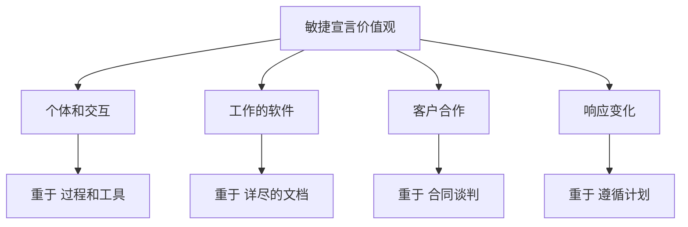
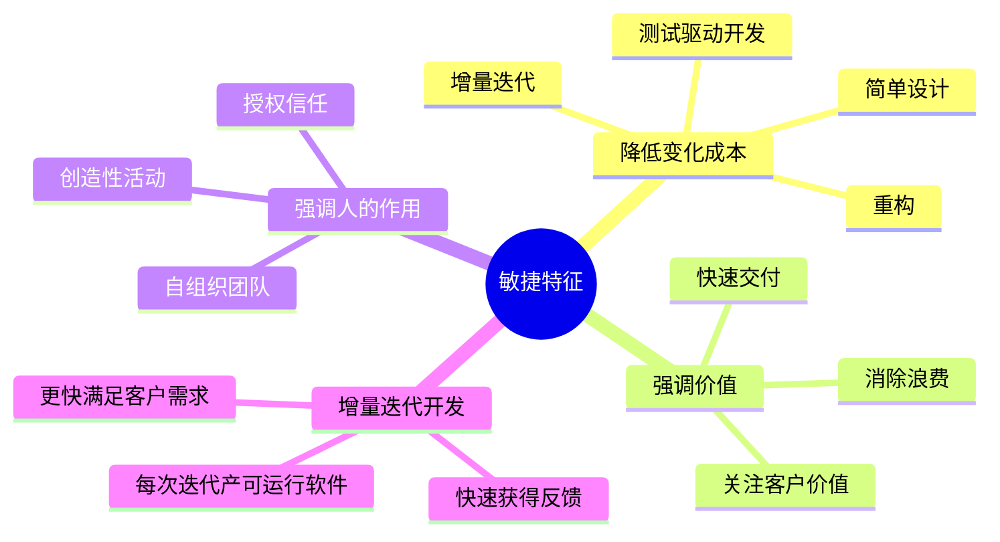
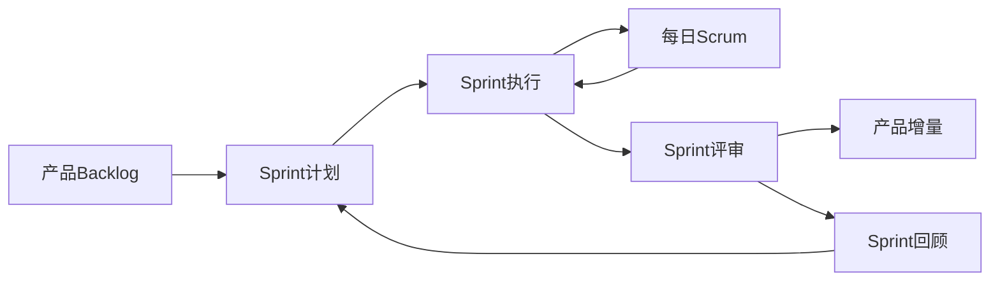
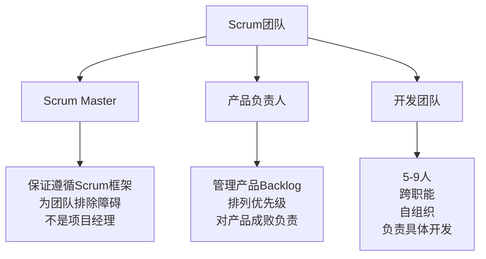
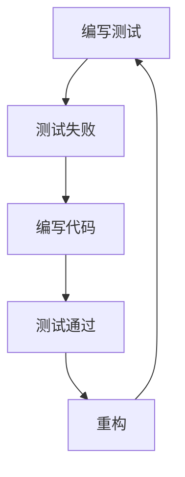
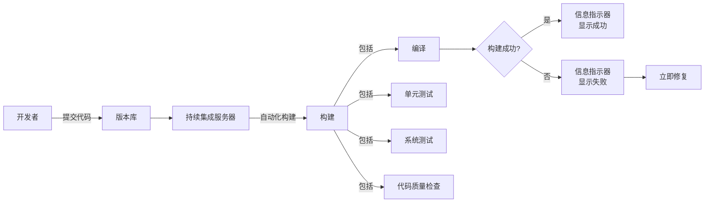
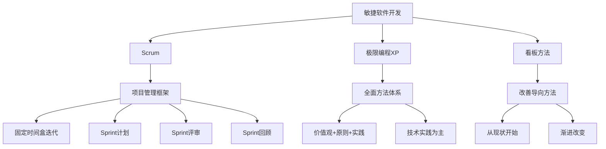

# 第10章 敏捷软件开发

## 基本信息

- **课程**：软件工程
- **章节**：第10章 敏捷软件开发
- **日期**：2026-04-10
- **标签**：#敏捷开发 #Scrum #极限编程 #看板方法 #精益思想

***

## 重点内容

### ⭐⭐⭐ 核心考点

1. **敏捷宣言4个价值观**（必背）
2. **敏捷宣言12条原则**
3. **精益思想5条基本原则**
4. **Scrum三支柱和团队角色**
5. **极限编程价值观和实践**
6. **看板方法5条规则**

### 📌 考试重点

- 敏捷宣言价值观的对比关系
- Scrum团队三种角色的职责
- 极限编程的5个价值观
- 看板方法与Scrum的区别

***

## 详细笔记

### 10.1 敏捷软件开发方法概述

#### 10.1.1 敏捷宣言

**背景**：2001年2月，17位敏捷方法先驱在美国犹他州召开会议，发布了"敏捷宣言"。

**敏捷宣言的4个核心价值观**：

**💡 记忆技巧**：**"交软客响"** - 交流软件客户响应

**敏捷宣言的12条原则**：

1. **最高优先级**：持续不断地、及早地交付有价值的软件使客户满意
2. **拥抱变化**：即使在开发后期，敏捷过程愿意为了客户的竞争优势而接纳变化
3. **频繁交付**：经常地交付可工作的软件，周期越短越好
4. **紧密合作**：业务人员和开发人员必须在整个项目阶段紧密合作
5. **激励个体**：围绕着被激励的个体构建项目，给予信任和支持
6. **面对面交流**：团队内和团队间信息沟通最有效的方式是面对面交流
7. **工作的软件**：可工作的软件是进度的首要度量标准
8. **可持续开发**：倡导可持续的开发步调
9. **技术卓越**：持续追求技术卓越和良好设计，提高敏捷性
10. **简洁为本**：减少不必要工作的艺术
11. **自组织团队**：最好的架构、需求和设计从自组织的团队中涌现
12. **定期反思**：团队定期反思如何更有效率，并调整行为

***

#### 10.1.2 精益思想

精益思想起源于**丰田生产系统（TPS）**，强调**价值**和**消除浪费**。

**⭐ 精益思想5条基本原则**：

1. **识别价值** - 从客户角度定义价值
2. **定义价值流** - 描述为交付价值所采取的增值活动
3. **保持流动** - 让价值快速流动
4. **拉动系统** - 基于客户需求驱动生产
5. **持续改善** - 不断追求改进

**📌 精益7大浪费**：

- 需要纠正的错误
- 生产了没有需求的产品
- 库存
- 不必要的工序
- 不必要的工人移动
- 不必要的货物搬运
- 下道工序等待上道工序完成

***

#### 10.1.3 敏捷方法综述

**主要敏捷方法**：

- 极限编程（XP）
- Scrum
- 看板方法
- 精益软件开发（LSD）
- 水晶方法（Crystal）
- 自适应软件开发（ASD）
- 动态系统开发方法（DSDM）

**敏捷方法共同特征**：

***

### 10.2 Scrum方法 ⭐

#### 10.2.1 Scrum简介

**Scrum核心概念图**：

**Scrum三支柱**：

1. **高透明度** - 让相关人员清晰看到影响结果的因素
2. **检验** - 经常检测开发过程，及时发现偏差
3. **适应** - 发现问题时及时调整

**Scrum要素**：

- **时间盒**：固定时间段，一般1个月或更短
- **制品**：产品Backlog、Sprint Backlog、潜在可交付产品增量

***

#### 10.2.2 Scrum团队

***

#### 10.2.3 需求管理

**产品Backlog示例**：

| 优先级 | Backlog条目       | 估算（故事点） |
| --- | --------------- | ------- |
| 1   | 用户能够注册姓名和送货地址信息 | 1       |
| 2   | 用户能够将商品放入购物车并购买 | 2       |
| 3   | 用户能够使用VISA信用卡支付 | 2       |
| 4   | 用户能够取消尚未支付的订单   | 2       |

***

### 10.3 极限编程方法（XP） ⭐

#### 10.3.1 极限编程简介

**极限编程2.0的5个价值观**：

1. **沟通** - 团队成员之间、客户和团队之间的充分沟通
2. **简单** - 仅做当前最必要的工作
3. **反馈** - 利用每一个机会发现和解决问题
4. **勇气** - 做正确的决策，即使困难
5. **尊重** - 认可团队中每个人的专业技能和价值

***

#### 10.3.3 极限编程实践 ⭐⭐

**主要实践**：

##### 1. 故事（用户故事）

- 以用户为中心的描述
- 使用故事卡片
- 拥有清楚的完成标准

##### 2. 估算

**计划扑克步骤**：

1. 团队坐在一起
2. 产品负责人讲解故事
3. 团队讨论
4. 每个人独立选取估算数值
5. 同时亮牌
6. 若差距大，讨论后重选
7. 达成共识

**故事点特点**：

- 相对值方法
- 使用斐波那契数列
- 强调工作量的本质特征

##### 3. 简单设计

**简单设计标准**：

- ✅ 完成了定义的功能，能通过所有测试
- ✅ 设计描述了程序员的重要意图
- ✅ 设计和实现没有冗余
- ✅ 没有多余的类和方法

##### 4. 重构

- **定义**：在不改变代码外部行为的情况下，调整内部结构
- **坏味道**：重复代码、过长函数、过大的类、数据泥团等
- **重要**：持续不断的小规模重构，而非大规模重写

##### 5. 测试驱动开发（TDD）

**TDD三步曲**：

1. 编写一个测试
2. 编写代码使测试通过
3. 对代码进行重构

##### 6. 结对编程

- **驾驶员**：关注当前具体实现
- **领航员**：负责检查、策略思考、提出建议
- **流动的结对**：分工和伙伴动态调整

##### 7. 持续集成

**持续集成环境**：

**持续集成前提**：

- ✅ 版本管理系统
- ✅ 开发者工作在相同分支
- ✅ 构建速度足够快
- ✅ 构建提供高质量反馈

***

### 10.4 看板方法

#### 10.4.1 看板方法简介

\*\*看板（Kanban）\*\*来源于日语，意为"可视卡片"。

**David J. Anderson定义**：

> "看板是一种增量的、演进的改变技术开发和组织运作的方法。通过限制WIP的数量，形成以拉动系统为核心的机制，暴露系统中的问题，激发协作来改善系统。"

**看板三原则**：

1. 从组织的现状开始
2. 形成渐进、演化的改善共识
3. 尊重当前的过程定义、角色、职责或头衔

***

#### 10.4.2 看板方法5条规则 ⭐

```mermaid
mindmap
  root((看板5条规则))
    可视化工作流
      列出所有活动
      归类活动
      按依赖关系串行化
      用图表呈现
    限制WIP数量
      精益重要手段
      实现拉动系统
      从后往前推
    度量周期时间
      需求流动时间
      响应速度指标
      设定改善目标
    明确过程准则
      每步定义完成标准
      达成团队共识
      准确了解项目状态
    科学方法改善
      暴露问题
      团队讨论
      提出解决方案
```

***

#### 10.4.3 看板方法和Scrum的比较

| 方面       | Scrum      | 看板        |
| -------- | ---------- | --------- |
| **时间盒**  | 有固定迭代周期    | 无明确定义     |
| **角色**   | 有明确定义的角色   | 不定义具体角色   |
| **改善方式** | 通过迭代评审回顾   | 持续渐进改善    |
| **承诺**   | 需要组织做出更大承诺 | 尊重现状，渐进改变 |
| **适用场景** | 需要快速变革     | 渐进过渡      |

**共同点**：

- 都遵循敏捷三支柱：高透明度、检验、适应
- 都使用增量和迭代
- 都可使用用户故事

***

## 章节重点总结

### ⭐⭐⭐ 考试重点

1. **敏捷宣言4个价值观**：个体和交互 > 过程和工具；工作的软件 > 详尽文档；客户合作 > 合同谈判；响应变化 > 遵循计划
2. **敏捷宣言12条原则**：需要能够列举或解释
3. **精益思想5原则**：识别价值、定义价值流、保持流动、拉动系统、持续改善
4. **Scrum三支柱**：高透明度、检验、适应
5. **Scrum团队角色**：Scrum Master、产品负责人、开发团队
6. **极限编程价值观**：沟通、简单、反馈、勇气、尊重（XP 2.0新增尊重）
7. **极限编程核心实践**：故事、估算、简单设计、重构、测试驱动开发、结对编程、持续集成
8. **看板5条规则**：可视化工作流、限制WIP、度量周期时间、明确过程准则、科学方法改善

### 💡 学习技巧

**敏捷方法对比记忆**：

***

## 疑问与思考

### ❓ 待解决问题

1.  

### 💡 个人理解

1.  

***

## 相关链接

- **课本出处**：第10章 敏捷软件开发
- **大纲文件**：`软件工程/大纲.md`
- **完整内容**：`软件工程/full.md`

***

## 课后习题

1. 敏捷软件开发方法具有哪些共同的特征？
2. 简述敏捷软件开发的价值观
3. 简述敏捷软件开发的原则
4. 简述精益思想的5条基本原则
5. 列出Scrum的主要实践，并说明它们分别体现了敏捷宣言中的哪些原则
6. 为什么极限编程不仅仅是一套技术实践？
7. 看板方法有哪5条规则？

