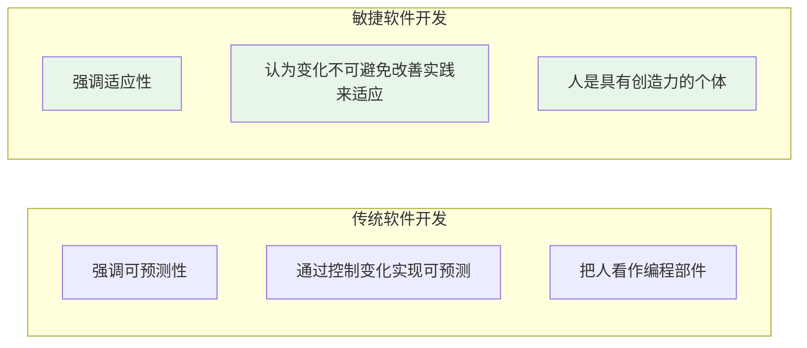
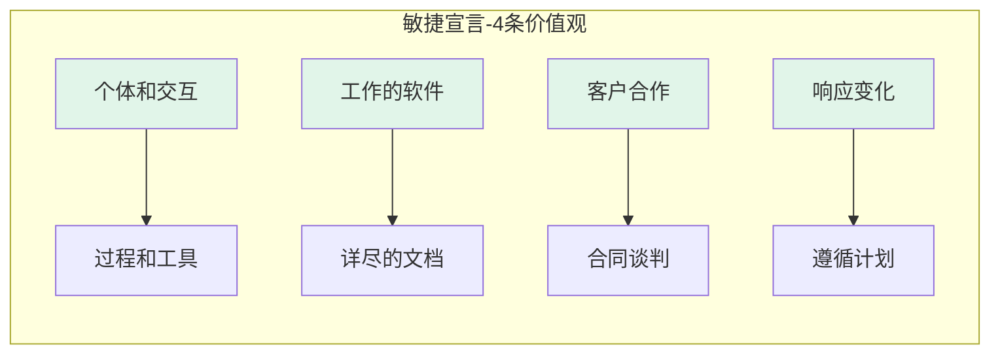
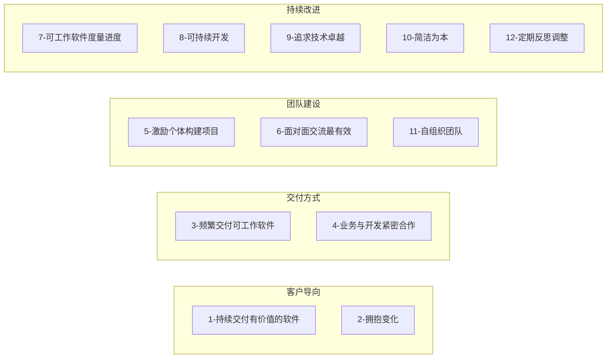
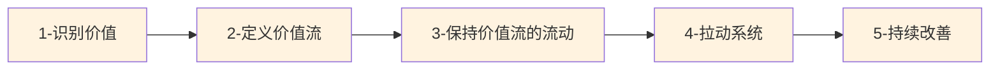
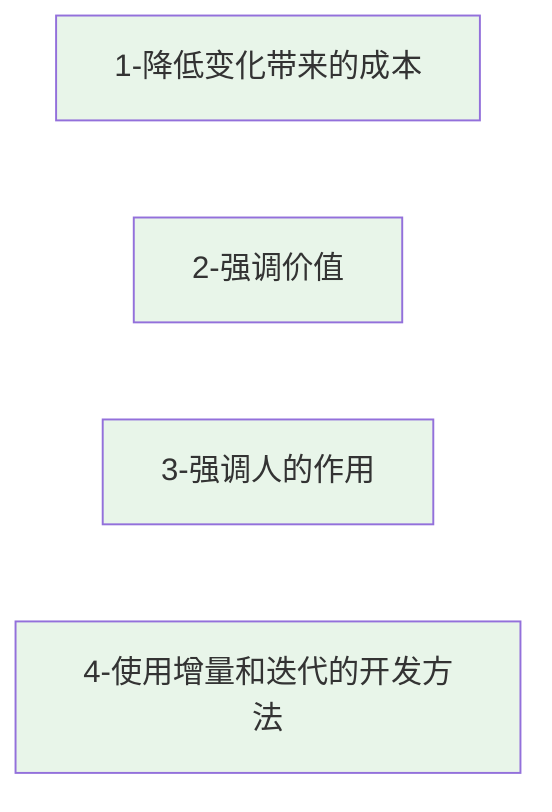

# 第10章-10.1 敏捷软件开发方法概述

## 基本信息

- **课程**：软件工程
- **章节**：第10章 10.1节 敏捷软件开发方法概述
- **日期**：2026-04-28
- **标签**：#敏捷开发 #敏捷宣言 #精益思想 #敏捷价值观

***

## 重点内容

### ⭐⭐⭐ 核心考点

1. **敏捷宣言4个价值观**（必背）
2. **敏捷宣言12条原则**
3. **精益思想5条基本原则**
4. **敏捷方法的共同特征**

### 📌 考试重点

- 敏捷宣言价值观的对比关系（左项 vs 右项）
- 敏捷宣言12条原则的理解
- 精益思想5原则的掌握
- 敏捷与传统软件开发的区别

***

## 详细笔记

### 一、敏捷软件开发的起源

#### 背景

- **时间**：20世纪90年代开始
- **特点**：多种轻量级软件开发方法逐渐流行
- **共同点**：强调软件开发的**灵活性**
- **统称**：敏捷软件开发方法

#### 核心区别



#### Martin Fowler提出的软件开发3个特征

1. **提前预测需求是困难的**
   - 客户需求优先级变更也难以预测
2. **软件设计和构建是交错进行的**
   - 设计需要通过构建来验证
   - 构建过程中获得的知识帮助设计
3. **分析、设计、构建和测试活动不容易预测**
   - 从制定计划角度看，这些活动难以准确预估

#### 两种思路

| 思路         | 说明            |
| ---------- | ------------- |
| **提高可预测性** | 传统方法，试图控制变化   |
| **增强适应性**  | 敏捷方法，改善实践适应变化 |

***

### 二、敏捷宣言 ⭐⭐⭐

> 📚 **课本出处**：2001年2月，17位敏捷方法先驱在美国犹他州召开会议，发布了"敏捷宣言"

#### 敏捷宣言的4条价值观



> ⚠️ **重要说明**：敏捷宣言**并不否认**右项的价值，只是**更重视**左项的价值

#### 4条价值观详解

##### 1. 个体和交互 > 过程和工具

- **核心**：软件开发的最重要因素是人（开发者和客户）
- **理解**：过程和工具有价值，但其价值在于提高生产率、改善人际交互
- **要点**：人的创造力和协作比流程更重要

##### 2. 工作的软件 > 详尽的文档

- **核心**：完成软件开发才是真正目的
- **理解**：
  - 编写文档是为了支持软件开发
  - 代码是客观的，能更准确度量进度和质量
  - 文档缺乏客户验证，容易隐藏问题
- **要点**：可运行的软件比完美文档更重要

##### 3. 客户合作 > 合同谈判

- **核心**：开发团队和客户应拥有共同目标
- **理解**：
  - 只有满足客户需求才能为客户带来最高价值
  - 拒绝变化会导致客户过早提出不确定需求
  - 目标冲突对客户和开发团队都不利
- **要点**：与客户紧密合作，而非对抗

##### 4. 响应变化 > 遵循计划

- **核心**：随着开发进行，掌握的信息越来越多
- **理解**：
  - 早期计划阶段的预测可能不准确
  - 变化发生时，尽快调整是明智的
  - 不应简单遵循过时的计划
- **要点**：拥抱变化，及时调整

#### 💡 记忆技巧

**"交软客响"**：

- **交** = 个体和交互
- **软** = 工作的软件
- **客** = 客户合作
- **响** = 响应变化

***

### 三、敏捷宣言的12条原则 ⭐⭐⭐



#### 12条原则详解

| 编号 | 原则                                      | 核心要点        |
| -- | --------------------------------------- | ----------- |
| 1  | 我们的最高优先级是持续不断地、及早地交付有价值的软件来使客户满意        | 客户满意是最高目标   |
| 2  | 拥抱变化，即使是在项目开发的后期。敏捷过程愿意为了客户的竞争优势而接纳变化   | 变化不可避免，要拥抱  |
| 3  | 经常地交付可工作的软件，相隔几星期或一两个月，倾向于采用较短的周期       | 短周期频繁交付     |
| 4  | 业务人员和开发人员必须在项目的整个阶段紧密合作                 | 全程紧密协作      |
| 5  | 围绕着被激励的个体构建项目。为个体提供所需的环境和支持，给予信任，从而达成目标 | 激励和信任个体     |
| 6  | 在团队内和团队间沟通信息的最有效和最高效的方式是面对面的交流          | 面对面交流最有效    |
| 7  | 可工作的软件是进度的首要度量标准                        | 软件本身度量进度    |
| 8  | 敏捷过程倡导可持续开发。项目发起者、开发人员和用户应该维持一个可持续的步调   | 保持可持续步调     |
| 9  | 持续地追求技术卓越和良好设计，可以提高敏捷性                  | 技术卓越提高敏捷性   |
| 10 | 以简洁为本，它是减少不必要工作的艺术                      | 简洁，减少浪费     |
| 11 | 最好的架构、需求和设计是从自组织的团队中涌现出来的               | 自组织团队产生最佳方案 |
| 12 | 团队定期地反思如何变得更加高效，并且相应地调整自身的行为            | 定期反思和改进     |

***

### 四、精益思想 ⭐⭐

#### 起源

- **来源**：丰田生产系统（Toyota Production System, TPS）
- **基本出发点**：**价值**
- **引入软件开发**：Mary Poppendieck 和 Tom Poppendieck 夫妇

#### 精益思想的核心观点

**价值定义**：

- 从**最终客户的角度**定义价值
- 客户为正确运行的软件付费
- 不会为只有完备文档但没有价值的软件付费

**浪费观点**：

- 传统：设备闲置是浪费
- 精益：生产无需求产品、形成库存是更大浪费
- 设备闲置是信号，提示工作流存在问题

#### 📷 精益思想的5条原则



#### 5条原则详解

| 原则              | 说明                                |
| --------------- | --------------------------------- |
| **1. 识别价值**     | 价值是客户愿意购买产品的原因，是产品开发的根本价值所在       |
| **2. 定义价值流**    | 描述组织为了交付价值所采取的一系列有增值的活动           |
| **3. 保持价值流的流动** | 让价值迅速流动，用较低成本生产出正确产品              |
| **4. 拉动系统**     | 基于当前客户需求，向生产环节逐级反馈，每个环节基于下一环节需求生产 |
| **5. 持续改善**     | 上述4个方面不是静态的，总是存在改善空间              |

#### 精益7大浪费（大野耐一）

1. 需要纠正的错误
2. 生产了没有需求的产品
3. 库存
4. 不必要的工序
5. 不必要的工人移动
6. 不必要的货物搬运
7. 下道工序等待上道工序完成

#### 精益思想与敏捷宣言的呼应

| 精益思想 | 敏捷宣言   |
| ---- | ------ |
| 尊重人  | 个体和交互  |
| 持续改善 | 团队定期反思 |

#### 精益思想在软件开发中的应用

- **精益软件开发（LSD）**：精益思想在软件开发中的应用
- **看板方法**：精益思想的系统化实践（10.4节详细介绍）

***

### 五、敏捷方法综述

#### 常见敏捷方法

| 方法                | 说明                  |
| ----------------- | ------------------- |
| **Scrum**         | 增量迭代的开发管理框架（10.2节）⭐ |
| **极限编程（XP）**      | 强调技术实践的敏捷方法（10.3节）⭐ |
| **看板方法**          | 精益思想的系统化实践（10.4节）   |
| 精益软件开发（LSD）       | 精益思想在软件开发中的应用       |
| 水晶软件开发方法（Crystal） | 根据项目规模调整方法          |
| 自适应软件开发（ASD）      | 强调自适应               |
| 动态系统开发方法（DSDM）    | 强调时间盒               |

#### 📷 图10.1 敏捷方法和变更成本


> 📚 **课本出处**：图10.1 展示了敏捷方法通过增量迭代、测试驱动开发等手段"抚平"变更成本曲线

#### 敏捷方法的4个共同特征



##### 1. 致力于降低变化带来的成本

- Kent Beck的观点：通过以下手段"抚平"变更成本曲线
  - 增量和迭代
  - 测试驱动开发
  - 重构
  - 简单设计

##### 2. 强调价值

- 关注客户价值
- 强调快速交付
- 通过增量迭代，早期交付最有价值的功能
- 基于价值衡量工作流，消除不必要的文档和环节

##### 3. 强调人的作用

- 软件开发是创造性活动
- 需要充分激发每个人的能动性
- 重视给予团队授权、信任
- 帮助建立自组织团队
- 经典过程模型忽略人和人的差异

##### 4. 使用增量和迭代的开发方法

- 每次迭代都产生真正可运行的软件
- 更容易获得客户反馈
- 便于做出及时的、正确的适应性改变
- 在很短的时间间隔内交付软件增量
- 更快满足客户需求

***

## 本节小结

```
┌─────────────────────────────────────────────────────────────┐
│                    10.1 敏捷软件开发方法概述                   │
├─────────────────────────────────────────────────────────────┤
│  起源：20世纪90年代轻量级方法 → 强调灵活性                    │
│  核心：适应性 > 可预测性，人 > 过程                           │
├─────────────────────────────────────────────────────────────┤
│  敏捷宣言（4价值观 + 12原则）                                 │
│  ├─ 个体和交互 > 过程和工具                                   │
│  ├─ 工作的软件 > 详尽的文档                                   │
│  ├─ 客户合作 > 合同谈判                                       │
│  └─ 响应变化 > 遵循计划                                       │
├─────────────────────────────────────────────────────────────┤
│  精益思想（5原则）                                            │
│  ├─ 识别价值 → 定义价值流 → 保持流动 → 拉动系统 → 持续改善   │
│  └─ 7大浪费：错误、无需求产品、库存、不必要工序等             │
├─────────────────────────────────────────────────────────────┤
│  共同特征：降低变化成本、强调价值、强调人、增量迭代           │
└─────────────────────────────────────────────────────────────┘
```

***

## 疑问与思考

### ❓ 待解决问题

1. <br />

### 💡 个人理解

1. <br />

***

## 相关链接

- **课本出处**：第10章 10.1节"敏捷软件开发方法概述"
- **大纲文件**：`软件工程/大纲.md`
- **完整内容**：`软件工程/full.md`

### 本节相关图片

1. **图10.1 敏捷方法和变更成本**
   - 路径：`../../../images/a87efa6ffa9f3fa1ad92b5ebb5e8c0979ae54cd001c1a252c4b6ae23d9455f2a.jpg`
   - 说明：展示了敏捷方法通过增量迭代等手段"抚平"变更成本曲线

***

## 课后习题

1. 敏捷软件开发方法产生的背景是什么？与传统软件开发方法的主要区别是什么？
2. 敏捷宣言的4条价值观是什么？如何理解"尽管右项有其价值，我们更重视左项的价值"？
3. 敏捷宣言的12条原则中，哪几条最能体现"客户合作重于合同谈判"这一价值观？
4. 精益思想的5条基本原则是什么？
5. 精益思想中的"拉动系统"与传统的"推动系统"有什么区别？
6. 敏捷方法有哪些共同特征？
7. 为什么说敏捷软件开发强调"人的因素"？

***

*笔记创建时间：2026-04-28*
