# 第10章-10.2 Scrum方法

## 基本信息
- **课程**：软件工程
- **章节**：第10章 10.2节 Scrum方法
- **日期**：2026-04-28
- **标签**：#Scrum #敏捷开发 #Sprint #每日站会 #回顾会议

---

## 重点内容

### ⭐⭐⭐ 核心考点

1. **Scrum三支柱**（高透明度、检验、适应）
2. **Scrum团队三种角色及其职责**
3. **Scrum四大要素**（时间盒、团队、制品、规则）
4. **Sprint迭代活动**（计划、每日例会、评审、回顾）
5. **产品Backlog和Sprint Backlog**

### 📌 考试重点

- Scrum Master vs 项目经理的区别
- 每日例会的三个问题
- Sprint回顾会议的5个阶段
- 燃尽图和任务墙的作用

---

## 详细笔记

### 一、Scrum简介

#### 起源与发展

| 时间 | 人物 | 事件 |
|------|------|------|
| 1986年 | 竹内弘高、野中郁次郎 | 在《哈佛商业评论》发表《新的新产品开发方式》，使用**橄榄球运动**作为比拟 |
| 1993年 | Jeffery Sutherland | 基于上述文章思想，结合软件开发经验，开发了Scrum方法 |
| 1995年 | Jeffery Sutherland、Ken Schwaber | 在OOPSLA大会发表论文，正式发布Scrum |

#### 橄榄球运动的比拟

- 没有显著的、彼此分离的阶段
- 整个开发过程由**跨职能团队**共同完成
- 能够显著提高新产品开发的速度和灵活性

#### 核心思想

> **尽量在早期暴露软件开发中的问题，进行及时调整**，使得软件开发团队在充满不确定的研发领域成功地工作。

Ken Schwaber的观点：
- 软件项目的本质是**探索和尝试**
- 开发过程中充满**不确定性**
- 细微的变化可能产生重大影响
- 需要及时监控和调整

---

### 二、Scrum核心概念

#### 📷 图10.2 Scrum过程框架

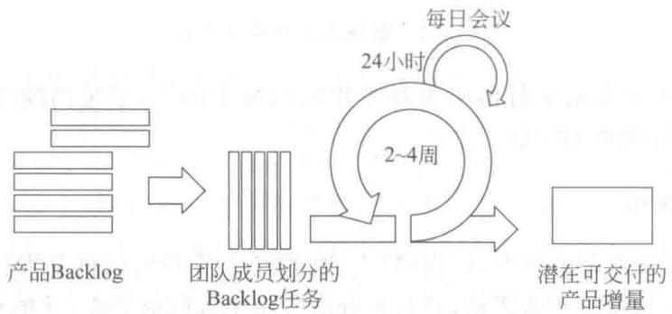

> 📚 **课本出处**：图10.2 展示了Scrum的核心概念，包括产品Backlog、Sprint计划、每日Scrum、Sprint评审、Sprint回顾等环节

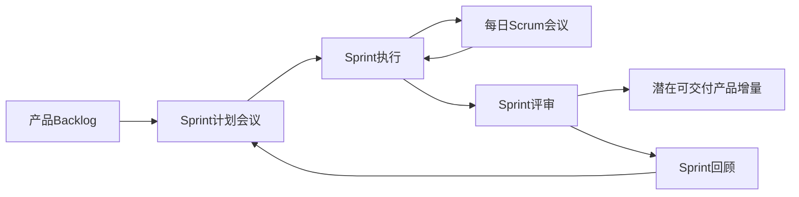

---

### 三、Scrum四大要素 ⭐⭐⭐

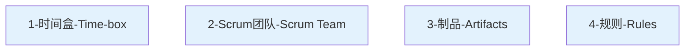

#### 1. 时间盒（Time-box）

| 特性 | 说明 |
|------|------|
| **定义** | 固定的时间段，为软件开发提供节奏 |
| **Sprint** | 时间盒在Scrum中的称呼 |
| **周期** | 一般**1个月或更短**（常见2周） |
| **内容** | 每个Sprint包含完整的需求分析、计划、开发、测试等环节 |
| **目标** | 每个Sprint都应该产生**可发布的产品增量** |
| **固定性** | 一旦确定Sprint周期，就不能改变 |

#### 2. Scrum团队 ⭐⭐⭐

**团队特征**：
- **自组织**：团队自己决定做哪些事情以及如何做
- **跨职能**：包含设计、开发、测试等各种技能
- **规模**：通常由**5~9人**组成

**三种角色**：

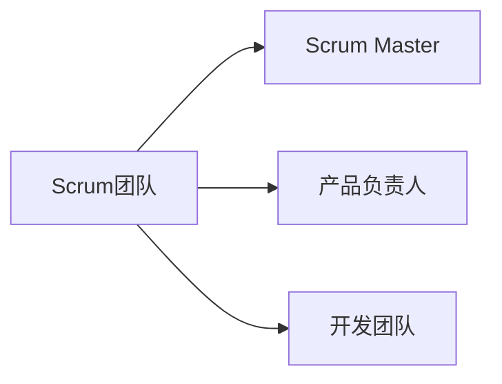

**Scrum Master职责**：

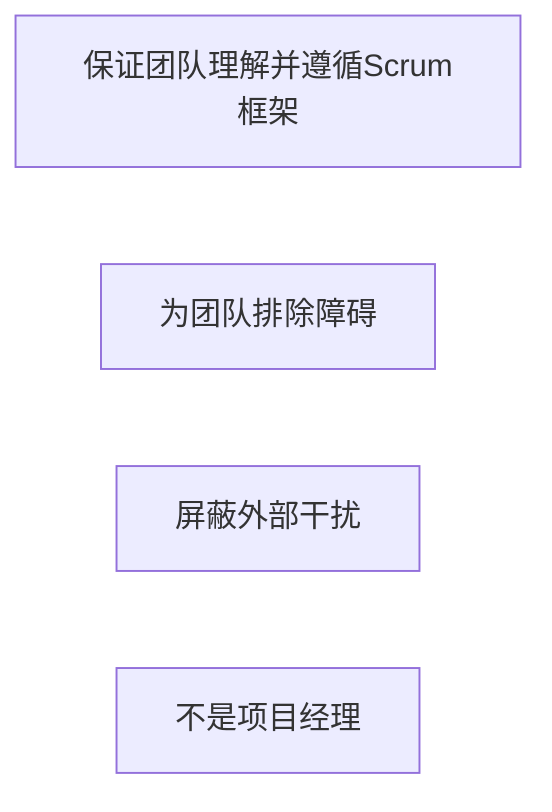

**产品负责人职责**：

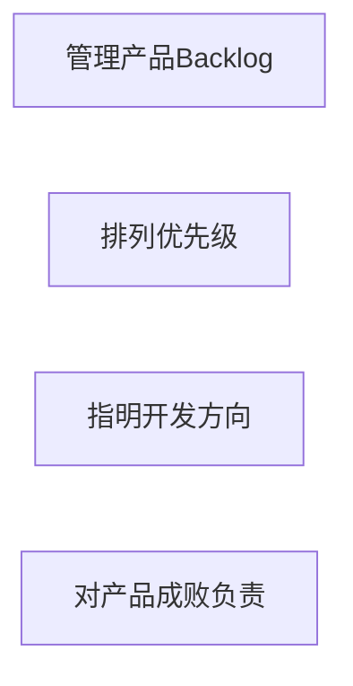

**开发团队特征**：

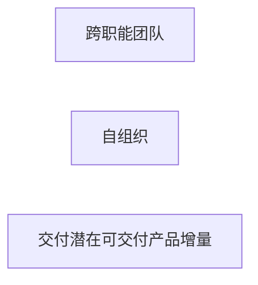

**Scrum Master ≠ 项目经理**：

| 方面 | Scrum Master | 项目经理 |
|------|-------------|----------|
| 团队管理 | 团队是自组织的，不分配任务 | 通常负责分配任务 |
| 角色定位 | 服务型领导，为团队服务 | 管理型角色 |
| 核心职责 | 确保团队遵循Scrum框架，排除障碍 | 规划、执行、监控项目 |
| 权力 | 没有直接管理权力 | 有正式管理权力 |

#### 3. 制品（Artifacts）

| 制品 | 英文 | 说明 |
|------|------|------|
| **产品Backlog** | Product Backlog | 产品负责人对团队的需求列表，按优先级排序 |
| **Sprint Backlog** | Sprint Backlog | 开发团队为实现Sprint目标定义的任务列表 |
| **潜在可交付产品增量** | Potentially Shippable Product Increment | 每个Sprint结束时应产生的新功能，达到"完成"标准 |

#### 4. 规则（Rules）

- Scrum非常强调**纪律性**
- 每个Sprint交付物必须达到"**完成**"（Done）标准
- "完成"标准由**开发团队定义**并清晰描述
- 只有达到"完成"标准，才能声称完成了产品增量

---

### 四、Scrum三支柱 ⭐⭐⭐

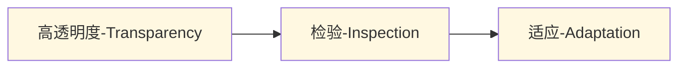

| 支柱 | 说明 | 实践体现 |
|------|------|----------|
| **高透明度** | 让关心结果的人清晰看到影响结果的各种因素 | 严格执行Sprint交付标准，忠实记录执行过程 |
| **检验** | 经常检测开发过程中的各个方面，及时发现重大偏差 | 每日例会、Sprint评审、跟踪燃尽图 |
| **适应** | 发现制品或工作方法不合适时，及时调整 | Sprint回顾会议，持续改进过程 |

---

### 五、需求管理

#### 产品Backlog（Product Backlog）

**管理理念**：
- ❌ 不赞同项目初期定义所有精细功能
- ✅ 关注尽早交付客户价值
- ✅ 只要定义足够当前价值交付的需求即可

**Backlog条目特征**：
- 应该是**良好分割**的
- 支持迭代和增量开发
- 使用用户故事作为条目（常见做法）

#### 📷 表10.1 产品Backlog示例

| 条目 | 估算（故事点） | 优先级 |
|------|---------------|--------|
| 用户能够注册姓名和送货地址信息 | 1 | 1 |
| 用户能够将商品放到购物车，在购物结束时能够购买 | 2 | 2 |
| 用户能够使用VISA信用卡支付 | 2 | 3 |
| 在订单完成之前，用户能够删除购物车中的商品 | 1 | 4 |
| 管理员能够在网站上增加新商品 | 1 | 5 |
| 管理员能够调整商品的价格 | 1 | 6 |
| 用户能够取消尚未支付的订单 | 2 | 7 |

**Backlog管理要点**：

1. **产品负责人负责**：
   - 管理Backlog内容和优先级
   - 对产品成败负责

2. **共同撰写**：
   - 推荐产品负责人和开发团队共同撰写主要条目

3. **持续调整**：
   - 根据反馈不断调整和扩充
   - 优先级可以随着新信息调整

4. **精化时间**：
   - 每个Sprint保留**5%~10%**时间
   - 共同精化产品Backlog
   - 为后续1~2个Sprint做准备

5. **速率（Velocity）**：
   - 团队成员相对稳定
   - 每个Sprint时间相同
   - 每个Sprint产出保持稳定速率
   - 可预测功能发布时间

---

### 六、基于时间盒的迭代

#### 1. Sprint计划会议（Sprint Planning）

| 项目 | 说明 |
|------|------|
| **时机** | 每个Sprint开始阶段 |
| **时长** | 1-2小时到一天不等 |
| **参与者** | 产品负责人、Scrum Master、开发团队（可选：管理人员、客户代表） |
| **目的1** | 确定本Sprint准备交付哪些内容 |
| **目的2** | 确定为了达成目标应该做哪些事情 |

**会议两部分**：

**第一部分**：

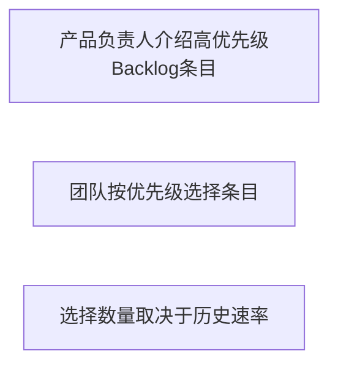

**第二部分**：

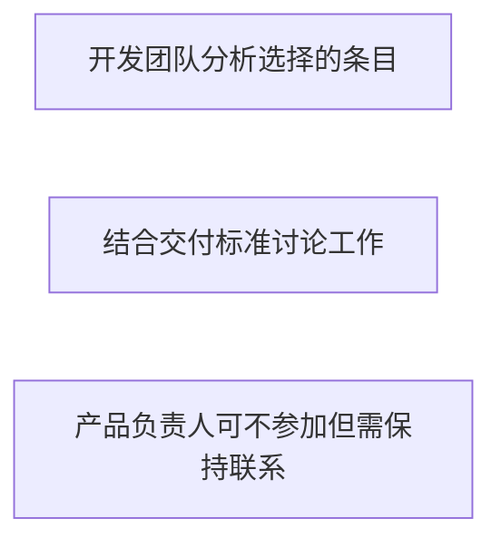

#### 📷 图10.3 任务墙和燃尽图

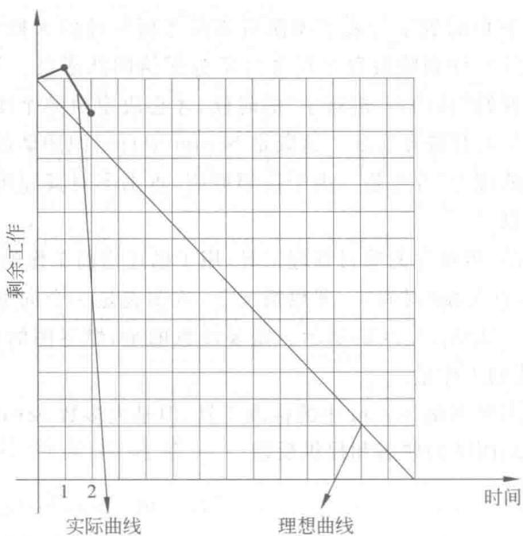

> 📚 **课本出处**：图10.3 展示了任务墙和燃尽图的示例，用于跟踪Sprint进度

**任务墙（Task Board）**：

| 特性 | 说明 |
|------|------|
| **形式** | 物理墙面、卡片、白板（推荐）或电子工具 |
| **结构** | 最左侧：产品Backlog条目；列：待开始 → 进行中 → 已完成 |
| **卡片信息** | 任务描述 + 右下角估算时间 |
| **重要特点** | **不提前分配任务**，任务从"待开始"→"进行中"时才自我选择 |
| **背后思想** | 自组织团队、延迟决策、排队理论 |

**燃尽图（Burndown Chart）**：

| 特性 | 说明 |
|------|------|
| **Y轴** | 剩余工作量 |
| **X轴** | 时间 |
| **理想曲线** | 向下的曲线，"燃尽"至零 |
| **重点** | 关心**剩余工作量**，而非已完成工作量 |
| **作用** | 可视化项目进度，及时发现偏差 |

#### 2. 每日例会（Daily Scrum / Stand-up）

| 项目 | 说明 |
|------|------|
| **时长** | 不超过**15分钟** |
| **参与者** | 开发团队、Scrum Master（产品负责人可选）；其他人可旁听但不得发言 |
| **形式** | 常采用**站立会议**（Stand-up） |
| **目的** | 保证团队了解和分享全局项目信息，尽早发现潜在问题 |

**三个经典问题**：

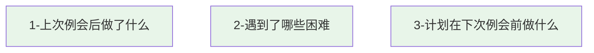

**为什么要站着开？**
- 确保会议简短高效
- 避免讨论过多细节
- 仅讨论最重要、共同关心的问题

#### 3. Sprint评审（Sprint Review）

| 项目 | 说明 |
|------|------|
| **目的** | 演示本Sprint完成的功能，获得反馈 |
| **参与者** | 鼓励各种角色参加（不仅限于客户和团队） |
| **形式** | **非正式方式**，不使用幻灯片，不过多准备 |
| **意义** | 组织学习的机会，不同角色可能发现新信息 |

#### 4. Sprint回顾（Sprint Retrospective）⭐⭐⭐

> 📚 **课本出处**：敏捷宣言第12条原则 - "团队定期地反思如何变得更加高效，并且相应地调整自身的行为"

**回顾会议5个阶段**：

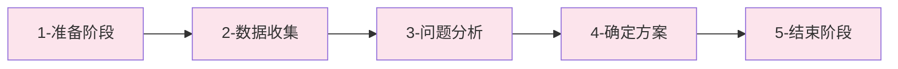

| 阶段 | 内容 |
|------|------|
| **1. 准备阶段** | 设定目标和议程，调动参与者积极性，就工作方式达成共识 |
| **2. 数据收集** | 从多个视角收集信息，为问题分析准备数据 |
| **3. 问题分析** | 参与者一起分析信息，试图发现深层次问题 |
| **4. 确定方案** | 确定优先解决的问题，寻找切实可行的解决方案；仅选择高优先级问题，不试图解决所有问题 |
| **5. 结束阶段** | 就如何更有效地召开回顾会议进行回顾 |

**参与者**：
- Scrum团队成员（开发团队、产品负责人、Scrum Master）
- 一般不邀请团队以外的人

**Scrum Master职责**：
- 协调回顾会议
- 保证会议有效性
- 协助发现有效部分和潜在问题

**其他回顾方式**：
- 增加感谢环节
- 保持回顾会议活力

---

## 本节小结

```
┌─────────────────────────────────────────────────────────────┐
│                      10.2 Scrum方法                          │
├─────────────────────────────────────────────────────────────┤
│  起源：1986年橄榄球比拟 → 1995年正式发布                      │
│  核心：早期暴露问题，及时调整                                 │
├─────────────────────────────────────────────────────────────┤
│  四大要素                                                    │
│  ├─ 时间盒：Sprint，1个月或更短，固定节奏                    │
│  ├─ 团队：Scrum Master、产品负责人、开发团队（5-9人）        │
│  │   └─ Scrum Master ≠ 项目经理（服务型 vs 管理型）          │
│  ├─ 制品：产品Backlog、Sprint Backlog、潜在可交付产品增量    │
│  └─ 规则：达到"完成"标准                                     │
├─────────────────────────────────────────────────────────────┤
│  三支柱：高透明度 → 检验 → 适应                              │
├─────────────────────────────────────────────────────────────┤
│  迭代活动                                                    │
│  ├─ Sprint计划会议：两部分，选择Backlog条目，制定计划        │
│  ├─ 每日例会：15分钟，站立，3个问题                          │
│  ├─ Sprint评审：演示功能，非正式                             │
│  └─ Sprint回顾：5个阶段，持续改进                            │
├─────────────────────────────────────────────────────────────┤
│  工具：任务墙、燃尽图                                        │
└─────────────────────────────────────────────────────────────┘
```

---

## 疑问与思考

### ❓ 待解决问题

1. 

### 💡 个人理解

1. 

---

## 相关链接

- **课本出处**：第10章 10.2节"Scrum方法"
- **大纲文件**：`软件工程/大纲.md`
- **完整内容**：`软件工程/full.md`
- **上一节笔记**：[第10章-10.1-敏捷软件开发方法概述](./第10章-10.1-敏捷软件开发方法概述.md)

### 本节相关图片

1. **图10.2 Scrum过程框架**
   - 路径：`../../../images/ddbc1d71c6bb00780d1bdd8e523e40763f170ebdff6ea5299f135b8c8b0f373c.jpg`
   - 说明：展示了Scrum的核心概念和流程

2. **图10.3 任务墙和燃尽图**
   - 路径：`../../../images/17b9e2327a432bb04ad73fef5a9da405a7ebd93d79cf2dea81ab3febc149f26b.jpg`
   - 说明：展示了任务墙和燃尽图的示例

---

## 课后习题

1. Scrum的起源是什么？为什么用"Scrum"（橄榄球）命名？
2. Scrum的四大要素分别是什么？
3. Scrum团队的三种角色是什么？各自的职责是什么？
4. Scrum Master和项目经理有什么区别？
5. Scrum的三支柱是什么？分别如何理解？
6. 产品Backlog的管理有哪些要点？
7. Sprint计划会议分为哪两部分？分别做什么？
8. 每日例会的三个问题是什么？为什么要站着开？
9. 燃尽图的作用是什么？Y轴和X轴分别代表什么？
10. Sprint回顾会议的5个阶段是什么？

---

*笔记创建时间：2026-04-28*
