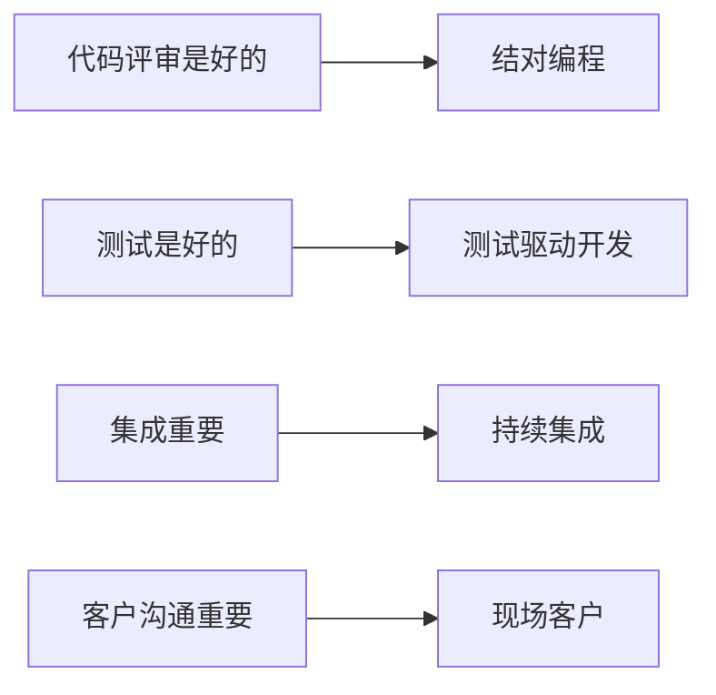
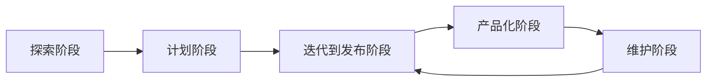
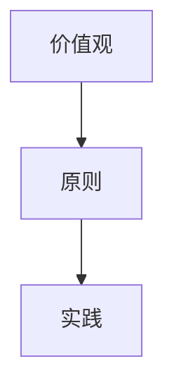
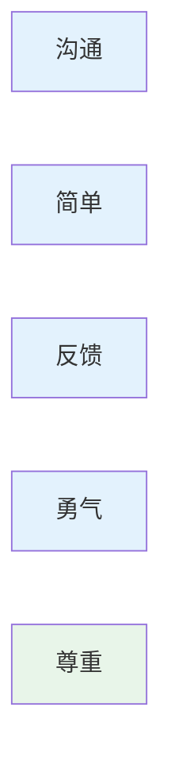
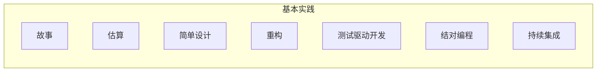
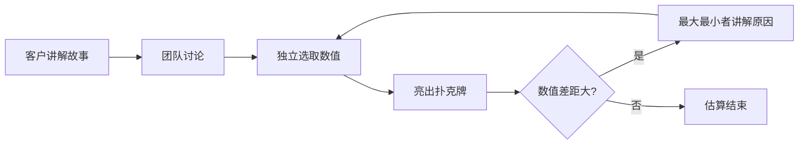
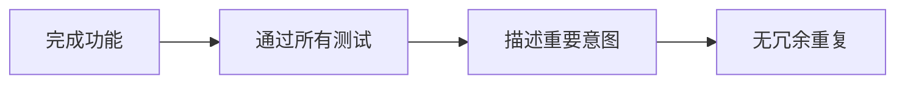
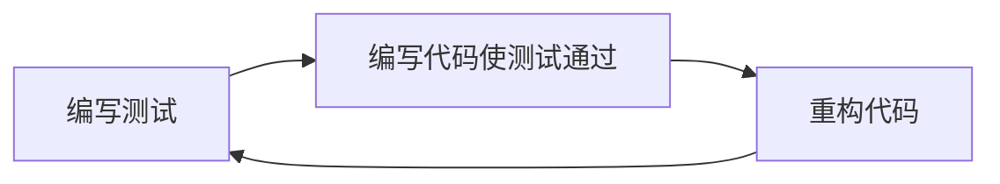
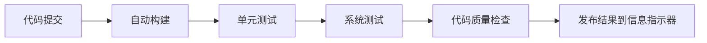
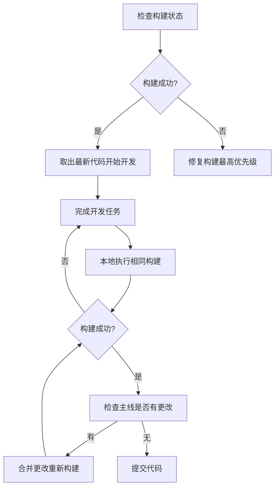

# 第10章-10.3 极限编程方法（XP）

## 基本信息

- **课程**：软件工程
- **章节**：第10章 10.3节 极限编程方法
- **日期**：2026-04-28
- **标签**：#极限编程 #XP #敏捷开发 #结对编程 #测试驱动开发

---

## 重点内容

### ⭐⭐⭐ 核心考点

1. **极限编程5个价值观**（沟通、简单、反馈、勇气、尊重）
2. **极限编程核心实践**（结对编程、测试驱动开发、持续集成、重构等）
3. **极限编程开发过程**（探索、计划、迭代到发布、产品化、维护）

### 📌 考试重点

- 结对编程的工作方式
- 测试驱动开发的3个步骤
- 持续集成的目标和实践步骤
- 简单设计的4个标准

---

## 详细笔记

### 一、极限编程简介

#### 起源

| 时间 | 人物 | 事件 |
|------|------|------|
| 1996年 | Kent Beck等人 | 在Chrysler的C3项目中逐步产生极限编程基本概念 |
| 1999年 | Kent Beck | 撰写《解析极限编程：拥抱变化》，阐述XP价值观、原则和实践 |

#### "极限"的含义

所谓"极限"，表明Kent Beck对一系列软件开发实践**追求卓越**的态度：



| 实践 | 核心思想 | 说明 |
|------|----------|------|
| **结对编程** | 把代码评审推向极致 | 两个程序员搭档工作，最大化交流，确保代码第一时间得到评审 |
| **测试驱动开发** | 把测试推向极致 | 在实际代码编写之前就编写自动测试代码 |
| **持续集成** | 把集成推向极致 | 每当有新代码产生就立即集成 |
| **现场客户** | 把客户沟通推向极致 | 每天都保证客户和团队在一起工作 |

#### 极限编程的开发阶段



**各阶段说明**：

| 阶段 | 主要活动 |
|------|----------|
| **探索阶段** | 用户和开发团队协作，理解高层需求，发现风险要素；产生用户故事列表初始版本，发现重大体系结构决策 |
| **计划阶段** | 基于需求和体系结构制订发布计划；估算出现问题时采取探索性活动（如快速原型） |
| **迭代到发布阶段** | 完成主要开发工作（建模、编码、测试、集成）；产生新用户故事，开发测试用例，进行验收测试 |
| **产品化阶段** | 用户认可后成为新的可发布版本增量 |
| **维护阶段** | 保持现有系统正常运行，开发新功能，进行重构 |

#### 📷 图10.4 极限编程的开发过程


> 📚 **课本出处**：图10.4 展示了极限编程的5个开发阶段及其关系

---

### 二、价值观和原则 ⭐⭐⭐

#### 极限编程的方法体系



#### 5个价值观



> ⚠️ **注意**：尊重是XP 2.0新增的价值观

##### 1. 沟通

- **核心**：成功的软件开发关键是掌握正确的信息
- **问题**：不能准确沟通需求 → 无法产生正确软件；模型变化不能及时同步 → 不一致的实现和集成问题
- **XP实践**：强调真实客户参与、结对编程等

##### 2. 简单

- **核心**：团队在任何时刻仅做当前最必要的工作（类似JIT）
- **要求**：仅使用最必要的过程、撰写最必需的文档、编写最必要的代码
- **目的**：不产生额外浪费，避免预测未来，减少未来变化的影响
- **与沟通的关系**：越复杂的设计，沟通成本越大；加强沟通可发现不需要的需求和设计

##### 3. 反馈

> "盲目乐观是设计的敌人，而反馈是避免盲目乐观的药方。" —— Kent Beck

- **核心**：利用每一个机会发现问题并调整
- **特点**：XP实践中充满大量反馈回路，尽可能缩短反馈周期
- **示例**：结对编程发现设计问题、现场客户发现需求问题、先写测试发现实现问题

##### 4. 勇气

- **核心**：倾向于做正确的决策，即使困难
- **示例**：
  - 项目状态不如预期时，勇于如实告知
  - 发现前期设计重大失误时，勇于承认并修复
- **注意**：勇气不是鲁莽，需要和沟通、简单、反馈相结合

##### 5. 尊重（XP 2.0新增）

- **核心**：认可每个人的专业技能和价值
- **体现**：如实反映和他人利益相关的情况，构建团队共同目标

#### 原则

原则是对价值观的具体应用，XP 2.0包括：
- 人性化、经济性、互惠、自相似、改善、多样性、反省、机遇、流动、失败、冗余、质量、小步骤、接受责任

---

### 三、极限编程实践 ⭐⭐⭐

#### 实践分类



#### 1. 故事（用户故事）

- **定义**：描述待开发软件的必要特征和功能，以用户为中心
- **形式**：建议使用**故事卡片**（物理索引卡片）
- **用途**：
  - 触发客户和开发团队之间的沟通
  - 澄清需求、排列优先级
  - 作为验收测试的依据

**常见误区**：使用开发人员的术语描述，如"为系统增加一个硬件适配层" ❌

#### 2. 估算

- **方法**：采用**故事点**进行估算（而非人年、人月）
- **故事点**：相对值方法，选择基准故事定为1点，其他故事与之比较
- **优势**：在固定迭代周期的团队中，可计算完成一定故事点需要的迭代周期

**计划扑克**：



**估算步骤**：
1. 团队坐在一起
2. 客户（产品负责人）讲解故事
3. 团队讨论需要做的工作
4. 每个人独立选取估算数值
5. 一起亮出扑克牌
6. 数值相同或类似 → 估算结束
7. 数值差距大 → 最大最小者讲解原因，重复步骤4-7

> 💡 **价值**：不仅是确定故事规模，更重要的是通过讨论发现需求或实现中的问题

#### 3. 简单设计

**4个标准**：



| 标准 | 说明 |
|------|------|
| 完成功能 | 完成了定义的功能 |
| 通过测试 | 能通过所有的测试 |
| 描述意图 | 设计描述了程序员的重要意图，便于理解和沟通 |
| 无冗余 | 设计和实现没有冗余、没有重复的逻辑 |

- **注意**：简单设计 ≠ 简陋设计，需要对领域深刻理解
- **结果**：简单设计往往是**持续重构**的结果

#### 4. 重构

- **定义**：在不改变代码外部行为的情况下，调整内部结构，保持代码可理解、可维护
- **参考**：Martin Fowler《重构》描述22种代码坏味道和60多种重构手法
- **常见坏味道**：重复代码、过长函数、过大类、数据泥团等
- **原则**：
  - ❌ 不推荐大规模重构（风险大）
  - ✅ 代码刚出现"坏味道"时及时调整
  - ✅ 在自动化测试保证下进行

#### 5. 测试驱动开发（TDD）⭐⭐⭐

**3个步骤**（快速循环）：



| 步骤 | 说明 |
|------|------|
| ① 编写测试 | 试图发现代码中有一处功能未实现，或存在一个需要修复的问题 |
| ② 编写代码 | 使用尽可能快的方式编写产品代码，使测试得以通过 |
| ③ 重构 | 对代码进行重构 |

**价值**：
- 促使开发人员在编码前周密思考要实现的功能
- 更加专注于代码的外部行为
- 更容易保证代码的可测试性
- **副产品**：获得一份可自动化执行的测试代码，为重构建立保证

#### 6. 结对编程 ⭐⭐⭐

- **定义**：两个程序员坐在一台计算机前一起编程
- **角色分工**：
  - **驾驶员**：关注当前具体实现
  - **领航员**：检查程序正确性、进行策略思考、提出建议
- **特点**："流动的结对"——分工和伙伴动态调整

**价值**：
- 提高设计可靠性和质量（两个程序员一起思考）
- 代码编写完成时同时通过代码审查
- 减少程序错误，降低测试时间和成本
- 促进团队对代码的理解，减少人员流动影响

#### 7. 持续集成 ⭐⭐⭐

**传统开发模式的风险**：
- **接口问题**：模块接口不一致，数月开发后才发现
- **模块内部问题**：模块内部错误未在模块测试时发现，影响集成进度

**持续集成的目标**：
> 始终保持一个可以工作的系统

**核心思想**：
> 每次只引入细小变化、缓慢但稳健地保持系统增长

**实践要求**：
- 每当完成一部分功能，立即集成到系统中
- 通过各种测试保证集成质量
- 通过测试后才能进行后续开发与集成
- 仅使用有限分支（最好是唯一主线）
- 每天多次集成

**自动化支持**：



**关键概念**：构建不仅仅指编译，还包括所有保证软件质量的活动

**开发步骤**：



#### 📷 图10.5 持续集成环境示例


> 📚 **课本出处**：图10.5 展示了典型的持续集成环境，包括代码提交、自动构建、测试、质量检查和结果发布

---

## 本节小结

```
┌─────────────────────────────────────────────────────────────┐
│                    10.3 极限编程方法（XP）                    │
├─────────────────────────────────────────────────────────────┤
│  起源：1996年C3项目 → 1999年Kent Beck著书阐述               │
│  核心："极限" = 把好的实践推向极致                           │
├─────────────────────────────────────────────────────────────┤
│  5个价值观                                                   │
│  ├─ 沟通：掌握正确信息是关键                                 │
│  ├─ 简单：仅做当前最必要的工作                               │
│  ├─ 反馈：避免盲目乐观的药方                                 │
│  ├─ 勇气：做正确的决策                                       │
│  └─ 尊重：认可每个人的价值（XP 2.0新增）                     │
├─────────────────────────────────────────────────────────────┤
│  核心实践                                                    │
│  ├─ 故事：用户故事、故事卡片                                 │
│  ├─ 估算：故事点、计划扑克                                   │
│  ├─ 简单设计：4个标准                                        │
│  ├─ 重构：持续调整代码结构                                   │
│  ├─ 测试驱动开发：先写测试→再写代码→重构                     │
│  ├─ 结对编程：驾驶员+领航员，流动结对                         │
│  └─ 持续集成：始终保持可工作系统，每天多次集成               │
└─────────────────────────────────────────────────────────────┘
```

---

## 疑问与思考

### ❓ 待解决问题

1. 
2. 

### 💡 个人理解

1. 
2. 

---

## 相关链接

- **课本出处**：第10章 10.3节"极限编程方法"
- **大纲文件**：`软件工程/大纲.md`
- **完整内容**：`软件工程/full.md`

### 本节相关图片

1. **图10.4 极限编程的开发过程**
   - 说明：展示了极限编程的5个开发阶段及其关系

2. **图10.5 持续集成环境示例**
   - 路径：`../../../images/4327fc09092291e62cfa270085d1e5e57c77784c2c4a5c7a75fddb03cbe37cd0.jpg`
   - 说明：展示了典型的持续集成环境

---

## 课后习题

1. 什么是极限编程？为什么叫"极限"编程？
2. 极限编程的5个价值观是什么？它们之间有什么关系？
3. 极限编程的开发过程包括哪几个阶段？各阶段的主要活动是什么？
4. 什么是用户故事？好的用户故事应该具备什么特征？
5. 什么是故事点？如何使用计划扑克进行估算？
6. 简单设计的4个标准是什么？
7. 测试驱动开发的3个步骤是什么？它有什么价值？
8. 结对编程中两个程序员的角色分工是什么？结对编程有什么价值？
9. 持续集成的目标是什么？开发者在持续集成环境中应该遵循哪些步骤？

---

*笔记创建时间：2026-04-28*
