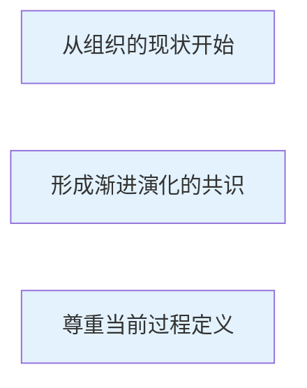
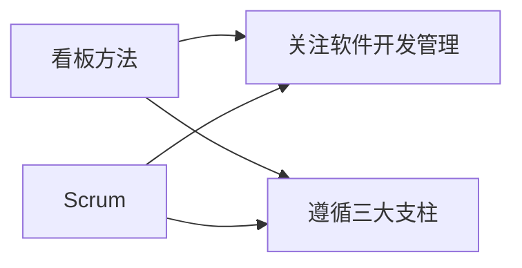
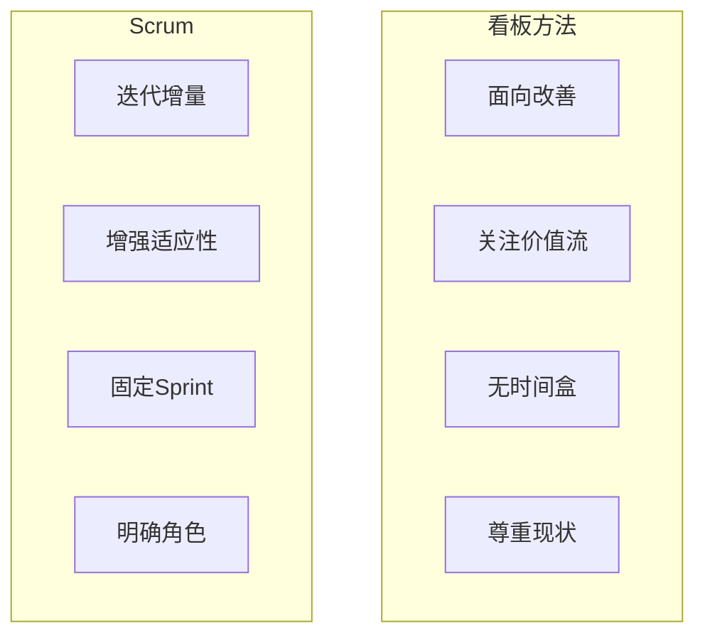

# 第10章-10.4 看板方法

## 基本信息

- **课程**：软件工程
- **章节**：第10章 10.4节 看板方法
- **日期**：2026-04-28
- **标签**：#看板方法 #Kanban #精益思想 #WIP限制 #价值流

---

## 重点内容

### ⭐⭐⭐ 核心考点

1. **看板方法的5条规则**
2. **WIP（在制品）限制的作用**
3. **看板方法与Scrum的比较**
4. **看板方法的3个基本原则**

### 📌 考试重点

- 可视化工作流的创建方法
- 限制WIP数量如何实现拉动系统
- 周期时间的度量和意义
- 看板与Scrum的主要区别

---

## 详细笔记

### 一、看板方法简介

#### 起源

- **词源**："看板"来源于日语，本意是"**可视卡片**"
- **生产系统**：在丰田生产系统中，使用看板发布生产指令，实现对"在制品"(WIP)数量的限制
- **软件开发**：David J. Anderson 将看板方法引入软件开发领域

#### 定义

> "看板是一种增量的、演进的改变技术开发和组织运作的方法。看板通过限制WIP的数量，形成了一个以拉动系统为核心的机制，暴露系统中的问题，激发协作来改善系统。"
> —— David J. Anderson

#### 本质

看板方法的本质是一种**改善系统的方式**，与精益思想追求持续改善的思路一致。

#### 3个基本原则 ⭐⭐⭐



| 原则 | 说明 |
|------|------|
| **① 从组织的现状开始** | 认可组织当前的现状，不寻求激烈的改变 |
| **② 形成渐进演化的共识** | 团队理解并愿意为了改善系统而实施逐步的改善 |
| **③ 尊重当前的过程定义** | 认可当前组织现状的合理性，消除影响变革的恐惧因素 |

---

### 二、看板方法的5条规则 ⭐⭐⭐


#### 1. 可视化工作流

**目的**：了解当前的工作流，发现可以改善的问题

**创建步骤**：
1. 列出日常工作中的所有活动
2. 将活动进行归类
3. 按照依赖关系串行化
4. 用图表呈现当前工作在工作流上的现状

> 💡 **关键**：团队的紧密协作非常重要

#### 📷 图10.6 可视化工作流


> 📚 **课本出处**：图10.6 展示了可视化工作流的示例，每个列代表工作流的一个步骤，每张卡片代表一项工作

**工作流 vs 价值流**：
- David J. Anderson 提倡使用"**工作流**"而不是"价值流"
- 体现看板方法的"**尊重现状**"原则

#### 2. 限制WIP的数量 ⭐⭐⭐

**WIP（Work In Progress）**：在制品，指正在加工的产品或准备加工的原料/半成品

**为什么要限制WIP？**
- WIP占用资金和资源而不能立即交付给客户
- 在精益生产中被看成是**浪费**

**如何实现拉动系统**：


**示例**：
- 客户确认的WIP限制为**1**
- 系统测试的WIP限制为**3**
- 如果客户确认阶段已有1个，即使系统测试完成新功能，也不能移动到客户确认阶段
- 这将阻止系统测试阶段继续开发，实现从后端往前端的**拉动系统**

#### 3. 度量并管理周期时间

**周期时间**：一个需求在整个开发环节流动的时间

**意义**：
- 周期时间越短 → 对客户的响应越迅速
- 是**创建价值的重要指标**
- 帮助了解当前现状，为改善设定目标

#### 4. 明确过程准则

**为什么需要过程准则？**
- 缺乏准则会导致团队困惑
- 例如：开发准备阶段做到什么程度算完成？
- 实现阶段是否包含代码质量检查？
- 是否应该编写自动化单元测试？

**作用**：
- 在整个软件开发团队中**达成共识**
- 准确了解项目的当前状态
- 进行进一步的改善

#### 5. 通过科学的方法改善工作流

**如何暴露问题**：
- WIP的限制暴露过程中的问题
- 周期时间的度量提供改善依据

**示例**：
- 如果工作流总是在**系统测试处发生拥塞**
- 提示："系统测试方面可能是人员不足"

**改善方式**：
- 看板方法不会告诉团队应该怎么做
- 要求团队就问题进行讨论，提出解决方案
- 可能方案：增加测试人员、提高WIP限制、或暂时不做改变

**工作流的演化**：
- 工作流不是一成不变的
- 团队在实践中逐步发现更好的工作流

---

### 三、看板方法和Scrum的比较 ⭐⭐⭐

#### 相似之处



| 方面 | 说明 |
|------|------|
| **关注范围** | 都关注软件开发的管理，不关心技术本身 |
| **三大支柱** | 都遵循高透明度、检验、适应 |
| **演化可能** | 实施看板的组织在某些情形下能够演化为Scrum |

**看板如何实现三大支柱**：
- **高透明度**：可视化工作流、限制WIP数量、度量周期时间
- **检验**：通过透明度发现问题
- **适应**：推动团队进行改善

#### 主要区别



| 比较维度 | 看板方法 | Scrum |
|----------|----------|-------|
| **核心目标** | 改善价值流，促使价值流更快流动 | 通过迭代增量增强适应性与变革能力 |
| **时间盒** | ❌ 没有明确定义的时间盒 | ✅ 有固定的Sprint周期 |
| **迭代计划** | ❌ 无须固定时间节点进行迭代计划 | ✅ 每个Sprint开始时有计划会议 |
| **迭代评审** | ❌ 无须固定时间节点进行评审 | ✅ 每个Sprint结束时有评审会议 |
| **角色定义** | 尊重当前角色和职责 | 明确定义Scrum Master、产品负责人、开发团队 |
| **组织要求** | 宽松，尊重现状，逐渐改变 | 要求组织做出更大承诺，调整组织结构 |
| **常用实践** | 每日例会、回顾会议（可选） | 每日站会、Sprint评审、Sprint回顾（必须） |

#### 选择建议

| 场景 | 推荐方法 |
|------|----------|
| 希望尊重现状、渐进改变 | 看板方法 |
| 愿意调整组织结构、明确角色 | Scrum |
| 需要固定节奏、明确迭代 | Scrum |
| 希望灵活流动、持续优化 | 看板方法 |

---

## 本节小结

```
┌─────────────────────────────────────────────────────────────┐
│                      10.4 看板方法                           │
├─────────────────────────────────────────────────────────────┤
│  起源：日语"可视卡片" → 丰田生产系统 → 软件开发              │
│  本质：改善系统的方式，与精益思想一致                        │
├─────────────────────────────────────────────────────────────┤
│  3个基本原则                                                 │
│  ├─ 从组织的现状开始                                         │
│  ├─ 形成渐进演化的共识                                       │
│  └─ 尊重当前过程定义                                         │
├─────────────────────────────────────────────────────────────┤
│  5条规则 ⭐⭐⭐                                               │
│  ├─ 1. 可视化工作流                                          │
│  ├─ 2. 限制WIP数量（实现拉动系统）                           │
│  ├─ 3. 度量并管理周期时间                                    │
│  ├─ 4. 明确过程准则                                          │
│  └─ 5. 通过科学方法改善工作流                                │
├─────────────────────────────────────────────────────────────┤
│  与Scrum的比较                                               │
│  ├─ 相似：关注管理、遵循三大支柱                             │
│  └─ 区别：无时间盒、尊重现状 vs 固定Sprint、明确角色         │
└─────────────────────────────────────────────────────────────┘
```

---

## 疑问与思考

### ❓ 待解决问题

1. 
2. 

### 💡 个人理解

1. 
2. 

---

## 相关链接

- **课本出处**：第10章 10.4节"看板方法"
- **大纲文件**：`软件工程/大纲.md`
- **完整内容**：`软件工程/full.md`

### 本节相关图片

1. **图10.6 可视化工作流**
   - 路径：`../../../images/6687a2dc9c4497ae0da824f1904f0be7ed55bffe00b46e3e99fc5d9641bcac5c.jpg`
   - 说明：展示了可视化工作流的示例，每个列代表工作流步骤，每张卡片代表一项工作

---

## 课后习题

1. 什么是看板方法？它的本质是什么？
2. 看板方法的3个基本原则是什么？
3. 看板方法的5条规则是什么？请详细说明每条规则的内容。
4. 什么是WIP？为什么要限制WIP的数量？
5. 限制WIP数量如何实现拉动系统？
6. 什么是周期时间？为什么它是创建价值的重要指标？
7. 看板方法和Scrum有哪些相似之处？
8. 看板方法和Scrum的主要区别是什么？在什么情况下应该选择看板方法？

---

*笔记创建时间：2026-04-28*
