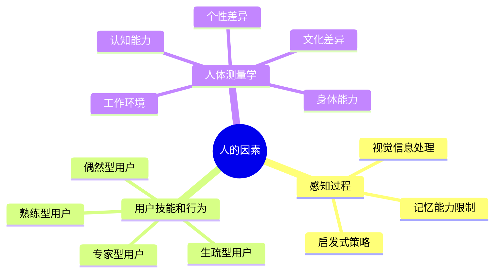

# 第11章-11.1-人的因素

## 基本信息
- **课程**：软件工程
- **章节**：第11章 11.1节 人的因素
- **日期**：2026-06-30
- **标签**：#人机界面 #感知过程 #用户分类 #人体测量学

---

## 重点内容

### ⭐⭐ 核心概念
- **感知过程**：人通过感觉器官认识客观世界，界面设计必须考虑视觉、触觉、听觉
- **记忆限制**：人的记忆能力有限，不能要求用户记住复杂操作顺序
- **启发式策略**：用户通常使用以往经验中获得的启发式策略来处理问题

### ⭐⭐ 用户分类
- **偶然型**：第一次或极少使用系统，需要简单功能和防错提示
- **生疏型**：有了解但很少使用，需要简单提示和常规操作序列
- **熟练型**：经常使用某些功能，需要快捷方式和宏操作
- **专家型**：通晓系统各方面，需要高效率和及时反馈

### ⭐ 人体测量学的多样性维度
- 身体能力、工作环境、认知能力、个性、文化

---

## 详细笔记

### 一、人对感知过程的认识

人通过感觉器官认识客观世界，设计用户界面时要充分考虑视觉、触觉、听觉的作用。

> 📚 **课本出处**：第11章 11.1.1节"人对感知过程的认识"

**可视信息处理**：

人机界面主要在可视介质上实现（正文、图形、图表等）。人们根据显示内容的体积、形状、颜色等表征来理解可视信息。字体、大小、位置、颜色、形状等因素都会直接影响信息提取的难易程度。

**记忆能力**：

- 用户从界面提取的信息需要保存在记忆中，供以后回忆和使用
- 用户还需要记住命令、操作顺序、出错现场等信息
- 人的记忆能力是有限的，设计时不能要求用户记住复杂的操作顺序

**启发式策略**：

- 大多数人遇到问题时不进行形式的演绎和归纳推理，而是使用一组启发式策略
- 这些策略是从以往对类似问题的处理中逐渐获得的
- 设计人机界面时应便于用户积累交互经验
- 启发式策略要保持一致性，如 undo、exit 等要有统一的含义、位置和表示

> 💡 **理解技巧**：界面设计的关键在于"符合人的认知习惯"，而不是要求人去适应计算机。好的界面应该让用户凭直觉就能操作。

---

### 二、用户的技能和行为方式

除了感知这个基本因素外，用户本身的技能、个性差异、行为方式的不同都会对人机界面造成影响。

> 📚 **课本出处**：第11章 11.1.2节"用户的技能和行为方式"

**用户分类与设计策略**：

| 用户类型 | 特点 | 设计策略 |
|:--------:|:-----|:---------|
| 偶然型 | 第一次或极少使用，无记忆 | 简单功能、防错、及时提示反馈 |
| 生疏型 | 有了解但很少使用，知道功能但不记得操作 | 简单提示、符合常规的操作序列 |
| 熟练型 | 经常使用某些功能 | 设置快捷方式、定义宏操作 |
| 专家型 | 通晓系统各方面和各种操作 | 保证高效、及时反馈结果信息 |

**分类递进策略**：

当需要同时为多个不同类型用户设计界面时：
- 为**偶然型用户**：提供最少功能，忽略性能，但提供最好的健壮性
- 为**高级用户**：提供更多功能、更好性能，但操作出错率会增加

#### 📷 图11.1 WindowsXP性能维护向导

> 📚 **课本出处**：图11.1 展示了WindowsXP控制面板的向导功能，适合不太熟练的用户

---

### 三、人体测量学对设计的影响

人机界面设计必须符合该系统用户的特点，人的多样性体现在多个方面。

> 📚 **课本出处**：第11章 11.1.3节"人体测量学对设计的影响"

**人的多样性维度**：

| 维度 | 说明 | 设计影响 |
|:----:|:-----|:---------|
| 身体能力 | 性别、年龄、人种、体重、身高等 | 如键盘按键距离、大小、力度 |
| 工作环境 | 用户使用系统时所处的物理环境 | 空间、光线、噪音约束 |
| 认知能力 | 人认识世界、处理事物的能力 | 控制系统复杂度和学习开销 |
| 个性 | 男性和女性的个性差异等 | 如游戏软件的交互方式差异 |
| 文化 | 民族、语言等文化背景差异 | 软件国际化和本地化 |

#### 📷 图11.2 WindowsXP操作系统区域和语言选项

> 📚 **课本出处**：图11.2 展示了WindowsXP操作系统的区域和语言选项，体现了人机界面的本地化设计

**主要的可测人性因素**：

| 度量指标 | 说明 |
|:--------:|:-----|
| 用户时间 | 典型用户完成特定任务所需时间 |
| 基准时间 | 系统正确完成基准任务所需时间 |
| 基准出错率 | 典型用户完成基准任务时的错误情况 |
| 任务出错率 | 典型用户完成特定任务时的错误情况 |
| 学习能力 | 典型用户学习使用系统所花费的时间 |
| 记忆能力 | 典型用户使用系统后的记忆保持时间 |
| 主观看法 | 典型用户使用系统后的主观满意情况 |

**不同系统的设计取舍**：

| 系统类型 | 代表案例 | 设计重点 |
|:--------:|:---------|:---------|
| 关键系统 | 飞机航线控制、消防调度、医疗器械 | 高效性、极低出错率，可牺牲学习时间和主观看法 |
| 工商业系统 | 自动取款机 | 适当考虑主观看法，减少学习时间，保持较高效率 |
| 个人系统 | 家庭娱乐系统 | 容易学习、出错率低、主观满意度高 |

> ⚠️ **常见误区**：这些可测量的人性因素并不能都保持最佳状态，设计时必须根据实际情况进行取舍。例如要维持低出错率，系统效率可能变差；要保证效率，学习时间可能增加。

---

## 总结

### 知识点脑图

### 关键要点

1. **感知是界面设计的基础**：界面主要通过视觉传递信息，字体、颜色、位置等因素直接影响信息提取
2. **记忆能力有限**：设计不应要求用户记住复杂操作顺序，应提供可视提示
3. **启发式策略要一致**：undo、exit等操作要有统一的含义、位置和表示
4. **四类用户需要不同策略**：偶然型重健壮性、熟练型重效率、专家型重高性能
5. **人性化因素需要取舍**：不同系统根据特点侧重不同的度量指标

---

## 疑问与思考

❓ **在实际项目中，如何确定目标用户群体的类型分布？是否需要对每类用户都设计专门的交互路径？**
💡 通常通过用户调研（问卷、访谈、现场观察）来确定用户类型的分布比例。实践中一般采用"主辅兼顾"策略：以数量最多的用户类型为主要设计目标，同时提供可切换的模式（如高级模式/简易模式）来服务其他类型用户，而不是为每类用户设计完全独立的交互路径。

❓ **"分类递进策略"中如何平衡偶然型用户的健壮性和专家型用户的效率？是否可能出现矛盾？**
💡 矛盾确实存在，实践中常用的平衡手段是分层设计：默认界面面向偶然型和生疏型用户，提供简洁、防错的操作流程；同时保留快捷键、命令行、宏等高效入口供熟练型和专家型用户使用。关键是让初级功能"好发现"、高级功能"好找到"但不碍事。

❓ **认知能力的多样性如何量化？界面复杂度的"阈值"该如何确定？**
💡 认知能力的量化可通过认知负荷测量工具（如NASA-TLX量表）和任务完成率来间接评估。界面复杂度的阈值没有统一标准，一般通过可用性测试来确定——当多数目标用户能顺利完成核心任务且主观满意度达标时，可认为复杂度在可接受范围内。

### 💡 个人理解/技巧
- 四类用户的划分可以类比"学习曲线"：偶然型处于曲线起点，专家型处于曲线平台期
- 可测量人性因素之间的关系类似于"不可能三角"：低出错率、高效率、低学习成本难以同时满足
- 关键系统（如医疗、航空）本质上是用高培训成本换取低使用风险
- WindowsXP向导功能的例子说明：向导模式是为生疏型用户设计的典型方案，通过引导式操作降低认知负担

---

## 相关链接

### 本节相关图片
- [图11.1 WindowsXP性能维护向导](../../../images/6106032c59a24c65bdfc682a7e74160fd4bb6ef67ca32837a61504d31b008e5d.jpg)
- [图11.2 WindowsXP操作系统区域和语言选项](../../../images/cc8540de79237cfa30dc27d8a30a1fde06246bec87b51a91b98a298f1257f3a2.jpg)

### 关联章节
- [第11章-人机界面设计](./第11章-人机界面设计.md)
- [第11章-11.2-人机界面风格](./第11章-11.2-人机界面风格.md)
- [第11章-11.3~11.6-界面分析设计评估](./第11章-11.3~11.6-界面分析设计评估.md)

---

## 检查清单

- [x] 已理解人对感知过程的认识（视觉、记忆、启发式策略）
- [x] 已掌握四类用户的特点和对应设计策略
- [x] 已理解人体测量学的五个多样性维度
- [x] 已掌握七种可测人性因素
- [x] 已插入课本原图（图11.1、图11.2）
- [x] 已添加课本出处标注

---

*笔记创建时间：2026-06-30*
