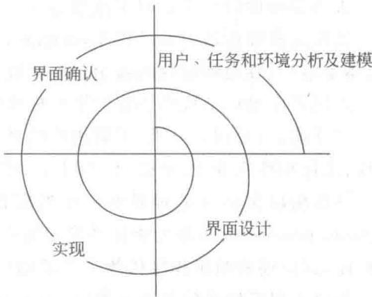
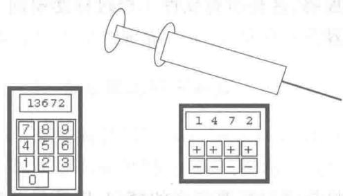
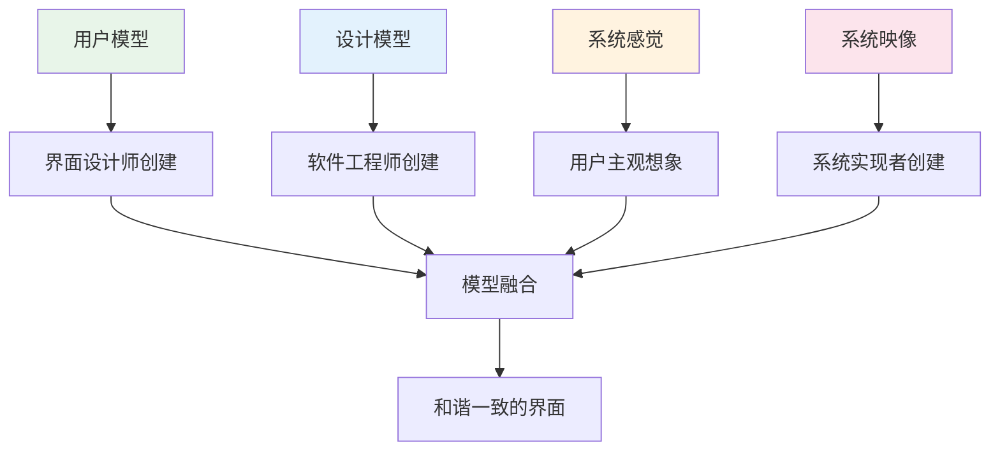

# 第11章-11.3~11.6-界面分析设计评估

## 基本信息
- **课程**：软件工程
- **章节**：第11章 11.3~11.6节 界面分析建模、设计活动、实现工具、设计评估
- **日期**：2026-06-30
- **标签**：#人机界面 #界面分析 #界面设计 #黄金原则 #可用性评估 #UIDS

---

## 重点内容

### ⭐⭐⭐ 黄金原则（Mandel三条原则）
1. **让用户拥有控制权**：不强迫用户进入不必要模式、提供灵活交互、支持中断撤销、允许定制
2. **减少用户的记忆负担**：减少短期记忆要求、建立默认值、定义直觉性捷径、基于真实世界隐喻
3. **保持界面一致**：有意义的语境、应用系列内一致、不改变用户已熟悉的交互模型

### ⭐⭐ 界面设计过程（迭代四步）
1. 用户、任务和环境分析及建模
2. 界面设计
3. 界面构造
4. 界面确认

### ⭐⭐ 四种模型
- 设计模型（软件工程师创建）
- 用户模型（界面设计师创建）
- 用户的模型/系统感觉（终端用户主观想象）
- 系统映像（系统实现者创建）

### ⭐ 设计问题
- 系统响应时间、用户求助设施、错误信息处理、命令标记

---

## 详细笔记

### 一、11.3 人机界面分析与建模

#### 1. 人机界面设计过程

人机界面的设计过程是**迭代的**，可以用类似于螺旋模型表示，包括4个不同的框架活动。

> 📚 **课本出处**：第11章 11.3.1节"人机界面设计过程"

**四个框架活动**：

| 活动 | 内容 |
|:----:|:-----|
| 1. 分析及建模 | 分析用户特点、进行需求获取、定义用户类别、任务分析、环境分析 |
| 2. 界面设计 | 定义界面对象和动作（及屏幕表示） |
| 3. 界面构造 | 根据设计方案使用实现工具完成界面构造 |
| 4. 界面确认 | 检查任务完成程度、易用易学程度、用户接受程度 |

**用户环境分析需关注的问题**：

1. 界面物理上位于何处？
2. 用户是否坐着、站着或完成其他和界面无关的任务？
3. 界面硬件是否适应空间、光线或噪音的约束？
4. 是否需要考虑特殊的由环境因素驱动的人的因素？

#### 📷 图11.3 人机界面设计过程

> 📚 **课本出处**：图11.3 展示了人机界面设计的迭代过程，包含分析建模、设计、构造、确认四个活动

**注射器界面案例**：

一个自动注射器的原型被送到医院试用后，发现了严重的界面缺陷：剂量通过数字小键盘输入，一个意外按键就可能导致剂量相差至少10倍。最终修改为每位数字由加减按钮完成。

#### 📷 图11.4 注射器剂量输入界面

> 📚 **课本出处**：图11.4 左图为调整前界面（数字键盘输入），右图为调整后界面（加减按钮输入）

> ⭐ **核心重点**：用户的早期参与可以使设计缺陷尽快暴露，使最终产品更易被用户接受。

---

#### 2. 人机界面设计中涉及的模型

> 📚 **课本出处**：第11章 11.3.2节"人机界面设计中涉及的模型"

**四种模型**：

| 模型 | 创建者 | 描述 |
|:----:|:------:|:-----|
| 设计模型 | 软件工程师 | 整个系统设计模型，包括数据结构、体系结构、界面和过程的表示 |
| 用户模型 | 界面设计工程师 | 描述系统终端用户的特点（年龄、性别、能力、教育、文化等） |
| 用户的模型（系统感觉） | 终端用户 | 用户主观想象的系统映像，描述期望的系统操作 |
| 系统映像 | 系统实现者 | 基于计算机系统的外在表示和支撑信息（手册、帮助文件等） |

**模型融合原则**：
- 设计模型必须适应包含在用户模型中的信息
- 系统映像必须准确反映接口的语法和语义信息
- **如果系统映像和系统感觉一致，用户就会对软件感到舒服，使用起来就很有效**

> 💡 **理解技巧**：四种模型可以类比"翻译"过程：设计模型是"源语言"，用户模型是"目标听众"，系统映像是"翻译作品"，系统感觉是"读者的理解"。只有四者协调一致，交流才顺畅。

---

#### 3. 任务分析的途径与方法

> 📚 **课本出处**：第11章 11.3.3节"任务分析的途径与方法"

**两种途径**：

| 途径 | 方法 |
|:----:|:-----|
| 基于原有系统 | 剖析原有应用系统的工作步骤，映射到人机界面任务 |
| 基于需求规格说明 | 通过系统需求规格说明的分析，导出与各模型协调的任务 |

**两种分析方法**：

| 方法 | 说明 | 示例 |
|:----:|:-----|:-----|
| 逐步精化法 | 将任务层层细分为子任务 | 室内设计 -> 家具布局/材料选择/涂料选择等 -> 各子任务进一步细分 |
| 面向对象法 | 观察用户使用的物理对象及动作 | 家具模板是对象，动作有"选择""移动""画出轮廓"等 |

---

### 二、11.4 界面设计活动

#### 1. 定义界面对象和动作

> 📚 **课本出处**：第11章 11.4.1节"定义界面对象和动作"

**界面设计步骤**：

1. 建立任务的目标和意图
2. 将每个目标或意图映射为一系列特定的动作
3. 按在界面上执行的方式说明这些动作的顺序
4. 指明系统状态（执行动作时的界面表现）
5. 定义控制机制（用户可用的改变系统状态的设备和动作）
6. 指明控制机制如何影响系统状态
7. 指明用户如何通过界面上的信息解释系统状态

**对象和动作定义方法**：分析用户场景，将名词（对象）和动词（动作）分离出来，形成对象和动作的列表。

---

#### 2. 设计问题

> 📚 **课本出处**：第11章 11.4.2节"设计问题"

**四个常见设计问题**：

| 问题 | 说明 | 设计要点 |
|:----:|:-----|:---------|
| 系统响应时间 | 从用户执行动作到软件作出响应的时间 | 稳定的响应时间比不稳定的要好 |
| 用户求助设施 | 联机帮助系统 | 集成型（语境相关）vs 附加型（需查找） |
| 错误信息处理 | 系统给出的报错信息 | 用用户可理解的术语，提供建议，非批评性 |
| 命令标记 | 命令交互方式的提供 | 考虑命令对应菜单、提供方式、学习难度、可定制性 |

**错误消息应具备的特征**：

1. 以用户可以理解的术语描述问题
2. 提供如何从错误中恢复的建议性意见
3. 指出错误可能导致的不良后果
4. 伴随视觉或听觉上的提示
5. 是"非批评性的"(nonjudgmental)，不能指责用户

> ⚠️ **常见误区**：像"SEVERE SYSTEM FAILURE--14A"这样的出错消息对用户毫无帮助，因为用户无法理解其含义。

---

#### 3. 黄金原则

Theo Mandel提出的三条"黄金原则"，是人机界面设计的基本原则。

> 📚 **课本出处**：第11章 11.4.3节"黄金原则"

##### 原则一：让用户拥有控制权

| 要点 | 说明 |
|:----:|:-----|
| 交互模式定义 | 不能强迫用户进入不必要或不希望的动作方式 |
| 灵活的交互 | 允许通过键盘、鼠标、语音等方式交互 |
| 中断和撤销 | 允许用户交互可以被中断和撤销 |
| 流水化和定制 | 技能增长时可定制交互，提供宏机制 |
| 隔离技术细节 | 允许用户与屏幕对象直接交互 |

##### 原则二：减少用户的记忆负担

| 要点 | 说明 |
|:----:|:-----|
| 减少短期记忆要求 | 提供可视提示，使用户能识别过去的动作 |
| 建立有意义的默认值 | 允许用户定义初始默认值 |
| 定义直觉性捷径 | 助忆符应容易记忆（如Alt+P激活打印） |
| 基于真实世界隐喻 | 界面布局基于用户熟悉的隐喻 |
| 逐步揭示信息 | 层次式组织界面，逐层展开详细信息 |

##### 原则三：保持界面一致

| 要点 | 说明 |
|:----:|:-----|
| 有意义的语境 | 提供指示器让用户知道当前工作的语境 |
| 应用系列内一致 | 一组应用统一实现相同的设计规则 |
| 不改变已熟悉的模型 | 已成为事实标准的交互序列不要改变其含义 |

> ⭐ **核心重点**：黄金原则的核心可以概括为：控制权（用户主导）、记忆负担（减少记忆）、一致性（统一规范）。这三条原则在实际界面设计中需要综合考虑。

---

### 三、11.5 实现工具

创建设计模型后，通常可使用用户界面工具箱或用户界面开发系统(UIDS)开发界面原型。

> 📚 **课本出处**：第11章 11.5节"实现工具"

**UIDS提供的内建(built-in)机制**：

- 管理输入设备（如鼠标和键盘）
- 确认用户输入
- 处理错误和显示出错消息
- 提供反馈（如自动的输入响应）
- 提供帮助和提示
- 处理窗口、域和窗口内的滚动
- 建立应用软件和界面间的连接
- 将应用程序与界面管理功能分离
- 允许用户定制界面

**UIDS的优势**：
- 软件工程师不必一点一滴琐碎地编写界面
- 把主要精力集中在要解决的问题上
- 同一平台上开发的应用程序能有一致的界面风格
- 相似的任务在相似的界面上运行

---

### 四、11.6 设计评估

一旦建立好操作性用户界面原型，必须对其进行评估，以确定是否满足用户的需求。

> 📚 **课本出处**：第11章 11.6节"设计评估"

有效的设计评估包括**专家评审**和**可用性测试**。

#### 1. 专家评审

| 方法 | 说明 |
|:----:|:-----|
| 启发式评审 | 使界面与设计启发规则相符合 |
| 指导文档评审 | 检查界面与组织内指导文档是否相符 |
| 一致性检查 | 检查同类界面的术语、颜色、布局、格式等一致性 |
| 认知尝试 | 专家模仿用户执行典型任务 |
| 正式可用性评审 | 专家讨论，设计小组参与，仲裁设计利弊 |

> ⚠️ **注意**：专家评审可能出现的问题是专家对任务或用户缺乏足够的理解，且对项目目标有不同意见，所以必须选择熟悉项目、经验丰富的专家。

#### 2. 可用性测试

**可用性三要素**：使用效率、易学性、舒适程度

**测试流程**：
1. 制订具体详细的测试计划（任务列表、满意标准、相关问题）
2. 确定参与测试的用户数目、类型和来源
3. 要求用户完成一系列任务，对完成过程进行记录
4. 对记录进行评审

**可用性测试的局限性**：

| 局限 | 说明 |
|:----:|:-----|
| 首次使用 | 强调的是首次使用的情况 |
| 部分界面 | 只能涉及部分的界面 |
| 短期评估 | 不能延续太长时间，很难确定长时间使用后的情况 |

---

## 总结

### 黄金原则表

| 原则 | 核心思想 | 关键措施 |
|:----:|:---------|:---------|
| 让用户拥有控制权 | 用户控制计算机，而非被计算机控制 | 灵活交互、支持中断撤销、允许定制、隔离技术细节 |
| 减少用户记忆负担 | 要求用户记住的东西越多，出错可能越大 | 可视提示、默认值、直觉捷径、真实世界隐喻、逐步揭示 |
| 保持界面一致 | 以一致的方式展示和获取信息 | 有意义语境、应用系列一致、不改变已熟悉的模型 |

### 设计活动表

| 活动 | 阶段 | 核心任务 |
|:----:|:----:|:---------|
| 分析建模 | 11.3 | 用户/任务/环境分析，建立四种模型，任务分析 |
| 界面设计 | 11.4 | 定义对象和动作，解决设计问题，遵循黄金原则 |
| 界面构造 | 11.5 | 使用UIDS工具箱开发界面原型 |
| 界面确认 | 11.6 | 专家评审和可用性测试 |

### 四种模型总结

### 关键要点

1. **迭代设计**：界面设计是迭代过程，用户的早期参与至关重要
2. **四种模型一致**：设计模型、用户模型、系统感觉、系统映像必须协调一致
3. **黄金原则**是核心：控制权、记忆负担、一致性
4. **错误信息**要友好：用用户可理解的语言，提供恢复建议，非批评性
5. **评估不可或缺**：专家评审和可用性测试双管齐下

---

## 疑问与思考

❓ **黄金原则的三条内容分别对应哪些具体的设计实践？能否各举一个正反面案例？**
💡 正面案例：（控制权）文本编辑器支持Ctrl+Z撤销，用户敢于尝试操作；（减记忆）浏览器地址栏的自动补全功能减少了URL记忆需求；（一致性）微软Office系列在不同应用中保持统一的快捷键和菜单布局。反面案例：（控制权）某些弹窗广告强制播放且无法关闭；（减记忆）要求用户输入复杂的命令行参数而无提示；（一致性）同一软件中"保存"按钮在不同页面位置和图标不同。

❓ **界面评估中，专家评审和可用性测试各有什么优缺点？在资源有限时应如何选择？**
💡 专家评审成本低、速度快，不需要召集用户，适合早期快速发现问题；但受限于专家的主观判断，可能忽略真实用户的实际困难。可用性测试能发现真实使用中的问题，证据更可靠；但成本高、周期长、样本有限。资源有限时建议先做专家评审（成本低，覆盖面广），筛选出主要问题后再做小规模可用性测试验证关键问题。

❓ **黄金原则提出至今已有多年，在移动互联网时代是否需要补充新的原则？**
💡 需要补充。移动互联网时代可增加：（1）响应式与自适应原则——界面应适配不同屏幕尺寸和使用姿态；（2）情境感知原则——根据位置、时间、设备状态动态调整界面；（3）隐私与安全原则——最小化数据暴露，明确告知权限用途；（4）无障碍原则——确保残障用户也能正常使用。

❓ **四种模型中，"系统感觉"与"系统映像"不一致时具体会有什么表现？如何诊断？**
💡 不一致的表现包括：用户频繁误操作、反复求助、对系统行为感到意外或困惑、任务完成时间远超预期、用户满意度低。诊断方法包括：可用性测试中观察用户行为和困惑点、收集用户对系统预期与实际体验的反馈、对比用户的心智模型与系统文档/帮助信息的描述差异。

### 💡 个人理解/技巧
- 黄金原则三条可以用"3C"记忆：Control（控制权）、Cognition（认知负担）、Consistency（一致性）
- 四种模型的关系可以理解为"沟通链"：设计者通过设计模型传达意图，系统映像是实际传达的内容，用户模型决定用户能否理解，系统感觉是用户实际理解的内容
- 界面设计过程的迭代性与敏捷开发的迭代理念一致，都强调"尽早暴露问题"
- 注射器界面案例说明：简单的输入方式改变可能避免严重的安全问题，体现了"以人为中心"设计的重要性
- 可用性测试的局限性提醒我们：界面评估应该是持续的，而非一次性活动

---

## 相关链接

### 本节相关图片
- [图11.3 人机界面设计过程](../../../images/5dd08800f4970fd5754a7a0b24ca0742d5f0338a0600d7213b55a40615ea7d4e.jpg)
- [图11.4 注射器剂量输入界面](../../../images/18e406dd8e0cd5cc31b33b8442866a9a9f347391a17590d19651edb591ee13b9.jpg)

### 关联章节
- [第11章-人机界面设计](./第11章-人机界面设计.md)
- [第11章-11.1-人的因素](./第11章-11.1-人的因素.md)
- [第11章-11.2-人机界面风格](./第11章-11.2-人机界面风格.md)
- [第4章-设计工程](../第4章-设计工程/第4章-设计工程.md)
- [第10章-敏捷软件开发](../第10章-敏捷软件开发/第10章-敏捷软件开发.md)

---

## 检查清单

- [x] 已理解界面设计的迭代过程（四个框架活动）
- [x] 已掌握四种模型及其创建者和关系
- [x] 已理解任务分析的两种途径和两种方法
- [x] 已掌握黄金原则三条及其具体措施
- [x] 已理解四个设计问题（响应时间、求助设施、错误信息、命令标记）
- [x] 已了解UIDS提供的内建机制
- [x] 已掌握专家评审的五种方法和可用性测试的流程
- [x] 已插入课本原图（图11.3、图11.4）
- [x] 已添加课本出处标注

---

*笔记创建时间：2026-06-30*
