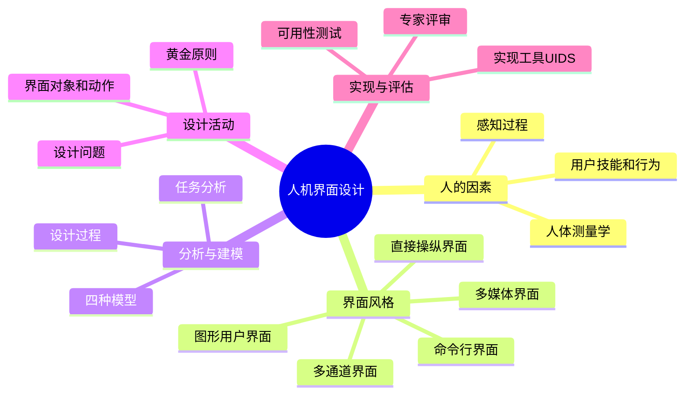

# 第11章-人机界面设计

## 基本信息
- **课程**：软件工程
- **章节**：第11章 人机界面设计
- **日期**：2026-06-30
- **标签**：#人机界面 #用户界面 #界面设计 #黄金原则 #可用性评估

---

## 重点内容

### ⭐⭐ 核心概念
- **人机界面（HCI）**：人与计算机之间传递和交换信息的媒介，包括硬件界面和软件界面
- **人机界面设计**：计算机科学与心理学、设计艺术学、认知科学和人机工程学的交叉领域
- **界面设计的三个黄金原则**：让用户拥有控制权、减少用户记忆负担、保持界面一致

### ⭐⭐ 界面风格演进
- **发展过程**：批处理 -> 联机终端（命令接口） -> 文本菜单 -> 多通道-多媒体用户界面 -> 虚拟现实系统
- **信息载体**：字符用户界面(CUI) -> 图形用户界面(GUI) -> 多媒体用户界面 -> 多通道用户界面
- **信息维度**：一维（文本流） -> 二维（图形） -> 三维（3D图形） -> 多维（多通道）

### ⭐ 设计过程
- **迭代设计**：用户/任务/环境分析建模 -> 界面设计 -> 界面构造 -> 界面确认
- **四种模型**：设计模型、用户模型、用户的模型（系统感觉）、系统映像
- **任务分析**：逐步精化方法和面向对象方法

### ⭐ 评估方法
- **专家评审**：启发式评审、指导文档评审、一致性检查、认知尝试、正式可用性评审
- **可用性测试**：效率、易学性、舒适程度

---

## 章节总览

| 小节 | 内容 | 关键词 |
|:----:|:-----|:-------|
| 11.1 | 人的因素 | 感知过程、用户分类、人体测量学 |
| 11.2 | 人机界面风格 | 命令行、GUI、多媒体、多通道 |
| 11.3 | 界面分析与建模 | 设计过程、用户模型、任务分析 |
| 11.4 | 界面设计活动 | 对象定义、设计问题、黄金原则 |
| 11.5 | 实现工具 | UIDS、构件库 |
| 11.6 | 设计评估 | 专家评审、可用性测试 |

---

## 知识点脑图

---

## 疑问与思考

❓ **人机界面设计中的"以人为中心"思想与敏捷开发中的"用户参与"有什么异同？**
💡 相同点：两者都强调用户的持续参与和反馈驱动的迭代改进。不同点：（1）"以人为中心"关注的是界面与用户认知、感知的匹配，侧重心理学和人体工程学依据；敏捷的"用户参与"关注的是需求验证和价值交付，侧重业务目标。（2）HCI的用户参与贯穿设计-原型-评估全过程，敏捷的用户参与主要体现在需求梳理和验收环节。（3）两者可以互补：将HCI的用户研究方法融入敏捷迭代，能在每次冲刺中同时保证可用性和业务价值。

❓ **多通道用户界面在当前AI技术（如语音助手、手势识别）中是如何体现的？**
💡 多通道界面与AI技术的结合日益紧密：（1）语音助手（Siri、小爱同学）将语音作为主要交互通道，结合自然语言处理理解用户意图；（2）手势识别（Leap Motion、Kinect）捕捉肢体动作实现空间交互；（3）视线追踪用于无障碍辅助和注意力分析；（4）情感识别通过面部表情和语调判断用户状态。AI技术使多通道界面能更精确地理解用户的模糊、不精确输入，真正实现"自然交互"。

❓ **黄金原则在移动端界面设计中是否仍然适用？需要做哪些调整？**
💡 三条黄金原则在移动端完全适用，但需调整具体实现：（1）控制权——移动设备需处理触摸手势冲突（如滑动返回 vs 滚动浏览），需合理设计手势优先级；（2）减少记忆——小屏幕限制了可视信息量，需使用渐进式披露和底部导航栏减少记忆负担；（3）一致性——移动端还需跨设备一致性（手机与平板体验衔接）和平台一致性（iOS和Android的各自设计规范）。此外，移动端需新增考虑：触摸精度、单手操作、通知管理等约束。

### 💡 个人理解/技巧
- 人机界面设计的核心是"理解用户"：不同类型用户需要不同的界面策略
- 界面风格的演进本质上是对人的感知和认知能力的不断适应
- 黄金原则三条可以分别概括为：控制权（用户主导）、记忆负担（减少记忆）、一致性（统一规范）

---

## 相关链接

### 关联章节
- [第1章-概论](../第1章-概论/第1章-概论.md)
- [第4章-设计工程](../第4章-设计工程/第4章-设计工程.md)
- [第10章-敏捷软件开发](../第10章-敏捷软件开发/第10章-敏捷软件开发.md)

### 本章小节笔记
- [第11章-11.1-人的因素](./第11章-11.1-人的因素.md)
- [第11章-11.2-人机界面风格](./第11章-11.2-人机界面风格.md)
- [第11章-11.3~11.6-界面分析设计评估](./第11章-11.3~11.6-界面分析设计评估.md)

---

*笔记创建时间：2026-06-30*
