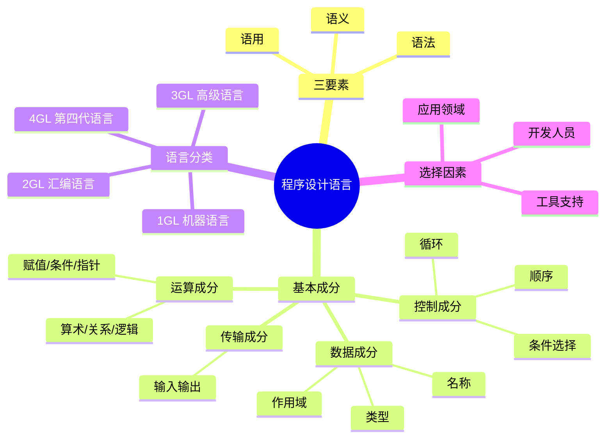

# 第12章-12.1-程序设计语言

## 基本信息
- **课程**：软件工程
- **章节**：第12章 12.1节 程序设计语言
- **日期**：2026-07-01
- **标签**：#程序设计语言 #基本成分 #语言分类 #语言选择

---

## 重点内容

### ⭐⭐⭐ 核心概念
- **语言三要素**：语法（syntax）、语义（semantic）、语用（pragmatic）
- **四大基本成分**：数据成分、运算成分、控制成分、传输成分

### ⭐⭐ 语言分类
- 第一代（机器语言）→ 第二代（汇编语言）→ 第三代（高级语言）→ 第四代（4GL）
- 各代语言的特点、优势和适用场景

### ⭐ 语言选择
- 首要标准：项目所属的应用领域
- 优先选择高级语言，特殊情况使用低级语言

---

## 详细笔记

### 一、程序设计语言的三要素

徐家福教授在《计算机科学技术百科全书》中指出，程序设计语言是用于书写计算机程序的语言，包含3个方面：

> 📚 **课本出处**：第12章 12.1节"程序设计语言"

#### 1. 语法（Syntax）

表示程序的结构或形式，即构成语言的各个记号之间的组合规则，不涉及记号固有的含义。

示例——C语言for语句的构成规则：
```
for(表达式1；表达式2；表达式3) 语句
```

#### 2. 语义（Semantic）

表示语言成分的固有含义，即各个记号的特定含义，不涉及使用者。

for语句的语义：
1. 计算表达式1
2. 计算表达式2，若为0则终止循环；否则转3
3. 执行循环体
4. 计算表达式3
5. 转向步骤2

#### 3. 语用（Pragmatic）

表示程序与使用情景有关的含义，是语言成分在程序特定执行中的实际效用。

例如：语言是否允许递归？是否要规定递归层数的上界？

> 💡 **理解技巧**：语法好比"造句规则"，语义好比"句子含义"，语用好比"在什么场合说这句话"。三者从不同维度描述程序设计语言。

---

### 二、12.1.1 程序设计语言的基本成分

程序设计语言种类繁多，但基本成分都可归纳为4种：

> 📚 **课本出处**：第12章 12.1.1节"程序设计语言的基本成分"

#### 1. 数据成分

指明该语言能接受的数据，用以描述程序中所涉及的数据，如变量、数组、指针、记录等。

数据成分具有三个特征：

| 特征 | 说明 |
|:----:|:-----|
| 名称 | 由用户通过标识符命名 |
| 类型 | 说明数据需占用多少存储单元和存放形式 |
| 作用域 | 说明数据可被使用的范围 |

#### 📷 图12.1 某语言数据类型


> 📚 **课本出处**：图12.1 展示了某语言的数据构造方式，分为基本类型和构造类型

#### 2. 运算成分

指明该语言允许执行的运算，用以描述程序中所包含的运算。

运算符分类：

| 运算符类型 | 功能 |
|:----------:|:-----|
| 算术运算符 | 用于各类数值运算（+、-、*、/） |
| 关系运算符 | 用于比较运算 |
| 逻辑运算符 | 用于逻辑运算 |
| 位操作运算符 | 按二进制位进行运算 |
| 赋值运算符 | 用于赋值运算 |
| 条件运算符 | 三目运算符，用于条件求值 |
| 逗号运算符 | 把若干表达式组合成一个表达式 |
| 指针运算符 | 用于取内容和取地址两种运算 |
| 求字节数运算符 | 计算数据类型所占的字节数 |
| 特殊运算符 | 括号()、下标[]、成员(->和.) |

#### 3. 控制成分

指明该语言允许的控制结构，包括3种基本结构：

> 📚 **课本出处**：第12章 12.1.1节"控制成分"

| 控制结构 | 说明 |
|:--------:|:-----|
| 顺序结构 | 从第一个操作开始，顺序执行后续操作，直至最后一个 |
| 条件选择结构 | 先计算条件P，P为真执行A，否则执行B；可嵌套 |
| 循环结构 | 描述循环计算过程，最基本的形式为while型 |

#### 📷 图12.2 程序语言的控制机构

##### (a) 顺序结构


> 📚 **课本出处**：图12.2(a) 顺序结构——操作按序列依次执行

##### (b) 条件选择结构


> 📚 **课本出处**：图12.2(b) 条件选择结构——根据条件P选择执行A或B

##### (c) 循环结构


> 📚 **课本出处**：图12.2(c) 循环结构——最基本的while型循环结构

#### 4. 传输成分

指明该语言允许的数据传输方式，用以表达程序中数据的传输。

示例：Turbo C语言标准库中的 `printf()` 和 `scanf()` 函数：
- `printf()` — 向标准输出设备（屏幕）写数据
- `scanf()` — 从标准输入设备（键盘）读数据

---

### 三、12.1.2 程序设计语言的特性

编码是把详细设计翻译成可执行代码的过程，语言的特性影响编码的效率和质量。

> 📚 **课本出处**：第12章 12.1.2节"程序设计语言的特性"

#### 1. 心理特性

从设计到编码的转换是人的活动，程序员总希望选择简单易学、使用方便的语言。

| 心理特性 | 含义 | 注意事项 |
|:--------:|:-----|:---------|
| 一致性 | 语言采用的标记法协调一致的程度 | 一符多用容易导致错误 |
| 二义性 | 人们理解程序语句时可能产生的歧义 | 通过添加括号来避免 |
| 紧致性 | 程序员必须记忆的编码相关信息总量 | 评价：对结构化部件的支持、关键字种类、运算符数目、预定义函数个数 |
| 线性 | 人们习惯的理解程序的次序 | 多层嵌套、goto语句会破坏线性次序 |

⚠️ **常见误区**：二义性不是语言本身的缺陷，而是人理解上的歧义。例如 `if C1 then S1 if C2 then S2 else S3` 语句，不同的人可能有不同的理解。

#### 2. 工程特性

| 工程特性 | 说明 |
|:--------:|:-----|
| 设计翻译便利度 | 语言是否直接支持结构化部件、复杂数据结构、I/O处理、OO方法 |
| 编译器效率 | 编译器应生成效率高的代码 |
| 源代码可移植性 | 语言的标准化有助于提高可移植性，应尽量不用标准以外的语句 |
| 配套开发工具 | CASE工具可减少编码时间，提高代码质量 |
| 可复用性 | 编程语言能否提供可复用的软件成分 |
| 可维护性 | 包括可理解性、可测试性、可修改性 |

#### 3. 应用特性

不同的程序设计语言满足不同的技术特性，可对应不同的应用。

| 语言 | 适用领域 |
|:----:|:---------|
| Prolog | 人工智能 |
| SQL | 关系数据库 |
| FORTRAN | 工程和科学计算 |
| COBOL | 商业领域 |
| C/C++ | 系统开发、OO开发 |

---

### 四、12.1.3 程序设计语言的分类

按语言级别可分为低级语言和高级语言；按应用范围可分为通用语言和专用语言。从软件工程角度，根据发展历程分为4类：

> 📚 **课本出处**：第12章 12.1.3节"程序设计语言的分类"

#### 1. 第一代语言——机器语言（从属于机器的语言）

- 由机器指令代码组成（二进制形式）
- 所有地址分配以绝对地址形式处理
- 存储空间安排、寄存器使用由程序员自己计划
- 运行效率高，但开发和维护困难

#### 2. 第二代语言——汇编语言

- 每条符号指令与相应机器指令有对应关系
- 增加了宏、符号地址等功能
- 存储空间安排可由机器解决
- 只在高级语言无法满足设计要求时才使用

#### 3. 第三代语言——高级程序设计语言

- 使程序员摆脱汇编语言繁琐细节，将精力集中在应用程序上
- 通常必须先转化为机器语言（编译）然后被执行
- 典型语言：FORTRAN、BASIC、COBOL、ALGOL、Pascal、ADA、C、C++、Java、C#、LISP、Prolog等

#### 4. 第四代语言（4GL）

出现于20世纪70年代，目的是提高开发速度和让非专业用户编程。

4GL的特点：
- 对用户友善，用类自然语言、图形或表格描述
- 多数与数据库系统结合，可直接对数据库操作
- 对许多功能有默认假设，不必详细说明每一步
- 程序码长度比COBOL少约一个数量级
- 支持结构化编程

典型4GL：数据库查询语言、报表生成程序、应用生成程序、电子表格、图形语言等。

---

### 五、12.1.4 程序设计语言的选择

选择语言时需从技术角度、工程角度、心理学角度评价，并考虑现实可能性。

> 📚 **课本出处**：第12章 12.1.4节"程序设计语言的选择"

选择语言时考虑的因素：

| 因素 | 说明 |
|:----:|:-----|
| 项目所属领域 | **首要标准** |
| 算法和计算的复杂性 | 影响语言的表达能力需求 |
| 软件执行的环境 | 硬件平台限制 |
| 用户需求 | 性能考虑与实现条件 |
| 数据结构的复杂性 | 影响语言的数据类型支持需求 |
| 开发人员的知识水平 | 人员熟悉度影响开发效率 |
| 可用的编译器 | 实际可用性 |

**语言选择的优先级**：
1. **优先选择高级语言**：开发和维护高级语言程序比低级语言容易得多
2. **部分或全部使用低级语言的情况**：
   - 对运行时间和存储空间有极端要求（如嵌入式软件）
   - 没有高级语言编译程序的计算机（如单片机）
   - 大型系统中对执行时间起关键作用的模块
3. **新旧语言过渡**：已有语言积累了大量程序和工具，应彻底分析评价新语言后才过渡

> 💡 **理解技巧**：语言选择就像选工具——先看做什么活（领域），再看手边有什么工具（编译器），最后看谁来用（开发人员）。

---

## 总结

### 语言分类对比表

| 分类 | 代表语言 | 抽象级别 | 可读性 | 执行效率 | 开发效率 | 适用场景 |
|:----:|:---------|:--------:|:------:|:--------:|:--------:|:---------|
| 1GL 机器语言 | 二进制指令 | 最低 | 极差 | 最高 | 极低 | 底层驱动、嵌入式 |
| 2GL 汇编语言 | 符号指令 | 低 | 差 | 高 | 低 | 特殊硬件交互 |
| 3GL 高级语言 | C/Java/Python等 | 高 | 好 | 中 | 高 | 通用开发 |
| 4GL 第四代语言 | SQL/报表工具 | 最高 | 极好 | 低 | 极高 | 数据库查询、报表 |

### 语言特性三维对比

| 特性维度 | 关注点 | 核心内容 |
|:--------:|:------:|:---------|
| 心理特性 | 人的感受 | 一致性、二义性、紧致性、线性 |
| 工程特性 | 工程实践 | 翻译便利、编译效率、可移植性、工具支持、可复用/维护 |
| 应用特性 | 领域匹配 | 语言的技术特性与应用领域的对应关系 |

### 知识点脑图



### 关键要点

1. **语法、语义、语用**是描述程序设计语言的三个维度
2. **四大基本成分**（数据/运算/控制/传输）是所有语言的共性
3. **心理特性**影响程序员编码体验：一致性、二义性、紧致性、线性
4. **工程特性**影响软件工程质量：翻译便利、编译效率、可移植性、工具、可复用、可维护
5. **应用领域**是语言选择的首要标准，优先选高级语言

---

## 疑问与思考

1. 语用（pragmatic）在实际编程中如何体现？不同语言的语用差异具体表现在哪些方面？
2. 4GL至今没有统一标准，这对4GL的发展和应用有哪些具体影响？
3. 在"紧致性"评价中，关键字种类越多是越好还是越差？如何平衡？
4. 第三代语言中，面向对象语言（如Java、C++）与面向过程语言（如C、FORTRAN）在基本成分上有什么本质区别？

### 💡 个人理解/技巧
- **语法/语义/语用三者关系**：语法是"造句规则"（能写出来），语义是"句子意思"（能理解），语用是"场合效果"（能用好）
- **语言分类记忆口诀**：一机二汇三高级，四代非过程自然语
- **语言选择口诀**：**领域优先、人员次之、工具再后**——先看项目是什么领域的，再看团队熟悉什么语言，最后看可用的编译器和工具
- **低级语言的使用场景**记住三个：极端性能需求、无高级编译器、关键性能模块
- **紧致性**可以理解为"记忆负担"——需要记忆的语法结构、关键字、运算符越多，紧致性越差（负担越重）
- 心理特性中的**线性**非常重要：尽量避免多层嵌套和goto语句，保持代码的线性阅读顺序

---

## 相关链接

### 本节相关图片
- [图12.1 某语言数据类型](../../../images/a62d5ea19062313aff90e3650770dbe9872913943473ba164ec08e0278efe16a.jpg)
- [图12.2a 顺序结构](../../../images/39eee90b8b452f8ed4ce3575df5f80749ada3a2be6e5c98eab849b13c43ab091.jpg)
- [图12.2b 条件选择结构](../../../images/46916367573c3235c67722e3ff7fa864e4c87587c144ba8643ea9a4ec59e9275.jpg)
- [图12.2c 循环结构](../../../images/bef03077993c87da87c6fe82138a3362a6e78e33820267741e898fc52b08f315.jpg)

### 关联章节
- [第12章 程序设计语言和编码](./第12章-程序设计语言和编码.md)
- [第12章-12.2-程序设计风格](./第12章-12.2-程序设计风格.md)
- [第4章-设计工程](../../第4章-设计工程/第4章-设计工程.md)

---

## 检查清单

- [x] 已掌握语法、语义、语用三要素
- [x] 已掌握四大基本成分（数据/运算/控制/传输）
- [x] 已理解心理特性（一致性/二义性/紧致性/线性）
- [x] 已理解工程特性（6个方面）
- [x] 已掌握语言分类（1GL-4GL）及各自特点
- [x] 已掌握语言选择的因素和优先级
- [x] 已插入课本原图（图12.1、图12.2）
- [x] 已添加课本出处标注

---

*笔记创建时间：2026-07-01*
