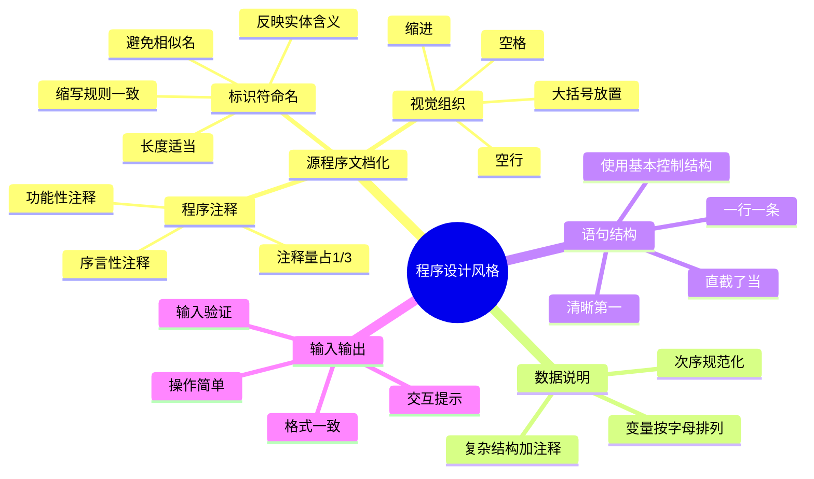

# 第12章-12.2-程序设计风格

## 基本信息
- **课程**：软件工程
- **章节**：第12章 12.2节 程序设计风格
- **日期**：2026-07-01
- **标签**：#编码风格 #源程序文档化 #数据说明 #语句结构 #输入输出

---

## 重点内容

### ⭐⭐⭐ 编码风格四要素
- **源程序文档化**：命名规则、注释、视觉组织
- **数据说明**：规范次序、有序化、注释复杂结构
- **语句结构**：每行一条、清晰第一、直截了当
- **输入和输出**：输入验证、格式方便、错误提示

### ⭐⭐ 核心原则
- **清晰第一，效率第二** —— 不要为追求效率而丧失清晰性
- **读程序的时间比写程序的时间多** —— 可读性是编码的首要目标

---

## 详细笔记

### 一、程序设计风格概述

在软件生存期中，编写程序的人与参与测试和维护的人都要阅读程序。20世纪70年代初，人们提出在编写程序时应使程序具有良好的风格，力图从编码原则的角度提高程序的可读性，改善程序质量。

程序设计风格包括4个方面：
1. 源程序文档化
2. 数据说明
3. 语句结构
4. 输入和输出

> 📚 **课本出处**：第12章 12.2节"程序设计风格"概述

---

### 二、12.2.1 源程序文档化

在源程序中包含内部文档，以帮助阅读和理解源程序。内部文档主要包括：标识符的命名、注释和程序的视觉组织。

> 📚 **课本出处**：第12章 12.2.1节"源程序文档化"

#### 1. 标识符的命名

标识符用于标识程序中的模块、变量、常量、子程序、函数等元素的名字。

命名规则：

| 序号 | 规则 | 说明 |
|:----:|:-----|:-----|
| 1 | 名字应反映所代表的实体 | 具有一定的实际意义 |
| 2 | 名字不是越长越好 | 太长增加打字量，易出错，修改困难 |
| 3 | 可使用缩写，但规则要一致 | 每个缩写名字要加注释 |
| 4 | 不用关键字作标识符 | 避免语法冲突 |
| 5 | 同一个名字不要有多个含义 | 避免混淆 |
| 6 | 不用相似的名字 | 如cm、cn、cmn、cnn、cmm容易混淆 |
| 7 | 避免使用易混淆的字符 | 如0和O、1和I或l、2和z |

> ⚠️ **常见误区**：名字不是越长越好。例如 `counter_of_total_items_in_the_list` 不如 `listItemCount` 好。

#### 2. 程序的注释

注释行的数量约占整个源程序的 **1/3**，甚至更多。注释分为两类：

| 注释类型 | 位置 | 描述内容 |
|:--------:|:-----|:---------|
| 序言性注释 | 每个程序模块开头 | 模块功能、接口、重要局部变量、开发历史 |
| 功能性注释 | 嵌在源程序体内 | 描述程序段的功能 |

**序言性注释的内容**：
- 模块的功能
- 模块的接口（调用格式、参数解释、调用的其他子模块名）
- 重要的局部变量（用途、约束和限制条件）
- 开发历史（设计者、评审者、评审日期、修改日期及修改描述）

**功能性注释的注意事项**：
- 注释要正确，错误的注释比没有注释更坏
- 为程序段作注释，而不是为每一个语句作注释
- 用缩进和空行使程序与注释容易区分
- 注释应提供从程序本身难以得到的信息，而不是语句的重复

> ⚠️ **常见误区**：不要写"重复代码本身含义"的注释。例如 `i = i + 1 // i加1` 这样的注释毫无意义。好的注释应该解释"为什么这样做"，而不是"做了什么"。

#### 3. 视觉组织

通过空格、空行和缩进帮助人们从视觉上看清程序结构。

常用技巧：

| 技巧 | 说明 |
|:----:|:-----|
| 缩进 | 清晰观察嵌套层次，容易发现"遗漏end"等错误 |
| 空行 | 自然的程序段之间用空行隔开 |
| 空格 | 使语句成分清晰 |
| 括号 | 突出运算优先级，避免运算错误 |
| 大括号放置 | K&R方法：左括号行尾，右括号行首 |

函数定义时应把左右括号都放在行首：
```c
int F(int x)
{
    ...
}
```

> 💡 **理解技巧**：视觉组织就像文章的段落排版——好的排版让人一眼看出结构，好的代码格式让人一眼看出逻辑层次。

---

### 三、12.2.2 数据说明

为了使数据说明更易于理解和维护：

> 📚 **课本出处**：第12章 12.2.2节"数据说明"

#### 1. 数据说明次序规范化

使数据属性容易查找，有利于测试、排错和维护。使说明的先后次序固定，例如可按**常量、变量、数组、文件**次序进行数据说明。

#### 2. 说明语句中变量安排有序化

多个变量名在一个说明语句中说明时，按**字母顺序**排列，便于查找。

#### 3. 使用注释说明复杂的数据结构

设计了复杂的数据结构时，使用注释来说明数据结构的固有特点。用户自定义的数据类型应在注释中做必要的补充说明。

> 💡 **理解技巧**：数据说明的规范就像图书馆的分类——按固定规则摆放，找书时一目了然。

---

### 四、12.2.3 语句结构

编码阶段的主要任务是书写程序语句。首先要保证程序正确，然后才要求提高运行速度。**清晰第一，效率第二**。

> 📚 **课本出处**：第12章 12.2.3节"语句结构"

#### 1. 一行内只写一条语句

适当添加空格，使程序逻辑和功能明确。虽然许多语言允许一行写多个语句，但不可取。

#### 2. 首先考虑清晰性

不要刻意追求技巧性。

**反面示例**（不推荐的交换两数写法）：
```c
a[i] = a[i] + a[t];
a[t] = a[i] - a[t];
a[i] = a[i] - a[t];
```
这段代码虽然节省了一个工作单元，但不易看懂。

**正面示例**（推荐写法）：
```c
work = a[t];
a[t] = a[i];
a[i] = work;
```
使用临时变量，一目了然。

#### 3. 直截了当说明程序员的用意

**反面示例**（巧妙但不易理解的单位矩阵生成）：
```c
for(i = 1; i <= n; i++)
    for(j = 1; j <= n; j++)
        v[i][j] = (i/j) * (j/i);
```
利用整数除法的特性：`i!=j` 时 `(i/j)*(j/i)=0`，`i==j` 时为1。

**正面示例**（直接表达意图）：
```c
for(i = 1; i <= n; i++)
    for(j = 1; j <= n; j++)
        if(i == j)
            v[i][j] = 1.0;
        else
            v[i][j] = 0.0;
```

> 📌 **考试重点**：效率的提高主要应通过选择高效的算法来实现，而不是通过在编码中使用技巧性写法。

#### 4. 其他常用规则

- 让编译程序做简单的优化
- 尽可能使用库函数
- 避免不必要的转移
- 尽量只采用3种基本控制结构（顺序、if-then-else选择、do-until/do-while循环）

---

### 五、12.2.4 输入和输出

输入和输出信息与用户的使用直接相关，系统能否被用户接受有时就取决于输入输出的风格。

> 📚 **课本出处**：第12章 12.2.4节"输入和输出"

输入输出设计原则：

| 原则 | 说明 |
|:----:|:-----|
| 输入验证 | 对所有输入数据进行检验，识别错误输入，保证有效性 |
| 组合检查 | 检查输入项的各种重要组合的合理性 |
| 操作简单 | 输入步骤和操作尽可能简单，保持简单格式 |
| 自由格式 | 输入数据时允许使用自由格式 |
| 默认值 | 应允许默认值 |
| 结束标志 | 输入一批数据时用结束标志，不指定数据数目 |
| 交互提示 | 交互式输入时使用提示符，指明选择项和取值范围 |
| 格式一致 | 输入输出格式与输入输出语句保持一致 |
| 输出注解 | 给所有输出加注解，设计良好的输出报表格式 |

输入输出风格还受到输入输出设备、用户熟练程度以及通信环境等因素的影响。

> 💡 **理解技巧**：好的输入输出设计就像好的服务窗口——让客户（用户）操作简单、提示清楚、出错有反馈。

---

## 总结

### 编码风格对比表

| 风格要素 | 差的实践 | 好的实践 |
|:--------:|:---------|:---------|
| **命名** | 用单字母、无意义名（如a, b, x1） | 用有意义的名字（如studentCount, maxPrice） |
| **命名长度** | 超长名字（counter_of_total_items） | 适中且精炼（itemCount） |
| **命名相似性** | 用cm, cn, cmn等相似名 | 名字之间有明显区别 |
| **注释** | 不写注释或只重复代码含义 | 解释"为什么"，提供代码无法表达的信息 |
| **缩进** | 不缩进或缩进不一致 | 一致的缩进表示嵌套层次 |
| **语句密度** | 一行多条语句 | 一行一条语句 |
| **算法技巧** | 用位运算巧妙交换两数 | 用临时变量清晰交换 |
| **数据说明** | 随意顺序声明变量 | 按固定次序（常量→变量→数组→文件） |
| **输入处理** | 不验证输入 | 验证所有输入，提供默认值和结束标志 |
| **输出格式** | 输出无注解无格式 | 输出有注解、格式清晰 |

### 四大风格要素脑图



### 关键要点

1. **清晰第一，效率第二** —— 这是编码风格的核心原则
2. **读程序的时间比写程序的时间多** —— 可读性直接影响维护成本
3. **注释解释"为什么"**，而不是重复"做了什么"
4. **好的命名是自文档化**——名字本身就能说明用途
5. **效率的提高靠算法，不靠编码技巧**
6. **输入验证是防御性编程的基础**

---

## 疑问与思考

1. 好的命名规则是否因语言而异？不同编程语言（如Java vs Python）的命名惯例有什么区别？
2. 注释应该写什么？如果代码本身已经足够清晰，是否还需要注释？
3. 输入验证的原则中，"检查所有重要组合的合理性"在实际项目中如何界定"重要"？
4. "清晰第一，效率第二"的原则在嵌入式系统等资源受限环境中是否仍然适用？
5. 注释占源程序1/3的比例在现代开发中是否仍然合理？（现代IDE提供文档生成工具）

### 💡 个人理解/技巧
- **好的命名规则**：动词+名词（如`calculateTotal`、`isValid`），布尔变量用is/has/can前缀
- **注释的黄金法则**：如果读者需要查看实现才能理解注释，那注释写得好；如果读者需要查看注释才能理解实现，那代码应该改写
- **输入验证三原则**：不信任用户输入、尽早验证、给出明确错误信息
- **编码风格类比**：写代码像写文章——命名是选词，注释是段落大意，缩进是排版，输入输出是开头结尾
- **效率 vs 清晰的权衡**：先写出清晰的代码，必要时再在关键路径上优化，而不是一开始就追求技巧
- 视觉组织中的大括号放置，不同团队可能有不同约定（K&R风格 vs Allman风格），关键是**团队统一**

---

## 相关链接

### 关联章节
- [第12章 程序设计语言和编码](./第12章-程序设计语言和编码.md)
- [第12章-12.1-程序设计语言](./第12章-12.1-程序设计语言.md)
- [第11章-人机界面设计](../../第11章-人机界面设计/第11章-人机界面设计.md)

---

## 检查清单

- [x] 已掌握源程序文档化三个方面（命名/注释/视觉组织）
- [x] 已掌握命名7条规则
- [x] 已理解序言性注释和功能性注释的区别
- [x] 已掌握数据说明的3条规范
- [x] 已掌握语句结构的核心原则（清晰第一）
- [x] 已掌握输入输出的9条设计原则
- [x] 已添加课本出处标注

---

*笔记创建时间：2026-07-01*
