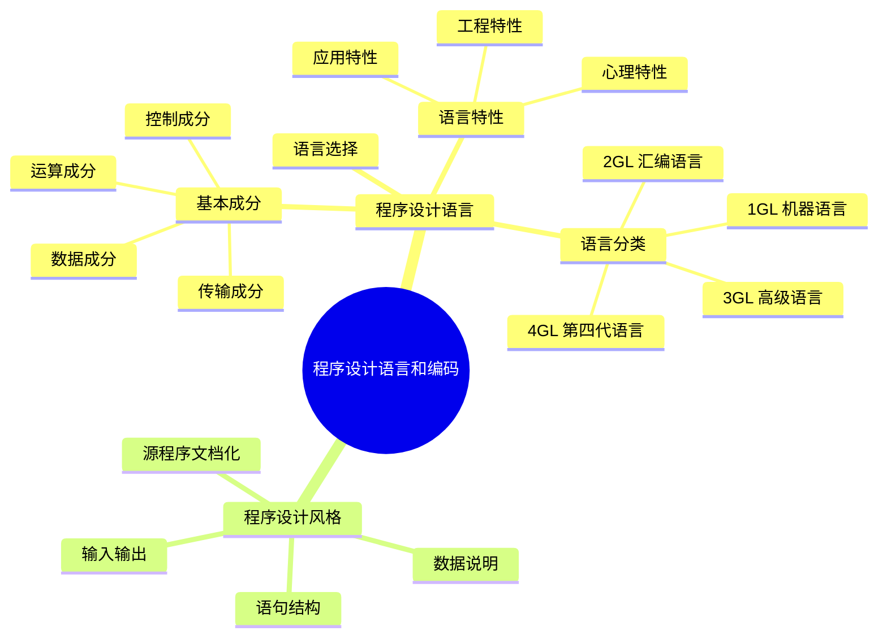

# 第12章 程序设计语言和编码

## 基本信息
- **课程**：软件工程
- **章节**：第12章 程序设计语言和编码
- **日期**：2026-07-01
- **标签**：#程序设计语言 #编码 #编程风格 #软件质量

---

## 重点内容

### ⭐⭐ 程序设计语言基本成分
- **四大成分**：数据成分、运算成分、控制成分、传输成分
- 语法（结构形式）、语义（固有含义）、语用（使用情景）三个维度

### ⭐⭐ 语言特性
- **心理特性**：一致性、二义性、紧致性、线性
- **工程特性**：设计翻译便利度、编译效率、可移植性、工具支持、可复用性、可维护性

### ⭐⭐ 语言分类（1GL-4GL）
- 第一代（机器语言）→ 第二代（汇编）→ 第三代（高级语言）→ 第四代（4GL）

### ⭐ 程序设计风格
- 源程序文档化、数据说明、语句结构、输入输出四大方面

---

## 详细笔记

### 一、本章概述

编码阶段的任务是根据详细设计说明书编写程序。程序设计语言的特性和程序设计风格会深刻地影响软件的质量和可维护性。

> 📚 **课本出处**：第12章 开篇

📌 **考试重点**：本章考查重点在于语言的基本成分、分类、语言选择因素以及编码风格的具体规范。

---

### 二、12.1 程序设计语言

程序设计语言是用于书写计算机程序的语言，是一种实现性的软件语言，包含**语法、语义、语用**三个方面。

| 维度 | 含义 | 示例 |
|:----:|:-----|:-----|
| 语法（syntax） | 程序的结构或形式，记号之间的组合规则 | `for(表达式1; 表达式2; 表达式3) 语句` |
| 语义（semantic） | 语言成分的固有含义 | for语句：赋初值→判断→执行循环体→增值→判断 |
| 语用（pragmatic） | 程序与使用情景有关的含义 | 语言是否允许递归？递归层数的上界？ |

#### 📷 图12.1 某语言数据类型

> 📚 **课本出处**：图12.1 展示了某语言的数据构造方式，分为基本类型和构造类型

#### 📷 图12.2 程序语言的控制机构

##### (a) 顺序结构

> 📚 **课本出处**：图12.2(a) 顺序结构——从第一个操作开始顺序执行到最后一个操作

##### (b) 条件选择结构

> 📚 **课本出处**：图12.2(b) 条件选择结构——先计算条件P，为真执行A，否则执行B

##### (c) 循环结构

> 📚 **课本出处**：图12.2(c) 循环结构——最基本的while型循环结构

---

### 三、12.2 程序设计风格

在软件生存期中，阅读程序的时间比写程序的时间还要多。程序设计风格包括4个方面：**源程序文档化、数据说明、语句结构、输入输出**。

> 📚 **课本出处**：第12章 12.2节"程序设计风格"

详细内容见：[第12章-12.2-程序设计风格](./第12章-12.2-程序设计风格.md)

---

## 总结

### 本章知识结构

### 关键要点

1. **程序设计语言三要素**：语法（结构形式）、语义（固有含义）、语用（使用情景）
2. **四大基本成分**：数据、运算、控制、传输，是所有程序设计语言的共性
3. **语言选择首要标准**：项目所属的应用领域
4. **编码风格核心原则**：清晰第一，效率第二；读程序的时间比写程序的时间多
5. **优先选择高级语言**，仅在性能/资源有极端要求时使用低级语言

---

## 疑问与思考

1. 语用（pragmatic）在实际编程中如何体现？不同语言的语用差异具体表现在哪些方面？
2. 第四代语言（4GL）至今没有统一标准，这对其发展和应用有什么影响？
3. 在面向对象语言中，控制成分与面向过程语言有什么本质区别？

### 💡 个人理解/技巧
- 语法、语义、语用可以类比：语法是"语法规则"，语义是"句子意思"，语用是"在什么场合说"
- 语言分类的记忆口诀：**一机二汇三高级，四代非过程自然语**
- 选择语言时，**领域优先，人员次之，工具再后**——这是实际项目中的优先级

---

## 相关链接

### 本节相关图片
- [图12.1 某语言数据类型](../../../images/a62d5ea19062313aff90e3650770dbe9872913943473ba164ec08e0278efe16a.jpg)
- [图12.2a 顺序结构](../../../images/39eee90b8b452f8ed4ce3575df5f80749ada3a2be6e5c98eab849b13c43ab091.jpg)
- [图12.2b 条件选择结构](../../../images/46916367573c3235c67722e3ff7fa864e4c87587c144ba8643ea9a4ec59e9275.jpg)
- [图12.2c 循环结构](../../../images/bef03077993c87da87c6fe82138a3362a6e78e33820267741e898fc52b08f315.jpg)

### 关联章节
- [第12章-12.1-程序设计语言](./第12章-12.1-程序设计语言.md)
- [第12章-12.2-程序设计风格](./第12章-12.2-程序设计风格.md)
- [第4章-设计工程](../第4章-设计工程/第4章-设计工程.md)
- [第11章-人机界面设计](../第11章-人机界面设计/第11章-人机界面设计.md)

---

## 检查清单

- [x] 已掌握程序设计语言的基本成分（数据/运算/控制/传输）
- [x] 已理解语法、语义、语用三要素
- [x] 已掌握语言的心理特性、工程特性和应用特性
- [x] 已了解语言分类（1GL-4GL）
- [x] 已理解语言选择的考虑因素
- [x] 已插入课本原图（图12.1、图12.2）
- [x] 已添加课本出处标注

---

*笔记创建时间：2026-07-01*
