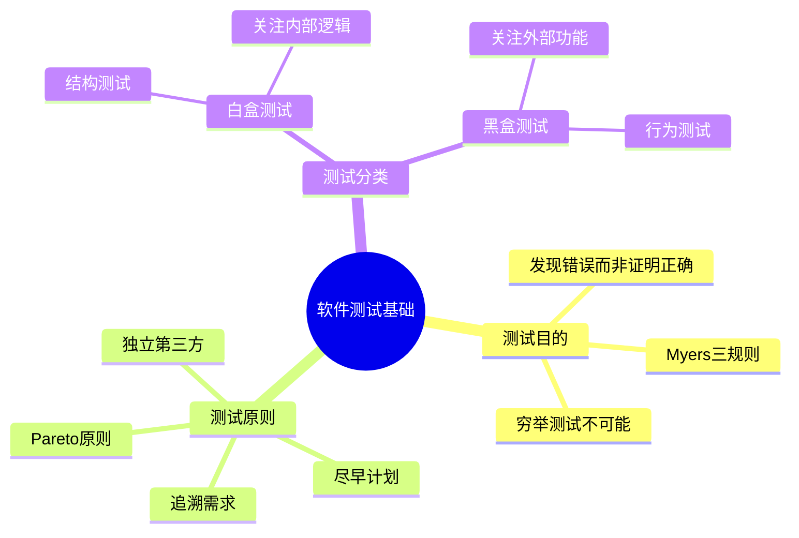

# 13.1 软件测试基础

## 基本信息
- **课程**：软件工程（第3版）
- **章节**：13.1 软件测试基础
- **日期**：2026-05-11
- **标签**：#软件测试 #测试目的 #测试原则

---

## 本节概述

软件测试是软件开发过程中发现错误和缺陷的主要手段。测试工作量约占软件开发总工作量的40%以上，对于关系到生命安全的软件（如飞行控制软件、核反应堆软件等），测试工作量可能相当于其他开发阶段工作量总和的3~5倍。

---

## 13.1.1 软件测试的目的

### ❌ 常见错误观点

| 错误观点 | 正确理解 |
|---------|---------|
| "软件测试是为了证明程序是正确的" | 测试不能证明程序无错，只能发现错误 |
| "程序测试是证明程序正确地执行了预期的功能" | 程序不应完成它不该做的事 |

### 📌 为什么无法穷举测试？

对于一个输入3个16位字长整型数据的程序：
- 输入数据组合：$2^{48} \approx 3 \times 10^{14}$ 种
- 测试一组数据需1ms
- 即使365天×24小时不停测试，需要约**1万年**

### ✅ Glen Myers的测试规则

> 💡 **核心思想**：测试是为了发现错误，而不是证明正确

1. **测试是一个为了发现错误而执行程序的过程**
2. **一个好的测试用例**是指很可能找到迄今为止尚未发现的错误的测试用例
3. **一个成功的测试**是指揭示了迄今为止尚未发现的错误的测试

### ⭐ 软件测试的真正目的

- 发现软件中的**错误和缺陷**
- 加以**纠正**
- 用尽可能**少**的测试用例，发现尽可能**多**的软件错误

---

## 13.1.2 软件测试的基本原则

### Davis提出的基本原则

| 原则 | 说明 |
|------|------|
| **追溯客户需求** | 最严重的错误是程序无法满足需求的错误 |
| **尽早测试计划** | 测试计划可在需求模型完成时就开始 |
| **Pareto原则** | 80%的错误可能来自于20%的程序代码 |
| **从小到大** | 先测单个模块，再测集成模块，最后测整个系统 |
| **穷举测试不可能** | 需要设计高效测试用例 |
| **独立第三方测试** | 由开发者之外的测试人员测试更有效 |

### 其他重要原则

- ✅ **合理与不合理输入**：测试用例应包括合理的输入条件和不合理的输入条件
- ✅ **严格执行计划**：排除测试的随意性
- ✅ **全面检查结果**：对每一个测试结果做全面检查
- ✅ **妥善保存资料**：测试计划、测试用例、出错统计和最终分析报告
- ✅ **检查不该做的事**：检查程序是否做了不该做的事
- ✅ **不要预设无错**：在规划测试时不要设想程序中不会查出错误

---

## 13.1.3 白盒测试和黑盒测试

### 测试用例设计的关键

- 设计**最有可能发现软件错误**的测试用例
- 尽量**避免测试用例冗余**
- 用尽可能**少**的测试用例发现尽可能多的错误

### 对比表

| 特性 | 白盒测试 | 黑盒测试 |
|------|---------|---------|
| **别称** | 结构测试 | 行为测试 |
| **视角** | 透明盒子 | 黑盒子 |
| **依据** | 程序内部逻辑结构 | 程序需求规格说明书 |
| **关注点** | 内部逻辑路径 | 外部功能表现 |

### 白盒测试详解

**定义**：把测试对象看作一个**透明的盒子**，测试人员根据程序内部的逻辑结构及有关信息设计测试用例。

**测试内容**：
- ✅ 程序模块中的所有**独立路径**至少执行一次
- ✅ 对所有**逻辑判定**的取值（"真"与"假"）都至少测试一次
- ✅ 在**上下边界**及可操作范围内运行所有循环
- ✅ 测试**内部数据结构**的有效性

### 黑盒测试详解

**定义**：把测试对象看作一个**黑盒子**，测试人员完全不考虑程序内部的逻辑结构，只依据程序的需求规格说明书检查程序功能。

**试图发现的错误类型**：
- ❌ 不正确或遗漏的功能
- ❌ 接口错误（参数个数、类型等）
- ❌ 数据结构错误或外部信息访问错误
- ❌ 性能错误
- ❌ 初始化和终止错误

---

## 本节小结

### 重点记忆

1. **测试目的**：发现错误，而非证明正确
2. **Pareto原则**：80%错误来自20%代码
3. **白盒测试**：看内部逻辑（透明盒子）
4. **黑盒测试**：看外部功能（黑盒子）

---

## 相关链接

- [返回第13章主笔记](第13章-软件测试.md)
- [下一节：13.2 白盒测试](第13章-13.2-白盒测试.md)

---

## 课本出处

> 📚 **出处**：第13章 13.1节"软件测试基础"
