# 13.2 白盒测试

## 基本信息
- **课程**：软件工程（第3版）
- **章节**：13.2 白盒测试
- **日期**：2026-05-11
- **标签**：#白盒测试 #逻辑覆盖 #基本路径测试 #循环测试
- **重要性**：⭐⭐⭐ 核心重点

---

## 本节概述

白盒测试又称结构测试，把测试对象看作一个透明的盒子，测试人员根据程序内部的逻辑结构及有关信息设计测试用例，检查程序中所有逻辑路径是否都按预定的要求正确地工作。

---

## 13.2.1 逻辑覆盖测试

### 核心概念

逻辑覆盖测试考察使用测试数据运行被测程序时对程序逻辑的覆盖程度。主要的覆盖标准有6种：

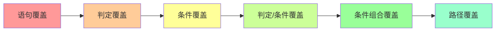

### 例题程序分析

**例13.1程序**：
```pascal
procedure example(y, z: real; var x: real);
begin
  if (y > 1) and (z = 0) then x := x / y;
  if (y = 2) or (x > 1) then x := x + 1;
end;
```

#### 📷 图13.1 例13.1程序流程图

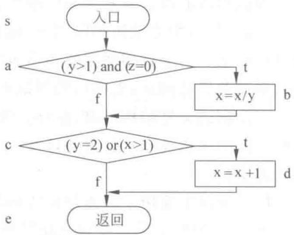

> 📚 **课本出处**：图13.1 展示了例13.1程序的控制流程，包含两个判定a和c，以及4条可执行路径

**程序分析**：
- **判定a**：$(y > 1)$ and $(z = 0)$
- **判定c**：$(y = 2)$ or $(x > 1)$
- **4条可执行路径**：
  - 路径1（sabcde）：a为真，c为真
  - 路径2（sace）：a为假，c为假
  - 路径3（sacde）：a为假，c为真
  - 路径4（sabce）：a为真，c为假

---

### 1. 语句覆盖 ⭐

**定义**：选择足够的测试用例，使得被测程序的**每个可执行语句**都至少执行一次。

**特点**：
- 最弱的覆盖标准
- 只需执行路径sabcde即可覆盖所有语句

**测试用例**：

| 测试数据 | 预期结果 | 执行路径 |
|---------|---------|---------|
| x=4, y=2, z=0 | x=3 | sabcde |

---

### 2. 判定覆盖（分支覆盖）⭐⭐

**定义**：使得每个判定的**所有可能结果**都至少出现一次（每个分支至少经过一次）。

**特点**：
- 满足判定覆盖一定满足语句覆盖
- 至少需2个测试用例

**测试用例**：

| 测试数据 | 预期结果 | 执行路径 | 判定a | 判定c |
|---------|---------|---------|-------|-------|
| x=1, y=2, z=1 | x=2 | sacde | 假 | 真 |
| x=3, y=3, z=0 | x=1 | sabce | 真 | 假 |

---

### 3. 条件覆盖 ⭐⭐

**定义**：使得每个判定中的**每个条件的所有可能结果**都至少出现一次。

**判定a的条件**：$y > 1$、$y \leqslant 1$、$z = 0$、$z \neq 0$

**判定c的条件**：$y = 2$、$y \neq 2$、$x > 1$（或$x > y$）、$x \leqslant 1$（或$x \leqslant y$）

**测试用例**：

| 测试数据 | 预期结果 | 执行路径 | 覆盖的条件 |
|---------|---------|---------|-----------|
| x=1, y=2, z=0 | x=1.5 | sabcde | y>1, z=0, y=2, x≤y |
| x=2, y=1, z=1 | x=3 | sacde | y≤1, z≠0, y≠2, x>1 |

⚠️ **注意**：条件覆盖不一定满足判定覆盖！

---

### 4. 判定/条件覆盖 ⭐⭐⭐

**定义**：同时满足**判定覆盖**和**条件覆盖**的标准。

**特点**：
- 满足判定/条件覆盖一定满足判定覆盖、条件覆盖、语句覆盖
- 测试用例个数 ≥ max(判定覆盖用例数, 条件覆盖用例数)

**测试用例**：

| 测试数据 | 预期结果 | 执行路径 | 判定a | 判定c | 覆盖的条件 |
|---------|---------|---------|-------|-------|-----------|
| x=4, y=2, z=0 | x=3 | sabcde | 真 | 真 | y>1, z=0, y=2, x>y |
| x=1, y=1, z=1 | x=1 | sace | 假 | 假 | y≤1, z≠0, y≠2, x≤1 |

---

### 5. 条件组合覆盖 ⭐⭐⭐

**定义**：使得每个判定中的**条件结果的所有可能组合**都至少出现一次。

**判定a的条件组合**（4种）：
1. $y > 1$，$z = 0$
2. $y > 1$，$z \neq 0$
3. $y \leqslant 1$，$z = 0$
4. $y \leqslant 1$，$z \neq 0$

**判定c的条件组合**（4种）：
5. $y = 2$，$x > 1$（或$x > y$）
6. $y = 2$，$x \leqslant 1$（或$x \leqslant y$）
7. $y \neq 2$，$x > 1$（或$x > y$）
8. $y \neq 2$，$x \leqslant 1$（或$x \leqslant y$）

**测试用例**：

| 测试数据 | 预期结果 | 执行路径 | 判定a | 判定c | 覆盖的条件组合 |
|---------|---------|---------|-------|-------|---------------|
| x=4, y=2, z=0 | x=3 | sabcde | 真 | 真 | ①⑤ |
| x=1, y=2, z=1 | x=2 | sacde | 假 | 真 | ②⑥ |
| x=2, y=1, z=0 | x=3 | sacde | 假 | 真 | ③⑦ |
| x=1, y=1, z=1 | x=1 | sace | 假 | 假 | ④⑧ |

⚠️ **注意**：条件组合覆盖仍不能保证覆盖所有路径！（本例中未经过sabce路径）

---

### 6. 路径覆盖 ⭐⭐⭐

**定义**：使得程序的**每条可能执行到的路径**都至少经过一次。

**测试用例**：

| 测试数据 | 预期结果 | 执行路径 | 判定a | 判定c |
|---------|---------|---------|-------|-------|
| x=4, y=2, z=0 | x=3 | sabcde | 真 | 真 |
| x=3, y=3, z=0 | x=1 | sabce | 真 | 假 |
| x=2, y=1, z=0 | x=3 | sacde | 假 | 真 |
| x=1, y=1, z=1 | x=1 | sace | 假 | 假 |

⚠️ **注意**：路径覆盖未必能覆盖判定中条件结果的各种可能情况！

---

### 6种覆盖标准对比

| 覆盖标准 | 强度 | 特点 |
|---------|------|------|
| 语句覆盖 | ⭐ | 最弱，只需覆盖所有语句 |
| 判定覆盖 | ⭐⭐ | 覆盖每个判定的真假分支 |
| 条件覆盖 | ⭐⭐ | 覆盖每个条件的真假值 |
| 判定/条件覆盖 | ⭐⭐⭐ | 同时满足判定和条件覆盖 |
| 条件组合覆盖 | ⭐⭐⭐⭐ | 覆盖条件的所有组合 |
| 路径覆盖 | ⭐⭐⭐⭐⭐ | 覆盖所有执行路径 |

---

## 13.2.2 逻辑表达式错误敏感的测试

### BRO测试技术

**全称**：Branch and Relational Operator（分支与关系运算符）

**适用条件**：
- 条件中的每个逻辑变量和关系运算符至多出现一次
- 无公共变量

**核心思想**：选择对发现逻辑表达式错误比较敏感的组合条件进行测试。

### 约束集合

| 逻辑表达式 | 敏感约束集合 |
|-----------|-------------|
| $B_1$ and $B_2$ | {(t,t), (f,t), (t,f)} |
| $B_1$ or $B_2$ | {(f,t), (t,f), (f,f)} |
| $B_1$ and $(E_3 = E_4)$ | {(t,=), (f,=), (t,<), (t,>)} |
| $(E_1 > E_2)$ and $(E_3 = E_4)$ | {(>,=), (=,=), (<,=), (>,<), (>,>)} |

---

## 13.2.3 基本路径测试 ⭐⭐⭐

### 核心思想

将测试的程序路径数压缩到一定范围内，通过计算流图的**区域数**确定**独立路径**集合。

### 步骤


### 流图（Flow Graph）

**定义**：由**结点**（圆）和**边**（箭头）组成的图。

**映射规则**：
- 连续的处理框序列 → 一个结点
- 判定框 → 一个结点
- 箭头 → 一条边
- 多个箭头的交汇点 → 空结点

⚠️ **注意**：判定中不能包含复合条件，如有需先转换成简单条件。

#### 📷 图13.3 复合条件的流图

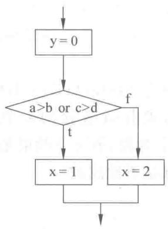

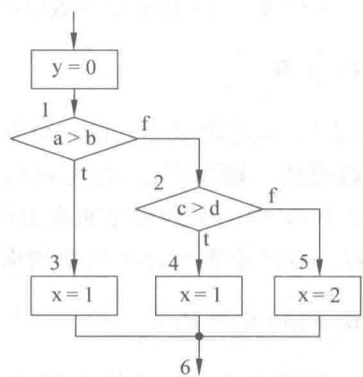

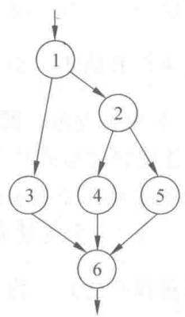

> 📚 **课本出处**：图13.3 展示了含复合条件的设计图如何转换成等价的简单条件设计图和对应的流图

**区域数计算**：
- 流图中由结点和边组成的闭合部分称为一个**区域**
- 图的外部部分也作为一个区域
- 图13.3(c)的区域数为**3**

### 独立路径

**定义**：程序中至少引进一个新的处理语句序列或一个新条件的任一路径。

**特点**：
- 独立路径至少包含一条在定义该路径之前未曾用到过的边
- **独立路径数 = 流图的区域数**

### 例13.3 基本路径测试实例

**程序功能**：最多输入N个值（以-999为输入结束标志），计算位于给定范围内的有效值的平均值。

#### 📷 图13.5 例13.3流图

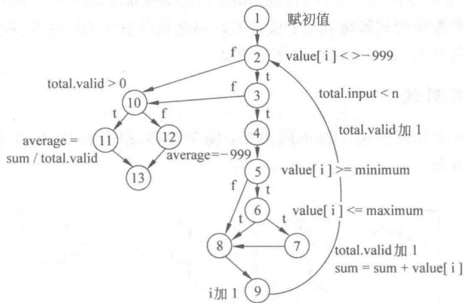

> 📚 **课本出处**：图13.5 展示了例13.3程序的控制流图，区域数为6

**PDL伪代码描述**（对应课本图13.4）：
```
PROCEDURE average;
INTERFACE RETURNS average, total.input, total.valid;
INTERFACE ACCEPTS n, value, minimum, maximum;
TYPE value[1, n] IS SCALAR ARRAY;
TYPE average, total.input, total.valid, minimum, maximum, sum IS SCALAR;
TYPE n, i IS INTEGER;

i = 1;
total.input = total.valid = 0;
sum = 0;

DO WHILE value[i] <= -999 and total.input < n
    increment total.input by 1;
    IF value[i] >= minimum AND value[i] <= maximum THEN
        increment total.valid by 1;
        sum = sum + value[i];
    END IF
    increment i;
END DO

IF total.valid > 0 THEN
    average = sum / total.valid;
ELSE
    average = -999;
END IF
END average
```

**6条独立路径**：
1. 路径1：1—2—10—11—13
2. 路径2：1—2—10—12—13
3. 路径3：1-2-3-10-11-13
4. 路径4：1-2-3-4-5-8-9-2-10-12-13
5. 路径5：1-2-3-4-5-6-8-9-2-10-12-13
6. 路径6：1-2-3-4-5-6-7-8-9-2-10-11-13

**测试用例**（假设n=5, minimum=0, maximum=100）：

| 覆盖路径 | 测试数据 | 预期结果 |
|---------|---------|---------|
| 路径1 | value=[90,-999,0,0,0] | average=90, total.input=1, total.valid=1 |
| 路径2 | value=[-999,0,0,0,0] | average=-999, total.input=0, total.valid=0 |
| 路径3 | value=[-1,90,70,-1,80] | average=80, total.input=5, total.valid=3 |
| 路径4 | value=[-1,-2,-3,-4,-999] | average=-999, total.input=4, total.valid=0 |
| 路径5 | value=[120,110,101,-999,0] | average=-999, total.input=3, total.valid=0 |
| 路径6 | value=[95,90,70,65,-999] | average=80, total.input=4, total.valid=4 |

---

## 13.2.4 数据流测试

### 核心概念

根据程序中变量的**定义**（赋值）和**引用**位置来设计测试用例。

### 定义

- **DEF(s)**：语句s中定义的变量集合
- **USE(s)**：语句s中引用的变量集合
- **DU链**[x,s,s']：变量x在s处定义，在s'处引用，且s到s'的路径上无其他定义

### 测试策略

设计测试用例使得**每个DU链至少被覆盖一次**。

---

## 13.2.5 循环测试

### 循环的4种类型

#### 📷 图13.6 循环的类别

**(a) 简单循环**

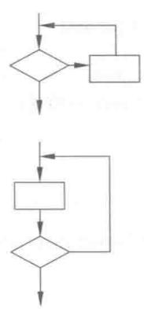

**(b) 嵌套循环**

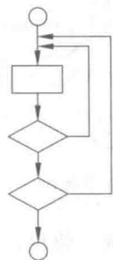

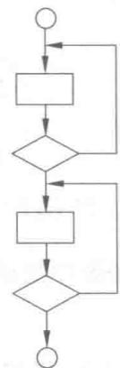

**(c) 串接循环**

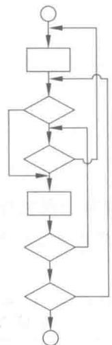

> 📚 **课本出处**：图13.6 展示了4种类型的循环：(a)简单循环 (b)嵌套循环 (c)串接循环 (d)非结构循环

⚠️ **注**：课本中(d)非结构循环的图片未在资源中找到

### 1. 简单循环

**测试用例设计规则**：
- 零次循环：从循环入口到出口
- 1次循环：检查循环初始值
- 2次循环：检查多次循环
- m次循环：检查多次循环
- 最大次数循环
- 比最大次数多一次的循环
- 比最大次数少一次的循环

### 2. 嵌套循环

**测试规则**：
1. 测试最内层循环：外层循环变量置为最小值，最内层按简单循环测试
2. 由里向外测试上一层循环：外层取最小值，内层取"典型"值
3. 重复直到所有层循环测试完毕
4. 对全部各层循环同时取最小或最大循环次数

### 3. 串接循环

- **互相独立**：分别用简单循环方法测试
- **不独立**（第一个循环变量用作第二个循环初值）：使用测试嵌套循环的方法

### 4. 非结构循环

**处理方法**：先将其**结构化**，然后再测试。

---

## 本节小结

### 白盒测试方法总结

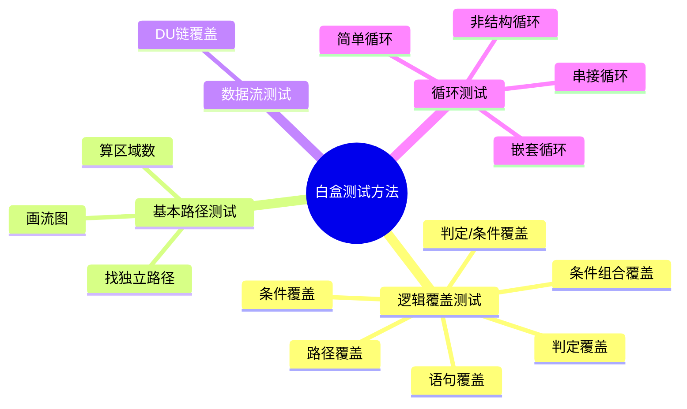

### 重点记忆

1. **6种逻辑覆盖标准**（由弱到强）：语句 → 判定 → 条件 → 判定/条件 → 条件组合 → 路径
2. **基本路径测试**：独立路径数 = 流图区域数
3. **循环测试**：重点关注边界值（0次、1次、2次、最大次数、最大±1）

---

## 相关链接

- [返回第13章主笔记](第13章-软件测试.md)
- [上一节：13.1 软件测试基础](第13章-13.1-软件测试基础.md)
- [下一节：13.3 黑盒测试](第13章-13.3-黑盒测试.md)

---

## 课本出处

> 📚 **出处**：第13章 13.2节"白盒测试"
