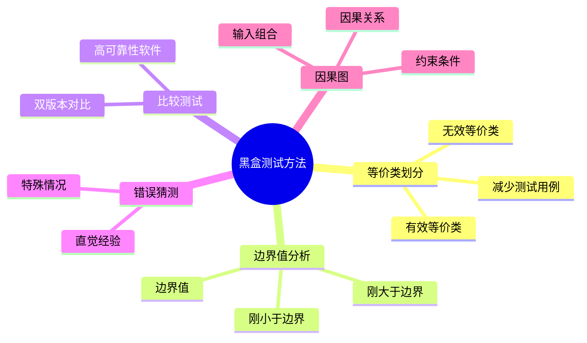

# 13.3 黑盒测试

## 基本信息
- **课程**：软件工程（第3版）
- **章节**：13.3 黑盒测试
- **日期**：2026-05-11
- **标签**：#黑盒测试 #等价类划分 #边界值分析 #因果图
- **重要性**：⭐⭐⭐ 核心重点

---

## 本节概述

黑盒测试是依据软件的需求规约，检查程序的功能是否符合需求规约的要求。测试人员完全不考虑程序内部的逻辑结构，只关注程序的输入和输出。

---

## 13.3.1 等价类划分 ⭐⭐⭐

### 核心思想

由于无法穷举所有可能的输入数据，只能选取少量有**代表性**的输入数据，来揭露尽可能多的软件错误。

### 等价类定义

**等价类**：输入域的某个子集，该子集中的每个输入数据对揭露软件中的错误都是**等效**的。

**特点**：
- 测试等价类的某个代表值就等价于对这一类其他值的测试
- 如果代表值能检测出错误，该类其他值也能检测出同样的错误
- 如果代表值不能检测出错误，该类其他值也不能检测出错误

### 等价类分类

| 类型 | 定义 | 用途 |
|------|------|------|
| **有效等价类** | 符合规格说明要求的合理的输入数据集合 | 检验程序是否实现了规格说明中规定的功能 |
| **无效等价类** | 不符合规格说明要求的不合理或非法的输入数据集合 | 检验程序是否做了不符合规格说明的事 |

### 确定等价类的规则

| 输入条件 | 有效等价类 | 无效等价类 |
|---------|-----------|-----------|
| **取值范围**（如0~100） | 1个：范围内（0≤成绩≤100） | 2个：小于最小值（<0）、大于最大值（>100） |
| **值的个数**（如输入3个数） | 1个：等于规定个数（=3） | 2个：少于规定个数（<3）、多于规定个数（>3） |
| **离散值集合**（如A,B,C,D,F） | 每个允许值1个（=A,=B,=C,=D,=F） | 1个：任意不允许值（≠A,B,C,D,F） |
| **必须遵循的规则** | 1个：符合规则 | 若干个：从不同角度违反规则 |
| **整型数据** | 3个：正整数、零、负整数 | 1个：非整数 |
| **表格处理** | 1个：表中有一项或多项数据 | 1个：空表 |

### 设计测试用例的步骤

**规则**：
1. 设计一个新的测试用例，使其尽可能多地覆盖尚未被覆盖的**有效等价类**
2. 为**每个无效等价类**设计一个新的测试用例（每个无效等价类单独测试）

### 例13.4 标识符测试

**规格说明**：
- 标识符由字母开头，后跟字母或数字的任意组合
- 标识符的字符数为1~8个
- 标识符必须先说明后使用
- 一个说明语句中至少有一个标识符
- 保留字不能用作变量标识符

**等价类表**：

| 输入条件 | 有效等价类 | 无效等价类 |
|---------|-----------|-----------|
| 第一个字符 | 字母(1) | 数字(2)、非字母数字的字符(3) |
| 后跟的字符 | 字母(4)、数字(5) | 非字母数字的字符(6)、保留字(7) |
| 字符数 | 1~8个(8) | 0个(9)、>8个(10) |
| 标识符的使用 | 先说明后使用(11) | 未说明已使用(12) |
| 标识符个数 | ≥1个(13) | 0个(14) |

**测试用例**：

| 输入数据 | 预期结果 | 覆盖的等价类 |
|---------|---------|-------------|
| VAR P3t2: REAL; BEGIN P3t2 := 3.1; ... END; | 正确标识符 | (1), (4), (5), (8), (11), (13) |
| VAR 3P: REAL; | 报错：不正确标识符 | (2) |
| VAR !X: REAL; | 报错：不正确标识符 | (3) |
| VAR T#: CHAR; | 报错：不正确标识符 | (6) |
| VAR GOTO: INTEGER; | 报错：保留字作标识符 | (7) |
| VAR X,: REAL; | 报错：标识符长度为0 | (9) |
| VAR T12345678: REAL; | 报错：标识符字符超长 | (10) |
| VAR PAR: REAL; BEGIN ... PAP := 3.14 ... END; | 报错：未说明已使用 | (12) |
| VAR : REAL; | 报错：标识符个数为0 | (14) |

---

## 13.3.2 边界值分析 ⭐⭐⭐

### 核心思想

大量的测试实践表明，程序在处理输入或输出范围的**边界情况**时出错的概率比较大。

> 💡 **常见错误**：将 $E1 > E2$ 写成 $E1 \geqslant E2$，或将 $E1 \geqslant E2$ 写成 $E1 > E2$

### 边界值选择规则

**边界附近的数据**：
- 正好等于边界的值
- 刚刚大于边界的值
- 刚刚小于边界的值

### 具体规则

| 规则 | 说明 | 示例 |
|------|------|------|
| **规则1** | 输入条件规定取值范围，选择边界值和刚刚超出边界的值 | 成绩0~100，取0、100、-1、101 |
| **规则2** | 输入条件规定值的个数，选择最大、最小、比最大多1、比最小少1 | 参赛项目1~3项，取1、3、0、4 |
| **规则3** | 对每个输出条件使用规则1 | 输出金额0~9999，选择使输出为0、9999、-1、10000的输入 |
| **规则4** | 对每个输出条件使用规则2 | 输出发票1~5行，选择使输出为1、5、0、6行的输入 |
| **规则5** | 输入或输出是有序集合，关注第一个和最后一个元素 | 顺序文件、表格 |
| **规则6** | 内部数据结构有预定义边界，选择达到边界和刚好超出边界的值 | 数组下界10、上界20，取10、20、9、21 |
| **规则7** | 发挥智慧，找出其他可能的边界条件 | - |

---

## 13.3.3 比较测试

### 适用场景

对可靠性要求很高的软件系统，如：
- 航空航天控制软件
- 核电厂控制软件

### 方法

1. 由**两支软件开发队伍**，根据相同的**需求规格说明**分别开发**两个软件版本**
2. 用**相同的测试用例**对两个版本分别进行测试
3. **比较两个版本的测试结果**
   - 结果相同 → 认为两个版本都正确
   - 结果不同 → 分析各个版本，发现错误所在

### 局限性

- ❌ 不能保证软件没有错误（规格说明本身可能有错）
- ❌ 各版本产生相同但都不正确的结果时无法发现

---

## 13.3.4 错误猜测

### 核心思想

凭**直觉和经验**推测某些可能存在的错误，针对这些可能存在的错误设计测试用例。

### 特点

- 没有机械的执行步骤
- 主要依靠**直觉和经验**

### 示例

**排序子程序的测试考虑**：
- 输入表为空
- 输入表只有一个元素
- 输入表的所有元素都相同
- 输入表已排好序

**二分法检索子程序的测试考虑**：
- 表中只有1个元素
- 表长为 $2^n$
- 表长为 $2^n - 1$
- 表长为 $2^n + 1$

---

## 13.3.5 因果图 ⭐⭐

### 核心思想

- 考虑**输入条件的组合关系**
- 考虑**输出条件对输入条件的依赖关系**（因果关系）
- 测试用例发现错误的效率比较高

### 设计步骤

### 1. 分割功能说明书

将输入条件分成若干组，分别对每个组使用因果图，减少输入条件组合的数目。

### 2. 识别"原因"和"结果"

- **原因**：输入条件或输入条件的等价类
- **结果**：输出条件或系统变换

每个原因和结果对应因果图中的一个结点，值为1表示成立/出现，为0表示不成立/不出现。

### 3. 因果图的基本符号

#### 📷 图13.7 因果图的基本符号

> 📚 **课本出处**：图13.7 展示了因果图的4种基本符号：恒等、非、或、与

| 符号 | 含义 |
|------|------|
| **恒等** | 若a=1，则b=1；若a=0，则b=0 |
| **非** | 若a=1，则b=0；若a=0，则b=1 |
| **或** | 若a=1或b=1或c=1，则d=1；若a=b=c=0，则d=0 |
| **与** | 若a=b=c=1，则d=1；若a=0或b=0或c=0，则d=0 |

### 4. 约束条件符号

#### 📷 图13.8 因果图的约束符号

> 📚 **课本出处**：图13.8 展示了因果图的5种约束符号

| 约束 | 含义 |
|------|------|
| **互斥(E)** | a、b、c中至多只有一个为1 |
| **包含(I)** | a、b、c中至少有一个为1 |
| **唯一(O)** | a、b、c中有且仅有一个为1 |
| **要求(R)** | 若a=1，则要求b必须为1 |
| **屏蔽(M)** | 若a=1，则b必须为0 |

### 5. 判定表

列出满足约束条件的所有原因组合，写出各种原因组合下的结果。

### 6. 设计测试用例

为判定表的每一列（有意义的组合）设计一个测试用例。

### 例13.5 饮料自动售货机

**规格说明**：
- 允许投入5角或1元硬币
- 可通过"橙汁"和"啤酒"按钮选择饮料
- "零钱找完"指示灯：有零钱时暗，无零钱时亮
- 投入5角+按钮：送出相应饮料
- 投入1元+按钮：
  - 有零钱找：送出饮料+退还5角
  - 无零钱找：饮料不送出+退还1元

**原因**：
1. 售货机有零钱找
2. 投入1元硬币
3. 投入5角硬币
4. 按下"橙汁"按钮
5. 按下"啤酒"按钮

**结果**：
- 售货机"零钱找完"灯亮
- 退还1元硬币
- 退还5角硬币
- 送出"橙汁"饮料
- 送出"啤酒"饮料

#### 📷 图13.9 饮料自动售货机因果图

> 📚 **课本出处**：图13.9 展示了饮料自动售货机的因果图，包含中间结点11、12、13、14

**中间结点**：
- 结点11：投入1元硬币且按下饮料按钮
- 结点12：按下"橙汁"或"啤酒"按钮
- 结点13：应找5角硬币且售货机有零钱找
- 结点14：钱已付清

**约束条件**：
- 原因2和3不能同时发生（互斥）
- 原因4和5不能同时发生（互斥）

---

## 本节小结

### 黑盒测试方法对比

### 方法选择建议

| 场景 | 推荐方法 |
|------|---------|
| 输入条件多，需减少用例 | 等价类划分 |
| 范围输入，易在边界出错 | 边界值分析 |
| 高可靠性要求 | 比较测试 |
| 有丰富测试经验 | 错误猜测 |
| 输入条件有组合关系 | 因果图 |

### 重点记忆

1. **等价类划分**：有效等价类 + 无效等价类，每个无效等价类单独测试
2. **边界值分析**：正好等于、刚刚大于、刚刚小于边界值
3. **因果图**：考虑输入组合和因果关系，使用约束条件

---

## 相关链接

- [返回第13章主笔记](第13章-软件测试.md)
- [上一节：13.2 白盒测试](第13章-13.2-白盒测试.md)
- [下一节：13.4 测试策略](第13章-13.4-测试策略.md)

---

## 课本出处

> 📚 **出处**：第13章 13.3节"黑盒测试"
