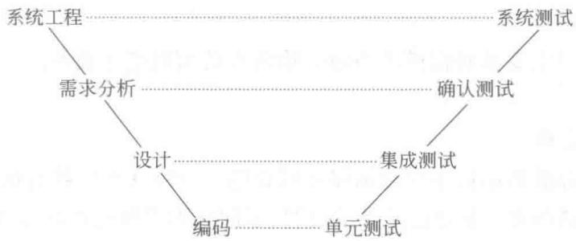
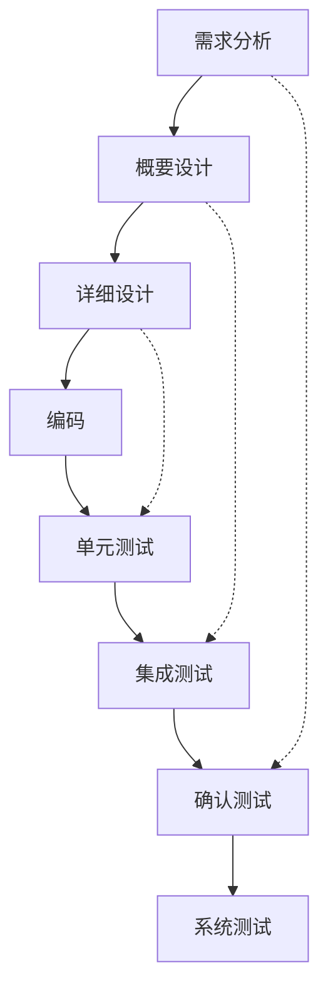
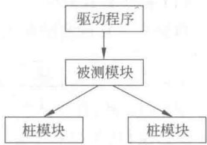
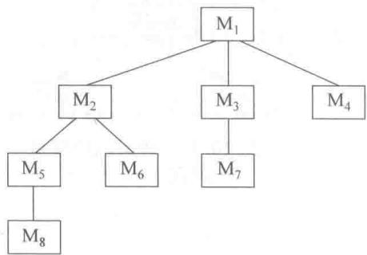
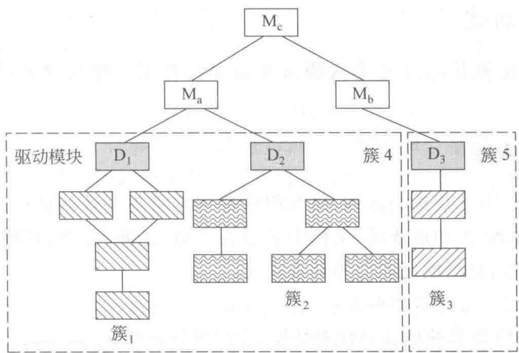
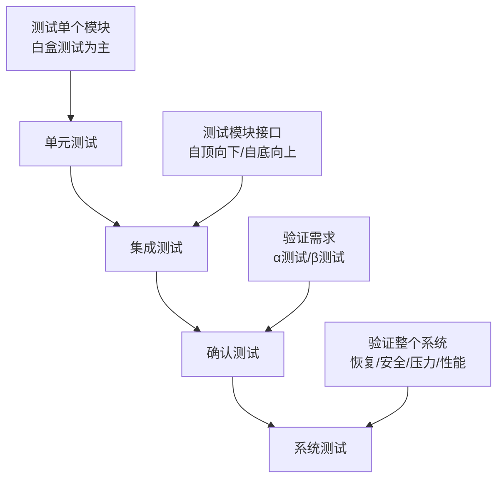

# 13.4 测试策略

## 基本信息
- **课程**：软件工程（第3版）
- **章节**：13.4 测试策略
- **日期**：2026-05-11
- **标签**：#测试策略 #V模型 #单元测试 #集成测试 #确认测试 #系统测试
- **重要性**：⭐⭐⭐ 核心重点

---

## 本节概述

软件测试策略把软件测试用例的设计方法集成到一系列经周密计划的步骤中去，从而使软件的测试得以成功地完成。

---

## 13.4.1 V模型

### V模型概述

V模型展示了软件开发各阶段与测试策略之间的对应关系。

#### 📷 图13.10 V模型

> 📚 **课本出处**：图13.10 V模型展示了软件开发各阶段与测试策略的对应关系

### 各阶段对应关系

| 开发阶段 | 测试阶段 | 测试目标 |
|---------|---------|---------|
| **需求分析** | **确认测试** | 揭露不符合需求规约的错误 |
| **概要设计** | **集成测试** | 揭露设计阶段产生的错误 |
| **详细设计** | **单元测试** | 揭露编码阶段产生的错误 |
| **编码** | **单元测试** | 测试单个模块 |

### Tom Gilb的成功测试策略

1. **量化需求**：以量化的形式确定产品需求
2. **显式陈述目标**：用可测量的术语描述测试目标
3. **了解用户**：为每一类用户建立剖面图
4. **快速循环测试**：以快速循环方式进行测试
5. **构造健壮软件**：设计成可测试自身的软件
6. **正式技术评审**：作为测试之前的过滤器
7. **评审测试策略**：评估测试策略和测试用例
8. **持续改进**：建立测试过程的持续改进方法

---

## 13.4.2 单元测试

### 定义

单元测试又称**模块测试**，着重对软件设计的最小单元——**软件构件或模块**进行测试。

### 特点

- 根据**设计描述**对重要的控制路径进行测试
- 通常采用**白盒测试**
- 多个构件或模块可以**并行**进行测试

### 单元测试的内容

| 测试内容 | 说明 |
|---------|------|
| **接口** | 确保输入输出参数信息正确（个数、次序、类型） |
| **局部数据结构** | 确保临时存储的数据维持完整性 |
| **边界条件** | 确保程序单元在极限情况下正确执行 |
| **独立路径** | 遍历所有独立路径，确保所有语句至少执行一次 |
| **错误处理路径** | 测试所有错误处理路径 |

### 单元测试规程

#### 辅助程序

模块本身不是独立程序，需要开发辅助程序：

| 辅助程序 | 功能 | 结构 |
|---------|------|------|
| **驱动程序(driver)** | 接收测试数据，调用被测模块，输出结果 | 数据说明→初始化→输入→调用→输出→停止 |
| **桩模块(stub)** | 替代被测模块调用的模块，返回模拟结果 | 数据说明→初始化→提示→验证→打印→返回 |

#### 📷 图13.11 单元测试环境

> 📚 **课本出处**：图13.11 展示了单元测试环境，包括驱动程序、被测模块和桩模块的关系

---

## 13.4.3 集成测试 ⭐⭐⭐

### 定义

集成测试又称**组装测试**，经单元测试后的模块需集成为软件系统，主要用来揭露**设计阶段**产生的错误。

### 为什么需要集成测试？

经单元测试后，每个模块都能独立工作，但放在一起时往往不能正常工作：
- 数据可能在通过接口时丢失
- 一个模块可能对另一个模块产生副作用
- 子功能连接后可能不能达到期望的主功能
- 单个模块可接受的不精确性，连起来后可能扩大
- 全局数据结构可能存在问题

### 集成测试方式

| 方式 | 说明 | 特点 |
|------|------|------|
| **非增量集成** | "一步到位"，所有模块组合后整体测试 | 同时遇到许多错误，难以定位和修复 |
| **增量集成** | 逐步集成，每次增加一个（或一组）模块 | 便于错误定位和修复 |

### 1. 自顶向下集成测试

#### 模块集成顺序

从**主控模块**（主程序）开始，按照程序结构图的控制层次，将直接或间接从属于主控模块的模块按**深度优先**或**广度优先**的方式逐个集成。

#### 📷 图13.12 自顶向下集成

> 📚 **课本出处**：图13.12 展示了自顶向下集成的模块集成顺序

**示例程序结构**：
- 深度优先顺序：M₁, M₂, M₅, M₈, M₆, M₃, M₇, M₄
- 广度优先顺序：M₁, M₂, M₃, M₄, M₅, M₆, M₇, M₈

#### 测试步骤

1. 主控模块用作驱动程序，直接从属模块用桩模块替换，测试主控模块
2. 根据集成方式（深度/广度），下层桩模块一次一个替换成真正模块
3. 用**回归测试**保证没有引入新错误
4. 重复步骤2-3，直至所有模块集成

#### 优缺点

| 优点 | 缺点 |
|------|------|
| 较早验证主要控制和决策 | 低层用桩模块替代，不能反映真实情况 |
| 能较早对某些完整功能进行验证（深度优先） | 重要的数据不能及时回送到上层模块 |
| 不需要驱动程序 | - |

### 2. 自底向上集成测试

#### 模块集成顺序

从程序结构的**最底层模块**（原子模块）开始，将上层模块集成到整个结构中。

#### 测试步骤

1. 将低层模块组合成能实现特定功能的**簇**
2. 为每个簇编写**驱动程序**，并对簇进行测试
3. 移走驱动程序，用簇的直接上层模块替换，沿层次向上组合新簇
4. 对新簇测试后进行**回归测试**
5. 重复步骤2-4，直至所有模块集成

#### 📷 图13.13 自底向上集成

> 📚 **课本出处**：图13.13 展示了自底向上集成的簇划分和集成过程

#### 优缺点

| 优点 | 缺点 |
|------|------|
| 不需要桩模块，容易组织测试 | 整体性错误发现得比较晚 |
| 同一层次的簇可并行测试，提高效率 | - |

### 3. 策略选择

#### 三明治测试（Sandwich Testing）

结合自顶向下和自底向上的优点：
- **高层**：使用自顶向下策略
- **低层**：使用自底向上策略

### 4. 关键模块

**定义**：具有以下一个或多个特征的模块：
- 与多个软件需求有关
- 含有高层控制（位于程序结构的高层）
- 本身复杂或容易出错
- 含有确定的性能需求

**处理**：关键模块应**尽早测试**，回归测试时也应集中在关键模块的功能上。

### 5. 回归测试

**定义**：对已经进行过测试的测试用例子集的**重新测试**，以确保对程序的改变和修改没有传播非故意的副作用。

**触发时机**：
- 增加新模块时
- 改正错误后
- 软件维护时

---

## 13.4.4 确认测试

### 定义

经集成测试后的软件需经过确认测试才能交付使用。通常采用**黑盒测试**方法。

### 确认测试的标准

**依据**：软件**需求规约**

**目标**：发现软件与需求不一致的错误

**检查内容**：
- 是否实现了规约规定的全部功能要求
- 文档资料是否完整、正确、合理
- 其他需求（可移植性、可维护性、兼容性、错误恢复能力）是否满足

### 测试结果分类

1. **满足需求** → 用户可以接受
2. **发现偏差** → 列出问题清单

### 软件配置评审

**目的**：保证软件配置的所有成分都齐全，各方面质量符合要求。

**配置内容**：
- 计算机程序（源代码和可执行程序）
- 各类文档（开发者和用户文档）
- 数据（程序内部或外部的数据）

### α测试和β测试

| 测试类型 | 执行者 | 地点 | 特点 |
|---------|-------|------|------|
| **α测试** | 用户 | 开发者场所 | 在开发者"指导"下进行 |
| **β测试** | 最终用户 | 用户场所 | 开发者不在现场，真实应用环境 |

**流程**：α测试 → β版软件 → β测试 → 最后修改 → 发布最终产品

---

## 13.4.5 系统测试

### 定义

将软件与计算机系统的其他元素集成起来，检验它是否符合系统工程中对软件的要求，能否与计算机系统的其他元素协调工作。

### 系统测试类型

| 测试类型 | 目的 | 测试内容 |
|---------|------|---------|
| **恢复测试** | 验证系统能否在规定时间内恢复正常 | 强制软件发生故障，验证重新初始化、检查点机制、数据恢复和重启动的正确性 |
| **安全保密性测试** | 验证保护机制能否防止非法侵入 | 扮演攻击者角色，采用各种方式攻击系统 |
| **压力测试** | 检查系统对非正常情况的承受程度 | 非正常数量、频率或容量下执行系统 |
| **性能测试** | 测试软件在集成系统中的运行性能 | 实时系统和嵌入式系统尤为重要 |

### 压力测试示例

- 中断频率每秒10个（正常1-2个）
- 输入数据数量提高一个数量级
- 执行需要最大内存的测试用例
- 执行可能导致大量磁盘驻留数据的测试用例

---

## 本节小结

### 测试策略层次

### 集成测试策略对比

| 策略 | 方向 | 需要桩模块 | 需要驱动程序 | 优点 | 缺点 |
|------|------|-----------|-------------|------|------|
| 自顶向下 | 从上到下 | ✅ 需要 | ❌ 不需要 | 较早验证主要控制 | 低层不能反映真实 |
| 自底向上 | 从下到上 | ❌ 不需要 | ✅ 需要 | 可并行测试 | 整体错误发现晚 |
| 三明治 | 混合 | 部分需要 | 部分需要 | 结合两者优点 | 复杂度较高 |

### 重点记忆

1. **V模型**：开发阶段与测试阶段的对应关系
2. **单元测试**：需要驱动程序和桩模块
3. **集成测试**：自顶向下 vs 自底向上，各有优缺点
4. **确认测试**：α测试（开发者场所）vs β测试（用户场所）
5. **系统测试**：恢复、安全、压力、性能

---

## 相关链接

- [返回第13章主笔记](第13章-软件测试.md)
- [上一节：13.3 黑盒测试](第13章-13.3-黑盒测试.md)

---

## 课本出处

> 📚 **出处**：第13章 13.4节"测试策略"
