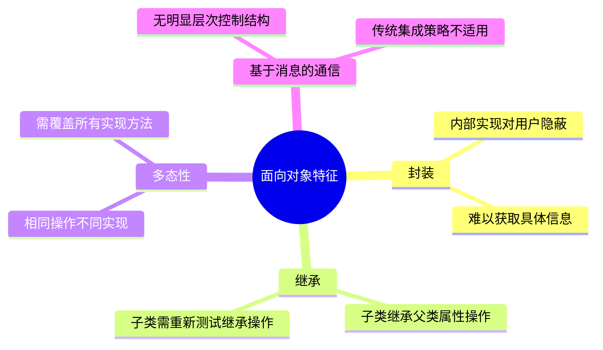
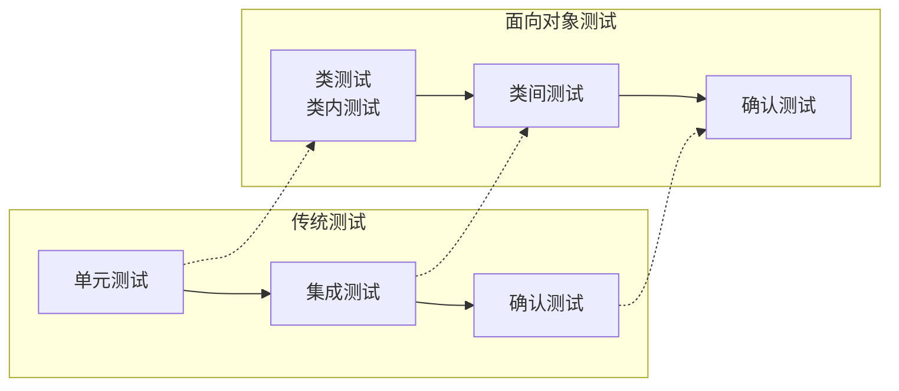

# 13.5 面向对象测试

## 基本信息
- **课程**：软件工程（第3版）
- **章节**：13.5 面向对象测试
- **日期**：2026-05-11
- **标签**：#面向对象测试 #类测试 #类间测试
- **重要性**：⭐ 一般了解

---

## 本节概述

对面向对象软件而言，虽然其测试的目标仍是用最少的时间和工作量来发现尽可能多的错误，但面向对象软件的性质改变了测试的策略和测试战术。

---

## 13.5.1 面向对象语境对测试的影响

### 面向对象特征对测试的影响

### 1. 单元

**传统软件中的单元**：
- 可以编译和执行的最小软件部件
- 绝不会指派给多个设计人员开发的软件部件
- 通常单个模块或子程序作为一个单元

**面向对象软件中的单元**：
- **类**是由属性（数据）以及操纵这些属性的操作组成的封装体
- 类是面向对象软件中的单元

### 2. 封装

**定义**：信息隐蔽技术，用户只能看见对象封装界面上的信息，对象的内部实现对用户是隐蔽的。

**对测试的影响**：
- ❌ 测试时很难获得对象的某些具体信息
- ❌ 除非提供内置操作来报告这些信息
- ❌ 给测试带来困难

### 3. 继承

**定义**：子类可以继承父类的属性和操作，也可以对继承的操作进行重定义。

**对测试的影响**：
- ⚠️ 测试了父类的操作后，子类仍需对继承的操作进行测试
- ⚠️ 每个子类都有自己定义的私有属性和操作
- ⚠️ 子类的语境（context）与父类不同

### 4. 多态性

**定义**：相同的操作应用于不同的对象，不同的对象对这一操作有不同的实现方法。

**对测试的影响**：
- 测试时应覆盖反映多态的**所有实现方法**

### 5. 基于消息的通信

**特点**：
- 通过消息通信实现类之间的协作
- 没有明显的层次控制结构

**对测试的影响**：
- ❌ 传统的自顶向下和自底向上集成策略不适用于面向对象软件测试

---

## 13.5.2 面向对象测试策略

### 测试层次对比

| 传统测试 | 面向对象测试 | 说明 |
|---------|-------------|------|
| 单元测试 | **类测试**（类内测试） | 测试类中的方法和类的行为 |
| 集成测试 | **类间测试** | 测试类之间的交互和协作 |
| 确认测试 | 确认测试 | 与传统方法相同 |
| 系统测试 | 系统测试 | 与传统方法相同 |

### 1. 类测试（Class Testing）

**别称**：类内测试

**内容**：
- 类内的**方法测试**
- 类的**行为测试**

### 2. 类间测试（Interclass Testing）

**别称**：面向对象的集成测试

**两种集成策略**：

#### （1）基于线程的测试（Thread-based Testing）

**思想**：
- 集成一组互相协作的类来响应系统的一个输入或事件
- 每个线程逐一被集成和测试
- 通过回归测试保证没有产生副作用

#### （2）基于使用的测试（Use-based Testing）

**思想**：
- 按使用层次来集成系统

**类的分类**：
- **独立类**：几乎不使用其他类提供的服务的类
- **依赖类**：使用其他类的类

**集成顺序**：
1. 从测试**独立类**开始
2. 集成直接依赖于独立类的那些类，并测试
3. 按照依赖的层次关系，逐层集成并测试
4. 直至所有的类被集成

### 3. 确认测试和系统测试

- 与传统确认测试和系统测试策略**相同**
- 面向对象确认测试时，应利用**用况模型**
- 通过用况提供的**场景**来发现与用户需求不一致的错误

---

## 13.5.3 面向对象测试用例设计

### 1. 传统测试用例设计方法的可用性

**仍可使用的方法**：
- **白盒测试**：逻辑覆盖、基本路径覆盖、数据流测试、循环测试（用于类内操作/方法）
- **黑盒测试**：边界值测试、等价类划分测试、错误猜测测试

### 2. 类测试

#### 操作（方法）测试

- 一个操作相当于传统软件中的一个函数或子程序
- 采用**白盒测试方法**

#### 类的行为测试

**描述工具**：状态机图

**覆盖标准**：
- 覆盖所有状态
- 覆盖所有状态迁移
- 从初始状态到终止状态的所有迁移路径

#### 划分测试（Partition Testing）

**目的**：减少测试类所需测试用例数目

**划分方式**：

| 划分方式 | 说明 | 示例 |
|---------|------|------|
| **基于状态的划分** | 根据类操作改变类状态的能力分类 | 改变状态的操作、不改变状态的操作 |
| **基于属性的划分** | 根据使用的属性对类操作分类 | 使用属性a的操作、修改属性a的操作、既不使用又不修改属性a的操作 |
| **基于类别的划分** | 根据操作的种类对类操作分类 | 初始化操作、计算操作、查询操作、终止操作 |

### 3. 类间测试

**测试目标**：测试类之间的交互和协作

**描述工具**：
- **顺序图**（Sequence Diagram）
- **通信图**（Communication Diagram）

**测试用例设计**：
- 根据顺序图或通信图
- 设计作为测试用例的**消息序列**
- 检查对象之间的协作是否正常

### 4. 基于场景的测试

**定义**：场景是用况的实例，反映了用户对系统功能的一种使用过程。

**应用**：
- 主要用于**确认测试**
- 类间测试时也可根据描述对象间的交互场景来设计测试用例

---

## 本节小结

### 面向对象测试 vs 传统测试

### 重点记忆

1. **封装**导致内部信息难以获取
2. **继承**要求子类重新测试继承的操作
3. **多态性**要求覆盖所有实现方法
4. **类测试** = 方法测试 + 行为测试
5. **类间测试**策略：基于线程、基于使用

---

## 相关链接

- [返回第13章主笔记](第13章-软件测试.md)
- [上一节：13.4 测试策略](第13章-13.4-测试策略.md)
- [下一节：13.6 测试完成标准](第13章-13.6-测试完成标准.md)

---

## 课本出处

> 📚 **出处**：第13章 13.5节"面向对象测试"
