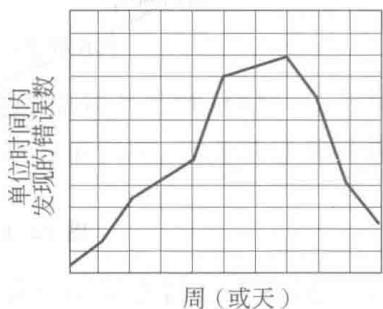
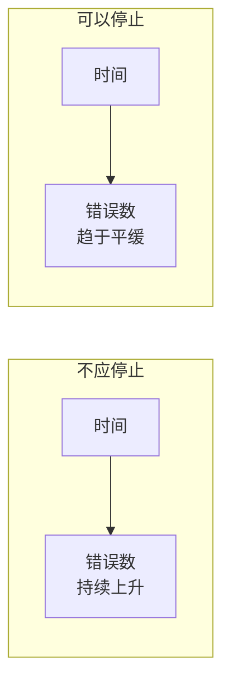
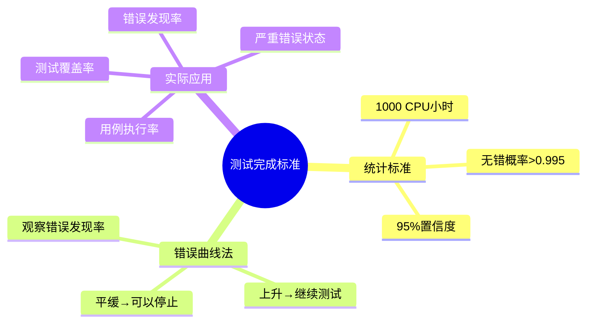

# 13.6 测试完成标准

## 基本信息
- **课程**：软件工程（第3版）
- **章节**：13.6 测试完成标准
- **日期**：2026-05-11
- **标签**：#测试完成标准 #统计标准 #错误曲线
- **重要性**：⭐ 一般了解

---

## 本节概述

软件测试只能发现软件中的错误和缺陷，但无法证明错误和缺陷不存在，即不能证明找出了所有的错误和缺陷。因此，决定什么时候可以停止程序测试是一个最困难的问题。

---

## 核心问题

> ❓ **关键问题**：如何判定当前查出的错误是否是最后一个错误？

由于无法绝对证明软件无错，测试最后总是要停止的，但需要合理的停止标准。

---

## 测试完成标准方法

### 1. 统计标准（Musa和Ackerman）

**标准描述**：

> "不，我们不能绝对地认定软件永远也不会再出错，但是相对于一个理论上合理的和在试验中有效的统计模型来说，如果一个在按照概率的方法定义的环境中，**1000个CPU小时内不出错运行的概率大于0.995**的话，那么我们就有**95%的信心**说，我们已经进行了足够的测试。"

**要点**：
- 基于**统计模型**
- 1000 CPU小时无错运行概率 > 0.995
- 95%置信度认为测试足够

### 2. 错误曲线法（实用标准）⭐

**核心思想**：观察测试过程中**单位时间内发现错误数目**的曲线。

#### 📷 图13.14 单位时间内发现错误数目的曲线

> 📚 **课本出处**：图13.14 展示了两种错误曲线情况，(a)不应停止，(b)可以停止

#### 曲线分析

| 曲线类型 | 特征 | 结论 |
|---------|------|------|
| **图(a) 不应停止** | 单位时间内发现错误的数目**仍在不断上升** | ❌ 不应停止测试 |
| **图(b) 可以停止** | 单位时间内发现错误的数目**趋于平缓/下降** | ✅ 可以停止测试 |

#### 曲线趋势说明

**经验表明**：
- 错误数持续上升 → 软件中仍有大量错误未被发现
- 错误数趋于平缓 → 大部分错误已被发现，可以停止测试

---

## 实际应用建议

### 综合考虑因素

1. **测试覆盖率**：语句覆盖、分支覆盖等是否达到预定目标
2. **错误发现率**：单位时间内发现错误的数量是否显著下降
3. **测试用例执行率**：计划中的测试用例是否已全部执行
4. **严重错误状态**：所有严重错误是否已修复
5. **时间和成本**：项目时间和预算约束

### 常用停止标准

| 标准类型 | 具体指标 |
|---------|---------|
| **基于覆盖率** | 语句覆盖≥90%，分支覆盖≥80% |
| **基于错误率** | 连续N天未发现新错误 |
| **基于用例** | 所有高优先级测试用例通过 |
| **基于时间** | 达到预定的测试周期 |

---

## 本节小结

### 测试完成标准总结

### 重点记忆

1. **无法绝对证明**软件无错
2. **统计标准**：1000 CPU小时无错概率>0.995，95%置信度
3. **错误曲线法**：错误发现率趋于平缓时可以停止

---

## 相关链接

- [返回第13章主笔记](第13章-软件测试.md)
- [上一节：13.5 面向对象测试](第13章-13.5-面向对象测试.md)
- [下一节：13.7 调试](第13章-13.7-调试.md)

---

## 课本出处

> 📚 **出处**：第13章 13.6节"测试完成标准"
