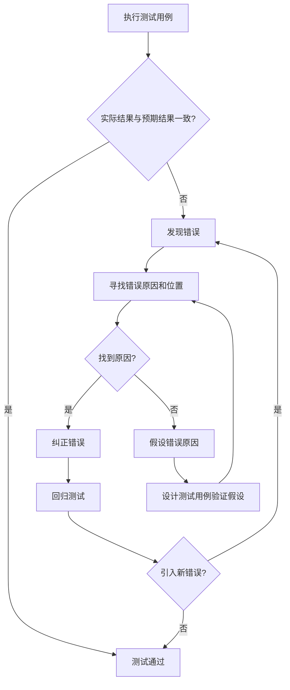
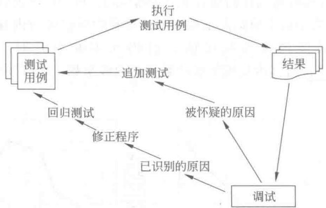
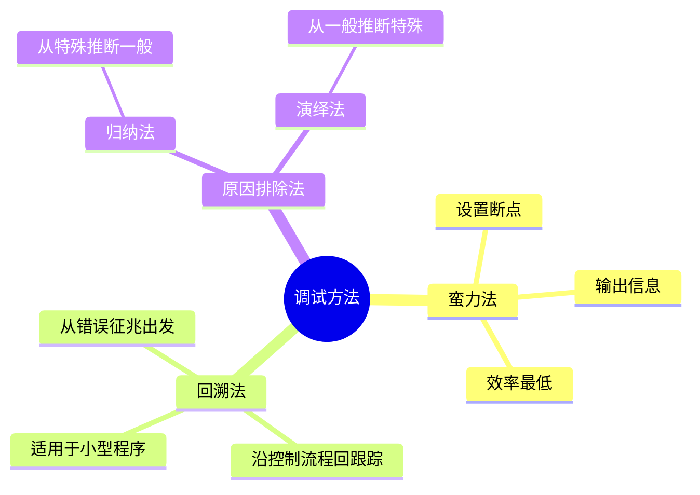
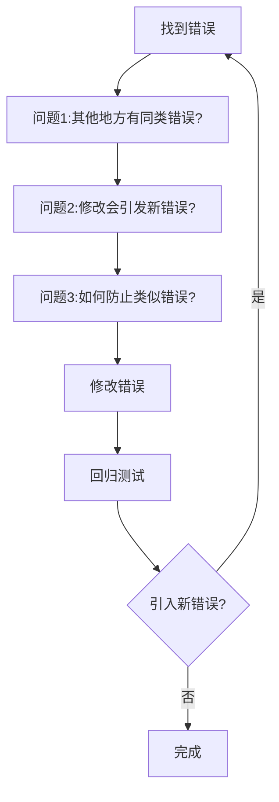
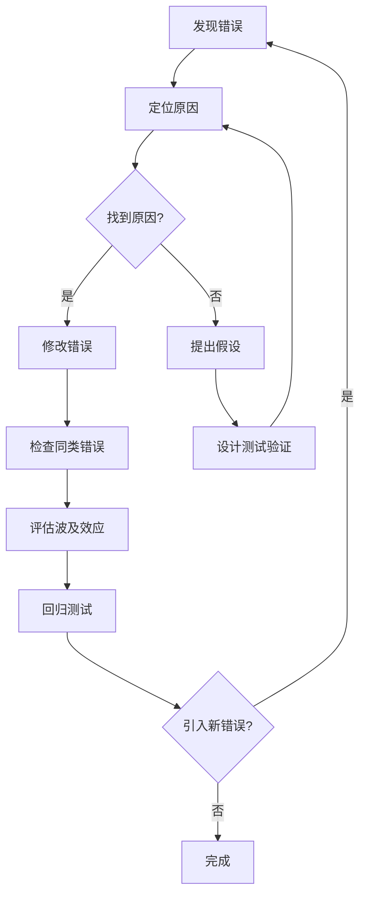

# 13.7 调试

## 基本信息
- **课程**：软件工程（第3版）
- **章节**：13.7 调试
- **日期**：2026-05-11
- **标签**：#调试 #蛮力法 #回溯法 #原因排除法
- **重要性**：⭐ 一般了解

---

## 本节概述

测试的目的是发现错误，当测试发现错误后需要进行调试。调试的目的是**确定错误的原因和准确位置**，并加以纠正。

---

## 13.7.1 调试过程

### 调试的基本流程

### 调试结果

| 结果 | 说明 |
|------|------|
| **找到错误** | 找到原因和位置，进行改正，并进行回归测试 |
| **未找到错误** | 假设错误原因，设计测试用例验证，重复直至找到 |

#### 📷 图13.15 调试过程

> 📚 **课本出处**：图13.15 展示了调试过程的流程图

---

## 13.7.2 调试方法

### 三种主要调试方法

### 1. 蛮力法（Brute Force）

**特点**：
- 最省脑筋但**最低效**
- 通常在**其他方法未能找到错误原因时**才使用

**常用手段**：
- 在程序中设置**断点**
- 输出**寄存器、存储器**的内容
- 打印有关**变量**的值
- 获取大量**现场信息**

**优化方法**：**二分法**
- 逐步缩小出错的范围

**缺点**：
- 效率低
- 输出的信息大多是无用的

### 2. 回溯法（Backtracking）

**基本思想**：
- 从**错误的征兆**出发
- **人工**沿着控制流程**往回跟踪**
- 直至发现错误的根源

**适用范围**：
- ✅ 适用于**小型程序**
- ❌ 对大型程序，由于回溯路径太多，难以彻底回溯

### 3. 原因排除法（Cause Elimination）

#### （1）归纳法

**定义**：从**特殊**推断**一般**的系统化思考方法。

**基本思想**：
- 从一些**线索**（错误征兆）着手
- 通过分析它们之间的**关系**
- 找出错误的原因

#### 📷 图13.16 归纳法调试过程

> 📚 **课本出处**：图13.16 展示了归纳法调试的过程

**归纳法步骤**：
1. 收集有关数据（错误征兆）
2. 组织数据（发现规律）
3. 做出假设（推测原因）
4. 证明假设（验证原因）

#### （2）演绎法

**定义**：从**一般**原理或前提出发，假设所有可能出错的原因，排除不可能正确的假设，最后推导出结论。

**基本思想**：
- 假设**所有可能**出错的原因
- **排除**不可能正确的假设
- 最后**推导出结论**

#### 📷 图13.17 演绎法调试过程

> 📚 **课本出处**：图13.17 展示了演绎法调试的过程

**演绎法步骤**：
1. 列举所有可能的原因
2. 根据已有数据排除不可能的原因
3. 对剩余原因进行优先级排序
4. 验证最可能的原因
5. 修正错误

---

## 13.7.3 纠正错误

### 修改前必须回答的三个问题

找到错误后必须将其纠正，但修改前应该回答以下问题：

#### 问题1：在程序的其他地方是否也存在同类的错误？

**分析**：
- 某些错误与设计者或编程者的**思维模式**有关
- 例如：缺少对边界条件的考虑

**处理**：
- 找到一处因边界条件造成的错误时
- 应仔细寻找程序中其他可能存在**边界条件错误**的情况

#### 问题2：本次修改可能会引发什么新的错误？

**分析**：
- 修改一个错误常常会**引入新的错误**
- 需要分析修改的**波及效应**

**处理**：
- 根据程序逻辑分析修改可能会对哪些程序段、模块或功能有影响
- 这种影响是否会引发新的错误
- 在**回归测试**时重点对修改波及的范围进行测试

#### 问题3：为了防止这个错误，我们应该做什么？

**目的**：
- 避免**今后再出现类似**的错误
- 总结经验教训
- 改进开发流程或规范

---

## 本节小结

### 调试方法对比

| 方法 | 核心思想 | 适用场景 | 效率 |
|------|---------|---------|------|
| **蛮力法** | 设置断点，输出信息，获取现场信息 | 其他方法无效时 | 最低 |
| **回溯法** | 从错误征兆出发，沿控制流程回跟踪 | 小型程序 | 中等 |
| **归纳法** | 从特殊线索推断一般原因 | 有明确错误征兆时 | 较高 |
| **演绎法** | 从一般假设排除不可能原因 | 可能原因较少时 | 较高 |

### 纠正错误的原则

### 重点记忆

1. **调试目的**：确定错误原因和位置，加以纠正
2. **三种调试方法**：蛮力法、回溯法、原因排除法（归纳法、演绎法）
3. **修改前三问**：同类错误？引发新错误？如何防止？

---

## 疑问与思考

❓ **测试和调试有什么本质区别？**
💡 **测试**的目的是**发现错误**——通过执行测试用例来揭示软件中存在的缺陷，测试是一个有计划的、可重复的过程。**调试**的目的是**确定错误的原因和准确位置，并加以纠正**——调试是在发现错误后进行的诊断和修复过程，它更具探索性和创造性，需要开发者深入分析代码逻辑来定位根因。简而言之：测试是"找错"，调试是"改错"。

❓ **归纳法调试和演绎法调试的核心区别是什么？**
💡 **归纳法**从**特殊到一般**：从具体的错误征兆（线索）出发，分析多个线索之间的关系，找出共同规律，从而推断出错误原因。适合有多个明确错误征兆的场景。**演绎法**从**一般到特殊**：先列举所有可能的原因假设，然后逐步排除不可能的原因，最后推导出结论。适合可能原因较多但可通过排除法缩小范围的场景。两者方向相反但互补。

❓ **回溯法调试适用于什么类型的程序？为什么不适用于大型程序？**
💡 回溯法从错误的征兆出发，**人工沿着控制流程往回跟踪**，直至找到错误根源。它适用于**小型程序**，因为小规模代码的控制流路径有限，回溯过程可控。对于大型程序，回溯路径数量呈指数级增长，人工回溯难以彻底执行，容易遗漏关键路径，效率极低。

❓ **蛮力法作为"最省脑筋"的方法，为什么通常只在其他方法无效时才使用？**
💡 蛮力法通过设置断点、输出大量寄存器和变量值来获取现场信息，看似简单直接，但**效率最低**：(1) 产生的信息量巨大，大部分是无用的；(2) 从海量信息中筛选有价值线索耗时耗力；(3) 没有明确的方向性，属于"大海捞针"。只有在归纳法、回溯法、演绎法都无法定位问题时，才作为最后手段使用。优化手段是使用**二分法**逐步缩小出错范围。

❓ **找到错误并修改后，为什么还要问"其他地方是否也存在同类错误"？**
💡 因为某些错误与开发者的**思维模式或编码习惯**有关——例如总是忘记处理边界条件、总是混淆"大于"和"大于等于"。这种思维模式导致的错误往往会在程序的多处出现。因此，找到一处错误后，应主动排查程序中是否存在类似的逻辑，避免"改了这处漏了那处"。

---

## 总结

### 3种调试方法对比

| 方法 | 核心思想 | 思维方向 | 适用场景 | 效率 | 需要信息 |
|:----:|:--------:|:--------:|:--------:|:----:|:--------:|
| **回溯法** | 从错误征兆沿控制流回跟踪 | 从现象到根源 | 小型程序 | 中等 | 控制流程 |
| **归纳法** | 从多个线索推断共同原因 | 从特殊到一般 | 有多个明确征兆 | 较高 | 错误征兆集合 |
| **演绎法** | 列举所有可能原因并排除 | 从一般到特殊 | 可能原因较多 | 较高 | 可能的原因列表 |
| **蛮力法** | 设置断点，输出大量信息 | 无方向 | 其他方法无效时 | 最低 | 运行现场数据 |

### 调试完整流程

**修改前三问**：(1) 其他地方有同类错误吗？(2) 修改会引发新错误吗？(3) 如何防止类似错误再次发生？

---

## 相关链接

- [返回第13章主笔记](第13章-软件测试.md)
- [上一节：13.6 测试完成标准](第13章-13.6-测试完成标准.md)

---

## 课本出处

> 📚 **出处**：第13章 13.7节"调试"
